# UPC AI — Enterprise Software Architecture

**Product:** UPC AI — the official AI-powered academic and campus assistant for **Udai Pratap College (UPC), Varanasi**
**Version:** 2.0 (supersedes v1.0)
**Status:** Architecture blueprint — approved PRD, pre-implementation
**Authored as:** Chief AI Architect · CTO · Principal Software Architect · Enterprise Solutions Architect · Staff Infrastructure Engineer · Principal Security Engineer · Senior DevOps Architect · AI Systems Designer

> **No implementation code appears in this document.** No React, no Next.js, no APIs, no DB schemas, no UI components, no folder structures. This is a pure architecture specification — services, flows, interfaces, diagrams, trade-offs, and decision records — detailed enough for a senior engineering team to build UPC AI directly.

---

## Table of Contents

- [Section 1 — System Architecture](#section-1--system-architecture)
- [Section 2 — AI Orchestration](#section-2--ai-orchestration)
- [Section 3 — RAG Architecture](#section-3--rag-architecture)
- [Section 4 — Admin Knowledge Portal](#section-4--admin-knowledge-portal)
- [Section 5 — AI Provider Layer](#section-5--ai-provider-layer)
- [Section 6 — Authentication](#section-6--authentication)
- [Section 7 — Security](#section-7--security)
- [Section 8 — Performance & Scalability](#section-8--performance--scalability)
- [Section 9 — Observability](#section-9--observability)
- [Section 10 — Deployment](#section-10--deployment)
- [Section 11 — Architecture Decision Records](#section-11--architecture-decision-records)

---

## Design Philosophy — Eight Governing Principles

Every decision in this document traces to one of these principles. They are stated once here and referenced throughout as **P1–P8**.

**P1 — College knowledge is data, never weights.** The LLM is never fine-tuned on UPC content. All college-specific knowledge lives in a retrieval layer (vectors + structured metadata + full-text index). When a notice changes, one document is re-embedded in seconds; nothing is retrained. This is the single most important constraint in the system and the reason RAG exists here at all.

**P2 — One assistant, two capabilities.** Students should never have to choose between "academic AI" and "college AI." A routing engine decides per turn whether a question is academic reasoning (LLM-native), college knowledge (retrieval-grounded), or both. The user sees one assistant; internally there are two pipelines.

**P3 — Providers are pluggable, never hard-coded.** No code outside the AI Provider Layer references OpenAI, Claude, Gemini, Groq, DeepSeek, or OpenRouter directly. The frontend doesn't even know providers exist. Swapping the primary model is a config change with zero frontend impact.

**P4 — Streaming-first.** Every AI response streams. First-token latency (~<800ms target) makes long derivations and long knowledge answers feel instant regardless of total length.

**P5 — Failure isolation.** Ingestion (slow, heavy, batch) is fully decoupled from serving (fast, interactive). A corrupt 300-page PDF being OCR'd can never slow down a student's chat. Queues, separate worker pools, and independent autoscaling enforce this boundary.

**P6 — Auditability over cleverness.** Every college answer cites its source document, page, and version. Every admin action lands in an append-only audit log. If the AI states a fee amount, a human can trace exactly which document version produced it and when.

**P7 — Bias toward refusal over hallucination.** For an official college assistant, a confident wrong answer about exam dates or fees is the worst possible outcome. When retrieval finds no evidence, the system says "I don't have that in the official knowledge base" — a feature, not a failure.

**P8 — Cloud-native and scale-out, not scale-up.** 50,000+ students, 5,000+ faculty, millions of AI requests, hundreds of thousands of documents. Every tier assumes horizontal scale: stateless services, read replicas, partitioned queues, sharded vector index, CDN-cached edges. But sized for a *single institution* first — no over-engineered multi-tenant SaaS machinery.

---

## Section 1 — System Architecture

### 1.1 The One-Minute Mental Model

UPC AI is a set of **loosely coupled services** behind a single edge entry point. Three planes of traffic exist and are kept strictly separate:

- **Interaction plane** — students/faculty chat with the assistant. Synchronous, streaming, latency-critical. Must stay fast under load.
- **Ingestion plane** — college staff upload documents; the system virus-scans, parses, OCRs, chunks, embeds, and indexes them. Asynchronous, throughput-critical, fault-tolerant.
- **Control plane** — admin portal operations: approvals, permissions, roles, analytics, indexing status, audit. Synchronous CRUD, low volume.

These planes share only the **system of record** (Postgres), the **object store**, and the **vector DB**. They scale, fail, and deploy independently. This separation (P5) is the backbone of the whole design.

### 1.2 Layered View

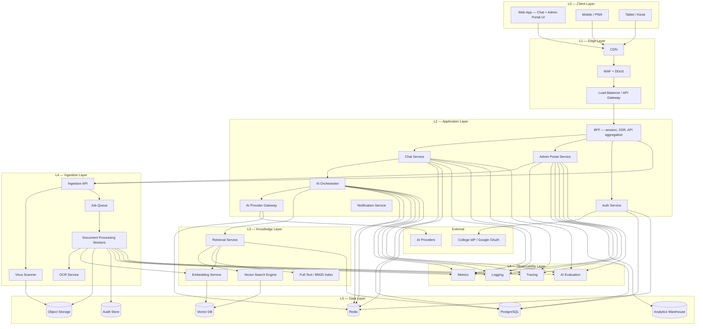

**Why this layering:** Each layer has one responsibility and one scaling profile. The Interaction plane (L2 chat path) never executes ingestion code (L4). The Knowledge layer (L3) is the only reader/writer of the vector index, so the rest of the system is insulated from the vector DB vendor. Observability (L6) is a cross-cutting sidecar, not a blocking dependency.

### 1.3 Service-by-Service Explanation

Each service below states its responsibility, why it exists as a separate service, and its scaling behavior.

**Client Layer (Web App, Mobile/PWA, Kiosk).** The chat UI and admin portal UI. Thin. It renders streams, shows citations, and collects feedback. **Why thin:** any AI logic in the client would be duplicated across web/mobile and would leak provider details. All intelligence lives server-side. **Scale:** static assets served from CDN; effectively free to scale.

**Edge Layer (CDN, WAF, Load Balancer/API Gateway).** TLS termination, global static caching, DDoS absorption, bot filtering, request shaping, auth token validation, per-user/per-IP rate limiting, and routing. **Why at the edge:** JWTs are validated here with a public key (no DB round-trip), rate limits are enforced before any expensive work happens, and static UI never reaches the app tier. **Scale:** CDN is global; gateway is stateless and multi-instance.

**BFF (Backend-for-Frontend).** Session management, server-side rendering of the shell, and API aggregation for the chat and portal. **Why a BFF:** the UI needs one stable, cookie-based API surface even though a dozen services live behind it. The BFF owns the session cookie and forwards authenticated calls; it does *not* buffer AI streams (it re-emits SSE passthrough for first-token latency).

**Chat Service.** The entry point for one conversation turn. It authenticates the user context, checks the semantic cache, calls the Orchestrator, streams the result, and persists the message + citations. **Why separate from Orchestrator:** Chat owns conversation *state and persistence*; the Orchestrator owns *intelligence and routing*. Keeping them separate lets us swap reasoning strategies without touching message storage.

**AI Orchestrator.** The brain. Runs intent detection, conversation-context handling, tool selection, model selection, and fallback. Decides academic vs. knowledge vs. hybrid and assembles the final prompt. See Section 2. **Why its own service:** routing logic changes frequently and must be independently deployable and versioned.

**AI Provider Gateway.** The only place provider SDKs are imported. Normalizes streaming, retries, fallbacks, health checks, rate limits, and cost accounting across OpenAI, Claude, Gemini, Groq, DeepSeek, OpenRouter. See Section 5. **Why a gateway:** P3 — providers are pluggable; nothing upstream knows which vendor served a response.

**Auth Service.** College email login, Google OAuth, OTP verification, JWT issuance, refresh tokens, RBAC, session lifecycle. See Section 6. **Why separate:** auth is security-critical and high-throughput; isolating it simplifies auditing and lets it scale on login bursts (start of semester) independently.

**Admin Portal Service.** Backend for staff: upload, delete, update, version, approve/reject, categorize, search, indexing status, retry, analytics, role/permission management, audit browsing. See Section 4. **Why separate from Chat:** different trust level, different RBAC, different traffic (low-volume, high-privilege). A portal bug must never take chat down.

**Notification Service.** Email/push/in-app notices: approval requests, indexing failures, official announcements, OTP delivery. **Why separate:** notifications are fire-and-forget, retryable, and rate-limited by the email/push provider — classic queue-driven background work.

**Retrieval Service.** The single choke point for all knowledge reads. Runs hybrid search (vector + BM25), metadata pre-filtering, re-ranking, context assembly, and citation generation. **Why the choke point:** every knowledge answer must pass authorization filters and citation assembly. There is no alternate path to vectors, so a student can never bypass document ACLs.

**Embedding Service.** Generates embeddings for ingestion (batch) and for retrieval queries (single). Centralizes the embedding model and version. **Why separate:** the model family and dimensionality must be consistent across the corpus; centralizing makes upgrades a controlled migration, not a silent regression.

**Vector Search Engine.** The query side of the vector DB: HNSW search with metadata filters. A thin service in front of the Vector DB so the vendor can be swapped (pgvector → Qdrant/Weaviate) without touching Retrieval logic.

**Ingestion API.** Validates uploads, virus-scan handoff, writes raw files to object storage, creates job records, enqueues jobs, returns 202. **Why it returns immediately:** parsing is slow; the request thread must not block. P5.

**Document Processing Workers.** Queue-driven workers that parse (PDF/DOCX/PPTX/Excel/images), OCR, extract metadata, auto-tag, chunk, and hand chunks to the Embedding Service. Autoscale on queue depth. **Why workers:** CPU/GPU-heavy batch work that must scale independently of interactive load.

**OCR Service.** Two-tier OCR: fast local engine first, high-accuracy cloud OCR for low-confidence pages. Reconstructs reading order and tables. See Section 3.

**Analytics Warehouse.** Read-optimized store fed by the event stream, powering admin analytics (usage, cost, retrieval quality, coverage gaps). **Why separate from Postgres:** aggregate queries at millions of rows would starve the OLTP hot path. P5/P8.

**Audit Store.** Append-only, hash-chained event sink for every security/admin action. Tamper-evident and exportable.

### 1.4 Request Flow — Student Asks a Question

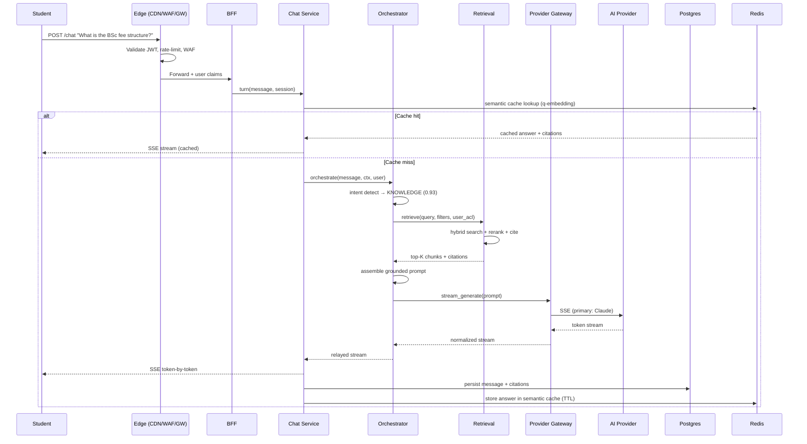

**Key decisions in the request flow:**

- **Auth and rate-limiting happen at the edge.** JWT signature validation is a local public-key check with no DB hop. Rate limits stop abuse before any AI cost is incurred.
- **Semantic cache is checked before the Orchestrator.** A cache hit skips intent detection, retrieval, *and* the provider call — the single biggest cost and latency win (P-cost). Cache keys are question embeddings matched by similarity; TTL is short for knowledge answers (data changes) and longer for academic ones (stable). See Section 8.
- **Intent detection runs before retrieval.** Pure academic questions skip the vector DB entirely; pure knowledge questions skip the general-reasoning path. No wasted round-trips.
- **Retrieval is a choke point.** The Orchestrator never touches the vector DB directly — it calls Retrieval, which enforces the user's ACL filters and assembles citations. This is the security boundary for private documents.
- **Streaming passthrough.** No buffering at the BFF or Chat Service; SSE frames relay end-to-end so first-token arrives fast.

### 1.5 Response Flow — Streaming Back to the User

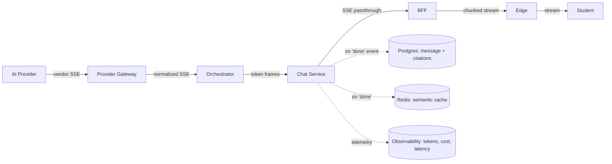

The Provider Gateway normalizes every vendor's streaming format into **one internal SSE schema** (token / tool_call / done / error). Citations travel as a final `done` event so the UI renders sources after the text settles, never blocking the stream. Telemetry (tokens in/out, cost, latency, provider used) is emitted on completion without delaying the user.

### 1.6 Data Flow — The Two Planes Over Time

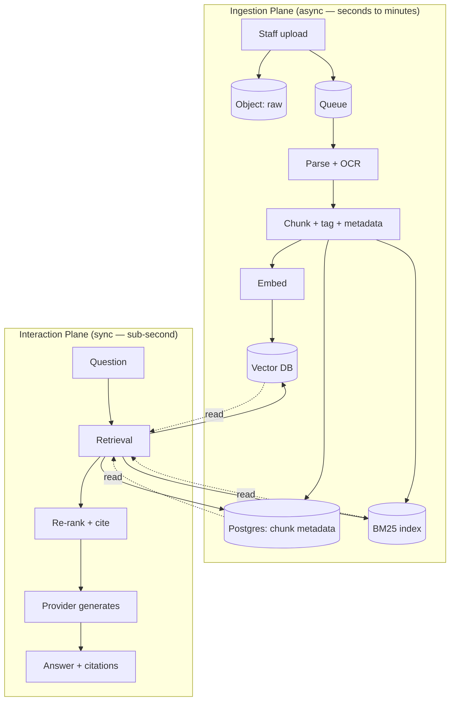

The ingestion plane *writes*; the interaction plane *reads*. A document becomes answerable the moment its chunks land in the Vector DB + BM25 index with status `indexed` — typically 30–90 seconds for a normal document. Writes and reads are decoupled by the queue, so a burst of uploads never degrades chat latency.

---

## Section 2 — AI Orchestration

The Orchestrator is what makes UPC AI an intelligent system rather than a thin wrapper over a chat model. It decides *how* each turn is handled before a single answer token is generated.

### 2.1 Orchestrator Sub-Components

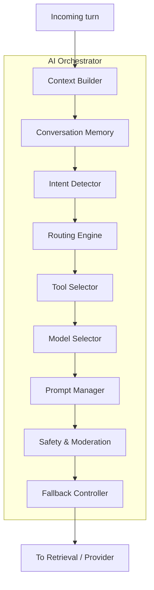

### 2.2 Intent Detection

Intent detection answers: *is this academic reasoning, college knowledge, both, chitchat, or out-of-scope?* It is a **layered** mechanism, not a single classifier call.

| Intent | Meaning | Example | Pipeline |
|--------|---------|---------|----------|
| **ACADEMIC** | Reasoning/solving, no college entity | "Solve ∫x²·eˣ dx" | Provider-only, no retrieval |
| **KNOWLEDGE** | College fact lookup | "When is the BSc exam?" | Retrieval + grounded generation |
| **MIXED** | Needs both | "Explain Hooke's law using our physics lab manual" | Retrieval + reasoning, fused |
| **CONVERSATIONAL** | Greeting, thanks, acknowledgement | "ok thanks" | Cheap model, no retrieval |
| **OUT_OF_SCOPE** | Harmful, PII-seeking, or non-UPC/non-academic | "write my Tinder bio" | Guardrail refusal |

**Detection signals, in order of cost:**

1. **Conversation continuity** (free): if the previous turn was KNOWLEDGE and this is a short follow-up ("what about for 3rd year?"), continue the same intent with adjusted filters.
2. **Keyword/entity heuristics** (cheap, in-process): college entities (department names, course codes like "CS302", "fee", "hostel", "timetable", "exam", "notice", faculty names) push toward KNOWLEDGE; subject terms ("integral", "derivative", "python", "photosynthesis", "GDP") push toward ACADEMIC.
3. **Zero-shot classifier** (one small model call): resolves the genuinely ambiguous middle.

**Why layered and not one classifier:** a single classifier is brittle — it can't express "continue the previous thread" or "probe both then pick." The layered rules handle continuity and the cheap cases instantly; the classifier is only invoked when needed. This keeps median intent latency ~30–80ms.

### 2.3 Routing Decision Tree

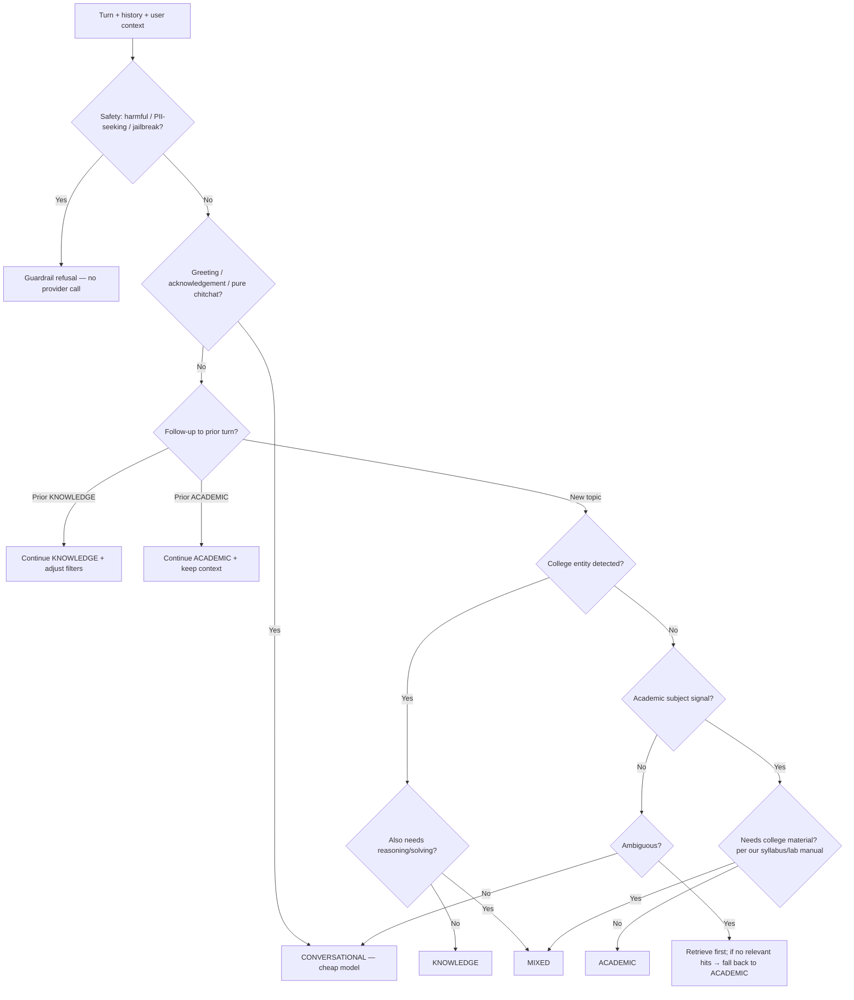

**Why the PROBE branch exists:** when unsure, attempting retrieval first is safer than refusing or guessing. If retrieval returns nothing relevant, the system falls back to academic reasoning rather than stalling. This is the graceful-degradation path that keeps the assistant helpful on borderline questions.

### 2.4 Per-Intent Pipelines

```mermaid
flowchart TB
    subgraph ACADEMIC["ACADEMIC"]
        A1[Question + history] --> A2[Reasoning system prompt]
        A2 --> A3[Provider: high-reasoning model]
        A3 --> A4[Optional verifier for math/code]
        A4 --> A5[Stream solution]
    end

    subgraph KNOWLEDGE["KNOWLEDGE"]
        K1[Question + user ACL] --> K2[Derive metadata filters]
        K2 --> K3[Hybrid retrieval + rerank]
        K3 --> K4{Evidence found?}
        K4 -->|Yes| K5[Grounded gen + citations]
        K4 -->|No| K6["Say: not in official KB"]
    end

    subgraph MIXED["MIXED"]
        M1[Question] --> M2[Retrieve relevant college material]
        M2 --> M3[Fused prompt: tutor + retrieved context]
        M3 --> M4[Provider reasons over both]
        M4 --> M5[Answer + derivation + citations]
    end
```

### 2.5 Conversation Context & Memory

Two tiers of memory, deliberately separated:

- **Short-term working context** — the rolling window of the current conversation, held in Redis keyed by session (TTL-bounded). Carries the last intent, referenced entities, retrieved doc IDs, and recent turns so follow-ups resolve correctly.
- **Long-term semantic memory** — an *opt-in, scoped* summary of a user's durable preferences (e.g., "I'm a 2nd-year BSc CS student"). Stored in Postgres, injected as a small context block. **Bounded and user-controllable** (viewable/editable) to respect privacy. Used only to personalize filters and tone, never to answer factual college questions.

**Why two tiers:** stuffing an entire chat history into every prompt is expensive and dilutes relevance. Working context is for continuity; long-term memory is for personalization (course, year, department), which directly improves retrieval filtering. Older turns beyond the working window are **summarized** into a compressed running summary to keep input-token counts bounded — a major cost lever (see Section 9).

### 2.6 Prompt Management

Prompts are **versioned artifacts**, not string literals in code. The Prompt Manager stores each system prompt (academic tutor, grounded knowledge answerer, refusal, mixed-fusion) with:

- a `prompt_id` + semantic `version` (e.g., `knowledge-grounded v7`)
- the model/temperature it was tuned for
- a changelog and rollout state (draft / canary / active / retired)

**Why versioned prompts:** prompt changes are behavior changes. Versioning lets us A/B a new grounded-answer prompt against the old one, roll back a regression instantly, and attribute quality changes to a specific prompt version in observability (Section 9). Prompt rollouts are config, not deploys.

### 2.7 Tool Selection

The Orchestrator has a small, explicit tool registry. Tools are invoked by the model via structured tool-calling, but *allowed* tools are chosen by the Orchestrator based on intent:

| Tool | When enabled | Why |
|------|--------------|-----|
| `knowledge_search` | KNOWLEDGE, MIXED | Ground college answers in the KB |
| `calculator` | ACADEMIC (math/stats) | Exact arithmetic; avoids LLM math slips |
| `code_executor` | ACADEMIC (programming) | Run/verify code in a sandbox |
| `table_lookup` | KNOWLEDGE (timetables, fees) | Structured queries against parsed tables |
| `web_search` | ACADEMIC research (opt-in) | Current info beyond the KB, clearly labeled non-official |

**Why Orchestrator-gated tools:** a student asking for the hostel curfew must never trigger a web search that returns an unofficial answer; an academic coding question must never leak a private document via `knowledge_search`. Gating tools by intent enforces both correctness and the ACL boundary (P6/P7).

### 2.8 Model Selection

Model choice is a function of intent + difficulty + cost tier + latency tier:

- **Conversational / simple lookups** → cheap, ultra-low-latency model (Groq-class).
- **Knowledge grounded answers** → mid-tier model with strong instruction-following (cheap enough for high volume).
- **Academic reasoning (math, physics, code)** → high-reasoning model; for hard cases a frontier model.
- **Mixed** → high-reasoning model (must both reason and stay grounded).

Difficulty is estimated by the router (subject, question length, prior turns) so we escalate to frontier only when needed. **Why:** routing every turn to a frontier model would be 5–10× more expensive with no quality gain on easy questions. Tiering is the core cost optimization (P-cost).

### 2.9 Fallback Logic

Fallback operates at three levels, in order:

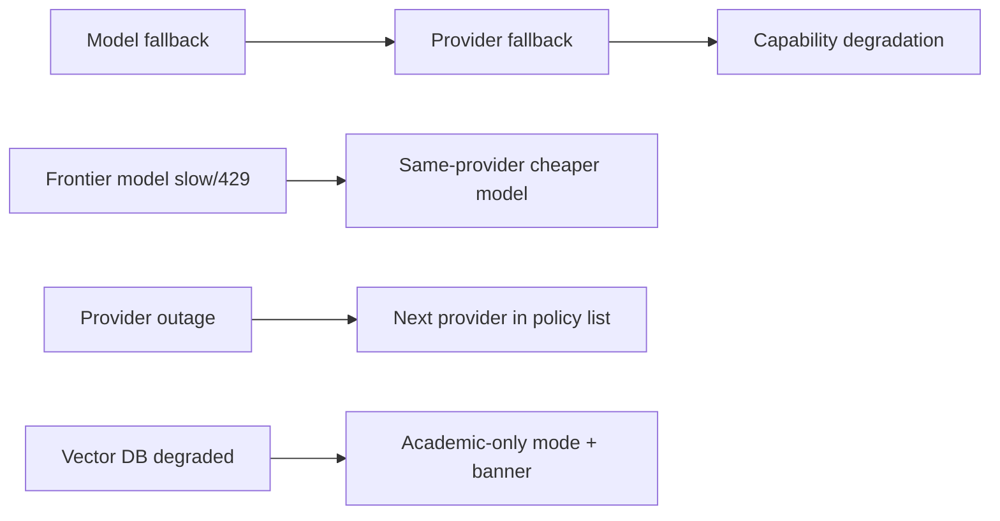

1. **Model fallback:** if the chosen model errors or stalls, retry the same provider's next-best model.
2. **Provider fallback:** if the provider is down (circuit open), move to the next provider in the routing policy (Section 5).
3. **Capability degradation:** if the *knowledge layer itself* (vector DB) is degraded, fall back to academic-only answers with a clear banner ("official college knowledge temporarily unavailable") rather than a hard outage. Availability of *some* answer beats none.

### 2.10 Streaming & Retry Strategy

- **Streaming:** all user-facing generations stream via the normalized SSE schema. First-token timeout ~8s; if the provider connects but stalls, fail over and restart the stream from the next provider (the user sees a brief restart, not corruption — generation is stateless and idempotent).
- **Retry:** exponential backoff + jitter for transient errors (429, 5xx, network). Max 2 retries on the same provider before provider fallback. Retries are safe because generation has no side effects; partial streams are discarded on failover.
- **Total timeout:** ~60s cap; anything longer is treated as a failure and degraded gracefully.

**Why fail over rather than just retry one vendor:** a single vendor outage must never take down the college. Multi-provider failover is the core resilience property (P3/P5).

---

## Section 3 — RAG Architecture

This is the heart of "College Knowledge AI." The requirement that the system **never retrain when knowledge changes** is satisfied entirely here: knowledge lives in a retrieval layer, and updating it is re-embedding one document. The design is **retrieve-then-generate** with **hybrid search**, **re-ranking**, **context assembly**, and **guaranteed citation**.

### 3.1 End-to-End Ingestion Pipeline

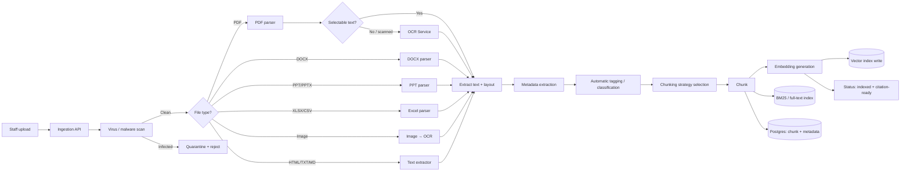

**Why pull-based async ingestion:** the Ingestion API validates, scans, stores the raw file, and enqueues a job, returning 202 immediately. Everything else happens in workers. Parsing a 300-page scanned PDF can take minutes; doing it inline would timeout gateways and hold connections open. Async + queue + status polling is the only design that survives real documents (P5). Jobs are **idempotent by content hash** — re-processing the same file re-embeds and atomically swaps the active chunk set, then marks the old set superseded.

### 3.2 Virus Scan

Every upload is scanned before any parsing. Infected files are quarantined and rejected; the event is logged to the audit store. **Why first and mandatory:** staff upload arbitrary files; a malicious document could carry an exploit that fires in a parser. Scanning at the boundary (before any parser touches the bytes) is the cheapest place to stop this. Scanning is async and non-blocking to the rest of the pipeline.

### 3.3 OCR Architecture — Two-Tier

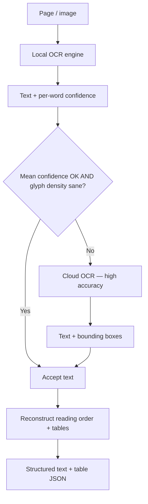

**Why two-tier:** local OCR (Tesseract-class) is free but weak on skewed scans, handwriting, and complex tables; cloud OCR is accurate but costs money and quota. Routing only low-confidence pages to the cloud keeps cost ~90% lower than cloud-everything while matching its accuracy on the hard fraction. **Bounding boxes + reading-order reconstruction are non-negotiable:** UPC notices are often multi-column and mixed-script (English + Hindi); naive top-to-bottom OCR jumbles reading order and destroys retrieval quality. Detected table grids are reconstructed into structured rows/columns, stored **both** as text (for BM25) and as JSON (so the LLM and UI can render real tables). Timetables, fee structures, and exam schedules are overwhelmingly tabular, so this is essential.

### 3.4 Format-Specific Parsing Decisions

| Format | Strategy | Why |
|--------|----------|-----|
| **PDF (text-native)** | Text + layout extraction, preserve headings/tables | Fast, accurate; structure drives chunking |
| **PDF (scanned)** | Rasterize pages → OCR pipeline | No selectable text exists; OCR is mandatory |
| **DOCX** | Read OOXML, infer heading hierarchy from styles | Style info (Heading 1/2) is the best semantic-boundary signal |
| **PPT/PPTX** | Per-slide extraction; each slide is a natural chunk boundary | Slides are self-contained units; respecting them beats arbitrary splits |
| **XLSX/CSV** | Detect header row; chunk per sheet-section; keep tabular JSON | Spreadsheets are relational, not prose; row-wise chunking preserves lookup semantics |
| **Images** | OCR (+ optional caption embedding for figures) | Photos of notices, whiteboards, lab diagrams are common |
| **HTML/TXT/MD** | DOM/text extraction, strip boilerplate | Cheap, trivial |

### 3.5 Metadata Extraction

Every chunk inherits a rich metadata envelope stored in Postgres **and** embedded as filterable attributes in the vector index:

- Identity: `doc_id`, `doc_version`, `doc_title`, `source_url`
- Classification: `category` (academic-calendar, fee-structure, hostel, placement, syllabus, notice, examination, …), `department`, `audience` (all / students / faculty / specific year-program)
- Temporal: `effective_date`, `expiry_date` (notices expire; old timetables must not answer current questions)
- Provenance: `uploaded_by`, `approved_by`, `approved_at`, `language`, `page_number`, `chunk_index`, `content_hash`
- Access: `access_level` (public / internal / restricted)

**Why this matters at retrieval time:** these attributes become **pre-filters** on vector search. "What's the current timetable for BSc CS 2nd year?" resolves by filtering `category=timetable AND department=CS AND audience~2ndyr AND effective_date<=now AND (expiry_date IS NULL OR expiry_date>now)`, *then* ranking by similarity. Without structured metadata, expired timetables would surface and the AI would confidently give wrong schedules — the most dangerous failure mode for an official college assistant (P7).

### 3.6 Automatic Tagging & Classification

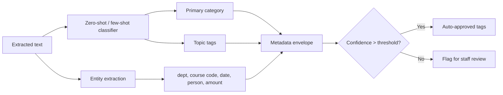

**Why automated but human-overridable:** hundreds of thousands of documents × pure manual tagging never ships; fully automated tagging has a ~15% misclassification rate that silently misleads retrieval. The confidence-gated hybrid auto-approves high-confidence tags and routes low-confidence ones to staff review. A mis-tagged "fee structure" landing in "hostel" is exactly the silent corruption this gate prevents (P6).

### 3.7 Chunking Strategy — Type-Aware

No single chunk size. Chunking is chosen per document type:

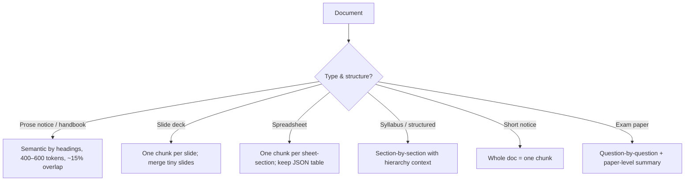

**Core rules and why:**

- **400–600 token target with ~15% overlap.** Small enough that each chunk is topically coherent (high retrieval precision); large enough that a retrieved chunk is self-contained context for the LLM.
- **Respect structural boundaries first.** Never split a heading from its body or a table across rows. Structural coherence beats fixed token counts.
- **Hierarchical context enrichment.** Each chunk stores a context path (e.g., `Hostel Rules > Section 3 > Curfew`) prepended at retrieval so the LLM knows *where* a chunk came from — sharply reduces out-of-context hallucination.
- **Tables stay atomic.** A timetable is never split mid-row.

**Why over naive fixed-size chunking:** fixed 512-token chunks ignore semantics, decapitate headings, and halve tables — each degrades relevance and citation accuracy. Type-aware chunking is more code but qualitatively better answers. This is the single largest determinant of answer quality in the whole RAG system.

### 3.8 Embedding Generation

**One primary embedding model family, versioned on every vector.** Chosen for strong **multilingual** performance (the corpus mixes English and Hindi). Stored as `embedding_model="upc-emb-v1"` on each vector. Embeddings are generated **server-side only** (never in the browser), so model and dimensionality are centralized and upgradeable. **Batch embedding** at ingestion (64–256 chunks per call) amortizes cost — this is where most ingestion spend lives. **Model upgrades** re-embed into a shadow index, validate quality, then atomically swap — zero downtime, never serving mixed-model vectors (mixing destroys cosine comparability).

### 3.9 Vector Index

**A dedicated managed vector DB at scale; pgvector at small scale.** Selection logic:

- **< ~250k chunks, low QPS:** `pgvector` on Postgres — one fewer system to operate, transactional with metadata.
- **250k–10M chunks:** dedicated engine (Qdrant/Weaviate/Pinecone) with HNSW, native metadata filtering, sharding.
- **> 10M chunks, high QPS:** sharded cluster with a routing layer.

The **Vector Search Engine service** abstracts the vendor so the swap is invisible to Retrieval. **HNSW parameters** (`M≈16`, `ef_construction≈200`, `ef_search≈100–400` tuned per collection) favor **recall** — a wrong answer is worse than a slightly slower one (P7).

### 3.10 Hybrid Search, Re-ranking, Context Assembly

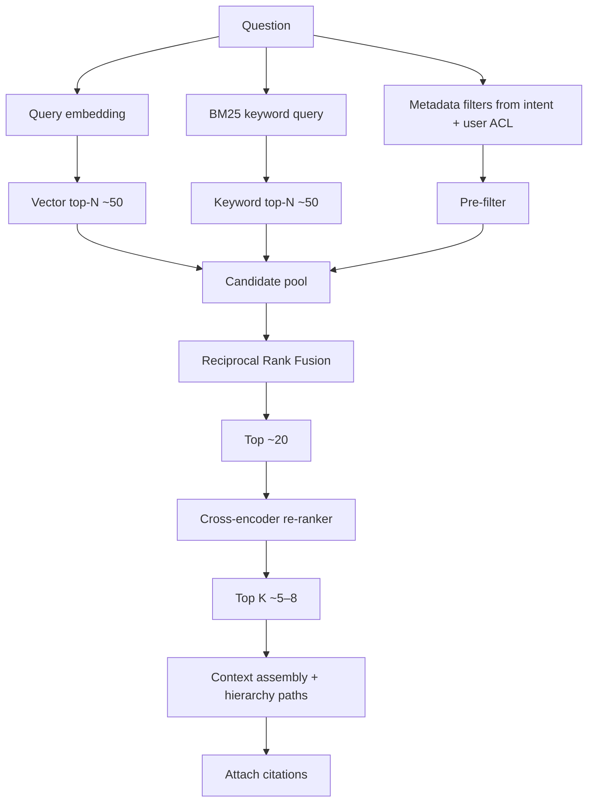

**Why hybrid, not pure vector:** semantic search misses exact-match queries — "notice ref 2024/127", a specific fee amount, a course code "CS302" — where lexical match is exactly right; BM25 misses paraphrase ("hostel curfew" vs "hostel closing time"). **Reciprocal Rank Fusion (RRF)** merges both without needing calibrated scores. **Why a cross-encoder re-ranker:** first-stage retrievers are fast but coarse; a cross-encoder scores query+chunk jointly and is far more accurate at true relevance. Retrieve broadly (cheap), re-rank narrowly (expensive, on only ~20 candidates) — the standard two-stage pattern maximizing relevance per millisecond. **Metadata pre-filtering is fused with retrieval** (applied in the engine, not after) so filtering never empties the candidate pool; the filter set comes from intent + the user's ACL — a 2nd-year CS student never retrieves a 4th-year ECE timetable, and never a restricted document (P6).

### 3.11 Citation Generation

Every knowledge answer ships with citations. Each citation = `{doc_title, doc_version, page_number, chunk_index, source_url, snippet}`. Rendered inline as footnotes **and** as a sources panel. The generation prompt is constrained: *"Answer only using the provided context. If the context does not contain the answer, say you don't have that in the official knowledge base. Cite a source for every claim."* Refusal-on-missing-evidence is enforced because a confident wrong answer about exam dates or fees is the worst outcome (P7).

### 3.12 Knowledge Updating

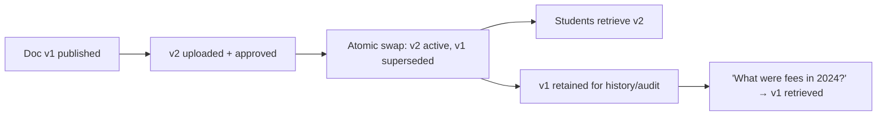

- Documents are **versioned, never overwritten**. A new version supersedes the old; old chunks are marked `superseded` and excluded from default retrieval but retained for audit and "what did the rule say in 2024?" queries.
- Notices carry `effective_date`/`expiry_date`; expired content is filtered from default retrieval.
- Re-ingestion of an edited document = new version → re-embed → atomic swap of the active chunk set. **No model retraining, anywhere, ever.** This is P1 realized.

---

## Section 4 — Admin Knowledge Portal

The Admin Portal is the **control plane** for the college knowledge base — an enterprise application in its own right with workflows, approvals, permissions, and audit. Only **`Published`** documents are retrievable by students.

### 4.1 Capability Map

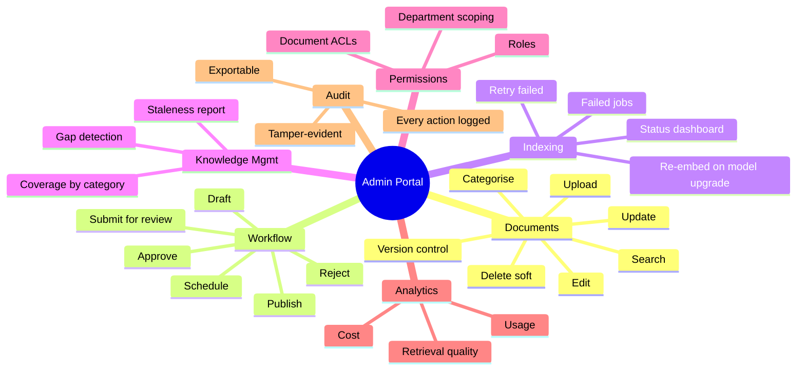

### 4.2 Document Lifecycle & Approval Workflow

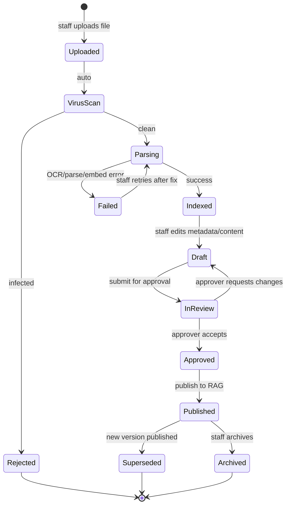

**Why an approval gate:** knowledge that reaches students must be vetted. A junior staff member publishing an unapproved "revised fee structure" would be an institutional incident. Draft → review → approve → publish ensures only authorized content enters the live RAG index. **Rejection** routes back to Draft with a reason; **Failed indexing** routes to a retry queue with the failing page/chunk surfaced so staff can fix and re-queue.

### 4.3 Version Control Model

Each document has an immutable `doc_id` and monotonic `version`. The "active version" pointer is updated transactionally; retrieval always reads the active pointer. Old versions are retained — storage is cheap; wrong answers about "what the rule used to be" are not. The portal shows a full version timeline with diff and who-approved-what.

### 4.4 Roles & Permissions (Admin Side)

| Role | Upload | Edit | Approve | Delete | Manage users | Scope |
|------|:---:|:---:|:---:|:---:|:---:|-------|
| **Contributor** | ✓ (own dept) | ✓ (own drafts) | — | — | — | department |
| **Editor** | ✓ | ✓ (dept docs) | — | soft (own) | — | department |
| **Approver** | ✓ | ✓ | ✓ (dept) | soft (dept) | — | department |
| **Knowledge Admin** | ✓ | ✓ | ✓ (all) | ✓ (all) | ✓ | college-wide |
| **Super Admin** | ✓ | ✓ | ✓ | hard delete | ✓ (all roles) | college-wide + config |

**Why department scoping by default:** a Physics faculty member shouldn't approve Chemistry syllabus changes. Scope-bounded roles prevent cross-department accidents while a Knowledge Admin retains global authority. Approval rights are intentionally separated from upload rights (a contributor cannot self-publish).

### 4.5 Indexing Status & Failure Monitoring

Real-time dashboard showing, per document: ingestion stage (uploaded → scanned → parsing → OCR → chunking → embedding → indexed / failed), failure reasons with the failing page/chunk, queue depth, worker health, and embedding-model version per doc (to spot pre-migration stragglers). Backed by the job-status table in Postgres, updated by workers via a status queue, pushed to the UI over SSE. **Retry failed indexing** re-enqueues with the same content hash (idempotent), optionally with a corrected file or an OCR override.

### 4.6 Analytics Surface

Read from the analytics warehouse (never the OLTP DB): top queried topics (reveals coverage gaps — "students keep asking about scholarships; our scholarship doc is thin"), retrieval-confidence distribution (lots of low-confidence hits = weak coverage), citation click-through (do students verify sources?), cost per answer per provider, and document coverage by category/department. These drive the knowledge-management backlog.

### 4.7 Audit

Every admin action — upload, edit, approve, reject, delete, permission change, role assignment — writes an immutable event `{actor, action, target, before, after, timestamp, request_id}` to the append-only store. Records are hash-chained (each references the previous record's hash) so tampering is detectable; exportable for compliance. See Section 7.6.

---

## Section 5 — AI Provider Layer

A Cursor-style provider abstraction. The frontend and every service speak one internal interface; the Provider Gateway translates to each vendor. **The frontend never depends on any provider.**

### 5.1 Provider Abstraction & Factory

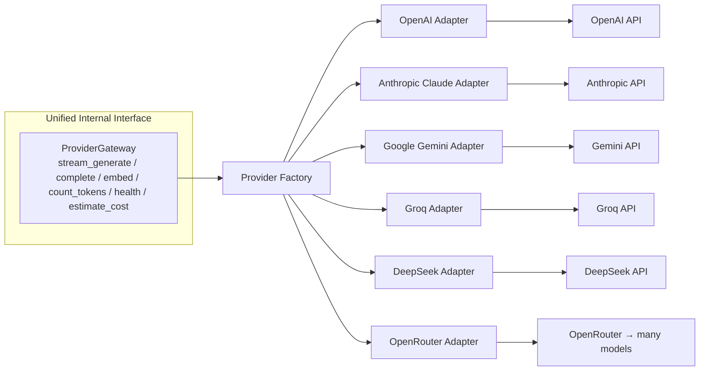

**The internal contract** every adapter implements (interface, not code): `stream_generate({messages, model_hint, max_tokens, temperature, tools, metadata}) → token stream`; `complete({...}) → response`; `embed({texts, model}) → vectors`; `count_tokens({text, model}) → int`; `health() → status`; `estimate_cost({tokens_in, tokens_out, model}) → decimal`. Adapters normalize streaming format, tool-calling schema, error codes, token counting, and pricing into this one shape.

**Why the Factory pattern:** providers are instantiated by config (name, credentials ref, model map, quotas) rather than by scattered `new OpenAI()` calls. Adding a seventh provider is "register one adapter + one config entry." Nothing upstream changes.

### 5.2 Routing Logic

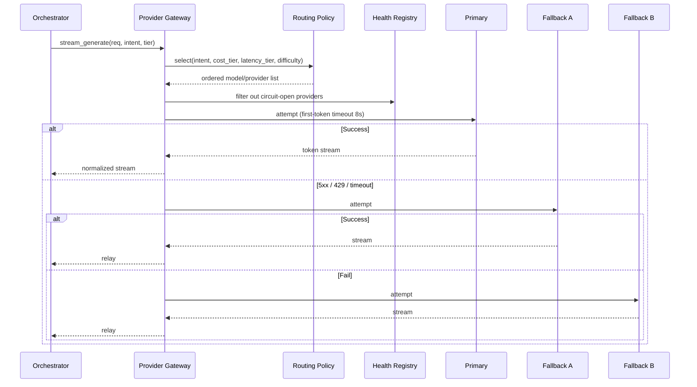

**Routing policy dimensions:** task type → model tier (cheap for conversational, mid for knowledge, frontier for hard reasoning); cost tier (cheapest model clearing the quality bar); latency tier (Groq-class for snappy turns); difficulty (escalate to frontier only when the router signals it); and feature flags/overrides (e.g., a mandated provider or on-prem model).

### 5.3 Health Checks & Circuit Breaking

Each adapter runs periodic lightweight `health()` probes. A provider that fails N consecutive checks (or serves a burst of errors) is marked **circuit-open** for a cooldown and removed from the candidate list; traffic shifts away automatically. A probe re-closes the circuit on recovery. **Why:** failover decisions must be made from *observed health*, not per-request error guessing — a slow-dying provider should be routed around *before* it starts erroring on live student requests.

### 5.4 Streaming Normalization

Each vendor streams differently. The gateway emits one canonical SSE schema regardless of who served:

```
event: token       data: { "text": "..." }
event: tool_call   data: { "name": "...", "args": {...} }
event: done        data: { "finish_reason": "...", "tokens_in": n, "tokens_out": m, "citations": [...] }
event: error       data: { "code": "...", "message": "..." }
```

Downstream services parse one schema. This is *why* swapping providers is invisible to the frontend (P3).

### 5.5 Rate Limits & Concurrency

- **Per-provider token buckets** sized to each vendor's quota, shared across gateway instances via Redis. A request that would exceed a provider limit queues briefly or routes to a fallback immediately.
- **Per-user concurrency caps:** one student can't open 20 parallel streams and burn budget.
- **Per-day quotas:** hard ceilings to prevent runaway cost.
- **Cost-aware shed:** under extreme load, conversational turns degrade to the cheapest model first; knowledge/academic turns degrade last.

### 5.6 Cost Optimisation

| Lever | Mechanism |
|-------|-----------|
| **Semantic cache** | Repeat/near-duplicate questions return cached answers; no provider call |
| **Model tiering** | Cheap models for easy tasks; frontier only when difficulty demands |
| **Prompt caching** | Reuse cached system prompts & stable context across turns (provider-supported) |
| **History summarization** | Compress older turns to cut input tokens |
| **Batch embedding** | Amortize embedding cost at ingestion |
| **Token budgets** | Per-turn max_tokens caps; avoid runaway outputs |
| **Cost attribution** | Per-request cost tagged to intent/user/category → dashboards (Section 9) |

**Why semantic caching is the biggest lever:** with a bounded knowledge base and millions of requests, question repetition is high ("when are exams?", "what's the fee?"). A 30–50% cache hit rate on knowledge questions roughly halves provider cost.

---

## Section 6 — Authentication

UPC AI supports three user classes — Student, Faculty, Admin — with multiple sign-in methods converging on one identity and one token model.

### 6.1 Supported Login Methods

- **College email login** — the primary method. A user signs in with their official `@upc...` college email + password, or via OTP if the college doesn't issue passwords.
- **Google login (OAuth 2.0 / OIDC)** — one-tap sign-in restricted to the college Google Workspace domain, so only official accounts succeed.
- **OTP verification** — email/SMS one-time passcode as a first-class login method (passwordless) and as a step-up factor for sensitive actions.
- **College SSO federation (SAML/OIDC/LDAP)** — if UPC runs an IdP, we federate and trust its directory for who is student/faculty/admin rather than maintaining a parallel user database.

**Why multiple methods:** UPC students and faculty have heterogeneous access — some have Workspace accounts, some only an email, some only ERP credentials. Converging all of them onto a single internal identity avoids fragmented accounts while meeting users where they are.

### 6.2 Authentication Flow

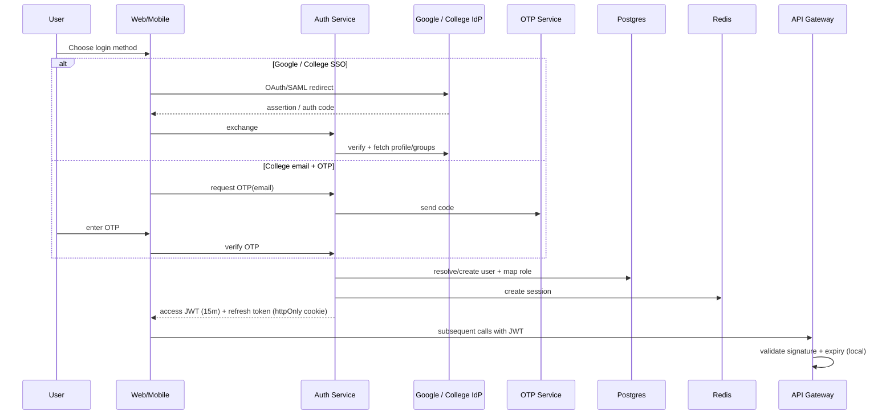

### 6.3 Token Model — JWT + Refresh Tokens

- **Access token:** short-lived signed JWT (~15 min), carrying `user_id`, role, department, year/program, and audience scopes. Validated at the gateway with a **local public key** — no DB round-trip per request, which is what makes the hot path fast and horizontally scalable.
- **Refresh token:** long-lived, **rotating**, stored in an `httpOnly`, `Secure`, `SameSite` cookie (never readable by JS → XSS-resistant). Each refresh rotates the token and invalidates the previous one; reuse of an old refresh token signals theft and revokes the session family.
- **Session record:** a server-side session entry in Redis enables instant revocation (logout, admin force-logout, suspicious activity) without waiting for JWT expiry.

**Why short-lived access + rotating refresh:** pure long-lived JWTs can't be revoked and leak broadly; pure server sessions don't scale horizontally. This hybrid gives revocation *and* stateless validation. P8 + security.

### 6.4 RBAC & Sessions

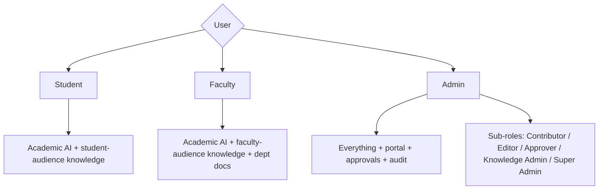

- **RBAC** governs *what kind* of action; **ABAC** (department, year, audience, access_level attributes) governs *over what data*. Retrieval always injects the user's attribute filters server-side.
- **Role mapping:** IdP groups/attributes (or OTP-verified email domain + enrollment data) map to internal roles via a configurable mapping table. A `faculty` assertion → `Editor` in their department; a `registrar` → `Approver`.
- **Sessions** are per-device, revocable, and listed in the user's settings ("sign out other devices").

---

## Section 7 — Security

Enterprise security across ten concerns. The two non-negotiables: **authorization is enforced server-side at the retrieval choke point**, and **every privileged action is audited immutably**.

### 7.1 Encryption

- **In transit:** TLS 1.2+ everywhere, including internal service-to-service (mTLS on the service mesh where supported).
- **At rest:** object storage server-side encryption with KMS-managed keys; database/volume encryption; Redis AUTH + encrypted persistence.
- **Field-level:** envelope encryption (KMS) for any PII we must store (e.g., identifiers in audit records).
- **Embeddings:** not individually encrypted (derived, non-reversible, and per-vector encryption kills query performance), but the vector store volume is encrypted at rest and network-isolated. This is a deliberate, documented trade-off.

### 7.2 Secure Uploads

Every upload is validated by **magic bytes** (not just extension), size-limited, **virus-scanned** before any parser touches it, written to object storage with a **content-addressed key** (dedup + integrity), and quarantined if infected. Presigned, short-lived upload URLs mean files never transit the app servers. **Why:** staff upload arbitrary files; the parser boundary is the cheapest place to stop a malicious document.

### 7.3 Secrets Management

All secrets (provider API keys, DB credentials, JWT signing keys, OAuth client secrets) live in a **managed secrets manager** with KMS backing — never in the repo, env files committed to source, or images. Least-privilege per-service access; automated rotation; signing-key rotation supports graceful overlap so live sessions aren't dropped.

### 7.4 Private Documents & Document Permissions

- Every document carries `access_level`: `public`, `internal`, `restricted`.
- `restricted` documents are retrievable only by users whose attributes match the document's ACL (e.g., a placement report restricted to final-year students of a department).
- **Private uploads** (marked "visible to uploader + approvers only") are **never** in the student-facing retrieval index — visible only in the portal. Protects drafts and sensitive memos.
- **Enforcement point:** the Retrieval Service is the single choke point. There is no alternate path to vectors that bypasses the ACL filter. A student cannot retrieve a restricted doc even by crafting the perfect query, because filtering is server-side. This is the most important security property of the knowledge layer.

### 7.5 Role Permissions

RBAC + ABAC as in Section 6.4. Authorization is checked twice for any knowledge read: (1) can this user query the KB at all (role), and (2) can they retrieve *this* chunk (attribute filter). Admin actions check role + scope (department-scoped approvers can't approve outside their department).

### 7.6 Audit Logs

```mermaid
flowchart LR
    A1[Admin action] --> AUD[Audit Service]
    A2[Auth event] --> AUD
    A3[Permission change] --> AUD
    A4[Document lifecycle change] --> AUD
    A5[Provider call - cost] --> AUD
    A6[Restricted-doc retrieval sampled] --> AUD
    AUD --> STORE[(Append-only, hash-chained store)]
    STORE --> EXPORT[Exportable for compliance]
    STORE --> ALERT[Anomaly detection]
```

- **Logged:** every auth event, permission/role change, document lifecycle change, admin action, bulk operation, provider call with cost, and sampled retrieval accesses.
- **Tamper-evidence:** each record includes the hash of the previous record (a chain); a broken chain signals tampering.
- **Retention:** per policy (years) in append-only object storage with object-lock.
- **Anomaly alerts:** mass deletions, privilege escalations, after-hours admin actions trigger alerts.

### 7.7 Rate Limiting

Enforced at the edge per user and per IP: request-rate caps, per-user concurrency caps on streams, per-day token quotas, and stricter limits on auth endpoints (OTP request throttling to prevent abuse). Stops scraping, brute force, and budget burn before any expensive work happens.

### 7.8 Content Moderation

- **Input moderation** at the Orchestrator: refuse harmful, PII-seeking, or jailbreak attempts *before* any provider call (no token spend, no risk).
- **Output moderation:** the provider's safety layer plus our grounded-prompt constraint (answer only from context) for knowledge answers.
- **Prompt-injection defense:** retrieved chunks are treated as *untrusted data*, fenced in the prompt, with instructions to ignore embedded commands — a maliciously crafted document can't make the AI exfiltrate data or ignore its guardrails.
- **PII redaction** on ingestion for accidentally-included personal data (a notice containing student IDs), configurable and logged.

### 7.9 Data Privacy

- **Data minimization:** store only what's needed; long-term memory is opt-in, scoped, and user-viewable/editable.
- **Purpose binding:** retrieval filters enforce audience so a student never sees another student's data.
- **Residency & compliance:** data pinned to the chosen region; retention and deletion honored; exportable on request. Aligns with Indian data-protection expectations (DPDP) for an educational institution.
- **No training on user data:** provider configurations disable vendor-side training on UPC prompts/documents.

### 7.10 Backup & Recovery Strategy

- **Postgres:** automated daily snapshots + continuous WAL archiving (point-in-time recovery); restores tested monthly.
- **Vector DB:** scheduled snapshots to object storage.
- **Object storage:** versioning + cross-region replication.
- **Redis:** snapshot persistence (cache is rebuildable; backup is convenience).
- **Recovery:** RPO ~15 min, RTO ~1 hour via warm standby + IaC bring-up (Section 10.9). Quarterly restore drills — an untested backup is a hope, not a backup.

---

## Section 8 — Performance & Scalability

Target: **50,000+ students, 5,000+ faculty, millions of AI requests, hundreds of thousands of documents**, low latency, high availability — sized for a single institution, built to scale out.

### 8.1 Scaling Strategy Per Tier

```mermaid
flowchart TB
    subgraph Edge["Edge — global, effectively free"]
        CDN[CDN + WAF]
    end
    subgraph App["Stateless app tier — horizontal autoscale"]
        GW[API Gateway ×N]
        CHAT[Chat ×N]
        ORCH[Orchestrator ×N]
        RETR[Retrieval ×N]
        PGW[Provider Gateway ×N]
    end
    subgraph Async["Async tier — autoscale on queue depth"]
        Q[(Partitioned Queues)]
        W[Workers ×N]
    end
    subgraph Data["Data tier — shard / replicate"]
        PG[(Postgres: primary + read replicas + partitions)]
        VDB[(Vector DB: sharded HNSW)]
        RDS[(Redis: cluster mode)]
        OBJ[(Object Storage: unbounded)]
    end
    CDN --> GW --> CHAT & ORCH & RETR & PGW
    CHAT --> RETR
    Q --> W
    CHAT & RETR --> PG & VDB & RDS
    W --> PG & VDB & OBJ
```

- **Stateless app services** hold no per-request state (state lives in Redis/Postgres), so they scale by adding instances behind the load balancer; autoscale on CPU + request latency.
- **Workers** scale on **queue depth**, not CPU — a PDF backlog spins up more workers; an empty queue scales to near-zero. This decouples ingestion throughput from interactive load (P5).
- **Postgres** scales via read replicas (retrieval metadata + analytics) and partitioning (messages by month, audit by month, chunks by category).
- **Vector DB** scales by sharding HNSW across nodes; metadata filters prune shards before search.
- **Redis** runs cluster mode; cache + session state sharded by key.
- **Object storage** is inherently unbounded; old versions lifecycle to cheaper classes.

### 8.2 Caching Strategy — Four Layers

```mermaid
flowchart LR
    REQ[Request] --> L1[L1 CDN/edge — static assets]
    REQ --> L2[L2 API cache — non-personalized knowledge Qs]
    REQ --> L3[L3 Semantic cache — answer-level dedup]
    REQ --> L4[L4 Object/DB cache — hot docs, metadata, embeddings]
    L1 & L2 & L3 & L4 --> HIT[Serve from cache]
    HIT --> USER[User]
```

- **L3 Semantic cache** is the headline win: question-embedding keys matched by similarity; TTL shorter for knowledge (data changes) than academic (stable). **Invalidation:** a doc-id → cache-key index evicts affected answers when a document version changes.
- **L2 API cache:** high-frequency non-personalized knowledge queries ("academic calendar 2026") cached at the gateway, short TTL.
- **L4 metadata/embedding cache:** hot document metadata and frequent query embeddings memoized.
- **L1 CDN:** all static frontend/admin assets + any public pages cached globally.

### 8.3 Queue System & Background Workers

```mermaid
flowchart LR
    P1[Ingestion API] --> Q1[(ingest queue)]
    P2[Admin re-index] --> Q1
    P3[Model-upgrade re-embed] --> Q2[(re-embed queue)]
    P4[Notifications] --> Q3[(notif queue)]
    Q1 --> W1[Parse/OCR workers]
    Q2 --> W2[Re-embed workers]
    Q3 --> W3[Notification workers]
    Q1 -.priority lane.-> URG[Urgent notices fast-track]
    Q1 -.poison jobs.-> DLQ[(Dead-letter queue)]
```

- **Partitioned queues** so a hot category (exam-season notices) doesn't starve others.
- **Priority lanes** for admin-triggered re-indexes so an urgent notice publishes fast even during a backlog.
- **Dead-letter queues** capture poison jobs (OCR loops, corrupt files) for the portal to surface.
- **Backpressure:** beyond depth thresholds, the Ingestion API returns 202 with a "delayed" signal rather than accepting unbounded work.

### 8.4 High Availability & Load Balancing

- **Multi-AZ** for every stateful tier (Postgres, Vector DB, Redis).
- **Stateless services** across AZs; the load balancer health-checks and removes unhealthy instances.
- **Provider failover** (Section 5) covers external AI outages.
- **Graceful degradation:** vector DB degraded → academic-only mode + banner (Section 2.9).
- **Target SLO:** 99.9% for the interaction plane; 99.5% for ingestion (async, tolerant).

### 8.5 Latency Budget

| Stage | Budget | Notes |
|-------|--------|-------|
| Edge + gateway + auth | ~20–40ms | local JWT validation |
| Intent detection | ~30–80ms | layered, cached |
| Retrieval (vector + BM25 + rerank) | ~80–200ms | the expensive interactive step |
| First token from provider | ~300–600ms | provider-dependent |
| **Time-to-first-token** | **< ~800ms target** | streaming makes it feel instant |
| Total answer | length-dependent | streams regardless |

### 8.6 Storage Strategy

```
/raw/<doc_id>/<version>/<filename>          # original upload
/derived/<doc_id>/<version>/text.txt        # extracted text
/derived/<doc_id>/<version>/tables/*.json   # structured tables
/derived/<doc_id>/<version>/pages/*.png     # page images (re-OCR / display)
/exports/...                                # audit + analytics exports
```

Content-addressed + versioned for dedup and immutability; lifecycle rules move old versions to cheaper storage classes; audit exports use object-lock for tamper-evidence.

---

## Section 9 — Observability

An AI system needs more than RED metrics. We observe **prompts, tokens, cost, retrieval quality, citation accuracy, and user feedback** alongside latency and errors.

### 9.1 Observability Pillars

```mermaid
flowchart LR
    SVC[All services] --> MET[Metrics]
    SVC --> LOG[Structured logs]
    SVC --> TRC[Distributed traces]
    SVC --> EVAL[AI evaluation]

    MET --> DASH[Dashboards]
    LOG --> DASH
    TRC --> DASH
    EVAL --> DASH
    DASH --> ALERT[Alerting]
    ALERT --> ONCALL[On-call / paging]
```

- **Metrics:** RED (Rate, Errors, Duration) per service **plus** AI metrics: cache hit rate, retrieval confidence distribution, tokens in/out, cost per answer, indexed-doc count, queue depth, provider failover count.
- **Logs:** structured JSON, one correlation `request_id` end-to-end; error-level always retained, high-volume info sampled to control cost.
- **Traces:** OpenTelemetry; sampling biased to errors and slow requests.

### 9.2 Prompt Versioning

Every generation records the `prompt_id + version` and model used (Section 2.6). This lets us correlate quality/regression to a specific prompt version, A/B prompt rollouts, and roll back a bad prompt instantly. Prompt metrics (acceptance, citation rate, refusal rate) are tracked **per prompt version**.

### 9.3 Latency, Token Usage & Cost Tracking

- **Latency:** per-stage histograms (edge, intent, retrieval, first-token, total) so we can see *which* stage regressed.
- **Token usage:** `tokens_in/tokens_out` per request, tagged by intent, model, prompt version, user cohort.
- **Cost:** per-request cost computed at the Provider Gateway (via `estimate_cost`) and aggregated per tenant/day, per category, per model. **Cost anomaly alerts** fire on unexpected spikes (a runaway loop or a mispriced model).

### 9.4 Error Tracking

Centralized error tracking with stack traces, grouped by fingerprint, correlated to `request_id` and deploy version. Ingestion failures carry the failing doc/page/chunk so staff can act. Error budgets tie to SLOs.

### 9.5 Model Performance & Retrieval Quality

- **Model performance:** per-model acceptance rate, latency, refusal rate, and downstream feedback score; compared across providers to inform routing policy.
- **Retrieval quality:** tracked via retrieval-confidence distribution, "no relevant evidence" rate (signals coverage gaps), and position-of-cited-chunk (are the right chunks ranking high?).

### 9.6 Citation Accuracy

Because citation correctness is the trust backbone (P6), we measure it: sampled answers are auto-checked that each cited chunk actually supports its claim (an evaluator model or human spot-check), and citation click-through is tracked. A drop in citation-support rate triggers a retrieval/prompt review.

### 9.7 User Feedback

Thumbs up/down per answer plus optional reason, captured by the client and tied to the exact prompt/model/retrieval set that produced it. Negative feedback routes to a review queue and feeds evaluation datasets.

### 9.8 AI Evaluation

An offline **evaluation harness** runs golden datasets (curated Q→expected-answer + expected-source) against candidate models/prompts before rollout. Regression: a new prompt/model must not drop retrieval-citation or answer-quality scores below the incumbent. This is the gate that makes prompt/model changes safe.

### 9.9 Dashboards & Alerting

- **Ops dashboard:** RED + queue depth + provider health + cache hit rate (real-time).
- **AI quality dashboard:** retrieval confidence, citation accuracy, feedback score, refusal rate, per-prompt-version trends.
- **Cost dashboard:** spend per day/category/model, budget burn, anomaly flags.
- **Admin analytics:** usage, coverage gaps, top topics (from the warehouse, Section 4.6).
- **Alerting:** on SLO burn, error rate, cost spike, queue backlog, provider circuit-open, vector DB health, citation-accuracy drop.

---

## Section 10 — Deployment

Cloud-native production deployment, sized for a single institution, built to scale out and recover.

### 10.1 Production Topology

```mermaid
flowchart TB
    subgraph G["Global"]
        DNS[DNS + Traffic Mgr]
    end
    subgraph E["Edge"]
        CDN[CDN — global PoPs]
        WAF[WAF + DDoS]
    end
    subgraph R["Primary Region — multi-AZ"]
        LB[Load Balancer]
        subgraph K["Container Orchestration"]
            APPS[App services: Chat/Orchestrator/Retrieval/Provider/Auth/Portal]
            WRK[Ingestion workers]
        end
        PG[(Managed Postgres)]
        VDB[(Managed Vector DB)]
        RDS[(Managed Redis)]
        OBJ[(Object Storage)]
    end
    subgraph EXT["External"]
        AI[AI Providers]
        IDP[College IdP / Google]
    end
    subgraph OB["Observability"]
        MON[Metrics + Dashboards]
        LOGS[Log aggregation]
        TRC[Tracing]
        AL[Alerting]
    end
    subgraph DR["Disaster Recovery"]
        WARM[Warm standby region + backups]
    end

    DNS --> CDN --> WAF --> LB
    LB --> APPS
    APPS --> PG & VDB & RDS & OBJ
    WRK --> PG & VDB & OBJ
    APPS & WRK --> AI
    APPS --> IDP
    APPS & WRK --> MON & LOGS & TRC
    MON --> AL
    PG & VDB & OBJ --> WARM
```

### 10.2 Cloud Infrastructure

| Concern | Choice | Why |
|---------|--------|-----|
| **Compute** | Managed Kubernetes / serverless containers | Horizontal scale, autoscaling, reproducible deploys |
| **Primary DB** | Managed Postgres | Transactional system of record; pgvector for the small-scale phase |
| **Vector DB** | Managed Qdrant/Weaviate/Pinecone (pgvector early) | Dedicated HNSW + filtering at scale |
| **Object storage** | S3-compatible managed store | Unbounded, cheap, lifecycle rules, SSE |
| **Cache/streams** | Managed Redis (cluster mode) | Semantic cache, sessions, rate-limit tokens, status pub/sub |
| **Queues** | Managed queue (SQS-class; Kafka if very high throughput) | Decouple ingestion; partitioned; DLQs |
| **CDN/WAF** | Global CDN with integrated WAF + DDoS | Latency + edge protection |
| **Secrets** | Managed secrets manager + KMS | No secrets in repo; rotation; envelope encryption |
| **IaC** | Terraform / Pulumi | Reviewable, rebuildable infrastructure |

**Why managed where possible:** self-hosting Postgres, Redis, and a vector DB at this scale is a dedicated team each. Managed services shift that to vendors with SLAs; the abstraction layers (Retrieval Service, Provider Gateway) keep exit paths open against lock-in.

### 10.3 Database, Vector DB, Redis, Object Storage

- **Postgres:** system of record (users/roles, documents + versions, chunk metadata, jobs, messages, audit pointer). Partitioned (messages/audit by month), read replicas for reads, connection pooling in front.
- **Vector DB:** sharded cluster, replicas per shard, HNSW per collection, scheduled snapshots to object storage, restore tested quarterly.
- **Redis:** cluster mode with replicas; semantic cache + sessions + rate-limit tokens + status pub/sub; AOF/RDB so restarts don't cause cold-cache storms.
- **Object storage:** layout per Section 8.6; versioning + cross-region replication + lifecycle.

### 10.4 CI/CD

```mermaid
flowchart LR
    DEV[Commit / PR] --> CI[CI: build + test + lint + scan]
    CI --> SEC[Dependency + container scan]
    SEC --> SIGN[Sign image]
    SIGN --> STG[Deploy to Staging]
    STG --> EVL[AI eval gate: golden datasets]
    EVL -->|pass| CAN[Canary deploy to Prod]
    EVL -->|fail| BLOCK[Block + notify]
    CAN --> FULL[Full rollout]
    FULL --> MON[Watch SLOs / auto-rollback on burn]
```

- **Pipeline:** build → test → dependency/container scan → sign → deploy to staging → **AI evaluation gate** (golden datasets must not regress) → canary → full rollout with auto-rollback on SLO burn.
- **Why an AI eval gate in CI/CD:** a prompt/model/retrieval change is a behavior change; the golden-dataset gate stops quality regressions before they reach students. This is what makes frequent AI iteration safe.

### 10.5 Environment Strategy

| Env | Purpose | Data | Notes |
|-----|---------|------|-------|
| **Development** | Local/PR iteration | synthetic | fast, disposable |
| **Testing / Staging** | Pre-prod validation + eval gate | anonymized subset of prod docs | mirrors prod config |
| **Production** | Live | real | canary + auto-rollback |

Config is per-environment via IaC; secrets per-environment via the secrets manager. **No prod data in lower environments** without anonymization.

### 10.6 Backups

As Section 7.10: Postgres daily snapshots + WAL PITR; Vector DB scheduled snapshots; object storage versioning + cross-region replication; Redis snapshot persistence. Restores tested monthly.

### 10.7 Disaster Recovery

- **RPO ~15 min** (WAL archiving + async replication), **RTO ~1 hour** (warm standby + IaC bring-up).
- **Warm standby** in a second region with replicated object storage and a promotable DB replica; DNS failover. Active-active only after growth justifies the cost.
- **Runbooks** per failure mode: provider outage, vector DB outage, region loss, bad-deploy rollback.

---

## Section 11 — Architecture Decision Records

Each ADR: the decision, alternatives considered, why chosen, trade-offs, risks, future improvements.

### ADR-01 — RAG over Fine-Tuning for College Knowledge

- **Decision:** All college knowledge served via retrieval-augmented generation; the LLM is never fine-tuned on UPC content.
- **Alternatives:** (a) fine-tune a model on college docs; (b) prompt-stuffing large context; (c) hybrid fine-tune + RAG.
- **Why chosen:** college info changes constantly (notices, timetables, fees). Fine-tuning is slow, expensive, and non-reversible; a wrong fact is baked in. RAG updates in seconds, provides citations, and supports versioned documents (P1, P6, P7).
- **Trade-offs:** adds a retrieval hop (latency) and retrieval-quality dependency; requires a good chunking/metadata pipeline.
- **Risks:** poor retrieval → poor answers. Mitigated by hybrid search + rerank + metadata filters + evaluation gate.
- **Future:** optional small adapter/LoRA for *tone/style* (never for facts); query-expansion models.

### ADR-02 — Orchestrator with Explicit Intent Routing

- **Decision:** A dedicated AI Orchestrator classifies intent (academic / knowledge / mixed / conversational / out-of-scope) and routes to the right pipeline.
- **Alternatives:** (a) single mega-prompt that "does everything"; (b) always-retrieve; (c) pure LLM router with no rules.
- **Why chosen:** one assistant, two capabilities (P2). Explicit routing saves cost (skip retrieval for pure academic, skip provider for chitchat), enforces tool gating and ACLs, and handles continuity. Layered rules + classifier beats a single brittle classifier.
- **Trade-offs:** more moving parts; routing errors possible.
- **Risks:** misclassification → wrong pipeline. Mitigated by the PROBE fallback and feedback-driven tuning.
- **Future:** learned router from logged outcomes; per-user routing priors.

### ADR-03 — Hybrid Search (Vector + BM25) with Cross-Encoder Re-rank

- **Decision:** Two-stage retrieval: broad hybrid recall (vector + BM25 fused via RRF), then a cross-encoder re-ranks the top ~20.
- **Alternatives:** (a) vector-only; (b) BM25-only; (c) single-stage dense with no rerank.
- **Why chosen:** vector misses exact matches (course codes, notice numbers, amounts); BM25 misses paraphrase. RRF fuses cheaply. Cross-encoder gives the best relevance per ms on a narrow candidate set.
- **Trade-offs:** extra latency (~100–200ms) and a reranker model to operate.
- **Risks:** reranker cost/latency at scale. Mitigated by re-ranking only ~20 candidates.
- **Future:** learned sparse+dense fusion; ColBERT-style late interaction.

### ADR-04 — Type-Aware Chunking over Fixed-Size

- **Decision:** Chunk by document type and structure (semantic sections, per-slide, per-sheet-section, atomic tables), ~400–600 tokens with ~15% overlap, plus hierarchical context paths.
- **Alternatives:** (a) fixed 512-token chunks; (b) whole-document chunks; (c) sentence windows only.
- **Why chosen:** chunk quality is the largest determinant of answer quality. Fixed chunks decapitate headings and halve tables; whole docs are too coarse for precision. Structural chunking keeps units self-contained and citable.
- **Trade-offs:** more parser code per format.
- **Risks:** edge-case formats chunk poorly. Mitigated by fallback semantic chunker + staff review.
- **Future:** layout-aware multimodal chunking; automatic chunk-size tuning per category.

### ADR-05 — Two-Tier OCR

- **Decision:** Local OCR first; route only low-confidence pages to high-accuracy cloud OCR; reconstruct reading order and tables from bounding boxes.
- **Alternatives:** (a) cloud OCR for everything; (b) local only; (c) no table reconstruction.
- **Why chosen:** cloud-everything is expensive; local-only is inaccurate on scans/handwriting. Two-tier matches cloud accuracy on the hard fraction at ~10% of the cost. Table reconstruction is essential because timetables/fees/exam schedules are tabular and mixed English/Hindi.
- **Trade-offs:** routing logic + confidence calibration.
- **Risks:** misrouted pages yield bad text. Mitigated by confidence thresholds + staff retry with override.
- **Future:** vision-language-model OCR for complex layouts; handwriting-specialized models.

### ADR-06 — Dedicated Vector DB (Migration Path from pgvector)

- **Decision:** Start on pgvector; migrate to a dedicated vector DB (Qdrant/Weaviate/Pinecone) as corpus/QPS grows. Retrieval Service abstracts the vendor.
- **Alternatives:** (a) pgvector forever; (b) dedicated vector DB from day one; (c) Elasticsearch/OpenSearch kNN.
- **Why chosen:** at small scale pgvector is one fewer system and transactional with metadata; at target scale (millions of vectors) a dedicated HNSW engine with native filtering wins on latency/recall. The abstraction makes the swap invisible.
- **Trade-offs:** an eventual migration; pgvector limits at high scale.
- **Risks:** migration downtime/data drift. Mitigated by shadow-index re-embed + atomic swap.
- **Future:** GPU-accelerated indexing; per-category collections for filter efficiency.

### ADR-07 — Multi-Provider Abstraction with Failover

- **Decision:** A Provider Gateway + Factory abstracts OpenAI, Claude, Gemini, Groq, DeepSeek, OpenRouter behind one interface with routing, health checks, circuit breaking, retries, and streaming normalization. Frontend never depends on a provider.
- **Alternatives:** (a) single provider; (b) per-feature hard-coded providers; (c) client-side provider selection.
- **Why chosen:** P3 — resilience (a vendor outage must not down the college), cost (tier per task), and negotiating leverage. Normalized streaming makes swaps invisible.
- **Trade-offs:** engineering complexity; must maintain N adapters.
- **Risks:** adapter drift/inconsistent behavior across vendors. Mitigated by the eval gate and per-model quality tracking.
- **Future:** automatic model selection from outcome data; self-hosted open models for cost/privacy on suitable tasks.

### ADR-08 — Federated Auth (College Email / Google / OTP) + JWT & Rotating Refresh

- **Decision:** Multiple sign-in methods converging on one identity; short-lived JWT access tokens + rotating httpOnly refresh tokens; RBAC + ABAC; server-side session records for revocation.
- **Alternatives:** (a) parallel local user DB only; (b) long-lived JWTs; (c) pure server sessions.
- **Why chosen:** users have heterogeneous access; converging avoids fragmented accounts. Short JWTs + rotating refresh give both revocation and stateless (scalable) validation. ABAC enforces per-document ACLs server-side (P6).
- **Trade-offs:** refresh-rotation logic; depends on college IdP/email reliability.
- **Risks:** token theft. Mitigated by rotation + reuse detection + httpOnly cookies.
- **Future:** passkeys/WebAuthn; step-up MFA for admin actions; device trust signals.

### ADR-09 — Append-Only, Hash-Chained Audit Store

- **Decision:** Every privileged action writes an immutable, hash-chained audit event; exportable; anomaly alerts.
- **Alternatives:** (a) standard DB log table (mutable); (b) rely on app logs; (c) third-party audit SaaS only.
- **Why chosen:** for an official college assistant, non-repudiation and tamper-evidence are required (P6). Hash chaining detects tampering cheaply; append-only object-lock storage satisfies compliance.
- **Trade-offs:** storage growth; can't edit (by design).
- **Risks:** log-volume cost. Mitigated by sampling high-volume read events, retaining all writes.
- **Future:** periodic anchoring of chain heads to an external ledger; automated compliance reports.

### ADR-10 — Semantic Answer Caching with Doc-Version Invalidation

- **Decision:** Cache answers keyed by question embedding (similarity-matched), with TTL (short for knowledge, longer for academic) and doc-id→cache-key invalidation on document version change.
- **Alternatives:** (a) no answer cache; (b) exact-match cache only; (c) cache without invalidation.
- **Why chosen:** with a bounded KB and millions of requests, repetition is high; a 30–50% hit rate roughly halves provider cost and cuts latency. Version invalidation prevents stale official answers (P7 + cost).
- **Trade-offs:** staleness risk between TTL and invalidation; similarity-threshold tuning.
- **Risks:** serving a superseded answer. Mitigated by aggressive invalidation on version swap + short knowledge TTL.
- **Future:** per-category TTLs; cache warming for predictable high-traffic queries (exam season).

### ADR-11 — Managed Cloud Services over Self-Hosted

- **Decision:** Use managed Postgres, Redis, vector DB, queues, CDN, secrets, and IaC; keep swap paths via abstraction layers.
- **Alternatives:** (a) self-host everything on VMs; (b) fully serverless per-request; (c) on-prem for the college.
- **Why chosen:** P8 — at 50k+ users, self-hosting each datastore is a dedicated team. Managed services provide SLAs and free the team to focus on routing/retrieval/portal. Abstractions (Retrieval, Provider) preserve exit options against lock-in.
- **Trade-offs:** vendor lock-in + recurring cost.
- **Risks:** cost growth; provider dependency. Mitigated by cost dashboards, abstraction layers, and IaC portability.
- **Future:** reserved/savings-plan pricing; selective self-hosting if a workload outgrows managed economics; optional on-prem vector node if data-residency demands it.

---

## Closing Architectural Note

UPC AI is an **AI Operating System for Udai Pratap College**, not a chatbot, because of three structural choices repeated throughout this document:

1. **An Orchestrator that decides capability per turn** — academic reasoning, college knowledge, or fused — instead of one pipeline.
2. **A RAG knowledge base that is data, not weights** — the college changes a notice and the system updates in seconds, with zero retraining, guaranteed citations, and version history.
3. **A provider abstraction with failover** — resilient, cost-optimized, vendor-independent, like Cursor's.

Every other decision — async ingestion, hybrid retrieval, two-tier OCR, type-aware chunking, ABAC enforcement, append-only audit, managed services with abstraction-backed exit ramps, and the CI/CD AI-eval gate — exists to make those three choices reliable at 50,000+ students and hundreds of thousands of documents. The design is deliberately biased toward **refusal over hallucination**, **auditability over cleverness**, and **horizontal scale over bigger boxes**. A senior engineering team can implement UPC AI directly from this document, phase by phase, with the ADRs as their guide through the edge cases.


---

## Changelog — v2.1

1. **§1.7 v1 Deployment Reality — Modular Monolith.** v1 ships as ONE Next.js app + ONE worker process; the service decomposition above is the *scale target*, not the launch topology. Mapping: Chat Service + BFF + Admin Portal + Auth → `modules/auth`, `modules/chat`, `modules/portal` inside the app; AI Orchestrator + Provider Gateway → `modules/orchestrator`, `modules/providers` (pure TS packages, no HTTP hop); Retrieval + Embedding + Vector Search → `modules/retrieval`; Ingestion API → in-app route; Document Workers + OCR → separate BullMQ worker. **Split triggers:** (a) chat p95 degrades >20% for 7 days from ingestion CPU → extract workers; (b) gateway needs isolated rate-limit key management → extract; (c) sustained >200 RPS or team >4 engineers → split retrieval; (d) otherwise stay monolith. Module boundaries enforced by ESLint import rules (public interfaces only).
2. **Model names in examples** (claude-3.5-sonnet, gpt-4o, gemini-1.5-pro) are illustrative-only; routing speaks in tiers (`tier:fast`, `tier:standard`, `tier:frontier`) resolved by the Provider Gateway config.
3. **SLOs:** the canonical table lives in Backend Architecture v1.1 (TTFT p50 <800ms / p95 <1.5s); conflicting absolute numbers elsewhere in this doc defer to it.
