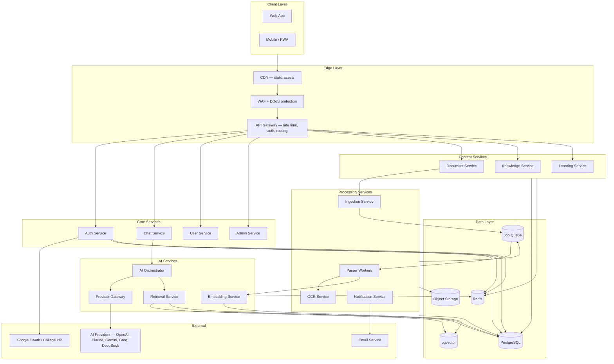
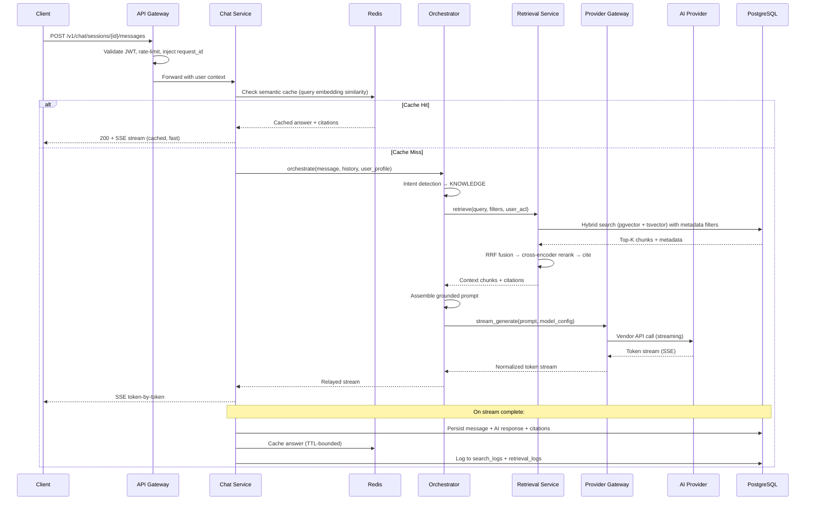
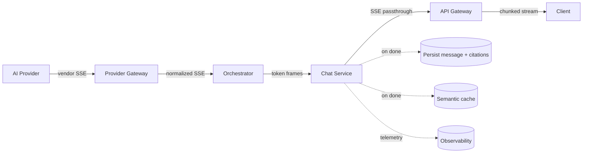
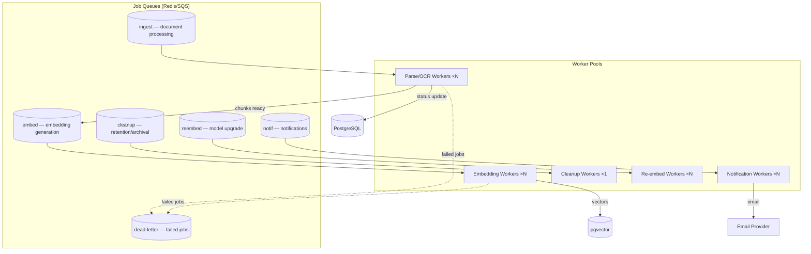
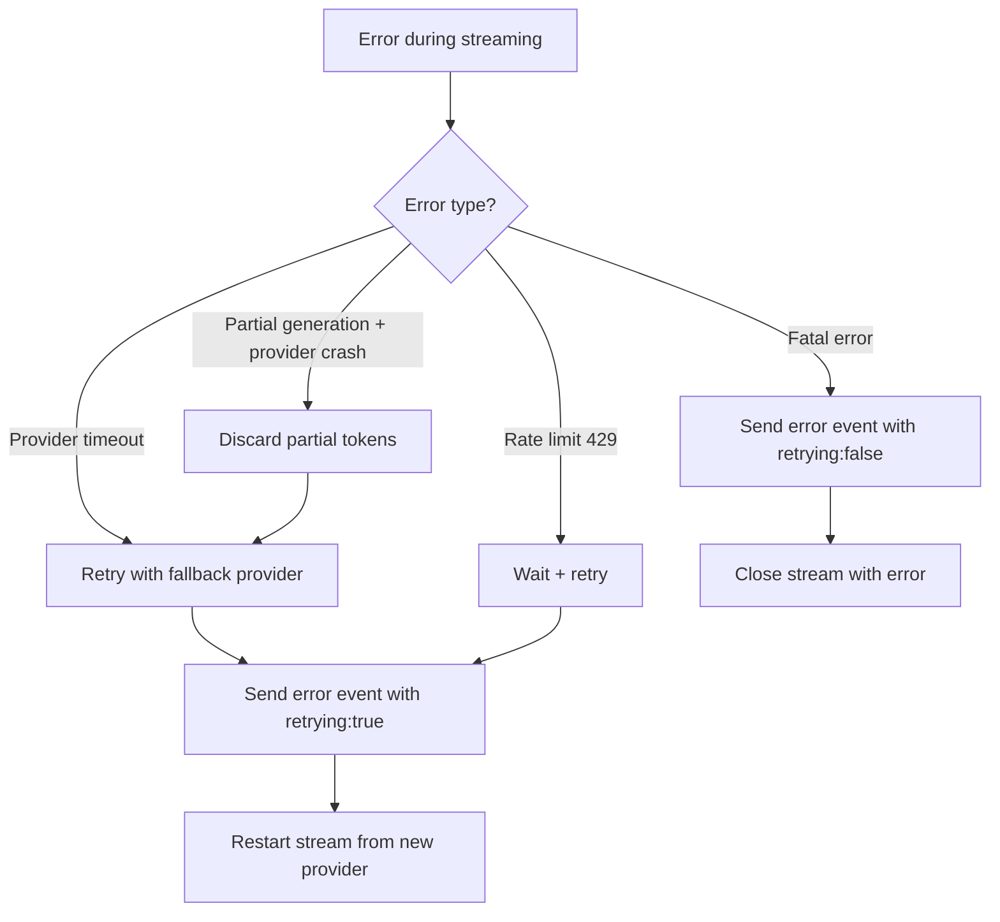
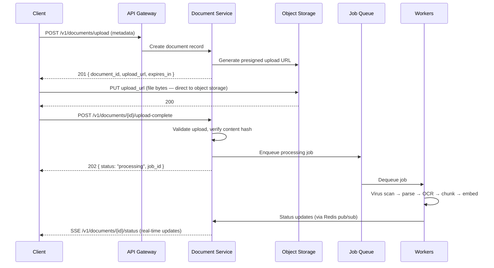
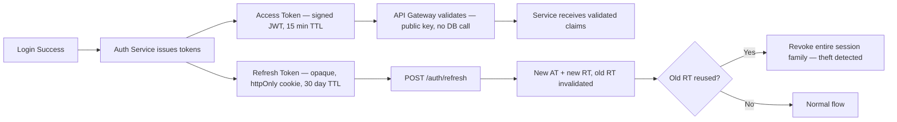
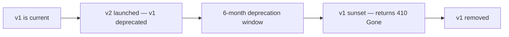
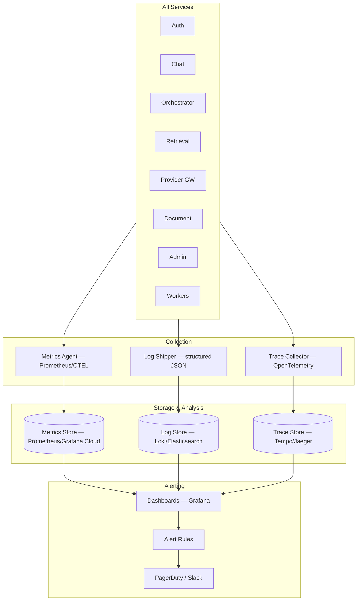

# UPC AI — Backend Architecture & API Specification

**Product:** UPC AI — Official AI-Powered Academic & Campus Assistant for Udai Pratap College (UPC), Varanasi
**Version:** 1.0
**Status:** Backend architecture blueprint — approved, pre-implementation
**Authored as:** Chief Backend Architect · Principal Software Engineer · API Architect · Distributed Systems Engineer · Enterprise Solutions Architect · Staff AI Infrastructure Engineer

> **No implementation code appears in this document.** No Express handlers, no Next.js API routes, no middleware functions, no database queries. This is a pure backend architecture and API specification — service designs, endpoint contracts, request/response schemas, security policies, and observability standards — detailed enough for a backend engineering team to implement UPC AI's entire API layer directly.

---

## Table of Contents

- [Section 1 — Backend Architecture](#section-1--backend-architecture)
- [Section 2 — REST API Design](#section-2--rest-api-design)
- [Section 3 — Streaming APIs](#section-3--streaming-apis)
- [Section 4 — File Processing APIs](#section-4--file-processing-apis)
- [Section 5 — AI APIs](#section-5--ai-apis)
- [Section 6 — Admin APIs](#section-6--admin-apis)
- [Section 7 — Security](#section-7--security)
- [Section 8 — Error Handling](#section-8--error-handling)
- [Section 9 — API Versioning](#section-9--api-versioning)
- [Section 10 — Observability](#section-10--observability)

---

## Conventions

All endpoints in this document use the following conventions:

- **Base URL:** `https://api.upcai.edu.in/v1`
- **Authentication:** JWT Bearer token in the `Authorization` header unless noted otherwise.
- **Content-Type:** `application/json` for all request/response bodies unless noted (file uploads use `multipart/form-data`).
- **Timestamps:** ISO 8601 format with timezone (e.g., `2025-07-30T10:30:00+05:30`).
- **IDs:** UUIDv7 strings.
- **Pagination:** Cursor-based by default (`cursor`, `limit`). Offset-based (`page`, `per_page`) where cursor is impractical.
- **Sorting:** `sort_by` and `sort_order` (asc/desc) query parameters.
- **Filtering:** Field-specific query parameters (e.g., `?department_id=xxx&status=published`).
- **Rate limits:** Returned in headers `X-RateLimit-Limit`, `X-RateLimit-Remaining`, `X-RateLimit-Reset`.

---

## Section 1 — Backend Architecture

### 1.1 Service Architecture Overview



### 1.2 Service Responsibilities

#### API Gateway

The single entry point for all client requests. Responsibilities:

- **TLS termination** — all traffic is HTTPS.
- **JWT validation** — validates token signature and expiry using the public key. No database call. Rejects expired/malformed tokens with 401 before hitting any service.
- **Rate limiting** — per-user and per-IP, using Redis-backed sliding-window counters. Returns 429 with `Retry-After` header when exceeded.
- **Request routing** — routes to the correct service by URL prefix (`/v1/auth/*` → Auth Service, `/v1/chat/*` → Chat Service, etc.).
- **Request ID injection** — generates a `X-Request-Id` UUID for every request, propagated through all services for distributed tracing.
- **CORS enforcement** — allows only approved origins.
- **Request size limits** — rejects oversized payloads (default 1MB JSON, 50MB file uploads).
- **Compression** — gzip/brotli response compression.

#### Auth Service

Handles all authentication and session management:

- User registration (email + password, Google OAuth, OTP)
- Login / logout
- JWT issuance (access + refresh tokens)
- Token refresh with rotation
- Session management (list, revoke)
- Password reset
- OTP generation and verification
- RBAC resolution (user → roles → permissions)

#### Chat Service

Manages conversation state and message persistence:

- Session CRUD (create, list, get, update, archive, delete)
- Message persistence (user messages + AI responses)
- Citation persistence
- Feedback collection
- Delegates AI generation to the Orchestrator
- Streams AI responses back to the client via SSE

#### AI Orchestrator

The intelligence engine. Does not persist data — it orchestrates:

- Intent detection (academic / knowledge / mixed / conversational / out-of-scope)
- Routing to the appropriate pipeline
- Tool selection (knowledge_search, calculator, code_executor)
- Model selection (cheap for chat, mid for knowledge, frontier for reasoning)
- Prompt assembly (system prompt + context + history + user message)
- Fallback logic (model → provider → capability degradation)
- Streams results back to the Chat Service

#### Provider Gateway

The AI vendor abstraction:

- Manages adapters for OpenAI, Anthropic, Gemini, Groq, DeepSeek, OpenRouter
- Streaming normalization (vendor SSE → internal SSE schema)
- Retry + circuit-breaking + health checks
- Token counting and cost estimation
- Rate-limit management per provider

#### Retrieval Service

The RAG read path:

- Query embedding generation
- Hybrid search (vector + BM25)
- Metadata pre-filtering (category, department, audience, access_level, dates)
- Reciprocal Rank Fusion
- Cross-encoder re-ranking
- Context assembly + hierarchy paths
- Citation generation

#### Embedding Service

Centralized embedding generation:

- Single-query embedding (retrieval path)
- Batch embedding (ingestion path)
- Model version management

#### Document Service

Document CRUD and lifecycle:

- Upload initiation and presigned URL generation
- Document metadata CRUD
- Version management
- Status tracking
- Download / preview URL generation

#### Knowledge Service

Structured college knowledge:

- Notices, circulars, events, fees, scholarships, placements, timetables, etc.
- Category and tag management
- Knowledge search (structured + semantic)
- Coverage analytics

#### Ingestion Service

Document processing orchestration:

- Accepts upload completion notifications
- Enqueues processing jobs
- Tracks job status
- Manages retry logic

#### Parser Workers

Queue-driven document processors:

- PDF parsing (text-native + scanned)
- DOCX, PPTX, XLSX, CSV, image, HTML/TXT parsing
- Text extraction + structure detection
- Metadata extraction + auto-tagging
- Chunking (type-aware)
- Hands chunks to Embedding Service

#### OCR Service

Two-tier OCR:

- Local OCR (Tesseract-class) for text pages
- Cloud OCR for low-confidence pages
- Reading order reconstruction
- Table detection and structured extraction

#### Learning Service

Study tools:

- Quiz generation + grading
- Flashcard CRUD + spaced-repetition scheduling
- Revision note generation + management
- Bookmark management

#### User Service

User profile and preference management:

- Profile CRUD
- Preference management
- Student/Faculty profile extensions

#### Admin Service

Admin portal backend:

- Document approval workflow
- Role and permission management
- User management (admin)
- Analytics aggregation
- Audit log browsing
- System settings
- Indexing status monitoring

#### Notification Service

Multi-channel notifications:

- In-app notification persistence and delivery
- Email dispatch (via external email service)
- Push notification dispatch
- Notification preferences enforcement

### 1.3 Request Flow — Student Asks a Question



### 1.4 Response Flow — Streaming Back



### 1.5 Background Worker Architecture



Workers are:
- **Stateless** — pull jobs from queues, process, ack/nack.
- **Idempotent** — re-processing the same job produces the same result (keyed by content hash).
- **Autoscaled** — on queue depth, not CPU.
- **Isolated** — a stuck OCR job never blocks chat. Worker pools are separate per queue.

---

## Section 2 — REST API Design

### 2.1 Authentication (`/v1/auth`)

---

#### `POST /v1/auth/register`

Register a new user account.

| Field | Value |
|-------|-------|
| **Auth** | None |
| **Rate Limit** | 5 req/min per IP |

**Request Body:**
```json
{
  "email": "student@upc.ac.in",
  "password": "SecureP@ss123",
  "display_name": "Rahul Sharma",
  "user_type": "student"
}
```

**Validation:**
- `email` — required, valid email, must end with college domain
- `password` — required, min 8 chars, 1 uppercase, 1 lowercase, 1 digit, 1 special
- `display_name` — required, 2–100 chars
- `user_type` — required, enum: `student`, `faculty`

**Success Response (201):**
```json
{
  "user_id": "uuid",
  "email": "student@upc.ac.in",
  "display_name": "Rahul Sharma",
  "user_type": "student",
  "is_verified": false,
  "message": "Verification email sent"
}
```

**Error Responses:**
- `400` — Validation error (invalid email format, weak password)
- `409` — Email already registered
- `429` — Rate limit exceeded

---

#### `POST /v1/auth/login`

Email + password login.

| Field | Value |
|-------|-------|
| **Auth** | None |
| **Rate Limit** | 10 req/min per IP, 5 failed attempts lock for 15 min |

**Request Body:**
```json
{
  "email": "student@upc.ac.in",
  "password": "SecureP@ss123"
}
```

**Success Response (200):**
```json
{
  "access_token": "eyJhbG...",
  "token_type": "Bearer",
  "expires_in": 900,
  "user": {
    "user_id": "uuid",
    "email": "student@upc.ac.in",
    "display_name": "Rahul Sharma",
    "user_type": "student",
    "department": { "id": "uuid", "name": "Computer Science" },
    "roles": ["student"]
  }
}
```

The refresh token is set as an `httpOnly`, `Secure`, `SameSite=Strict` cookie — never in the response body.

**Error Responses:**
- `400` — Missing email or password
- `401` — Invalid credentials
- `403` — Account locked (too many failed attempts) or account disabled
- `429` — Rate limit exceeded

---

#### `POST /v1/auth/login/google`

Google OAuth login.

| Field | Value |
|-------|-------|
| **Auth** | None |
| **Rate Limit** | 10 req/min per IP |

**Request Body:**
```json
{
  "id_token": "google-id-token-string"
}
```

**Validation:**
- `id_token` — required; verified against Google's public keys; `hd` (hosted domain) must match the college Google Workspace domain.

**Success Response (200):** Same shape as `/auth/login`.

**Error Responses:**
- `400` — Invalid or expired token
- `403` — Email domain not authorized (not a college account)

---

#### `POST /v1/auth/otp/request`

Request OTP for passwordless login or verification.

| Field | Value |
|-------|-------|
| **Auth** | None |
| **Rate Limit** | 3 req/min per email, 5 req/hour per IP |

**Request Body:**
```json
{
  "email": "student@upc.ac.in",
  "purpose": "login"
}
```

**Validation:**
- `email` — required, valid email
- `purpose` — required, enum: `login`, `email_verify`, `password_reset`

**Success Response (200):**
```json
{
  "message": "OTP sent to student@upc.ac.in",
  "expires_in": 600
}
```

**Error Responses:**
- `400` — Invalid email
- `404` — No account found with this email (for login/password_reset purpose)
- `429` — Too many OTP requests

---

#### `POST /v1/auth/otp/verify`

Verify OTP and authenticate.

| Field | Value |
|-------|-------|
| **Auth** | None |
| **Rate Limit** | 5 req/min per email |

**Request Body:**
```json
{
  "email": "student@upc.ac.in",
  "otp": "847291",
  "purpose": "login"
}
```

**Success Response (200):** Same shape as `/auth/login` (for login purpose). For `email_verify` purpose:
```json
{
  "message": "Email verified successfully",
  "is_verified": true
}
```

**Error Responses:**
- `400` — Invalid OTP format
- `401` — OTP incorrect or expired
- `403` — Too many failed attempts (OTP locked)
- `429` — Rate limit

---

#### `POST /v1/auth/refresh`

Refresh the access token using the refresh token cookie.

| Field | Value |
|-------|-------|
| **Auth** | Refresh token cookie (httpOnly) |
| **Rate Limit** | 30 req/hour per user |

**Request Body:** None (refresh token is in the cookie).

**Success Response (200):**
```json
{
  "access_token": "eyJhbG...",
  "token_type": "Bearer",
  "expires_in": 900
}
```

A new refresh token cookie is set (rotation). The old refresh token is invalidated.

**Error Responses:**
- `401` — No refresh token, expired, or revoked
- `403` — Refresh token reuse detected (session family revoked — potential theft)

---

#### `POST /v1/auth/logout`

Logout the current session.

| Field | Value |
|-------|-------|
| **Auth** | Bearer token |
| **Rate Limit** | None |

**Success Response (200):**
```json
{ "message": "Logged out successfully" }
```

Clears the refresh token cookie. Revokes the server-side session.

---

#### `POST /v1/auth/logout/all`

Logout from all devices.

| Field | Value |
|-------|-------|
| **Auth** | Bearer token |

**Success Response (200):**
```json
{ "message": "All sessions revoked", "sessions_revoked": 3 }
```

---

#### `POST /v1/auth/password/change`

Change password for authenticated user.

| Field | Value |
|-------|-------|
| **Auth** | Bearer token |
| **Rate Limit** | 3 req/hour |

**Request Body:**
```json
{
  "current_password": "OldP@ss123",
  "new_password": "NewP@ss456"
}
```

**Validation:**
- `current_password` — required, must match
- `new_password` — required, password strength rules, must differ from current

**Error Responses:**
- `400` — Weak new password or same as current
- `401` — Current password incorrect

---

#### `POST /v1/auth/password/reset/request`

Initiate password reset (sends OTP).

| Field | Value |
|-------|-------|
| **Auth** | None |
| **Rate Limit** | 3 req/hour per email |

**Request Body:**
```json
{ "email": "student@upc.ac.in" }
```

**Success Response (200):**
```json
{ "message": "Password reset OTP sent" }
```

Always returns 200 even if email not found (prevents user enumeration).

---

#### `POST /v1/auth/password/reset/confirm`

Complete password reset with OTP.

| Field | Value |
|-------|-------|
| **Auth** | None |

**Request Body:**
```json
{
  "email": "student@upc.ac.in",
  "otp": "847291",
  "new_password": "NewP@ss789"
}
```

---

#### `GET /v1/auth/sessions`

List active sessions for the current user.

| Field | Value |
|-------|-------|
| **Auth** | Bearer token |

**Success Response (200):**
```json
{
  "sessions": [
    {
      "session_id": "uuid",
      "device_info": { "browser": "Chrome", "os": "Windows", "device_type": "desktop" },
      "ip_address": "203.0.113.50",
      "is_current": true,
      "last_active_at": "2025-07-30T10:30:00+05:30",
      "created_at": "2025-07-28T08:00:00+05:30"
    }
  ]
}
```

---

#### `DELETE /v1/auth/sessions/{session_id}`

Revoke a specific session (sign out a device).

| Field | Value |
|-------|-------|
| **Auth** | Bearer token |

**Error Responses:**
- `404` — Session not found or not owned by user

---

### 2.2 Users (`/v1/users`)

---

#### `GET /v1/users/me`

Get current user's profile.

| Field | Value |
|-------|-------|
| **Auth** | Bearer token |

**Success Response (200):**
```json
{
  "user_id": "uuid",
  "email": "student@upc.ac.in",
  "display_name": "Rahul Sharma",
  "avatar_url": "https://...",
  "user_type": "student",
  "department": { "id": "uuid", "name": "Computer Science", "code": "CS" },
  "is_verified": true,
  "roles": ["student"],
  "student_profile": {
    "enrollment_number": "UPC2023CS001",
    "roll_number": "CS2301",
    "course": { "id": "uuid", "name": "BSc Computer Science", "code": "BSC-CS" },
    "current_year": 2,
    "current_semester": 3,
    "section": "A",
    "admission_year": 2023
  },
  "created_at": "2023-08-01T00:00:00+05:30"
}
```

---

#### `PATCH /v1/users/me`

Update current user's profile.

| Field | Value |
|-------|-------|
| **Auth** | Bearer token |

**Request Body (partial update):**
```json
{
  "display_name": "Rahul K. Sharma",
  "avatar_url": "https://...",
  "phone": "+919876543210"
}
```

**Validation:**
- `display_name` — 2–100 chars
- `phone` — valid Indian mobile number format
- Cannot change `email`, `user_type`, or `department_id` (admin-only)

---

#### `GET /v1/users/{user_id}` — Admin/Faculty

Get any user's profile. Requires `user:read` permission.

#### `GET /v1/users` — Admin

List users with filters. Requires `user:manage` permission.

**Query Params:** `?user_type=student&department_id=uuid&is_active=true&search=rahul&page=1&per_page=20`

**Success Response (200):**
```json
{
  "users": [ /* user objects */ ],
  "pagination": {
    "page": 1,
    "per_page": 20,
    "total": 542,
    "total_pages": 28
  }
}
```

---

### 2.3 Students (`/v1/students`)

---

#### `GET /v1/students/me`

Get current student's extended profile.

| Field | Value |
|-------|-------|
| **Auth** | Bearer token (student only) |

---

#### `PATCH /v1/students/me`

Update student profile fields (section, guardian info).

| Field | Value |
|-------|-------|
| **Auth** | Bearer token (student only) |

**Updatable fields:** `section`, `guardian_name`, `guardian_contact`, `is_hostel_resident`.
**Non-updatable (admin-only):** `enrollment_number`, `roll_number`, `course_id`, `current_year`, `current_semester`.

---

#### `GET /v1/students` — Admin/Faculty

List students with filters.

**Query Params:** `?course_id=uuid&year=2&section=A&department_id=uuid`

---

### 2.4 Faculty (`/v1/faculty`)

---

#### `GET /v1/faculty`

List faculty members. Public endpoint (filtered to basic info).

**Query Params:** `?department_id=uuid&designation=professor&search=sharma`

---

#### `GET /v1/faculty/{faculty_id}`

Get faculty profile. Public info + extended info if authenticated.

---

### 2.5 Departments (`/v1/departments`)

---

#### `GET /v1/departments`

List all departments.

| Field | Value |
|-------|-------|
| **Auth** | Optional (public listing) |

**Success Response (200):**
```json
{
  "departments": [
    {
      "department_id": "uuid",
      "name": "Computer Science",
      "code": "CS",
      "description": "...",
      "head_of_department": { "name": "Prof. Kumar", "designation": "Professor" },
      "courses_count": 3,
      "is_active": true
    }
  ]
}
```

---

#### `GET /v1/departments/{department_id}`

Department details with courses.

#### `POST /v1/departments` — Admin (`department:create`)
#### `PATCH /v1/departments/{department_id}` — Admin (`department:update`)
#### `DELETE /v1/departments/{department_id}` — Admin (`department:delete`)

---

### 2.6 Courses (`/v1/courses`)

#### `GET /v1/courses` — `?department_id=uuid&degree_type=bachelor`
#### `GET /v1/courses/{course_id}`
#### `POST /v1/courses` — Admin
#### `PATCH /v1/courses/{course_id}` — Admin

---

### 2.7 Subjects (`/v1/subjects`)

#### `GET /v1/subjects` — `?course_id=uuid&semester=3&department_id=uuid&subject_type=theory`
#### `GET /v1/subjects/{subject_id}`
#### `POST /v1/subjects` — Admin
#### `PATCH /v1/subjects/{subject_id}` — Admin

---

### 2.8 Chat Sessions (`/v1/chat/sessions`)

---

#### `POST /v1/chat/sessions`

Create a new chat session.

| Field | Value |
|-------|-------|
| **Auth** | Bearer token |
| **Rate Limit** | 30 sessions/hour |

**Request Body:**
```json
{
  "title": "Physics doubts",
  "session_type": "academic",
  "subject_id": "uuid",
  "study_mode": "learn",
  "language_preference": "en"
}
```

All fields optional. Defaults: `session_type: "general"`, `language_preference` from user preferences.

**Success Response (201):**
```json
{
  "session_id": "uuid",
  "title": "Physics doubts",
  "session_type": "academic",
  "subject": { "id": "uuid", "name": "Physics", "code": "PHY101" },
  "study_mode": "learn",
  "language_preference": "en",
  "created_at": "..."
}
```

---

#### `GET /v1/chat/sessions`

List user's chat sessions.

| Field | Value |
|-------|-------|
| **Auth** | Bearer token |

**Query Params:** `?is_archived=false&session_type=academic&search=physics&sort_by=last_message_at&sort_order=desc&cursor=uuid&limit=20`

**Success Response (200):**
```json
{
  "sessions": [
    {
      "session_id": "uuid",
      "title": "Physics doubts",
      "session_type": "academic",
      "subject": { "id": "uuid", "name": "Physics" },
      "study_mode": "learn",
      "last_message_at": "...",
      "message_count": 12,
      "is_pinned": false,
      "is_archived": false,
      "preview": "What is Newton's third law?"
    }
  ],
  "next_cursor": "uuid",
  "has_more": true
}
```

---

#### `GET /v1/chat/sessions/{session_id}`

Get session details with recent messages.

**Query Params:** `?include_messages=true&message_limit=50`

---

#### `PATCH /v1/chat/sessions/{session_id}`

Update session (title, pin, archive, mode).

**Request Body:**
```json
{
  "title": "Newton's Laws Discussion",
  "is_pinned": true,
  "is_archived": false,
  "study_mode": "practice"
}
```

---

#### `DELETE /v1/chat/sessions/{session_id}`

Soft-delete a session and its messages.

---

### 2.9 Messages (`/v1/chat/sessions/{session_id}/messages`)

---

#### `GET /v1/chat/sessions/{session_id}/messages`

Get messages in a session.

| Field | Value |
|-------|-------|
| **Auth** | Bearer token (session owner only) |

**Query Params:** `?cursor=uuid&limit=50&order=desc`

**Success Response (200):**
```json
{
  "messages": [
    {
      "message_id": "uuid",
      "role": "user",
      "content": "Explain Newton's third law with examples",
      "content_format": "text",
      "intent": null,
      "sequence_number": 1,
      "attachments": [],
      "created_at": "..."
    },
    {
      "message_id": "uuid",
      "role": "assistant",
      "content": "Newton's third law states that...",
      "content_format": "markdown",
      "intent": "academic",
      "intent_confidence": 0.97,
      "sequence_number": 2,
      "citations": [
        {
          "citation_id": "uuid",
          "document_title": "Physics Lab Manual",
          "page_number": 42,
          "snippet": "For every action...",
          "relevance_score": 0.94
        }
      ],
      "ai_metadata": {
        "model_used": "claude-3.5-sonnet",
        "tokens_input": 1250,
        "tokens_output": 380,
        "cost_estimate": 0.0042,
        "first_token_latency_ms": 450,
        "cache_hit": false,
        "retrieval_used": true
      },
      "created_at": "..."
    }
  ],
  "next_cursor": "uuid",
  "has_more": true
}
```

---

#### `POST /v1/chat/sessions/{session_id}/messages`

Send a message and get an AI response (streaming).

| Field | Value |
|-------|-------|
| **Auth** | Bearer token |
| **Rate Limit** | 30 messages/min per user |
| **Response** | `text/event-stream` (SSE) |

**Request Body:**
```json
{
  "content": "What is the BSc CS fee structure for 2nd year?",
  "attachments": []
}
```

**Validation:**
- `content` — required, 1–10,000 chars
- `attachments` — optional, max 5, each < 10MB

**Response:** Server-Sent Events stream (see Section 3).

**Error Responses:**
- `400` — Empty message or validation error
- `403` — Not session owner
- `404` — Session not found
- `429` — Rate limit (too many messages)
- `503` — AI service temporarily unavailable

---

#### `POST /v1/chat/sessions/{session_id}/messages/{message_id}/regenerate`

Regenerate an AI response.

| Field | Value |
|-------|-------|
| **Auth** | Bearer token |
| **Response** | `text/event-stream` (SSE) |

---

#### `DELETE /v1/chat/sessions/{session_id}/messages/{message_id}`

Soft-delete a message.

---

### 2.10 College Knowledge Endpoints

These are read-only endpoints (write operations go through the Admin APIs in Section 6).

---

#### Notices — `GET /v1/notices`

**Query Params:** `?notice_type=examination&department_id=uuid&priority=urgent&is_published=true&effective_after=2025-01-01&search=exam&cursor=uuid&limit=20`

**Success Response (200):**
```json
{
  "notices": [
    {
      "notice_id": "uuid",
      "title": "Revised Examination Schedule",
      "reference_number": "UPC/2025/EXAM/047",
      "notice_type": "examination",
      "priority": "urgent",
      "department": { "id": "uuid", "name": "Examinations" },
      "effective_date": "2025-07-15",
      "expiry_date": "2025-08-15",
      "content": "The examination schedule for BSc 3rd year...",
      "source_document": { "id": "uuid", "download_url": "..." },
      "published_by": { "name": "Dr. Verma" },
      "view_count": 1250,
      "created_at": "..."
    }
  ],
  "next_cursor": "uuid",
  "has_more": true
}
```

#### `GET /v1/notices/{notice_id}`

---

#### Events — `GET /v1/events`
**Query Params:** `?event_type=seminar&department_id=uuid&upcoming=true`

#### `GET /v1/events/{event_id}`

---

#### Fee Structure — `GET /v1/fee-structure`
**Query Params:** `?course_id=uuid&session_id=uuid&year=2`

---

#### Timetables — `GET /v1/timetables`
**Query Params:** `?course_id=uuid&year=2&semester=3&section=A&session_id=uuid`

---

#### Academic Calendar — `GET /v1/academic-calendar`
**Query Params:** `?session_id=uuid&event_type=exam_start`

---

#### Scholarships — `GET /v1/scholarships`
**Query Params:** `?scholarship_type=merit&session_id=uuid&is_active=true`

---

#### Placements — `GET /v1/placements`
**Query Params:** `?status=upcoming&session_id=uuid&course_id=uuid`

---

#### Hostel Info — `GET /v1/hostel`
**Query Params:** `?info_type=rules&hostel_type=boys&session_id=uuid`

---

#### Library — `GET /v1/library`
**Query Params:** `?resource_type=book&department_id=uuid&subject_id=uuid&search=data+structures`

---

#### Policies — `GET /v1/policies`
**Query Params:** `?policy_type=academic&is_active=true`

---

#### Attendance Rules — `GET /v1/attendance-rules`
**Query Params:** `?department_id=uuid&session_id=uuid`

---

#### Previous Year Papers — `GET /v1/previous-papers`
**Query Params:** `?subject_id=uuid&session_id=uuid&exam_type=end_semester`

---

#### Lab Manuals — `GET /v1/lab-manuals`
**Query Params:** `?subject_id=uuid&department_id=uuid`

---

#### Lecture Notes — `GET /v1/lecture-notes`
**Query Params:** `?subject_id=uuid&faculty_id=uuid&session_id=uuid`

---

### 2.11 Learning Tools

---

#### Quizzes — `/v1/quizzes`

**`POST /v1/quizzes`** — Generate or create a quiz.

```json
{
  "quiz_type": "ai_generated",
  "subject_id": "uuid",
  "topic": "Binary Search Trees",
  "difficulty": "medium",
  "question_count": 10,
  "time_limit_minutes": 15
}
```

**`GET /v1/quizzes`** — `?subject_id=uuid&status=completed&sort_by=created_at`

**`GET /v1/quizzes/{quiz_id}`** — Quiz with questions (answers hidden until submitted).

**`POST /v1/quizzes/{quiz_id}/submit`** — Submit quiz answers.

```json
{
  "answers": [
    { "question_id": "uuid", "selected_answer": "B" },
    { "question_id": "uuid", "selected_answer": "True" }
  ],
  "time_taken_seconds": 420
}
```

**Success Response (200):**
```json
{
  "result_id": "uuid",
  "score": 7,
  "total_marks": 10,
  "percentage": 70.0,
  "results": [
    {
      "question_id": "uuid",
      "selected_answer": "B",
      "correct_answer": "B",
      "is_correct": true,
      "explanation": "..."
    }
  ]
}
```

**`GET /v1/quizzes/{quiz_id}/results`** — Get quiz results (all attempts).

---

#### Flashcards — `/v1/flashcards`

**`POST /v1/flashcards`** — Create or AI-generate flashcards.

```json
{
  "source": "ai_generated",
  "subject_id": "uuid",
  "topic": "Operating Systems — Process Scheduling",
  "count": 10
}
```

**`GET /v1/flashcards`** — `?subject_id=uuid&deck_name=OS&is_archived=false`

**`GET /v1/flashcards/due`** — Get flashcards due for review (spaced repetition).

```json
{
  "flashcards": [ /* flashcards where next_review_at <= now */ ],
  "total_due": 15
}
```

**`POST /v1/flashcards/{flashcard_id}/review`** — Record a review result.

```json
{
  "quality": 4
}
```
`quality` is 0–5 (SM-2 scale: 0 = complete blackout, 5 = perfect response). Updates `ease_factor`, `interval_days`, `next_review_at`.

**`PATCH /v1/flashcards/{flashcard_id}`** — Edit a flashcard.

**`DELETE /v1/flashcards/{flashcard_id}`**

---

#### Revision Notes — `/v1/revision-notes`

**`POST /v1/revision-notes`** — Create or AI-generate revision notes.

```json
{
  "source": "ai_generated",
  "subject_id": "uuid",
  "topic": "Thermodynamics — Laws and Applications",
  "chat_session_id": "uuid"
}
```

**`GET /v1/revision-notes`** — `?subject_id=uuid&is_pinned=true`

**`GET /v1/revision-notes/{note_id}`**

**`PATCH /v1/revision-notes/{note_id}`** — Edit content, pin/unpin.

**`DELETE /v1/revision-notes/{note_id}`**

---

#### Bookmarks — `/v1/bookmarks`

**`POST /v1/bookmarks`**

```json
{
  "bookmarkable_type": "message",
  "bookmarkable_id": "uuid",
  "label": "Great explanation of recursion",
  "folder": "CS302"
}
```

**`GET /v1/bookmarks`** — `?bookmarkable_type=message&folder=CS302`

**`DELETE /v1/bookmarks/{bookmark_id}`**

**`GET /v1/bookmarks/check`** — `?bookmarkable_type=message&bookmarkable_id=uuid` — Returns `{ "is_bookmarked": true, "bookmark_id": "uuid" }`.

---

### 2.12 Notifications (`/v1/notifications`)

---

**`GET /v1/notifications`** — `?notification_type=notice&is_read=false&cursor=uuid&limit=20`

**`GET /v1/notifications/unread-count`**

```json
{ "unread_count": 7 }
```

**`PATCH /v1/notifications/{notification_id}/read`**

**`PATCH /v1/notifications/read-all`**

**`DELETE /v1/notifications/{notification_id}`**

---

### 2.13 Feedback (`/v1/feedback`)

---

**`POST /v1/feedback`**

```json
{
  "message_id": "uuid",
  "response_id": "uuid",
  "feedback_type": "thumbs_down",
  "category": "outdated",
  "comment": "This fee structure is from last year"
}
```

**Validation:**
- `feedback_type` — required, enum: `thumbs_up`, `thumbs_down`, `report`, `suggestion`
- `category` — required for `thumbs_down` and `report`
- At least one of `message_id` or `response_id` required

---

### 2.14 Search (`/v1/search`)

---

#### `GET /v1/search`

Unified search across all knowledge entities.

| Field | Value |
|-------|-------|
| **Auth** | Bearer token |
| **Rate Limit** | 60 req/min |

**Query Params:** `?q=examination+schedule&type=notice,event,document&department_id=uuid&limit=20`

**Success Response (200):**
```json
{
  "results": [
    {
      "type": "notice",
      "id": "uuid",
      "title": "Revised Examination Schedule",
      "snippet": "The examination schedule for BSc 3rd year has been revised...",
      "relevance_score": 0.92,
      "metadata": {
        "notice_type": "examination",
        "effective_date": "2025-07-15",
        "department": "Examinations"
      }
    },
    {
      "type": "document",
      "id": "uuid",
      "title": "Exam Guidelines 2025",
      "snippet": "...",
      "relevance_score": 0.85
    }
  ],
  "total": 15,
  "query_time_ms": 120
}
```

---

#### `GET /v1/search/suggestions`

Autocomplete/typeahead.

**Query Params:** `?q=examin&limit=5`

```json
{
  "suggestions": [
    "examination schedule",
    "examination fee",
    "examination rules"
  ]
}
```

---

### 2.15 Settings (`/v1/settings`)

---

**`GET /v1/settings/preferences`** — Get user preferences.

**`PATCH /v1/settings/preferences`** — Update preferences.

```json
{
  "theme": "dark",
  "language": "hi",
  "ai_response_length": "detailed",
  "ai_difficulty_level": "advanced",
  "notification_email": true,
  "notification_push": false,
  "show_citations": true,
  "default_study_mode": "practice"
}
```

---

## Section 3 — Streaming APIs

### 3.1 Protocol: Server-Sent Events (SSE)

AI responses stream via **Server-Sent Events** over HTTP/2. SSE is chosen over WebSockets because:

- AI generation is unidirectional (server → client); WebSocket's bidirectional channel is unnecessary.
- SSE works through HTTP proxies, CDNs, and load balancers without special configuration.
- Automatic reconnection is built into the browser `EventSource` API.
- Simpler implementation and debugging than WebSocket.

**Connection:** The client sends `POST /v1/chat/sessions/{id}/messages` with `Accept: text/event-stream`. The server responds with `Content-Type: text/event-stream` and streams events.

### 3.2 SSE Event Schema

```
event: status
data: {"type":"status","status":"thinking","message":"Analyzing your question..."}

event: intent
data: {"type":"intent","intent":"knowledge","confidence":0.93}

event: retrieval
data: {"type":"retrieval","status":"searching","chunks_found":8}

event: token
data: {"type":"token","text":"Newton's","sequence":1}

event: token
data: {"type":"token","text":" third","sequence":2}

event: token
data: {"type":"token","text":" law","sequence":3}

event: citation
data: {"type":"citation","citations":[{"document_title":"Physics Textbook","page":42,"snippet":"..."}]}

event: done
data: {"type":"done","message_id":"uuid","finish_reason":"stop","usage":{"tokens_input":1250,"tokens_output":380,"cost_estimate":0.004},"latency":{"first_token_ms":450,"total_ms":3200}}

event: error
data: {"type":"error","code":"PROVIDER_TIMEOUT","message":"AI provider timed out, retrying...","retrying":true}
```

### 3.3 Event Types

| Event | Purpose | When |
|-------|---------|------|
| `status` | Progress indicator | Thinking, searching, generating |
| `intent` | Intent classification result | After intent detection |
| `retrieval` | Retrieval progress | After knowledge search completes |
| `token` | Individual generated token | During streaming generation |
| `citation` | Source citations | After generation, before `done` |
| `tool_call` | Tool invocation notification | When the AI calls a tool (calculator, code executor) |
| `tool_result` | Tool execution result | After tool returns |
| `done` | Stream complete | End of generation |
| `error` | Error occurred | On any error |

### 3.4 Cancellation

The client closes the SSE connection (calls `EventSource.close()` or aborts the fetch). The server detects the closed connection, cancels the upstream provider request (if possible), and discards the partial response. No message is persisted for cancelled generations.

**Server-side detection:** The server monitors the connection via a heartbeat. If the client disconnects, the write to the response stream fails, triggering cleanup.

### 3.5 Reconnection

If the connection drops (network issue, not cancellation):

1. The browser's `EventSource` auto-reconnects using the `Last-Event-ID` header.
2. The server checks if the generation for this message is still in progress (Redis key `stream:{message_id}`).
3. If in progress: resume streaming from the current position.
4. If complete: return the full message from the database with a single `done` event.
5. If failed: return the error.

**Each token event includes a `sequence` number** so the client can detect missed tokens and request the full message from the REST endpoint as a fallback.

### 3.6 Heartbeat

The server sends a comment line (`:heartbeat`) every 15 seconds to keep the connection alive through proxies and load balancers that might close idle connections.

```
:heartbeat

event: token
data: {"type":"token","text":"The","sequence":45}
```

### 3.7 Error Recovery During Streaming



If failover occurs mid-stream:
1. Send `error` event with `retrying: true`.
2. Discard all tokens from the failed provider.
3. Restart generation with the same prompt on the fallback provider.
4. Resume `token` events with `sequence` numbers continuing from 0 (the client replaces the partial text, not appends).

---

## Section 4 — File Processing APIs

### 4.1 Upload Flow



### 4.2 Upload Endpoints

---

#### `POST /v1/documents/upload`

Initiate a document upload. Returns a presigned URL for direct upload to object storage (file bytes never transit the app server).

| Field | Value |
|-------|-------|
| **Auth** | Bearer token (with `document:create` permission) |
| **Rate Limit** | 20 uploads/hour |

**Request Body:**
```json
{
  "title": "BSc CS Fee Structure 2025-26",
  "file_name": "fee_structure_bsc_cs_2025.pdf",
  "file_size_bytes": 2048576,
  "mime_type": "application/pdf",
  "category_id": "uuid",
  "department_id": "uuid",
  "access_level": "public",
  "audience": { "scope": "students", "course_ids": ["uuid"] },
  "effective_date": "2025-07-01",
  "expiry_date": null,
  "description": "Fee structure for BSc CS 2nd year, 2025-26 session"
}
```

**Validation:**
- `file_name` — required
- `file_size_bytes` — required, max 50MB
- `mime_type` — required, must be in allowed list: `application/pdf`, `application/vnd.openxmlformats-officedocument.*`, `image/png`, `image/jpeg`, `text/plain`, `text/html`, `text/markdown`, `text/csv`
- `category_id` — required
- `title` — required, 1–500 chars

**Success Response (201):**
```json
{
  "document_id": "uuid",
  "upload_url": "https://storage.example.com/...?signature=...",
  "upload_url_expires_in": 3600,
  "upload_method": "PUT",
  "upload_headers": {
    "Content-Type": "application/pdf",
    "x-amz-content-sha256": "UNSIGNED-PAYLOAD"
  }
}
```

**Error Responses:**
- `400` — Invalid file type, size exceeds limit, missing fields
- `403` — No upload permission for this department
- `413` — File too large

---

#### `POST /v1/documents/{document_id}/upload-complete`

Notify the server that the file upload to object storage is complete.

**Request Body:**
```json
{
  "content_hash": "sha256:a1b2c3d4..."
}
```

**Success Response (202):**
```json
{
  "document_id": "uuid",
  "status": "processing",
  "job_id": "uuid",
  "estimated_processing_time_seconds": 60
}
```

---

#### `GET /v1/documents/{document_id}/status`

Get processing status (SSE for real-time updates or polling).

**Accept: text/event-stream:**
```
event: status
data: {"stage":"virus_scan","progress":100,"message":"Clean — no threats detected"}

event: status
data: {"stage":"parsing","progress":45,"message":"Extracting text from pages 5-10..."}

event: status
data: {"stage":"ocr","progress":30,"message":"Running OCR on 3 scanned pages..."}

event: status
data: {"stage":"chunking","progress":80,"message":"Created 24 chunks"}

event: status
data: {"stage":"embedding","progress":60,"message":"Generating embeddings..."}

event: done
data: {"stage":"indexed","chunk_count":24,"processing_time_seconds":45}
```

**Accept: application/json (polling):**
```json
{
  "document_id": "uuid",
  "status": "parsing",
  "stages": {
    "virus_scan": { "status": "completed", "result": "clean" },
    "parsing": { "status": "in_progress", "progress": 45 },
    "ocr": { "status": "pending" },
    "chunking": { "status": "pending" },
    "embedding": { "status": "pending" }
  }
}
```

---

#### `GET /v1/documents`

List documents with filters.

**Query Params:** `?category_id=uuid&department_id=uuid&status=published&access_level=public&file_type=pdf&search=fee&sort_by=created_at&cursor=uuid&limit=20`

---

#### `GET /v1/documents/{document_id}`

Document details with metadata, tags, version info.

---

#### `PATCH /v1/documents/{document_id}`

Update document metadata (title, category, tags, access_level, audience, dates).

**Auth:** `document:update` permission, scoped to department.

---

#### `DELETE /v1/documents/{document_id}`

Soft-delete a document. Removes from retrieval. Requires `document:delete` permission.

---

#### `GET /v1/documents/{document_id}/versions`

List all versions of a document (by canonical_id).

```json
{
  "canonical_id": "uuid",
  "versions": [
    { "document_id": "uuid", "version": 2, "is_active": true, "change_summary": "Updated fee amounts", "changed_by": "Dr. Verma", "created_at": "..." },
    { "document_id": "uuid", "version": 1, "is_active": false, "changed_by": "Admin", "created_at": "..." }
  ]
}
```

---

#### `GET /v1/documents/{document_id}/download`

Generate a presigned download URL.

```json
{
  "download_url": "https://storage.example.com/...?signature=...",
  "expires_in": 3600,
  "file_name": "fee_structure_2025.pdf",
  "file_size_bytes": 2048576
}
```

---

#### `GET /v1/documents/{document_id}/preview`

Generate a preview (first page thumbnail or text excerpt).

```json
{
  "preview_type": "thumbnail",
  "preview_url": "https://...",
  "text_excerpt": "Fee Structure for BSc Computer Science...",
  "page_count": 3,
  "word_count": 1250
}
```

---

#### `POST /v1/documents/{document_id}/reprocess`

Re-trigger processing (after fixing a corrupted file, or after an OCR improvement).

**Auth:** `document:update` permission.

**Success Response (202):**
```json
{ "job_id": "uuid", "status": "queued" }
```

---

### 4.3 OCR API (Internal)

The OCR service is internal (called by parser workers, not directly by clients). Its contract:

**`POST /internal/ocr/process`**

```json
{
  "document_id": "uuid",
  "pages": [
    { "page_number": 1, "image_path": "s3://derived/uuid/pages/1.png" },
    { "page_number": 2, "image_path": "s3://derived/uuid/pages/2.png" }
  ],
  "options": {
    "languages": ["eng", "hin"],
    "detect_tables": true,
    "detect_reading_order": true
  }
}
```

**Response:**
```json
{
  "results": [
    {
      "page_number": 1,
      "text": "...",
      "confidence": 0.92,
      "ocr_method": "local",
      "tables": [
        { "rows": [["Header1", "Header2"], ["Val1", "Val2"]], "bounding_box": {...} }
      ],
      "reading_order": [...]
    },
    {
      "page_number": 2,
      "text": "...",
      "confidence": 0.65,
      "ocr_method": "cloud",
      "tables": []
    }
  ]
}
```

---

## Section 5 — AI APIs

### 5.1 Core AI Chat (already covered in Section 2.9)

The primary AI interaction is `POST /v1/chat/sessions/{id}/messages` which returns an SSE stream. The following endpoints provide specialized AI functionality.

### 5.2 Knowledge Search API

#### `POST /v1/ai/knowledge/search`

Direct knowledge retrieval without generation (for the admin portal or debugging).

| Field | Value |
|-------|-------|
| **Auth** | Bearer token |

**Request Body:**
```json
{
  "query": "BSc CS 2nd year fee structure",
  "filters": {
    "category": "fee_structure",
    "department": "CS",
    "audience": "students"
  },
  "top_k": 5,
  "include_embeddings": false
}
```

**Success Response (200):**
```json
{
  "results": [
    {
      "chunk_id": "uuid",
      "content": "Fee structure for BSc CS 2nd Year: Tuition Fee: ₹15,000...",
      "document": {
        "document_id": "uuid",
        "title": "Fee Structure 2025-26",
        "version": 2,
        "page_number": 1
      },
      "relevance_score": 0.94,
      "hierarchy_path": "Fee Structure > BSc CS > 2nd Year",
      "chunk_type": "table",
      "table_data": { "headers": [...], "rows": [...] },
      "metadata": {
        "category": "fee_structure",
        "department": "CS",
        "effective_date": "2025-07-01"
      }
    }
  ],
  "search_metadata": {
    "vector_candidates": 50,
    "bm25_candidates": 45,
    "fused_candidates": 30,
    "reranked_results": 5,
    "retrieval_time_ms": 120,
    "cache_hit": false
  }
}
```

### 5.3 Quiz Generation API

#### `POST /v1/ai/quiz/generate`

Generate a quiz using AI.

**Request Body:**
```json
{
  "subject_id": "uuid",
  "topic": "Binary Search Trees",
  "difficulty": "medium",
  "question_count": 10,
  "question_types": ["mcq", "true_false"],
  "source": "subject"
}
```

**Success Response (201):** Returns a complete Quiz object with QuizQuestions.

### 5.4 Flashcard Generation API

#### `POST /v1/ai/flashcards/generate`

```json
{
  "subject_id": "uuid",
  "topic": "Process Scheduling Algorithms",
  "count": 10,
  "difficulty": "medium"
}
```

### 5.5 Revision Notes Generation API

#### `POST /v1/ai/revision-notes/generate`

```json
{
  "subject_id": "uuid",
  "topic": "Thermodynamics — Laws and Applications",
  "chat_session_id": "uuid",
  "detail_level": "detailed"
}
```

### 5.6 Summarization API

#### `POST /v1/ai/summarize`

Summarize a document or chat conversation.

```json
{
  "source_type": "document",
  "source_id": "uuid",
  "summary_length": "medium",
  "language": "en"
}
```

### 5.7 Conversation Memory API (Internal)

Internal APIs used by the Orchestrator:

**`GET /internal/memory/context/{session_id}`** — Get working context (Redis).

**`PUT /internal/memory/context/{session_id}`** — Update working context.

**`GET /internal/memory/user/{user_id}`** — Get long-term semantic memory.

### 5.8 Prompt Templates API (Internal)

**`GET /internal/prompts/{prompt_id}`** — `?version=latest` or `?version=7`

**`GET /internal/prompts/{prompt_id}/versions`** — List all versions.

**`POST /internal/prompts`** — Create new prompt (admin).

**`PATCH /internal/prompts/{prompt_id}/versions/{version}/rollout`** — Change rollout status (draft → canary → active → retired).

### 5.9 Model Selection API (Internal)

**`POST /internal/models/select`**

```json
{
  "intent": "knowledge",
  "difficulty": "medium",
  "cost_tier": "standard",
  "latency_tier": "normal",
  "features_required": ["tool_calling", "streaming"]
}
```

**Response:**
```json
{
  "selected_model": "claude-3.5-sonnet",
  "selected_provider": "anthropic",
  "fallback_chain": [
    { "model": "gpt-4o", "provider": "openai" },
    { "model": "gemini-1.5-pro", "provider": "google" }
  ],
  "estimated_cost_per_1k_tokens": 0.003,
  "max_context_window": 200000
}
```

---

## Section 6 — Admin APIs

All admin endpoints require authentication and specific permissions. The API Gateway validates the JWT; the service layer checks role-based permissions.

### 6.1 Document Approval Workflow (`/v1/admin/documents`)

---

#### `GET /v1/admin/documents/pending`

List documents pending review in the authenticated admin's scope.

| Field | Value |
|-------|-------|
| **Auth** | Bearer token with `document:approve` permission |

**Query Params:** `?department_id=uuid&category_id=uuid&status=in_review`

---

#### `POST /v1/admin/documents/{document_id}/submit-review`

Submit a document for approval review.

| Field | Value |
|-------|-------|
| **Auth** | `document:create` permission |

```json
{
  "review_notes": "Updated fee amounts for the new session"
}
```

---

#### `POST /v1/admin/documents/{document_id}/approve`

Approve a document.

| Field | Value |
|-------|-------|
| **Auth** | `document:approve` permission, scoped to document's department |

```json
{
  "approval_notes": "Verified against official records"
}
```

---

#### `POST /v1/admin/documents/{document_id}/reject`

Reject a document back to draft.

```json
{
  "rejection_reason": "Fee amounts don't match the registrar's announcement"
}
```

---

#### `POST /v1/admin/documents/{document_id}/publish`

Publish an approved document to the live RAG index.

| Field | Value |
|-------|-------|
| **Auth** | `document:publish` permission |

**Side effects:** Sets `is_active_version = true`, marks previous version as `superseded`, invalidates semantic cache entries linked to this canonical_id.

---

#### `POST /v1/admin/documents/{document_id}/archive`

Archive a published document (remove from default retrieval but retain for history).

---

### 6.2 Knowledge Management (`/v1/admin/knowledge`)

---

#### Categories

**`POST /v1/admin/knowledge/categories`** — Create category.
**`PATCH /v1/admin/knowledge/categories/{id}`** — Update.
**`DELETE /v1/admin/knowledge/categories/{id}`** — Delete (fails if documents exist).

---

#### Tags

**`GET /v1/admin/knowledge/tags`** — `?is_approved=false` (review auto-generated tags).
**`POST /v1/admin/knowledge/tags`** — Create.
**`PATCH /v1/admin/knowledge/tags/{id}/approve`** — Approve auto-tag.
**`DELETE /v1/admin/knowledge/tags/{id}`** — Delete.

---

#### Knowledge Stats

**`GET /v1/admin/knowledge/stats`**

```json
{
  "total_documents": 12450,
  "published_documents": 11200,
  "draft_documents": 800,
  "pending_review": 150,
  "failed_indexing": 45,
  "total_chunks": 285000,
  "total_embeddings": 285000,
  "coverage_by_category": [
    { "category": "Examination", "document_count": 2500, "chunk_count": 45000 },
    { "category": "Fee Structure", "document_count": 120, "chunk_count": 3200 }
  ],
  "coverage_gaps": [
    { "topic": "Scholarships", "query_count": 450, "document_count": 8, "gap_severity": "high" }
  ],
  "staleness_report": [
    { "category": "Hostel Rules", "oldest_update": "2023-01-15", "staleness_days": 930 }
  ]
}
```

---

### 6.3 Role Management (`/v1/admin/roles`)

**`GET /v1/admin/roles`** — List all roles.
**`GET /v1/admin/roles/{role_id}`** — Role with permissions.
**`POST /v1/admin/roles`** — Create custom role. Requires `role:manage`.
**`PATCH /v1/admin/roles/{role_id}`** — Update (system roles are immutable).
**`DELETE /v1/admin/roles/{role_id}`** — Delete custom role (fails if assigned).

---

### 6.4 Permission Management (`/v1/admin/permissions`)

**`GET /v1/admin/permissions`** — List all permissions (system-defined, read-only).

---

### 6.5 User Management (`/v1/admin/users`)

**`GET /v1/admin/users`** — List with filters (covered in Section 2.2).
**`GET /v1/admin/users/{user_id}`** — Full profile with roles.
**`PATCH /v1/admin/users/{user_id}`** — Update user (admin fields: is_active, department_id, roles).
**`POST /v1/admin/users/{user_id}/roles`** — Assign role.

```json
{
  "role_id": "uuid",
  "department_id": "uuid",
  "expires_at": "2025-12-31T23:59:59+05:30"
}
```

**`DELETE /v1/admin/users/{user_id}/roles/{user_role_id}`** — Revoke role.
**`POST /v1/admin/users/{user_id}/deactivate`** — Deactivate user.
**`POST /v1/admin/users/{user_id}/reactivate`** — Reactivate user.

---

### 6.6 Analytics (`/v1/admin/analytics`)

---

#### `GET /v1/admin/analytics/usage`

```json
{
  "period": "2025-07",
  "total_messages": 125000,
  "unique_users": 8500,
  "daily_active_users": [
    { "date": "2025-07-01", "users": 3200 },
    { "date": "2025-07-02", "users": 3450 }
  ],
  "messages_by_intent": {
    "academic": 65000,
    "knowledge": 45000,
    "mixed": 8000,
    "conversational": 7000
  },
  "top_subjects": [
    { "subject": "Data Structures", "messages": 8500 },
    { "subject": "Physics", "messages": 7200 }
  ]
}
```

**Query Params:** `?period=2025-07&granularity=daily`

---

#### `GET /v1/admin/analytics/costs`

```json
{
  "period": "2025-07",
  "total_cost_usd": 450.25,
  "cost_by_provider": {
    "anthropic": 280.50,
    "openai": 120.75,
    "groq": 49.00
  },
  "cost_by_intent": {
    "academic": 210.00,
    "knowledge": 180.25,
    "mixed": 60.00
  },
  "tokens_used": {
    "input": 15000000,
    "output": 5200000
  },
  "cache_hit_rate": 0.38,
  "estimated_savings_from_cache": 275.00
}
```

---

#### `GET /v1/admin/analytics/retrieval-quality`

```json
{
  "period": "2025-07",
  "average_relevance_score": 0.82,
  "no_evidence_rate": 0.08,
  "citation_accuracy_rate": 0.94,
  "feedback_positive_rate": 0.87,
  "top_low_confidence_queries": [
    { "query": "scholarship for OBC students", "avg_score": 0.45, "count": 120 }
  ]
}
```

---

#### `GET /v1/admin/analytics/top-topics`

Top queried topics to reveal what students care about.

---

#### `GET /v1/admin/analytics/coverage-gaps`

Topics with high query volume but low retrieval confidence (= missing documents).

---

### 6.7 Audit Logs (`/v1/admin/audit`)

---

#### `GET /v1/admin/audit/logs`

Browse audit logs.

| Field | Value |
|-------|-------|
| **Auth** | `audit:read` permission |

**Query Params:** `?actor_id=uuid&action=approve&resource_type=document&resource_id=uuid&date_from=2025-07-01&date_to=2025-07-31&cursor=uuid&limit=50`

**Success Response (200):**
```json
{
  "logs": [
    {
      "audit_id": "uuid",
      "sequence_number": 14523,
      "actor": { "user_id": "uuid", "display_name": "Dr. Verma", "email": "..." },
      "action": "approve",
      "resource_type": "document",
      "resource_id": "uuid",
      "change_summary": "Approved Fee Structure 2025-26 v2",
      "before_state": { "status": "in_review" },
      "after_state": { "status": "approved", "approved_by": "uuid" },
      "ip_address": "203.0.113.50",
      "request_id": "uuid",
      "created_at": "2025-07-30T10:30:00+05:30"
    }
  ],
  "next_cursor": "uuid"
}
```

---

#### `POST /v1/admin/audit/verify-chain`

Verify audit log hash chain integrity.

```json
{
  "status": "valid",
  "records_verified": 14523,
  "chain_start": "2024-01-01T00:00:00+05:30",
  "chain_end": "2025-07-30T10:30:00+05:30",
  "verification_time_ms": 3200
}
```

---

### 6.8 Index Monitoring (`/v1/admin/indexing`)

---

#### `GET /v1/admin/indexing/status`

```json
{
  "queue_depth": 12,
  "active_workers": 4,
  "jobs": {
    "processing": 3,
    "queued": 9,
    "failed_last_24h": 2,
    "completed_last_24h": 85
  },
  "embedding_model": "text-embedding-3-small",
  "embedding_model_version": "v1",
  "documents_on_current_model": 12400,
  "documents_on_old_model": 50
}
```

---

#### `GET /v1/admin/indexing/failed`

List failed indexing jobs.

**`POST /v1/admin/indexing/failed/{job_id}/retry`** — Retry a failed job.

**`POST /v1/admin/indexing/reindex`** — Trigger bulk re-indexing.

```json
{
  "scope": "category",
  "category_id": "uuid",
  "reason": "embedding model upgrade"
}
```

---

### 6.9 System Settings (`/v1/admin/settings`)

---

**`GET /v1/admin/settings`** — `?category=ai`

**`PATCH /v1/admin/settings/{setting_key}`**

```json
{
  "value": "claude-3.5-sonnet",
  "reason": "Switching primary model for better Hindi support"
}
```

| Field | Value |
|-------|-------|
| **Auth** | `setting:manage` permission (Super Admin) |

All setting changes are logged to the audit trail.

---

### 6.10 Admin College Knowledge CRUD

For entities like notices, events, fee structure, etc., the admin has full CRUD:

**`POST /v1/admin/notices`** — Create notice.
**`PATCH /v1/admin/notices/{id}`** — Update.
**`DELETE /v1/admin/notices/{id}`** — Soft-delete.
**`POST /v1/admin/notices/{id}/publish`** — Publish (if approval not required) or submit for review.

Same pattern for: `/v1/admin/events`, `/v1/admin/fee-structure`, `/v1/admin/timetables`, `/v1/admin/academic-calendar`, `/v1/admin/scholarships`, `/v1/admin/placements`, `/v1/admin/hostel`, `/v1/admin/library`, `/v1/admin/policies`, `/v1/admin/attendance-rules`, `/v1/admin/circulars`, `/v1/admin/previous-papers`, `/v1/admin/lab-manuals`, `/v1/admin/lecture-notes`.

Each follows the standard REST CRUD pattern with permission checks and audit logging.

---

## Section 7 — Security

### 7.1 JWT Architecture



**Access Token Claims:**
```json
{
  "sub": "user-uuid",
  "email": "student@upc.ac.in",
  "user_type": "student",
  "department_id": "dept-uuid",
  "roles": ["student"],
  "permissions": ["chat:create", "document:read"],
  "iat": 1722340200,
  "exp": 1722341100,
  "iss": "upcai-auth",
  "aud": "upcai-api"
}
```

**Key decisions:**
- **RS256 (RSA) signing** — asymmetric; the Auth Service signs with a private key, the gateway validates with a public key. The private key never leaves the Auth Service.
- **15-minute access token TTL** — short enough that revocation lag (waiting for expiry) is bounded.
- **Rotating refresh tokens** — each refresh issues a new refresh token and invalidates the old one. Reuse of an old refresh token is a theft signal.
- **Permission claims in the token** — avoids a DB lookup on every request. Permissions change infrequently; the 15-minute TTL bounds staleness.

### 7.2 Rate Limiting

| Tier | Limit | Scope | Enforcement |
|------|-------|-------|-------------|
| **Global** | 1000 req/min | Per IP | API Gateway |
| **Authenticated** | 300 req/min | Per user | API Gateway |
| **Chat messages** | 30 msg/min | Per user | Chat Service |
| **File uploads** | 20 uploads/hour | Per user | Document Service |
| **AI generation** | 60 req/hour | Per user | AI Orchestrator |
| **Auth login** | 10 req/min, 5 failed → 15 min lock | Per IP + email | Auth Service |
| **OTP request** | 3 req/min per email, 5/hour per IP | Per email + IP | Auth Service |
| **Search** | 60 req/min | Per user | Search Service |
| **Admin APIs** | 120 req/min | Per user | API Gateway |

**Algorithm:** Sliding window counter backed by Redis (`INCR` + `EXPIRE`). Distributed across gateway instances via shared Redis.

**Rate limit response (429):**
```json
{
  "error": {
    "code": "RATE_LIMIT_EXCEEDED",
    "message": "Too many requests. Please wait before retrying.",
    "retry_after": 30
  }
}
```

Headers: `X-RateLimit-Limit: 300`, `X-RateLimit-Remaining: 0`, `X-RateLimit-Reset: 1722341130`, `Retry-After: 30`.

### 7.3 Input Validation

**Every input is validated at two layers:**

1. **API Gateway (schema validation):**
   - Request body against JSON Schema (type, format, required fields, string lengths, numeric ranges)
   - Query parameters (type, enum values, ranges)
   - Path parameters (UUID format)
   - Content-Type header validation
   - Request size limits

2. **Service layer (business validation):**
   - Business rules (e.g., approver cannot approve their own upload)
   - Referential integrity (IDs exist in the database)
   - Permission checks (RBAC + ABAC)
   - Cross-field validation (expiry_date > effective_date)

**Sanitization:**
- All text inputs are sanitized against XSS (HTML entity encoding) before storage.
- Query parameters are parameterized (never string-concatenated into SQL).
- File uploads validated by magic bytes, not just MIME type or extension.

### 7.4 CSRF Protection

- **API requests:** CSRF is mitigated by requiring the `Authorization: Bearer` header. CSRF attacks cannot set custom headers.
- **Cookie-based auth (refresh token):** The refresh token cookie uses `SameSite=Strict`, preventing cross-site request inclusion. Additionally, the `/auth/refresh` endpoint checks the `Origin` header against the allowed domain whitelist.

### 7.5 XSS Protection

- All user-generated content is HTML-entity-encoded before storage.
- Response headers: `Content-Type: application/json` (not `text/html`), `X-Content-Type-Options: nosniff`.
- Chat message content is treated as untrusted and rendered with a safe Markdown renderer on the client (no raw HTML).

### 7.6 SQL Injection Prevention

- **Parameterized queries only** — no string concatenation for SQL. Enforced by the ORM/query builder.
- The database user (`upcai_app`) has no DDL permissions — even a successful injection cannot `DROP TABLE`.
- Input validation at the gateway rejects unexpected characters in structured fields.

### 7.7 Secure File Upload

1. **Client → presigned URL → object storage** — file bytes never transit the app servers.
2. **Magic byte validation** — verify file type by content, not extension/MIME.
3. **Virus scan** — before any parser touches the file.
4. **Size limits** — 50MB max, enforced at both presigned URL generation and gateway level.
5. **Content-addressed storage** — SHA-256 hash prevents duplicates and ensures integrity.
6. **No executable files** — allowed MIME types are explicitly whitelisted.
7. **Presigned URLs expire** — 1-hour TTL; single-use.

### 7.8 API Key Authentication (Internal Services)

Internal service-to-service communication uses **mTLS** (mutual TLS) on the service mesh. No API keys are used for internal calls — identity is established by the client certificate.

For external webhook/integration endpoints (if needed in the future), API keys would be:
- UUID-based, stored as SHA-256 hashes in the database.
- Scoped to specific endpoints and rate limits.
- Rotatable with graceful overlap.

---

## Section 8 — Error Handling

### 8.1 Standard Error Response Format

Every error response follows one consistent shape:

```json
{
  "error": {
    "code": "VALIDATION_ERROR",
    "message": "Human-readable error description",
    "details": [
      {
        "field": "email",
        "message": "Must be a valid email address",
        "code": "INVALID_FORMAT"
      }
    ],
    "request_id": "uuid",
    "timestamp": "2025-07-30T10:30:00+05:30",
    "documentation_url": "https://docs.upcai.edu.in/errors/VALIDATION_ERROR"
  }
}
```

- `code` — Machine-readable error code (stable, versionless, used for programmatic handling).
- `message` — Human-readable description (can change between versions).
- `details` — Optional array of field-level errors (for validation) or context-specific information.
- `request_id` — The `X-Request-Id` for correlation with logs.
- `timestamp` — When the error occurred.
- `documentation_url` — Optional link to error documentation.

### 8.2 Error Code Catalog

#### Authentication Errors (401)

| Code | Message | When |
|------|---------|------|
| `AUTH_TOKEN_MISSING` | Authentication token is required | No Bearer token in header |
| `AUTH_TOKEN_EXPIRED` | Access token has expired | JWT exp claim is past |
| `AUTH_TOKEN_INVALID` | Invalid authentication token | Signature verification failed, malformed JWT |
| `AUTH_CREDENTIALS_INVALID` | Invalid email or password | Login with wrong credentials |
| `AUTH_OTP_INVALID` | OTP is incorrect or expired | Wrong OTP or expired |
| `AUTH_OTP_LOCKED` | Too many failed attempts, try again later | 5+ failed OTP attempts |
| `AUTH_REFRESH_EXPIRED` | Refresh token has expired | Refresh token TTL exceeded |
| `AUTH_REFRESH_REVOKED` | Session has been revoked | Refresh token was revoked (logout, admin action) |
| `AUTH_REFRESH_REUSED` | Refresh token reuse detected, all sessions revoked | Potential token theft |

#### Authorization Errors (403)

| Code | Message | When |
|------|---------|------|
| `FORBIDDEN` | You don't have permission for this action | General permission denied |
| `FORBIDDEN_DEPARTMENT_SCOPE` | Action not permitted outside your department | Department-scoped permission violation |
| `FORBIDDEN_RESOURCE_ACCESS` | You cannot access this resource | Document access_level violation |
| `ACCOUNT_DISABLED` | Your account has been disabled | is_active = false |
| `ACCOUNT_LOCKED` | Account temporarily locked due to suspicious activity | Too many failed logins |
| `EMAIL_NOT_VERIFIED` | Please verify your email first | Unverified account attempting restricted action |

#### Validation Errors (400)

| Code | Message | When |
|------|---------|------|
| `VALIDATION_ERROR` | Request validation failed | Field-level validation failures (details array populated) |
| `INVALID_REQUEST_BODY` | Request body is malformed | Unparseable JSON |
| `MISSING_REQUIRED_FIELD` | Required field is missing | Specific field missing |
| `INVALID_FIELD_VALUE` | Field value is invalid | Type mismatch, enum violation, range |
| `FILE_TYPE_NOT_ALLOWED` | This file type is not supported | Upload with disallowed MIME type |
| `FILE_TOO_LARGE` | File exceeds the maximum size limit | > 50MB upload |

#### Not Found Errors (404)

| Code | Message | When |
|------|---------|------|
| `RESOURCE_NOT_FOUND` | The requested resource was not found | Any entity not found by ID |
| `SESSION_NOT_FOUND` | Chat session not found | Invalid session_id |
| `DOCUMENT_NOT_FOUND` | Document not found | Invalid document_id |
| `USER_NOT_FOUND` | User not found | Invalid user_id |

#### Conflict Errors (409)

| Code | Message | When |
|------|---------|------|
| `EMAIL_ALREADY_EXISTS` | An account with this email already exists | Registration with duplicate email |
| `RESOURCE_ALREADY_EXISTS` | This resource already exists | Duplicate creation attempt |
| `VERSION_CONFLICT` | Resource was modified by another user | Concurrent update detected |
| `BOOKMARK_ALREADY_EXISTS` | You've already bookmarked this item | Duplicate bookmark |

#### AI Errors (500/503)

| Code | HTTP | Message | When |
|------|------|---------|------|
| `AI_PROVIDER_ERROR` | 502 | AI provider returned an error | Upstream provider 5xx |
| `AI_PROVIDER_TIMEOUT` | 504 | AI provider timed out | Generation exceeded timeout |
| `AI_PROVIDER_UNAVAILABLE` | 503 | AI service is temporarily unavailable | All providers down |
| `AI_CONTENT_FILTERED` | 400 | Your request was filtered by content safety | Safety guardrail triggered |
| `AI_GENERATION_FAILED` | 500 | Failed to generate a response | Internal generation error |
| `AI_RETRIEVAL_FAILED` | 500 | Failed to retrieve knowledge | Vector/BM25 search failure |

#### Upload/Processing Errors

| Code | HTTP | Message | When |
|------|------|---------|------|
| `UPLOAD_FAILED` | 500 | File upload failed | Object storage error |
| `UPLOAD_VIRUS_DETECTED` | 400 | File contains malware and was quarantined | Virus scan positive |
| `UPLOAD_SCAN_FAILED` | 500 | File could not be scanned | Scanner error |
| `PROCESSING_FAILED` | 500 | Document processing failed | Parse/OCR/embed error |
| `OCR_FAILED` | 500 | OCR processing failed | OCR engine error |
| `OCR_LOW_CONFIDENCE` | 200 (warning) | OCR confidence is low, results may be inaccurate | < threshold confidence |

#### Rate Limit Errors (429)

| Code | Message | When |
|------|---------|------|
| `RATE_LIMIT_EXCEEDED` | Too many requests | General rate limit |
| `DAILY_QUOTA_EXCEEDED` | Daily AI usage quota exceeded | Per-day token/cost cap |
| `CONCURRENT_LIMIT` | Too many concurrent requests | Multiple simultaneous streams |

#### Server Errors (500)

| Code | Message | When |
|------|---------|------|
| `INTERNAL_ERROR` | An unexpected error occurred | Unhandled exception |
| `SERVICE_UNAVAILABLE` | Service temporarily unavailable | Downstream dependency down |
| `DATABASE_ERROR` | Database operation failed | Postgres connection/query error |

**Rule:** 500 errors never leak stack traces, query details, or internal state to the client. The `request_id` is the correlation key for engineers to find the full error in logs.

---

## Section 9 — API Versioning

### 9.1 Strategy: URL Path Versioning

**Format:** `/v1/...`, `/v2/...`

**Why URL path versioning:**
- Most visible and explicit — developers always know which version they're using.
- Easy to route at the gateway level.
- Works with all HTTP clients (no header manipulation required).
- Clear in documentation, logs, and monitoring.

**Alternatives considered and rejected:**
- **Header versioning** (`Accept: application/vnd.upcai.v1+json`) — less discoverable, harder to test.
- **Query parameter** (`?version=1`) — pollutes the query string, easy to forget.

### 9.2 Versioning Rules

1. **v1 is the initial version.** No version bump until a breaking change is required.
2. **Breaking changes require a new version.** Breaking = removing a field, changing a field type, changing an endpoint URL, changing error codes, removing an endpoint.
3. **Non-breaking changes do NOT require a new version.** Non-breaking = adding a new field to a response, adding a new optional field to a request, adding a new endpoint, adding a new enum value (with graceful handling).
4. **At most two versions are supported simultaneously** (current + previous).

### 9.3 Deprecation Policy



1. **Announcement:** v2 is announced with a deprecation notice for v1. Response header `Deprecation: true` and `Sunset: <date>` added to all v1 responses.
2. **Migration window:** 6 months minimum. v1 continues to work normally.
3. **Sunset:** After the window, v1 endpoints return `410 Gone` with a migration guide URL.
4. **Removal:** v1 code is removed from the codebase.

### 9.4 Backward Compatibility

Within a version:
- New response fields are added with no notice (clients should ignore unknown fields).
- New optional request fields are added with no notice (clients don't need to send them).
- Enum values may be added; clients should handle unknown enum values gracefully.
- Default sort orders and pagination defaults are stable within a version.

---

## Section 10 — Observability

### 10.1 Observability Architecture



### 10.2 Key Metrics

#### API Metrics (per endpoint)

| Metric | Type | Labels | Purpose |
|--------|------|--------|---------|
| `http_requests_total` | Counter | method, endpoint, status_code | Request rate |
| `http_request_duration_seconds` | Histogram | method, endpoint | Latency distribution |
| `http_request_size_bytes` | Histogram | method, endpoint | Request payload size |
| `http_response_size_bytes` | Histogram | method, endpoint | Response size |
| `http_active_connections` | Gauge | — | Current open connections |

#### AI Metrics

| Metric | Type | Labels | Purpose |
|--------|------|--------|---------|
| `ai_requests_total` | Counter | intent, model, provider, cache_hit | AI call volume |
| `ai_tokens_input_total` | Counter | model, provider | Input token usage |
| `ai_tokens_output_total` | Counter | model, provider | Output token usage |
| `ai_cost_total_usd` | Counter | model, provider, intent | Cost tracking |
| `ai_first_token_latency_seconds` | Histogram | model, provider | TTFT |
| `ai_total_latency_seconds` | Histogram | model, provider, intent | Total generation time |
| `ai_cache_hit_rate` | Gauge | — | Semantic cache effectiveness |
| `ai_fallback_total` | Counter | from_provider, to_provider | Failover frequency |
| `ai_circuit_open` | Gauge | provider | Circuit breaker state |

#### Retrieval Metrics

| Metric | Type | Labels | Purpose |
|--------|------|--------|---------|
| `retrieval_duration_seconds` | Histogram | — | Total retrieval latency |
| `retrieval_results_count` | Histogram | stage (vector/bm25/fused/reranked) | Result count per stage |
| `retrieval_no_evidence_total` | Counter | — | "No evidence found" rate |
| `retrieval_relevance_score` | Histogram | — | Score distribution |

#### Ingestion Metrics

| Metric | Type | Labels | Purpose |
|--------|------|--------|---------|
| `ingestion_queue_depth` | Gauge | queue_name | Queue backlog |
| `ingestion_job_duration_seconds` | Histogram | stage | Processing time per stage |
| `ingestion_failures_total` | Counter | stage, error_type | Failure tracking |
| `ingestion_documents_indexed_total` | Counter | — | Throughput |

#### Authentication Metrics

| Metric | Type | Labels | Purpose |
|--------|------|--------|---------|
| `auth_login_total` | Counter | method, success | Login attempts |
| `auth_login_failures_total` | Counter | reason | Failed login tracking |
| `auth_token_refresh_total` | Counter | success | Refresh activity |
| `auth_active_sessions` | Gauge | — | Active session count |

### 10.3 Structured Logging

All logs are **structured JSON** with consistent fields:

```json
{
  "timestamp": "2025-07-30T10:30:00.123+05:30",
  "level": "info",
  "service": "chat-service",
  "request_id": "uuid",
  "user_id": "uuid",
  "method": "POST",
  "path": "/v1/chat/sessions/uuid/messages",
  "status_code": 200,
  "latency_ms": 3200,
  "message": "Message processed successfully",
  "ai": {
    "intent": "knowledge",
    "model": "claude-3.5-sonnet",
    "provider": "anthropic",
    "tokens_in": 1250,
    "tokens_out": 380,
    "cache_hit": false
  }
}
```

**Log levels:**
- `error` — always retained; triggers alerts
- `warn` — always retained
- `info` — sampled at high volume (1 in 10 for hot paths like message retrieval)
- `debug` — development only; never in production

**Sensitive data in logs:** PII (email, name, phone) is **never** logged. User identity is logged as `user_id` only. Message content is never logged (privacy). Token values are never logged.

### 10.4 Distributed Tracing

**Protocol:** OpenTelemetry (OTLP).

Every request gets a `trace_id` (propagated in the `X-Request-Id` header) and each service creates spans:

```
Trace: X-Request-Id = abc123
├── API Gateway (20ms)
│   └── JWT validation (2ms)
├── Chat Service (3200ms)
│   ├── Semantic cache check (5ms)
│   ├── Orchestrator call (3100ms)
│   │   ├── Intent detection (40ms)
│   │   ├── Retrieval (150ms)
│   │   │   ├── Query embedding (30ms)
│   │   │   ├── Vector search (50ms)
│   │   │   ├── BM25 search (40ms)
│   │   │   └── Re-ranking (30ms)
│   │   └── Provider Gateway (2900ms)
│   │       ├── Model selection (5ms)
│   │       └── LLM streaming (2890ms)
│   ├── Message persistence (20ms)
│   └── Cache write (5ms)
```

**Sampling:** 100% for errors and slow requests (> p95); 10% for normal requests; 1% for health checks.

### 10.5 Health Check Endpoints

#### `GET /health`

Shallow health check — is the service process running?

| Field | Value |
|-------|-------|
| **Auth** | None |
| **Used by** | Load balancer, Kubernetes liveness probe |

```json
{ "status": "ok", "service": "chat-service", "version": "1.2.3" }
```

---

#### `GET /health/ready`

Deep health check — is the service ready to serve traffic?

| Field | Value |
|-------|-------|
| **Auth** | None |
| **Used by** | Kubernetes readiness probe, deployment gating |

```json
{
  "status": "ready",
  "checks": {
    "database": { "status": "up", "latency_ms": 3 },
    "redis": { "status": "up", "latency_ms": 1 },
    "vector_db": { "status": "up", "latency_ms": 8 },
    "object_storage": { "status": "up" }
  }
}
```

If any critical dependency is down:
```json
{
  "status": "not_ready",
  "checks": {
    "database": { "status": "down", "error": "connection refused" },
    "redis": { "status": "up", "latency_ms": 1 }
  }
}
```

HTTP status: `503` when not ready.

---

#### `GET /health/dependencies`

Full dependency status (internal use, not exposed publicly).

```json
{
  "dependencies": {
    "postgres_primary": { "status": "up", "latency_ms": 3, "connections_used": 45, "connections_max": 200 },
    "postgres_replica": { "status": "up", "latency_ms": 5, "replication_lag_ms": 200 },
    "redis": { "status": "up", "latency_ms": 1, "memory_used_mb": 512 },
    "pgvector": { "status": "up", "latency_ms": 8, "index_count": 285000 },
    "object_storage": { "status": "up" },
    "job_queue": { "status": "up", "queue_depth": 12 },
    "ai_providers": {
      "anthropic": { "status": "up", "circuit": "closed" },
      "openai": { "status": "up", "circuit": "closed" },
      "groq": { "status": "degraded", "circuit": "half-open", "last_error": "rate limited" }
    }
  }
}
```

### 10.6 Alerting Rules

| Alert | Condition | Severity | Action |
|-------|-----------|----------|--------|
| **High error rate** | 5xx rate > 5% for 5 min | Critical | Page on-call |
| **High latency** | p99 > 10s for 5 min | Warning | Investigate |
| **AI provider down** | Circuit open for > 5 min | Warning | Verify failover working |
| **All providers down** | No healthy provider | Critical | Page on-call |
| **Queue backlog** | Depth > 100 for 10 min | Warning | Scale workers |
| **Database connection saturation** | > 80% pool used for 5 min | Warning | Investigate queries |
| **Replication lag** | > 30s for 5 min | Warning | Check replica health |
| **Cost spike** | Hourly cost > 3× average | Warning | Investigate runaway |
| **Auth abuse** | > 50 failed logins from one IP in 5 min | Warning | Auto-block IP |
| **Cache hit rate drop** | < 20% for 1 hour | Info | Investigate cache invalidation |
| **Retrieval quality drop** | No-evidence rate > 15% for 1 day | Info | Check knowledge coverage |
| **Audit chain break** | Hash chain verification failure | Critical | Immediate investigation |
| **Disk space** | > 85% on any volume | Warning | Expand or archive |

### 10.7 SLOs

| Service | Metric | Target | Measurement Window |
|---------|--------|--------|--------------------|
| Chat API | Availability | 99.9% | 30-day rolling |
| Chat API | Latency (p95 TTFT) | < 1.5s | 30-day rolling |
| Chat API | Error rate (5xx) | < 0.1% | 30-day rolling |
| Retrieval | Latency (p95) | < 300ms | 30-day rolling |
| Ingestion | Job completion rate | 99.5% | 7-day rolling |
| Auth | Login success latency (p99) | < 500ms | 30-day rolling |
| Admin Portal | Availability | 99.5% | 30-day rolling |

---

## Closing Note

This backend architecture is designed around three structural principles that run through every section:

1. **Service isolation with shared-nothing communication** — each service owns its domain logic and communicates via well-defined HTTP/SSE contracts. A bug in the Document Service cannot crash Chat. Workers are queue-driven and independently scalable. The API Gateway is the single enforcement point for auth and rate limits.

2. **Streaming-first AI delivery** — every AI interaction streams via SSE with normalized events, heartbeats, cancellation, reconnection, and multi-provider failover. First-token latency is the critical UX metric; the architecture is optimized for it at every layer.

3. **Security at every boundary** — JWT with rotating refresh tokens and reuse detection; rate limiting at multiple tiers; input validation at gateway and service; file uploads that never transit app servers; RBAC enforced at both API and data layers; audit logging of every privileged action.

A backend engineering team can implement UPC AI's entire API layer — from authentication to streaming to admin portal — directly from this document, endpoint by endpoint, service by service.
