# UPC AI — Database & Data Architecture

**Product:** UPC AI — Official AI-Powered Academic & Campus Assistant for Udai Pratap College (UPC), Varanasi
**Version:** 1.0
**Status:** Database architecture blueprint — approved, pre-implementation
**Authored as:** Chief Database Architect · Principal Data Engineer · PostgreSQL Expert · Vector Database Specialist · Enterprise Solutions Architect · Data Governance Lead

> **No implementation code appears in this document.** No SQL, no Prisma schemas, no ORM models, no API handlers. This is a pure database and data architecture specification — entities, relationships, diagrams, indexing strategies, governance policies, and decision records — detailed enough for a senior database engineering team to implement UPC AI's entire data layer directly.

---

## Table of Contents

- [Section 1 — Database Overview](#section-1--database-overview)
- [Section 2 — Entity Design](#section-2--entity-design)
- [Section 3 — Relationships](#section-3--relationships)
- [Section 4 — RAG Data Model](#section-4--rag-data-model)
- [Section 5 — Chat Data Model](#section-5--chat-data-model)
- [Section 6 — Indexing Strategy](#section-6--indexing-strategy)
- [Section 7 — Data Governance](#section-7--data-governance)
- [Section 8 — Security](#section-8--security)
- [Section 9 — Scalability](#section-9--scalability)
- [Section 10 — Architecture Decisions](#section-10--architecture-decisions)

---

## Design Philosophy — Six Data Principles

Every decision in this document traces to one of these principles. They are stated once here and referenced throughout as **D1–D6**.

**D1 — Single source of truth.** Every fact lives in exactly one table. Denormalization exists only where read performance demands it, is always documented, and is always kept consistent via triggers or application-level writes. No "which table has the real value?" ambiguity.

**D2 — Soft delete by default, hard delete by policy.** No row is physically destroyed on user action. A `deleted_at` timestamp marks logical removal; background retention jobs enforce physical purge per data-class retention policy. This protects against accidental loss, supports audit, and enables "undo" — while still complying with data-protection erasure requirements on schedule.

**D3 — Audit everything that matters.** Every state change to a privileged resource (document, permission, role, approval, setting) writes an immutable, hash-chained audit event. The audit store is append-only; the chain detects tampering. This is non-negotiable for an official college system (mirrors P6 from the System Architecture).

**D4 — Partition for time, replicate for reads.** Time-series tables (messages, audit logs, analytics, API usage) are range-partitioned by month. Read-heavy queries (retrieval metadata, analytics aggregations) hit read replicas. This keeps the OLTP primary fast and bounded.

**D5 — Vectors live beside relational data, not instead of it.** Embeddings are stored via pgvector in the same Postgres instance at small scale, migrating to a dedicated vector engine at scale. But every vector's metadata — the attributes that drive filtering, citation, and access control — lives in relational tables with proper constraints, indexes, and joins. The vector index is a search accelerator, not a system of record.

**D6 — Schema is a contract.** Every column has a type, a constraint, and a reason. NULLable columns are intentional (documented why); NOT NULL is the default. Enums enforce closed sets. Check constraints enforce business rules at the lowest possible layer — the database itself — because application bugs come and go, but a CHECK never lies.

---

## Section 1 — Database Overview

### 1.1 Why PostgreSQL

PostgreSQL is the **sole relational database** for UPC AI. The selection is deliberate and unanimous across every evaluation axis:

| Criterion | PostgreSQL | Alternatives Considered | Verdict |
|-----------|-----------|------------------------|---------|
| **ACID compliance** | Full, battle-tested | MySQL (weaker isolation defaults), MongoDB (multi-doc txns added late) | PostgreSQL wins — an official college system cannot tolerate phantom reads or lost writes on fee structures and approvals |
| **JSON support** | JSONB with indexing, path queries, partial updates | MongoDB (native), MySQL (basic JSON) | PostgreSQL's JSONB matches MongoDB for our semi-structured needs (metadata envelopes, quiz answers, analytics properties) without a second database |
| **Full-text search** | Built-in tsvector/tsquery with ranking | Elasticsearch (dedicated), MySQL FULLTEXT | Built-in FTS covers our BM25 needs for the knowledge layer without an additional system. Elasticsearch is the upgrade path if FTS volume outgrows Postgres |
| **Vector support** | pgvector extension — HNSW/IVFFlat, metadata filtering | Qdrant, Weaviate, Pinecone (dedicated) | pgvector at small-to-medium scale (< ~500K vectors) avoids a separate system; dedicated vector DB is the documented migration path at scale (see DBD-01) |
| **Partitioning** | Declarative range/list/hash partitioning | All RDBMSes support some form | PostgreSQL's declarative partitioning is clean and well-supported |
| **Extensibility** | Extensions ecosystem (pgvector, pg_trgm, pgcrypto, pg_stat_statements) | Limited in MySQL/managed NoSQL | Extensions let us add capabilities without external services |
| **Managed offerings** | AWS RDS/Aurora, GCP Cloud SQL, Azure, Supabase, Neon | All major clouds | No vendor lock-in; migration between managed Postgres providers is straightforward |
| **Cost** | Open source; managed tiers are commodity-priced | MongoDB Atlas, Pinecone (premium pricing) | Significant cost advantage for a college-budget project |
| **Community & talent** | Largest open-source RDBMS community | — | Easier to hire and get support |

**The decisive factor:** PostgreSQL is the only database that serves as OLTP system of record, full-text search engine, and vector store simultaneously at our initial scale — one system to operate, one backup to manage, one connection pool to tune. The architecture explicitly plans the migration to dedicated vector and search engines when scale demands it, with abstraction layers (Retrieval Service) that make the swap invisible to application code.

### 1.2 Why pgvector (and the Migration Path)

pgvector provides:

- **HNSW indexes** for approximate nearest-neighbor search with sub-100ms latency at moderate scale
- **Exact distance operators** (L2, cosine, inner product) for precise scoring
- **Metadata co-location** — the embedding vector lives in the same row (or a joined table) as its relational metadata, so filtered vector search is a single query with WHERE clauses, not a two-system fan-out
- **Transactional consistency** — embedding writes are part of the same transaction as chunk metadata writes; there is never a moment where a chunk exists without its vector or vice versa

**Migration path to a dedicated vector DB:**

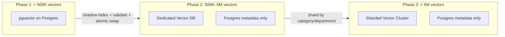

The Vector Search Engine service (from the System Architecture) abstracts the underlying store. Application code never calls pgvector directly — it calls the Retrieval Service, which calls the Vector Search Engine, which today queries pgvector and tomorrow queries Qdrant. The swap is a config change with a data migration, not a code rewrite.

### 1.3 Database Topology

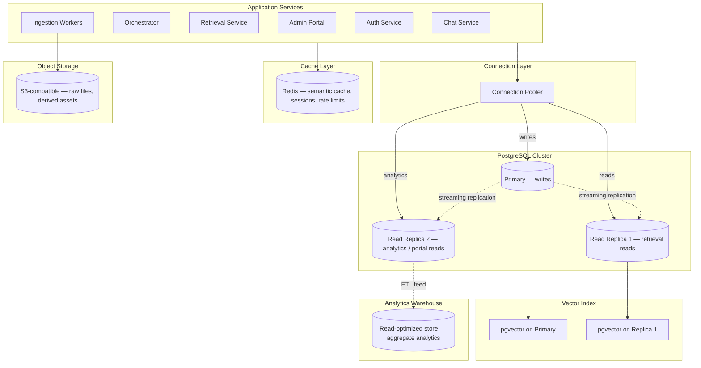

**Key topology decisions:**

- **Connection pooler (PgBouncer / Supavisor)** sits between all application services and PostgreSQL. Services never hold direct connections; the pooler manages a bounded connection pool, preventing connection exhaustion under load.
- **Primary handles all writes.** Reads that require strong consistency (auth, approval checks) also hit the primary.
- **Read Replica 1** serves retrieval metadata lookups and vector searches — the highest-volume read path. Replication lag is tolerable here (< 1s) because a 1-second-old chunk metadata set is acceptable for search.
- **Read Replica 2** serves admin portal reads (analytics, document listings, audit browsing) and feeds the analytics warehouse via ETL. These reads are never on the hot path.
- **Redis** is not a database — it is a cache and ephemeral state store (semantic cache, sessions, rate-limit counters). Loss of Redis means cold caches and re-authentication, not data loss.
- **Object storage** holds all binary files (raw uploads, derived text, page images, table JSON). Postgres stores only metadata and references (storage paths), never BLOBs.

### 1.4 Transaction Strategy

| Operation Class | Isolation Level | Why |
|----------------|----------------|-----|
| **Chat message persistence** | READ COMMITTED | Single-row inserts; no cross-row consistency needed; highest throughput |
| **Document version swap** | SERIALIZABLE | Swapping active version must be atomic: mark old chunks superseded, mark new chunks active, update active-version pointer — all or nothing. A concurrent swap must not interleave |
| **Approval workflow transitions** | REPEATABLE READ | State machine transitions (Draft → InReview → Approved → Published) must read a consistent state and write the next state without interference |
| **User/role/permission changes** | SERIALIZABLE | A role assignment and its permission grants must be atomically visible; partial visibility is a privilege-escalation vector |
| **Audit log writes** | READ COMMITTED (append-only) | Inserts only, no conflicts; hash-chain integrity is enforced by the application computing the chain, not by database isolation |
| **Embedding batch writes** | READ COMMITTED + advisory locks | Batch embedding inserts for one document are coordinated by an advisory lock on the document_id to prevent duplicate workers from double-embedding |
| **Analytics event writes** | READ COMMITTED | High-volume, append-only, non-critical; eventual consistency acceptable |

**General rules:**

- Default isolation: READ COMMITTED (PostgreSQL default) — sufficient for most operations and the highest throughput.
- Escalate to SERIALIZABLE only for operations where interleaving produces incorrect state (version swaps, permission changes).
- Transactions are kept **short** — no transaction holds a lock while waiting for an external service (AI provider, object storage, OCR). External calls happen outside the transaction; only the final database write is transactional.
- Retry logic with exponential backoff for serialization failures (PostgreSQL error code 40001).

### 1.5 Data Consistency

**Strong consistency (primary):**
- All writes go to the primary.
- Auth checks, approval status, permission lookups that gate security decisions read from the primary (not replicas).

**Eventual consistency (replicas, 0–1s lag):**
- Retrieval metadata reads (chunk filtering, citation assembly) tolerate replica lag — a chunk indexed 500ms ago that hasn't replicated yet simply doesn't appear in results for that fraction of a second; the next query sees it.
- Admin portal document listings, analytics, audit browsing.

**Cache consistency:**
- Semantic cache entries are keyed by question embedding similarity and invalidated on document-version change via a `document_id → cache_key` reverse index in Redis.
- Session cache in Redis is the authority for active sessions; Postgres session records are the durable backup.
- Cache TTLs are deliberately short for knowledge answers (minutes) and longer for academic answers (hours), reflecting data volatility.

### 1.6 Backup Strategy

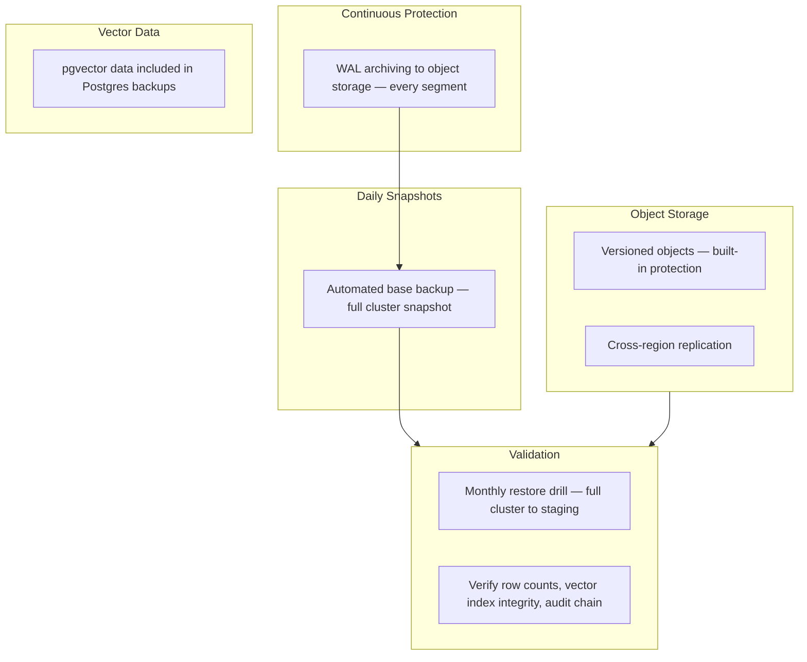

| Component | Method | Frequency | Retention | RPO |
|-----------|--------|-----------|-----------|-----|
| PostgreSQL (all data + vectors) | WAL archiving + daily base backup | Continuous / daily | 30 days of PITR, 90 days of daily snapshots | ~5 minutes |
| Object storage | Versioning + cross-region replication | Continuous | Per lifecycle policy (raw: 1 year, derived: 6 months, superseded: 90 days) | ~0 (replicated) |
| Redis | RDB snapshots | Hourly | 24 hours | Not critical (cache is rebuildable) |
| Analytics warehouse | Daily export snapshots | Daily | 1 year | 24 hours |

**Restore drills:** Monthly, automated to a staging environment. Verify: row counts match, pgvector indexes rebuild successfully, audit hash chain validates end-to-end, a sample of retrieval queries return expected results. An untested backup is a hope, not a backup.

### 1.7 Disaster Recovery

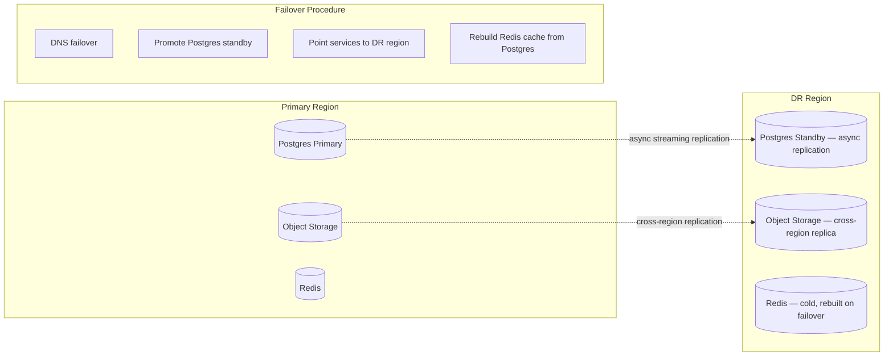

| Metric | Target | Mechanism |
|--------|--------|-----------|
| **RPO** | ~15 minutes | Async streaming replication + WAL archiving |
| **RTO** | ~1 hour | Standby promotion + DNS failover + IaC service bring-up |
| **Failover trigger** | Primary region loss, primary DB unrecoverable, or extended outage > 30 minutes | Manual decision (to avoid split-brain); automated alerting |

**Key DR decisions:**

- **Async replication, not sync:** sync replication halves write throughput and adds cross-region latency to every write. For a college assistant, ~15 minutes of potential data loss is acceptable vs. the performance cost of sync. This is a deliberate, documented trade-off.
- **Redis is not replicated cross-region:** it's a cache; rebuilding it from Postgres on failover takes minutes and is simpler than cross-region Redis replication.
- **Quarterly DR drills:** full failover to the DR region, run a test workload, validate data integrity, fail back.

### 1.8 Data Lifecycle

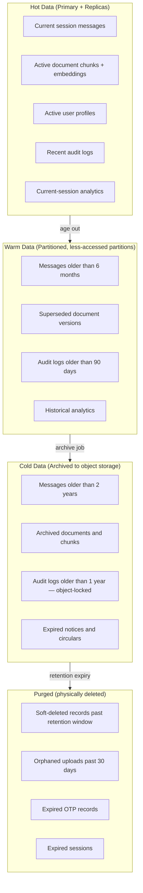

| Data Class | Hot Retention | Warm Retention | Cold Retention | Total Lifecycle |
|-----------|--------------|----------------|----------------|-----------------|
| Chat messages | 6 months | 18 months | 3 years | 5 years |
| Document chunks (active) | Indefinite (while active) | — | — | Until superseded |
| Document chunks (superseded) | 90 days | 1 year | 2 years | 3+ years |
| Audit logs | 90 days | 1 year | 7 years (compliance) | 7+ years |
| Analytics events | 30 days | 6 months | 2 years | 2.5 years |
| API usage logs | 30 days | 6 months | 1 year | 1.5 years |
| User accounts (soft-deleted) | 90 days grace | — | — | Purged after 90 days |
| Expired sessions/OTPs | 24 hours | — | — | Purged after 24 hours |

Lifecycle transitions are driven by scheduled background jobs (daily), not manual intervention. Each transition is logged to the audit store.

---

## Section 2 — Entity Design

### 2.1 Entity Map — All Domains

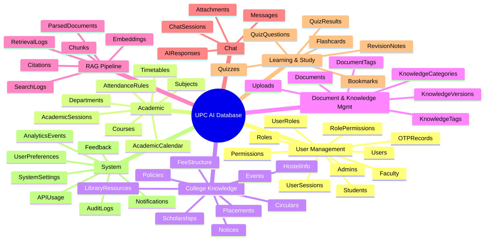

### 2.2 User Management Entities

---

#### Users

**Purpose:** The universal identity table. Every person interacting with UPC AI — student, faculty, or admin — has exactly one row here. This is the single identity that all other entities reference. Authentication, RBAC, and audit all resolve to this table.

**Key attributes:**
- `user_id` — UUID, primary key. Generated server-side (UUIDv7 for time-sortability).
- `email` — Unique, NOT NULL. The college email address; the login identifier.
- `password_hash` — Nullable (null for OAuth-only users). bcrypt/argon2 hash, never plaintext.
- `display_name` — The name shown in chat and portal UI.
- `avatar_url` — Profile image path in object storage.
- `user_type` — Enum: `student`, `faculty`, `admin`. Immutable after creation (type change = new user + migration).
- `department_id` — FK to Departments. The user's primary department affiliation.
- `phone` — Nullable. For OTP delivery.
- `is_active` — Boolean. Disabled accounts cannot authenticate.
- `is_verified` — Boolean. Email/phone verification status.
- `email_verified_at` — Timestamp.
- `last_login_at` — Timestamp. Updated on every successful authentication.
- `login_count` — Integer. For analytics and anomaly detection.
- `created_at`, `updated_at`, `deleted_at` — Standard temporal columns.

**Why a single Users table with type-specific child tables:** UPC AI has exactly three user classes with shared behavior (login, chat, preferences, feedback) and class-specific attributes (enrollment number for students, employee ID for faculty). A single-table-inheritance pattern with child tables avoids duplicating authentication, session, and preference logic across three separate user tables. The `user_type` discriminator tells the application which child table to join.

---

#### Students

**Purpose:** Extended profile for users with `user_type = student`. Carries enrollment, academic position, and guardian information — attributes that only students have and that drive retrieval filtering (year, course, department) and personalization.

**Key attributes:**
- `student_id` — UUID, primary key.
- `user_id` — FK to Users, UNIQUE (one-to-one).
- `enrollment_number` — Unique. The college enrollment/registration number.
- `roll_number` — Unique within a course/year combination.
- `course_id` — FK to Courses. The student's enrolled program.
- `current_year` — Integer (1–6). Drives retrieval filtering ("show me 2nd-year timetable").
- `current_semester` — Integer.
- `section` — Varchar (A, B, C). For section-specific timetables.
- `admission_year` — Integer. Cohort identification.
- `expected_graduation_year` — Integer.
- `category` — Enum: `general`, `obc`, `sc`, `st`, `ews`. For scholarship eligibility filtering.
- `is_hostel_resident` — Boolean. For hostel-specific knowledge filtering.
- `guardian_name`, `guardian_contact` — For emergency/administrative contact.

---

#### Faculty

**Purpose:** Extended profile for users with `user_type = faculty`. Carries employment details, academic qualifications, and department leadership status — used for portal permissions (HoDs get Approver role), timetable assignment, and lecture-note authorship.

**Key attributes:**
- `faculty_id` — UUID, primary key.
- `user_id` — FK to Users, UNIQUE.
- `employee_id` — Unique. The college employee number.
- `designation` — Enum: `professor`, `associate_professor`, `assistant_professor`, `lecturer`, `visiting`. Drives permission defaults.
- `qualification` — Text. Highest degree.
- `specialization` — Text. Research/teaching area.
- `joining_date` — Date.
- `is_hod` — Boolean. Heads of Department automatically receive department-scoped Approver role.
- `subjects_taught` — References via a junction table or JSONB array of subject_ids.

---

#### Admins

**Purpose:** Extended profile for users with `user_type = admin`. Carries administrative scope and level. Admins are the staff who operate the Knowledge Portal — uploading, approving, and managing documents. Their scope (which departments they can manage) is the key security attribute.

**Key attributes:**
- `admin_id` — UUID, primary key.
- `user_id` — FK to Users, UNIQUE.
- `admin_level` — Enum: `contributor`, `editor`, `approver`, `knowledge_admin`, `super_admin`. Maps to the portal role hierarchy from the System Architecture (Section 4.4).
- `managed_scope` — Enum: `department`, `college_wide`. Determines whether permissions are department-bounded or global.
- `managed_department_ids` — Array of department UUIDs or junction table. The departments this admin can manage.
- `appointed_by` — FK to Users. Who granted admin access.
- `appointed_at` — Timestamp.

---

#### Roles

**Purpose:** Named permission bundles. A role is a collection of permissions that can be assigned to users. Roles are hierarchical: a `knowledge_admin` inherits all permissions of `approver`, which inherits `editor`, which inherits `contributor`. System roles are immutable; custom roles can be created by Super Admins.

**Key attributes:**
- `role_id` — UUID, primary key.
- `role_name` — Unique. E.g., `student`, `faculty`, `contributor`, `editor`, `approver`, `knowledge_admin`, `super_admin`.
- `role_type` — Enum: `system` (immutable, seeded), `custom` (admin-created).
- `description` — Human-readable explanation of what this role can do.
- `scope_type` — Enum: `global`, `department`. Whether the role applies college-wide or per-department.
- `hierarchy_level` — Integer. For inheritance resolution (higher = more privilege).
- `is_active` — Boolean.
- `created_at`, `updated_at`.

---

#### Permissions

**Purpose:** Atomic authorization units. Each permission represents one action on one resource type. Permissions are never assigned directly to users — they are grouped into Roles. This prevents permission sprawl and makes auditing tractable (audit a role's permissions, not 50,000 individual user-permission assignments).

**Key attributes:**
- `permission_id` — UUID, primary key.
- `permission_key` — Unique, machine-readable. E.g., `document:create`, `document:approve`, `document:delete`, `user:manage`, `analytics:view`.
- `resource` — The entity type this permission governs: `document`, `user`, `role`, `notice`, `setting`, `analytics`, `audit`.
- `action` — Enum: `create`, `read`, `update`, `delete`, `approve`, `publish`, `manage`.
- `description` — Human-readable explanation.
- `category` — Grouping for UI display: `content`, `administration`, `security`, `analytics`.

---

#### RolePermissions (Junction)

**Purpose:** Maps permissions to roles. Many-to-many: a role has many permissions; a permission can belong to many roles.

**Key attributes:**
- `role_id` — FK to Roles. Part of composite PK.
- `permission_id` — FK to Permissions. Part of composite PK.
- `granted_at` — Timestamp.

---

#### UserRoles (Junction)

**Purpose:** Assigns roles to users, optionally scoped to a department. This is the RBAC assignment table. A user can have multiple roles (e.g., `faculty` globally + `approver` for Physics department). Department scoping is critical: a Physics approver cannot approve Chemistry documents.

**Key attributes:**
- `user_role_id` — UUID, primary key (or composite of user_id + role_id + department_id).
- `user_id` — FK to Users.
- `role_id` — FK to Roles.
- `department_id` — FK to Departments, nullable. NULL = college-wide; non-NULL = department-scoped.
- `granted_by` — FK to Users. Who assigned this role (audit trail).
- `granted_at` — Timestamp.
- `expires_at` — Timestamp, nullable. For temporary role assignments (e.g., acting HoD).
- `is_active` — Boolean.

---

#### UserSessions

**Purpose:** Server-side session records for active login sessions. Enables instant revocation (logout, admin force-logout, suspicious-activity kill), multi-device session listing ("sign out other devices"), and refresh-token rotation tracking.

**Key attributes:**
- `session_id` — UUID, primary key. Also the opaque session identifier in the refresh token.
- `user_id` — FK to Users.
- `refresh_token_hash` — Hash of the current refresh token. Rotates on every refresh; reuse of an old hash signals token theft and revokes the entire session family.
- `device_info` — JSONB: `{ browser, os, device_type, ip_address }`.
- `ip_address` — Inet. Login IP.
- `is_active` — Boolean. Set to false on logout or revocation.
- `last_active_at` — Timestamp. Updated on each token refresh.
- `expires_at` — Timestamp. Absolute session lifetime.
- `revoked_at` — Timestamp, nullable. When and if the session was revoked.
- `revoked_reason` — Enum: `logout`, `admin_revoke`, `token_reuse_detected`, `expired`, `password_change`.
- `created_at`.

---

#### OTPRecords

**Purpose:** Stores one-time passcodes for passwordless login and step-up verification. Short-lived, high-churn — purged aggressively.

**Key attributes:**
- `otp_id` — UUID, primary key.
- `user_id` — FK to Users, nullable (for pre-registration OTPs, keyed by email/phone instead).
- `email` or `phone` — The delivery target.
- `otp_hash` — Hash of the OTP (never stored plaintext).
- `purpose` — Enum: `login`, `email_verify`, `phone_verify`, `step_up`.
- `attempts` — Integer. Incremented on each failed verification; locked after 5 attempts.
- `is_used` — Boolean.
- `expires_at` — Timestamp (typically now + 10 minutes).
- `created_at`.

---

### 2.3 Academic Entities

---

#### Departments

**Purpose:** Organizational units of the college. Departments scope permissions, filter retrieval, organize documents, and structure timetables. Nearly every entity in the system carries a `department_id` for scoping.

**Key attributes:**
- `department_id` — UUID, primary key.
- `name` — E.g., "Physics", "Computer Science", "English".
- `code` — Unique short code. E.g., `PHY`, `CS`, `ENG`.
- `description` — Text.
- `head_faculty_id` — FK to Faculty. The current HoD.
- `parent_department_id` — FK to Departments (self-referential), nullable. For hierarchical department structures (e.g., "Sciences" → "Physics", "Chemistry").
- `contact_email` — Department email.
- `is_active` — Boolean.
- `created_at`, `updated_at`.

---

#### Courses

**Purpose:** Degree programs offered by the college. E.g., "BSc Computer Science", "MA English", "BEd". Courses drive student enrollment, subject mapping, timetable generation, and fee-structure association.

**Key attributes:**
- `course_id` — UUID, primary key.
- `name` — E.g., "BSc Computer Science".
- `code` — Unique. E.g., `BSC-CS`.
- `department_id` — FK to Departments.
- `degree_type` — Enum: `bachelor`, `master`, `diploma`, `certificate`, `phd`.
- `duration_years` — Integer.
- `total_semesters` — Integer.
- `medium_of_instruction` — Enum: `english`, `hindi`, `both`.
- `is_active` — Boolean.
- `created_at`, `updated_at`.

---

#### Subjects

**Purpose:** Individual courses/papers within a degree program. Subjects are the finest academic unit — used for timetable entries, lecture-note association, previous-year-paper mapping, quiz generation, and subject-mode filtering in chat.

**Key attributes:**
- `subject_id` — UUID, primary key.
- `name` — E.g., "Data Structures and Algorithms".
- `code` — Unique. E.g., `CS302`.
- `course_id` — FK to Courses.
- `department_id` — FK to Departments.
- `semester` — Integer. Which semester this subject belongs to.
- `year` — Integer. Which year.
- `credit_hours` — Numeric.
- `subject_type` — Enum: `theory`, `practical`, `elective`, `project`, `seminar`.
- `description` — Text.
- `syllabus_document_id` — FK to Documents, nullable. The official syllabus document.
- `is_active` — Boolean.
- `created_at`, `updated_at`.

---

#### AcademicSessions

**Purpose:** Academic year/term definitions. E.g., "2025–26". Sessions scope time-dependent entities: timetables, fee structures, notices, and academic calendars. The `is_current` flag drives default filtering — "what's the current timetable?" resolves to the current session.

**Key attributes:**
- `session_id` — UUID, primary key.
- `name` — E.g., "2025–26".
- `start_date` — Date.
- `end_date` — Date.
- `is_current` — Boolean. Exactly one session is current at any time (enforced by a partial unique index).
- `status` — Enum: `upcoming`, `active`, `completed`.
- `created_at`, `updated_at`.

---

#### Timetables

**Purpose:** Class schedule entries. Each row is one slot: "Monday, 10:00–11:00, CS302, Prof. Sharma, Room 204." Timetables are one of the most-queried knowledge entities ("what's my next class?") and are stored both as structured data (for precise queries) and as linked documents (for RAG retrieval of the full timetable PDF).

**Key attributes:**
- `timetable_id` — UUID, primary key.
- `session_id` — FK to AcademicSessions.
- `department_id` — FK to Departments.
- `course_id` — FK to Courses.
- `year` — Integer.
- `semester` — Integer.
- `section` — Varchar, nullable.
- `day_of_week` — Enum: `monday` through `saturday`.
- `time_slot_start` — Time.
- `time_slot_end` — Time.
- `subject_id` — FK to Subjects.
- `faculty_id` — FK to Faculty.
- `room_number` — Varchar.
- `effective_from` — Date. When this schedule starts.
- `effective_until` — Date, nullable. When it ends (null = until session ends).
- `source_document_id` — FK to Documents, nullable. The timetable PDF/image this was extracted from.
- `created_at`, `updated_at`.

---

#### AcademicCalendar

**Purpose:** Session-level academic events: exam periods, holidays, registration deadlines, result dates. Drives both structured queries ("when do exams start?") and RAG retrieval (the calendar document is also ingested).

**Key attributes:**
- `calendar_id` — UUID, primary key.
- `session_id` — FK to AcademicSessions.
- `event_title` — E.g., "End-Semester Examinations Begin".
- `event_type` — Enum: `holiday`, `exam_start`, `exam_end`, `registration`, `result`, `convocation`, `orientation`, `vacation_start`, `vacation_end`, `other`.
- `start_date` — Date.
- `end_date` — Date, nullable (single-day events).
- `description` — Text.
- `applies_to` — JSONB: `{ scope: "all" }` or `{ scope: "specific", course_ids: [...], department_ids: [...] }`.
- `source_document_id` — FK to Documents, nullable.
- `is_published` — Boolean.
- `created_at`, `updated_at`.

---

#### AttendanceRules

**Purpose:** Attendance policies — minimum percentage requirements, consequences of shortage, condonation rules. Queried by students ("what's the minimum attendance?") and referenced by notices about attendance shortages.

**Key attributes:**
- `rule_id` — UUID, primary key.
- `title` — E.g., "Minimum Attendance Requirement for Regular Students".
- `description` — Full rule text.
- `minimum_percentage` — Numeric. E.g., 75.0.
- `condonation_percentage` — Numeric, nullable. E.g., 65.0 (with dean's permission).
- `consequences` — Text. What happens below minimum.
- `applies_to` — JSONB: scope (all, specific courses/departments).
- `session_id` — FK to AcademicSessions.
- `department_id` — FK to Departments, nullable.
- `source_document_id` — FK to Documents, nullable.
- `is_active` — Boolean.
- `created_at`, `updated_at`.

---

### 2.4 College Knowledge Entities

These entities represent the structured knowledge that the college maintains — notices, events, fees, hostel rules, placements, etc. Each entity stores structured data for precise queries AND links to source documents for RAG retrieval. This dual representation is deliberate: structured data answers "what's the BSc CS 2nd year tuition fee?" with a precise number; the linked document provides full context and citation.

---

#### Notices

**Purpose:** Official college notices — the primary communication channel. Notices are time-sensitive (effective/expiry dates), audience-targeted, and one of the highest-volume knowledge entities. Expired notices are filtered from default retrieval but retained for historical queries.

**Key attributes:**
- `notice_id` — UUID, primary key.
- `title` — E.g., "Revised Examination Schedule for BSc 3rd Year".
- `reference_number` — Unique, nullable. Official notice number for exact-match retrieval.
- `content` — Text. The notice body (may also be in the linked document).
- `notice_type` — Enum: `general`, `academic`, `examination`, `administrative`, `hostel`, `placement`, `sports`, `cultural`, `disciplinary`.
- `priority` — Enum: `normal`, `important`, `urgent`.
- `department_id` — FK to Departments, nullable (null = college-wide).
- `audience` — JSONB: `{ scope: "all" }` or `{ scope: "students", year: 2, course_ids: [...] }`.
- `effective_date` — Date.
- `expiry_date` — Date, nullable (null = no expiry).
- `source_document_id` — FK to Documents, nullable.
- `published_by` — FK to Users.
- `approved_by` — FK to Users, nullable.
- `is_published` — Boolean.
- `is_pinned` — Boolean. Pinned notices appear prominently.
- `view_count` — Integer. For analytics.
- `created_at`, `updated_at`, `deleted_at`.

---

#### Circulars

**Purpose:** Official circulars — formal institutional communications, typically with a reference number, issued by authority. Distinguished from notices by formality and permanence. Circulars are rarely time-limited and carry institutional weight.

**Key attributes:**
- `circular_id` — UUID, primary key.
- `reference_number` — Unique, NOT NULL. E.g., "UPC/2025/EXAM/047".
- `title` — Text.
- `content` — Text.
- `circular_type` — Enum: `academic`, `administrative`, `examination`, `financial`, `disciplinary`.
- `issued_by` — Text. The issuing authority (e.g., "Office of the Registrar").
- `issued_by_user_id` — FK to Users.
- `department_id` — FK to Departments, nullable.
- `audience` — JSONB.
- `effective_date` — Date.
- `source_document_id` — FK to Documents, nullable.
- `is_published` — Boolean.
- `created_at`, `updated_at`, `deleted_at`.

---

#### Events

**Purpose:** College events — seminars, workshops, cultural fests, sports days, guest lectures. Events have temporal bounds, venue, registration, and capacity. Students frequently ask "what events are coming up?" — this entity powers both structured answers and RAG-grounded responses about event details.

**Key attributes:**
- `event_id` — UUID, primary key.
- `title` — Text.
- `description` — Text.
- `event_type` — Enum: `seminar`, `workshop`, `cultural`, `sports`, `guest_lecture`, `competition`, `exhibition`, `conference`, `orientation`.
- `venue` — Text.
- `start_datetime` — Timestamptz.
- `end_datetime` — Timestamptz.
- `organizer_department_id` — FK to Departments.
- `organized_by` — Text. Organizing committee/club name.
- `registration_required` — Boolean.
- `registration_url` — Text, nullable.
- `registration_deadline` — Timestamptz, nullable.
- `max_participants` — Integer, nullable.
- `current_participants` — Integer, default 0.
- `audience` — JSONB.
- `source_document_id` — FK to Documents, nullable.
- `is_published` — Boolean.
- `is_featured` — Boolean.
- `created_at`, `updated_at`, `deleted_at`.

---

#### LibraryResources

**Purpose:** Library catalog — books, journals, periodicals, theses, digital resources. Students ask "do we have a book on X?" or "what's the reference book for CS302?" This entity enables both structured lookup (by ISBN, subject) and RAG retrieval (catalog descriptions, availability).

**Key attributes:**
- `resource_id` — UUID, primary key.
- `title` — Text.
- `author` — Text.
- `isbn` — Varchar, nullable, unique where present.
- `resource_type` — Enum: `book`, `journal`, `periodical`, `thesis`, `digital`, `reference`, `magazine`.
- `department_id` — FK to Departments, nullable.
- `subject_id` — FK to Subjects, nullable.
- `edition` — Varchar, nullable.
- `publisher` — Text, nullable.
- `publication_year` — Integer, nullable.
- `total_copies` — Integer.
- `available_copies` — Integer.
- `shelf_location` — Varchar. Physical location in the library.
- `is_reference_only` — Boolean. Cannot be borrowed.
- `is_digital` — Boolean.
- `digital_url` — Text, nullable.
- `is_active` — Boolean.
- `created_at`, `updated_at`.

---

#### HostelInfo

**Purpose:** Hostel-related knowledge — rules, facilities, fee structures, mess menus, timings, allocation policies. Hostel information is highly queried ("what's the hostel curfew?", "what's the mess menu?") and changes frequently (mess menus weekly, rules annually). Each info record links to a specific hostel (or all) and a session.

**Key attributes:**
- `hostel_info_id` — UUID, primary key.
- `info_type` — Enum: `rules`, `facilities`, `fee_structure`, `allocation_policy`, `mess_menu`, `timings`, `contact`, `complaint_procedure`.
- `title` — Text.
- `content` — Text.
- `hostel_name` — Text, nullable (null = applies to all hostels).
- `hostel_type` — Enum: `boys`, `girls`, `all`, nullable.
- `session_id` — FK to AcademicSessions.
- `effective_from` — Date.
- `effective_until` — Date, nullable.
- `source_document_id` — FK to Documents, nullable.
- `is_active` — Boolean.
- `created_at`, `updated_at`, `deleted_at`.

---

#### Scholarships

**Purpose:** Scholarship information — eligibility, amounts, deadlines, application procedures. Students frequently ask "what scholarships am I eligible for?" The eligibility criteria and student profile (category, course, year, income) drive personalized filtering.

**Key attributes:**
- `scholarship_id` — UUID, primary key.
- `name` — E.g., "National Merit Scholarship".
- `description` — Text.
- `scholarship_type` — Enum: `merit`, `need_based`, `sports`, `minority`, `government`, `private`, `college`.
- `provider` — Text. Who provides the scholarship.
- `amount` — Numeric, nullable (variable amounts).
- `amount_description` — Text, nullable. E.g., "Full tuition waiver" or "₹5,000–₹15,000 based on merit".
- `eligibility_criteria` — JSONB: `{ min_percentage, categories, courses, years, income_limit, other_conditions }`.
- `application_process` — Text.
- `application_deadline` — Date, nullable.
- `session_id` — FK to AcademicSessions.
- `applicable_courses` — JSONB array of course_ids, or null (all courses).
- `source_document_id` — FK to Documents, nullable.
- `is_active` — Boolean.
- `created_at`, `updated_at`, `deleted_at`.

---

#### Placements

**Purpose:** Placement drive information — companies, roles, packages, eligibility, schedules. Critical for final-year students. Supports both structured queries ("which companies are coming for CS placements?") and RAG retrieval of detailed placement brochures.

**Key attributes:**
- `placement_id` — UUID, primary key.
- `company_name` — Text.
- `role_title` — Text.
- `description` — Text.
- `package_min` — Numeric, nullable. LPA.
- `package_max` — Numeric, nullable.
- `job_type` — Enum: `full_time`, `internship`, `ppo`.
- `eligibility_criteria` — JSONB: `{ min_percentage, courses, years, backlogs_allowed, skills }`.
- `applicable_courses` — JSONB array of course_ids.
- `drive_date` — Date, nullable.
- `registration_deadline` — Date, nullable.
- `session_id` — FK to AcademicSessions.
- `department_id` — FK to Departments, nullable.
- `source_document_id` — FK to Documents, nullable.
- `status` — Enum: `upcoming`, `registration_open`, `ongoing`, `completed`, `cancelled`.
- `is_published` — Boolean.
- `created_at`, `updated_at`, `deleted_at`.

---

#### FeeStructure

**Purpose:** Fee information by course, year, session, and fee type. One of the most sensitive knowledge entities — a wrong fee amount from the AI is an institutional incident. Structured storage enables exact-amount answers; document linkage provides the official source citation.

**Key attributes:**
- `fee_id` — UUID, primary key.
- `course_id` — FK to Courses.
- `session_id` — FK to AcademicSessions.
- `year` — Integer.
- `fee_type` — Enum: `tuition`, `examination`, `laboratory`, `library`, `sports`, `development`, `hostel`, `mess`, `caution_deposit`, `alumni`, `other`.
- `amount` — Numeric, NOT NULL. Exact amount in INR.
- `currency` — Varchar, default `INR`.
- `due_date` — Date, nullable.
- `late_fee_per_day` — Numeric, nullable.
- `description` — Text, nullable.
- `source_document_id` — FK to Documents, nullable.
- `is_active` — Boolean.
- `created_at`, `updated_at`.

**Constraint:** UNIQUE on `(course_id, session_id, year, fee_type)` — one amount per fee type per course/year/session.

---

#### Policies

**Purpose:** Institutional policies — academic integrity, anti-ragging, examination rules, hostel rules, library rules, code of conduct. Policies are versioned (a new version supersedes the old) and linked to source documents for full-text retrieval and citation.

**Key attributes:**
- `policy_id` — UUID, primary key.
- `title` — E.g., "Anti-Ragging Policy".
- `description` — Text. Policy summary or full text.
- `policy_type` — Enum: `academic`, `behavioral`, `anti_ragging`, `examination`, `library`, `hostel`, `placement`, `it_usage`, `grievance`, `other`.
- `department_id` — FK to Departments, nullable (null = college-wide).
- `version` — Integer. Monotonically increasing per policy title.
- `effective_from` — Date.
- `effective_until` — Date, nullable.
- `approved_by` — FK to Users.
- `approved_at` — Timestamp.
- `source_document_id` — FK to Documents, nullable.
- `is_active` — Boolean. Only the latest version is active.
- `previous_version_id` — FK to Policies (self-ref), nullable.
- `created_at`, `updated_at`, `deleted_at`.

---

#### PreviousYearPapers

**Purpose:** Past examination papers — the single most requested academic resource. Linked to subjects, sessions, and exam types. Always linked to a document (the paper itself), which is ingested into RAG for question-level retrieval.

**Key attributes:**
- `paper_id` — UUID, primary key.
- `title` — E.g., "BSc CS — Data Structures — End Semester 2024".
- `subject_id` — FK to Subjects.
- `course_id` — FK to Courses.
- `session_id` — FK to AcademicSessions.
- `year` — Integer.
- `semester` — Integer.
- `exam_type` — Enum: `midterm`, `end_semester`, `supplementary`, `internal`, `practical`.
- `document_id` — FK to Documents, NOT NULL. The paper file.
- `uploaded_by` — FK to Users.
- `is_published` — Boolean.
- `download_count` — Integer.
- `created_at`, `updated_at`.

---

#### LabManuals

**Purpose:** Laboratory manuals for practical subjects. Linked to subjects and departments. Ingested into RAG so students can ask "what's the procedure for experiment 5 in the physics lab?"

**Key attributes:**
- `manual_id` — UUID, primary key.
- `title` — E.g., "Physics Lab Manual — BSc 1st Year".
- `subject_id` — FK to Subjects.
- `course_id` — FK to Courses.
- `department_id` — FK to Departments.
- `edition` — Varchar, nullable.
- `academic_year` — Varchar, nullable.
- `document_id` — FK to Documents, NOT NULL.
- `uploaded_by` — FK to Users.
- `is_published` — Boolean.
- `created_at`, `updated_at`.

---

#### LectureNotes

**Purpose:** Faculty-uploaded lecture notes. Linked to subjects, topics, and the authoring faculty member. Ingested into RAG for topic-level retrieval — "explain the concept of recursion as covered in our CS302 lectures."

**Key attributes:**
- `note_id` — UUID, primary key.
- `title` — E.g., "Lecture 7 — Binary Search Trees".
- `topic` — Text. The specific topic covered.
- `subject_id` — FK to Subjects.
- `faculty_id` — FK to Faculty (the author).
- `session_id` — FK to AcademicSessions.
- `lecture_number` — Integer, nullable.
- `document_id` — FK to Documents, NOT NULL.
- `is_published` — Boolean.
- `download_count` — Integer.
- `created_at`, `updated_at`.

---

### 2.5 Document & Knowledge Management Entities

---

#### Documents

**Purpose:** The central entity of the knowledge layer. Every piece of uploadable content — notices, timetables, syllabi, papers, manuals, circulars — has a corresponding Documents row. This table tracks the full lifecycle: upload → virus scan → parsing → chunking → embedding → indexing → publication → versioning → archival. It is the source-of-truth for document metadata and the join point between structured college entities and the RAG pipeline.

**Key attributes:**
- `document_id` — UUID, primary key. Immutable across versions (each version gets a new row but shares a `canonical_id`).
- `canonical_id` — UUID. Groups all versions of the same logical document. All versions of "Fee Structure 2025–26" share the same `canonical_id`.
- `version` — Integer. Monotonically increasing per `canonical_id`.
- `title` — Text.
- `description` — Text, nullable.
- `file_name` — Original upload filename.
- `file_type` — Enum: `pdf`, `docx`, `pptx`, `xlsx`, `csv`, `image`, `html`, `txt`, `md`.
- `file_size_bytes` — Bigint.
- `mime_type` — Varchar.
- `storage_path` — Text. Object storage key for the raw file.
- `content_hash` — Varchar(64). SHA-256 of the file content. Used for deduplication and idempotent re-processing.
- `category_id` — FK to KnowledgeCategories.
- `department_id` — FK to Departments, nullable.
- `access_level` — Enum: `public`, `internal`, `restricted`.
- `audience` — JSONB, nullable. Fine-grained audience targeting.
- `status` — Enum: `uploaded`, `scanning`, `scan_failed`, `parsing`, `parse_failed`, `chunking`, `chunk_failed`, `embedding`, `embed_failed`, `indexed`, `draft`, `in_review`, `approved`, `published`, `superseded`, `archived`.
- `is_active_version` — Boolean. TRUE for the current active version of this `canonical_id`.
- `language` — Enum: `en`, `hi`, `en_hi` (mixed).
- `effective_date` — Date, nullable.
- `expiry_date` — Date, nullable.
- `page_count` — Integer, nullable.
- `word_count` — Integer, nullable.
- `chunk_count` — Integer, nullable. Populated after chunking.
- `embedding_model` — Varchar, nullable. E.g., `upc-emb-v1`. Which model generated the embeddings.
- `processing_error` — Text, nullable. Last error message if in a failed state.
- `processing_started_at` — Timestamptz, nullable.
- `processing_completed_at` — Timestamptz, nullable.
- `uploaded_by` — FK to Users.
- `approved_by` — FK to Users, nullable.
- `approved_at` — Timestamptz, nullable.
- `published_by` — FK to Users, nullable.
- `published_at` — Timestamptz, nullable.
- `created_at`, `updated_at`, `deleted_at`.

**Critical constraints:**
- Exactly one row per `canonical_id` has `is_active_version = TRUE` (enforced by partial unique index).
- `content_hash` enables idempotent re-processing: re-uploading the same file is a no-op, not a duplicate.

---

#### Uploads

**Purpose:** Upload audit trail. Every file upload creates an Uploads row before processing begins. Tracks the upload source, virus scan result, and the originating IP. Separated from Documents because one document may be re-uploaded multiple times (retries, corrections), and the upload trail is an audit artifact, not a content artifact.

**Key attributes:**
- `upload_id` — UUID, primary key.
- `document_id` — FK to Documents.
- `user_id` — FK to Users.
- `original_filename` — Text.
- `file_size_bytes` — Bigint.
- `mime_type` — Varchar.
- `storage_path` — Text. Raw upload location.
- `virus_scan_status` — Enum: `pending`, `clean`, `infected`, `scan_error`.
- `virus_scan_result` — JSONB, nullable. Scanner details.
- `virus_scanned_at` — Timestamptz, nullable.
- `upload_source` — Enum: `portal`, `api`, `bulk_import`.
- `ip_address` — Inet.
- `user_agent` — Text, nullable.
- `created_at`.

---

#### KnowledgeCategories

**Purpose:** Hierarchical taxonomy for organizing documents. E.g., "Academic" → "Examinations" → "Previous Year Papers". Categories drive both the admin portal's organizational structure and retrieval pre-filtering. A question about "exam schedule" retrieves only from the `examination` category subtree, dramatically improving precision.

**Key attributes:**
- `category_id` — UUID, primary key.
- `name` — Text. E.g., "Examinations".
- `slug` — Varchar, unique. URL-safe identifier. E.g., `examinations`.
- `description` — Text, nullable.
- `parent_category_id` — FK to KnowledgeCategories (self-ref), nullable. Root categories have NULL parent.
- `depth` — Integer. Pre-computed depth in the hierarchy for query efficiency.
- `path` — Text. Materialized path, e.g., `/academic/examinations/`. For subtree queries.
- `display_order` — Integer. Sort order within siblings.
- `icon` — Varchar, nullable. UI icon identifier.
- `is_active` — Boolean.
- `document_count` — Integer. Denormalized count of published documents in this category.
- `created_at`, `updated_at`.

---

#### KnowledgeTags

**Purpose:** Flat tags for cross-cutting classification. Unlike categories (hierarchical, mutually exclusive for primary classification), tags are flat and multi-assignable. E.g., a document might be categorized as "Examination" but tagged with `fee`, `deadline`, `bsc-cs`. Tags come from two sources: automatic (NER/classifier during ingestion) and manual (staff). Auto-tags below a confidence threshold are flagged for review.

**Key attributes:**
- `tag_id` — UUID, primary key.
- `name` — Text. E.g., "fee", "deadline", "bsc-cs".
- `slug` — Varchar, unique.
- `tag_type` — Enum: `auto`, `manual`.
- `is_approved` — Boolean. Auto-tags below confidence threshold start as unapproved.
- `usage_count` — Integer. Denormalized count of documents using this tag.
- `created_at`.

---

#### DocumentTags (Junction)

**Purpose:** Many-to-many relationship between Documents and KnowledgeTags.

**Key attributes:**
- `document_id` — FK to Documents. Part of composite PK.
- `tag_id` — FK to KnowledgeTags. Part of composite PK.
- `confidence_score` — Numeric(3,2), nullable. For auto-assigned tags: the classifier's confidence. NULL for manual tags.
- `tagged_by_type` — Enum: `auto`, `user`.
- `tagged_by_user_id` — FK to Users, nullable.
- `tagged_at` — Timestamptz.

---

#### KnowledgeVersions

**Purpose:** Version history records for documents. Each version change (new file uploaded for the same canonical document) creates a row here with a change summary. This is the audit trail for "what changed between v3 and v4 of the fee structure?"

**Key attributes:**
- `version_id` — UUID, primary key.
- `canonical_id` — UUID. The logical document identifier (matches `Documents.canonical_id`).
- `document_id` — FK to Documents. The specific version's document row.
- `version_number` — Integer.
- `change_summary` — Text. What changed in this version.
- `changed_by` — FK to Users.
- `previous_version_document_id` — FK to Documents, nullable.
- `is_active` — Boolean. Mirrors `Documents.is_active_version`.
- `activated_at` — Timestamptz, nullable. When this version became the active one.
- `superseded_at` — Timestamptz, nullable. When this version was superseded.
- `created_at`.

---

### 2.6 RAG Pipeline Entities

Detailed in **Section 4**. Summary:

| Entity | Purpose |
|--------|---------|
| **ParsedDocuments** | Extracted text and structure from raw files |
| **Chunks** | Semantic units of text for retrieval |
| **Embeddings** | Vector representations of chunks for similarity search |
| **Citations** | Source references attached to AI answers |
| **SearchLogs** | Every search query and its retrieval results |
| **RetrievalLogs** | Per-answer retrieval quality tracking |

---

### 2.7 Chat Entities

Detailed in **Section 5**. Summary:

| Entity | Purpose |
|--------|---------|
| **ChatSessions** | Conversation containers with mode and preference |
| **Messages** | Individual turns (user + assistant) |
| **AIResponses** | Model/provider/cost metadata per AI message |
| **Attachments** | Files attached to messages |

---

### 2.8 Learning & Study Entities

---

#### Quizzes

**Purpose:** Quiz containers — either AI-generated (from RAG content or academic topics) or self-created. A quiz is a set of questions with a time limit and difficulty level. Quizzes are one of UPC AI's study tools, helping students test their understanding.

**Key attributes:**
- `quiz_id` — UUID, primary key.
- `user_id` — FK to Users. The student who created/requested this quiz.
- `session_id` — FK to ChatSessions, nullable. If generated during a chat.
- `subject_id` — FK to Subjects, nullable.
- `title` — Text.
- `topic` — Text, nullable.
- `quiz_type` — Enum: `ai_generated`, `user_created`.
- `difficulty` — Enum: `easy`, `medium`, `hard`, `mixed`.
- `question_count` — Integer.
- `time_limit_minutes` — Integer, nullable.
- `status` — Enum: `draft`, `active`, `completed`, `abandoned`.
- `source_type` — Enum: `subject`, `document`, `topic`, `custom`. What the quiz was generated from.
- `created_at`, `updated_at`.

---

#### QuizQuestions

**Purpose:** Individual questions within a quiz. Supports multiple question types. If AI-generated from RAG content, links back to the source chunk for citation and verification.

**Key attributes:**
- `question_id` — UUID, primary key.
- `quiz_id` — FK to Quizzes.
- `question_text` — Text.
- `question_type` — Enum: `mcq`, `true_false`, `short_answer`, `fill_blank`.
- `options` — JSONB, nullable. For MCQ: `["Option A", "Option B", "Option C", "Option D"]`.
- `correct_answer` — Text.
- `explanation` — Text, nullable. Why this is the correct answer.
- `difficulty` — Enum: `easy`, `medium`, `hard`.
- `marks` — Numeric, default 1.
- `sequence_number` — Integer. Order within the quiz.
- `source_chunk_id` — FK to Chunks, nullable. The RAG chunk this question was generated from.
- `created_at`.

---

#### QuizResults

**Purpose:** A student's attempt at a quiz. Stores the overall score and per-question answers for review and analytics. Enables "show me my quiz history" and tracks learning progress over time.

**Key attributes:**
- `result_id` — UUID, primary key.
- `quiz_id` — FK to Quizzes.
- `user_id` — FK to Users.
- `score` — Numeric. Points earned.
- `total_marks` — Numeric. Maximum possible.
- `percentage` — Numeric.
- `time_taken_seconds` — Integer.
- `answers` — JSONB. Array of `{ question_id, selected_answer, is_correct, time_spent_seconds }`.
- `started_at` — Timestamptz.
- `completed_at` — Timestamptz, nullable.
- `status` — Enum: `in_progress`, `completed`, `abandoned`.
- `created_at`.

---

#### Flashcards

**Purpose:** Spaced-repetition flashcards — AI-generated from study material or user-created. Each flashcard has front (question/prompt) and back (answer/explanation) content. The spaced-repetition algorithm (SM-2 variant) controls review scheduling via `ease_factor`, `interval_days`, and `next_review_at`.

**Key attributes:**
- `flashcard_id` — UUID, primary key.
- `user_id` — FK to Users.
- `subject_id` — FK to Subjects, nullable.
- `deck_name` — Text, nullable. User-defined grouping.
- `topic` — Text, nullable.
- `front_content` — Text. The prompt/question.
- `back_content` — Text. The answer/explanation.
- `difficulty` — Enum: `easy`, `medium`, `hard`.
- `source` — Enum: `ai_generated`, `user_created`.
- `source_chunk_id` — FK to Chunks, nullable.
- `review_count` — Integer, default 0.
- `correct_count` — Integer, default 0.
- `last_reviewed_at` — Timestamptz, nullable.
- `next_review_at` — Timestamptz, nullable. Scheduled by the SRS algorithm.
- `ease_factor` — Numeric, default 2.5. SM-2 ease factor.
- `interval_days` — Integer, default 1. Current interval.
- `is_archived` — Boolean.
- `created_at`, `updated_at`.

---

#### RevisionNotes

**Purpose:** AI-generated or user-created study summaries. Often generated from a chat conversation ("summarize this topic for revision"). Links back to the originating chat session and messages for context.

**Key attributes:**
- `revision_note_id` — UUID, primary key.
- `user_id` — FK to Users.
- `subject_id` — FK to Subjects, nullable.
- `chat_session_id` — FK to ChatSessions, nullable.
- `title` — Text.
- `content` — Text. Markdown-formatted revision content.
- `topic` — Text, nullable.
- `source` — Enum: `ai_generated`, `user_created`, `chat_extracted`.
- `source_message_ids` — UUID array, nullable. The chat messages this was derived from.
- `word_count` — Integer.
- `is_pinned` — Boolean.
- `is_archived` — Boolean.
- `created_at`, `updated_at`, `deleted_at`.

---

#### Bookmarks

**Purpose:** Polymorphic bookmarking — users can bookmark messages, documents, notices, events, quizzes, flashcards, or revision notes. Uses a type+ID pattern to reference any bookmarkable entity without separate junction tables for each type.

**Key attributes:**
- `bookmark_id` — UUID, primary key.
- `user_id` — FK to Users.
- `bookmarkable_type` — Enum: `message`, `document`, `notice`, `event`, `quiz`, `flashcard`, `revision_note`, `library_resource`.
- `bookmarkable_id` — UUID. The ID of the bookmarked entity.
- `label` — Text, nullable. User-defined label.
- `folder` — Text, nullable. User-defined folder for organization.
- `notes` — Text, nullable. User's notes about why they bookmarked this.
- `created_at`.

**Index:** Composite index on `(user_id, bookmarkable_type, bookmarkable_id)` with a UNIQUE constraint to prevent duplicate bookmarks.

---

### 2.9 System Entities

---

#### UserPreferences

**Purpose:** Per-user settings and preferences. One row per user (one-to-one with Users). Stores UI preferences, AI behavior preferences, and notification settings. Injected into the Orchestrator context to personalize responses (language, detail level, difficulty).

**Key attributes:**
- `preference_id` — UUID, primary key.
- `user_id` — FK to Users, UNIQUE.
- `theme` — Enum: `light`, `dark`, `system`.
- `language` — Enum: `en`, `hi`, `en_hi`.
- `font_size` — Enum: `small`, `medium`, `large`.
- `notification_email` — Boolean, default TRUE.
- `notification_push` — Boolean, default TRUE.
- `notification_in_app` — Boolean, default TRUE.
- `ai_response_length` — Enum: `concise`, `balanced`, `detailed`.
- `ai_difficulty_level` — Enum: `beginner`, `intermediate`, `advanced`.
- `default_subject_id` — FK to Subjects, nullable. Pre-set subject mode.
- `default_study_mode` — Enum: `learn`, `practice`, `revise`, `quiz`, nullable.
- `show_citations` — Boolean, default TRUE.
- `auto_save_revision_notes` — Boolean, default FALSE.
- `created_at`, `updated_at`.

---

#### Feedback

**Purpose:** User feedback on AI responses — thumbs up/down, reports, and suggestions. Tied to specific messages and AI responses for quality tracking. Negative feedback enters a review queue; aggregate feedback drives model/prompt evaluation.

**Key attributes:**
- `feedback_id` — UUID, primary key.
- `user_id` — FK to Users.
- `message_id` — FK to Messages, nullable.
- `response_id` — FK to AIResponses, nullable.
- `feedback_type` — Enum: `thumbs_up`, `thumbs_down`, `report`, `suggestion`.
- `category` — Enum: `accuracy`, `relevance`, `completeness`, `outdated`, `harmful`, `hallucination`, `citation_wrong`, `too_verbose`, `too_brief`, `other`, nullable.
- `comment` — Text, nullable.
- `is_reviewed` — Boolean, default FALSE.
- `reviewed_by` — FK to Users, nullable.
- `reviewed_at` — Timestamptz, nullable.
- `review_action` — Text, nullable. What action was taken.
- `created_at`.

---

#### Notifications

**Purpose:** In-app, email, and push notifications. Covers system notifications (document approved, indexing failed), content notifications (new notice published, event reminder), and admin notifications (approval request, role change).

**Key attributes:**
- `notification_id` — UUID, primary key.
- `user_id` — FK to Users.
- `title` — Text.
- `body` — Text.
- `notification_type` — Enum: `system`, `document_status`, `approval_request`, `approval_result`, `notice`, `event`, `quiz`, `feedback_response`, `security`, `announcement`.
- `channel` — Enum: `in_app`, `email`, `push`.
- `action_url` — Text, nullable. Deep link to the relevant page.
- `reference_type` — Varchar, nullable. Polymorphic reference to the source entity.
- `reference_id` — UUID, nullable.
- `is_read` — Boolean, default FALSE.
- `read_at` — Timestamptz, nullable.
- `is_sent` — Boolean, default FALSE.
- `sent_at` — Timestamptz, nullable.
- `send_error` — Text, nullable.
- `created_at`.

---

#### APIUsage

**Purpose:** Per-request API usage tracking. Records every API call with its cost, latency, and AI provider details. Powers cost dashboards, rate-limit enforcement, and abuse detection. High-volume — partitioned by month.

**Key attributes:**
- `usage_id` — UUID, primary key.
- `user_id` — FK to Users, nullable (anonymous/system calls).
- `request_id` — UUID. Correlation ID for distributed tracing.
- `endpoint` — Text. The API endpoint called.
- `method` — Varchar. HTTP method.
- `status_code` — Smallint.
- `request_size_bytes` — Integer.
- `response_size_bytes` — Integer.
- `latency_ms` — Integer.
- `ip_address` — Inet.
- `user_agent` — Text, nullable.
- `ai_provider` — Varchar, nullable.
- `ai_model` — Varchar, nullable.
- `tokens_input` — Integer, nullable.
- `tokens_output` — Integer, nullable.
- `estimated_cost` — Numeric(10,6), nullable. In USD.
- `cache_hit` — Boolean, nullable.
- `intent` — Varchar, nullable.
- `created_at` — Timestamptz. **Partition key.**

---

#### AnalyticsEvents

**Purpose:** Product analytics events — page views, feature usage, search patterns, study activity. Feeds the admin analytics dashboard (top topics, coverage gaps, usage patterns). High-volume, append-only, partitioned by month.

**Key attributes:**
- `event_id` — UUID, primary key.
- `event_type` — Varchar. E.g., `page_view`, `chat_start`, `message_sent`, `document_viewed`, `search`, `quiz_completed`, `flashcard_reviewed`, `bookmark_created`.
- `user_id` — FK to Users, nullable.
- `session_id` — FK to ChatSessions, nullable.
- `properties` — JSONB. Event-specific attributes.
- `device_type` — Varchar, nullable. `desktop`, `mobile`, `tablet`.
- `browser` — Varchar, nullable.
- `os` — Varchar, nullable.
- `ip_address` — Inet, nullable.
- `created_at` — Timestamptz. **Partition key.**

---

#### AuditLogs

**Purpose:** Immutable, hash-chained audit trail for every privileged action. This is the compliance backbone — every document change, permission grant, approval, deletion, and security event is recorded here. The hash chain (each record includes the hash of the previous record) makes tampering detectable. Append-only; no UPDATE or DELETE is ever performed on this table.

**Key attributes:**
- `audit_id` — UUID, primary key.
- `sequence_number` — Bigserial. Monotonic, gap-free sequence for chain ordering.
- `actor_id` — FK to Users. Who performed the action.
- `actor_ip` — Inet.
- `action` — Enum: `create`, `read`, `update`, `delete`, `approve`, `reject`, `publish`, `archive`, `supersede`, `login`, `logout`, `login_failed`, `permission_grant`, `permission_revoke`, `role_change`, `setting_change`, `bulk_operation`.
- `resource_type` — Varchar. The entity type: `document`, `user`, `role`, `permission`, `notice`, `setting`, etc.
- `resource_id` — UUID. The specific entity.
- `before_state` — JSONB, nullable. Snapshot of the resource before the change.
- `after_state` — JSONB, nullable. Snapshot after the change.
- `change_summary` — Text, nullable. Human-readable description.
- `request_id` — UUID. Correlation ID for distributed tracing.
- `previous_audit_hash` — Varchar(64). SHA-256 hash of the previous audit record (chain link).
- `audit_hash` — Varchar(64). SHA-256 hash of this record (computed from all fields + previous_audit_hash).
- `created_at` — Timestamptz. **Partition key.**

**Constraints:** No UPDATE trigger. No DELETE trigger. Table-level policy: only INSERT is permitted. Enforced at the database level via a rule or trigger that rejects UPDATE and DELETE operations.

---

#### SystemSettings

**Purpose:** Application-wide configuration stored in the database — feature flags, AI provider defaults, rate limits, UI defaults, maintenance mode. Avoids hard-coding configuration that changes without deploys. Each setting has a key, a typed value, and an audit trail (who changed it when).

**Key attributes:**
- `setting_id` — UUID, primary key.
- `setting_key` — Varchar, UNIQUE. Machine-readable key. E.g., `ai.default_provider`, `ai.max_tokens_per_turn`, `feature.quiz_enabled`, `maintenance.is_active`.
- `setting_value` — JSONB. The value, stored as JSON for type flexibility.
- `setting_type` — Enum: `string`, `number`, `boolean`, `json`. Expected type for validation.
- `category` — Enum: `general`, `ai`, `security`, `notification`, `feature_flags`, `rate_limits`, `maintenance`.
- `description` — Text. What this setting controls.
- `is_sensitive` — Boolean. If TRUE, the value is encrypted at rest and masked in UI/logs.
- `updated_by` — FK to Users.
- `updated_at` — Timestamptz.
- `created_at`.

---

## Section 3 — Relationships

### 3.1 High-Level Domain Relationships

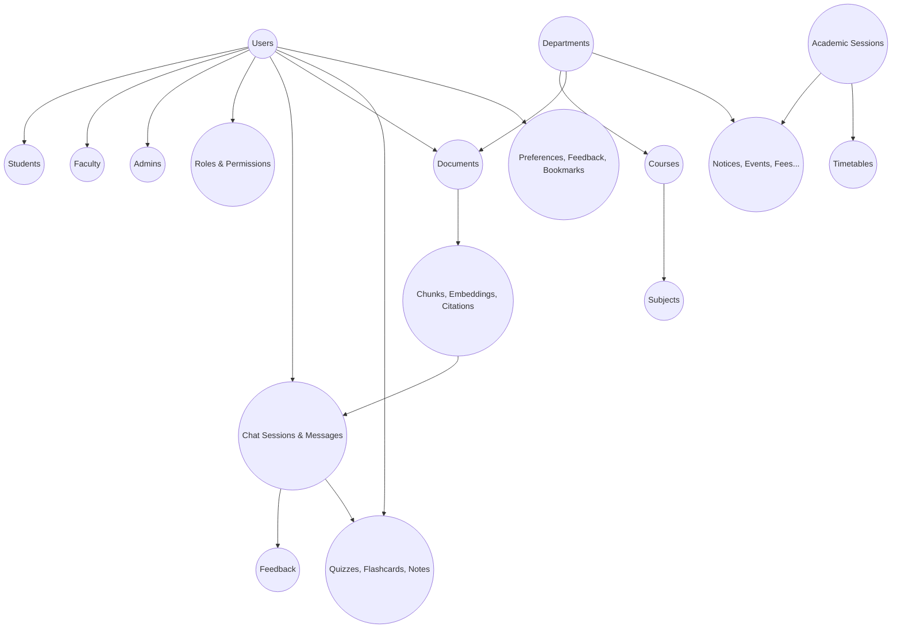

### 3.2 User Management ER Diagram

```mermaid
erDiagram
    USERS ||--o| STUDENTS : "has student profile"
    USERS ||--o| FACULTY : "has faculty profile"
    USERS ||--o| ADMINS : "has admin profile"
    USERS ||--o| USER_PREFERENCES : "has preferences"
    USERS ||--o{ USER_ROLES : "is assigned"
    USERS ||--o{ USER_SESSIONS : "has sessions"
    USERS ||--o{ OTP_RECORDS : "has OTPs"
    ROLES ||--o{ USER_ROLES : "assigned to"
    ROLES ||--o{ ROLE_PERMISSIONS : "grants"
    PERMISSIONS ||--o{ ROLE_PERMISSIONS : "granted by"
    DEPARTMENTS ||--o{ USERS : "employs/enrolls"
    DEPARTMENTS ||--o| FACULTY : "headed by"

    USERS {
        uuid user_id PK
        varchar email UK
        varchar password_hash
        varchar display_name
        enum user_type
        uuid department_id FK
        boolean is_active
        boolean is_verified
        timestamp deleted_at
    }

    STUDENTS {
        uuid student_id PK
        uuid user_id FK_UK
        varchar enrollment_number UK
        uuid course_id FK
        int current_year
        int current_semester
    }

    FACULTY {
        uuid faculty_id PK
        uuid user_id FK_UK
        varchar employee_id UK
        enum designation
        boolean is_hod
    }

    ADMINS {
        uuid admin_id PK
        uuid user_id FK_UK
        enum admin_level
        enum managed_scope
    }

    ROLES {
        uuid role_id PK
        varchar role_name UK
        enum role_type
        enum scope_type
        int hierarchy_level
    }

    PERMISSIONS {
        uuid permission_id PK
        varchar permission_key UK
        varchar resource
        enum action
    }

    ROLE_PERMISSIONS {
        uuid role_id FK_PK
        uuid permission_id FK_PK
    }

    USER_ROLES {
        uuid user_role_id PK
        uuid user_id FK
        uuid role_id FK
        uuid department_id FK
        uuid granted_by FK
        timestamp expires_at
    }

    USER_SESSIONS {
        uuid session_id PK
        uuid user_id FK
        varchar refresh_token_hash
        boolean is_active
        timestamp expires_at
    }

    OTP_RECORDS {
        uuid otp_id PK
        uuid user_id FK
        varchar otp_hash
        enum purpose
        int attempts
        timestamp expires_at
    }

    USER_PREFERENCES {
        uuid preference_id PK
        uuid user_id FK_UK
        enum theme
        enum language
        enum ai_response_length
    }

    DEPARTMENTS {
        uuid department_id PK
        varchar name
        varchar code UK
        uuid head_faculty_id FK
    }
```

### 3.3 Academic ER Diagram

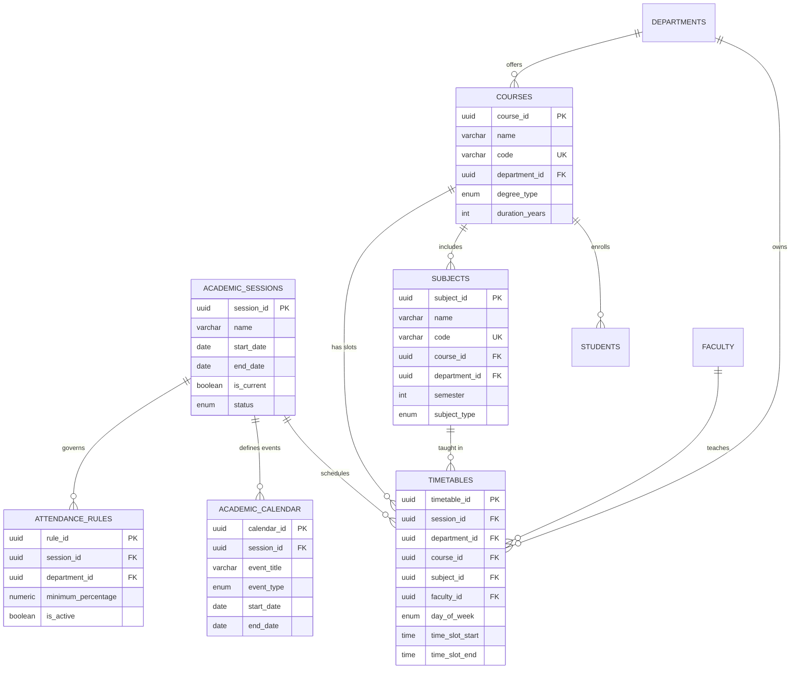

### 3.4 College Knowledge ER Diagram

```mermaid
erDiagram
    DEPARTMENTS ||--o{ NOTICES : "issues"
    DEPARTMENTS ||--o{ CIRCULARS : "issues"
    DEPARTMENTS ||--o{ EVENTS : "organizes"
    DEPARTMENTS ||--o{ LIBRARY_RESOURCES : "owns"
    ACADEMIC_SESSIONS ||--o{ HOSTEL_INFO : "governs"
    ACADEMIC_SESSIONS ||--o{ SCHOLARSHIPS : "offers"
    ACADEMIC_SESSIONS ||--o{ PLACEMENTS : "schedules"
    ACADEMIC_SESSIONS ||--o{ FEE_STRUCTURE : "defines"
    COURSES ||--o{ FEE_STRUCTURE : "priced for"
    SUBJECTS ||--o{ PREVIOUS_YEAR_PAPERS : "tested in"
    SUBJECTS ||--o{ LAB_MANUALS : "practiced in"
    SUBJECTS ||--o{ LECTURE_NOTES : "taught in"
    FACULTY ||--o{ LECTURE_NOTES : "authored by"
    DOCUMENTS ||--o| NOTICES : "sources"
    DOCUMENTS ||--o| CIRCULARS : "sources"
    DOCUMENTS ||--o| EVENTS : "sources"
    DOCUMENTS ||--|{ PREVIOUS_YEAR_PAPERS : "contains"
    DOCUMENTS ||--|{ LAB_MANUALS : "contains"
    DOCUMENTS ||--|{ LECTURE_NOTES : "contains"

    NOTICES {
        uuid notice_id PK
        varchar title
        enum notice_type
        enum priority
        uuid department_id FK
        date effective_date
        date expiry_date
        uuid source_document_id FK
        boolean is_published
    }

    CIRCULARS {
        uuid circular_id PK
        varchar reference_number UK
        varchar title
        uuid department_id FK
        uuid source_document_id FK
    }

    EVENTS {
        uuid event_id PK
        varchar title
        enum event_type
        timestamp start_datetime
        timestamp end_datetime
        uuid organizer_department_id FK
    }

    LIBRARY_RESOURCES {
        uuid resource_id PK
        varchar title
        varchar isbn UK
        enum resource_type
        uuid department_id FK
        uuid subject_id FK
    }

    HOSTEL_INFO {
        uuid hostel_info_id PK
        enum info_type
        varchar title
        uuid session_id FK
        uuid source_document_id FK
    }

    SCHOLARSHIPS {
        uuid scholarship_id PK
        varchar name
        enum scholarship_type
        uuid session_id FK
        jsonb eligibility_criteria
    }

    PLACEMENTS {
        uuid placement_id PK
        varchar company_name
        varchar role_title
        uuid session_id FK
        enum status
    }

    FEE_STRUCTURE {
        uuid fee_id PK
        uuid course_id FK
        uuid session_id FK
        int year
        enum fee_type
        numeric amount
    }

    POLICIES {
        uuid policy_id PK
        varchar title
        enum policy_type
        int version
        uuid source_document_id FK
    }

    PREVIOUS_YEAR_PAPERS {
        uuid paper_id PK
        uuid subject_id FK
        uuid session_id FK
        uuid document_id FK
    }

    LAB_MANUALS {
        uuid manual_id PK
        uuid subject_id FK
        uuid document_id FK
    }

    LECTURE_NOTES {
        uuid note_id PK
        uuid subject_id FK
        uuid faculty_id FK
        uuid document_id FK
    }
```

### 3.5 Document & RAG ER Diagram

```mermaid
erDiagram
    DOCUMENTS ||--o{ UPLOADS : "uploaded via"
    DOCUMENTS ||--o{ KNOWLEDGE_VERSIONS : "versioned as"
    DOCUMENTS ||--o{ DOCUMENT_TAGS : "tagged with"
    KNOWLEDGE_TAGS ||--o{ DOCUMENT_TAGS : "applied to"
    KNOWLEDGE_CATEGORIES ||--o{ DOCUMENTS : "categorizes"
    KNOWLEDGE_CATEGORIES ||--o{ KNOWLEDGE_CATEGORIES : "parent of"
    DOCUMENTS ||--o| PARSED_DOCUMENTS : "parsed into"
    DOCUMENTS ||--o{ CHUNKS : "split into"
    CHUNKS ||--|| EMBEDDINGS : "embedded as"
    CHUNKS ||--o{ CITATIONS : "cited in"
    MESSAGES ||--o{ CITATIONS : "references"
    DEPARTMENTS ||--o{ DOCUMENTS : "owns"
    USERS ||--o{ DOCUMENTS : "uploads"

    DOCUMENTS {
        uuid document_id PK
        uuid canonical_id
        int version
        varchar title
        enum file_type
        varchar content_hash
        uuid category_id FK
        enum access_level
        enum status
        boolean is_active_version
        varchar embedding_model
    }

    UPLOADS {
        uuid upload_id PK
        uuid document_id FK
        uuid user_id FK
        enum virus_scan_status
    }

    KNOWLEDGE_CATEGORIES {
        uuid category_id PK
        varchar name
        varchar slug UK
        uuid parent_category_id FK
        varchar path
    }

    KNOWLEDGE_TAGS {
        uuid tag_id PK
        varchar name
        varchar slug UK
        enum tag_type
    }

    DOCUMENT_TAGS {
        uuid document_id FK_PK
        uuid tag_id FK_PK
        numeric confidence_score
    }

    KNOWLEDGE_VERSIONS {
        uuid version_id PK
        uuid canonical_id
        uuid document_id FK
        int version_number
        boolean is_active
    }

    PARSED_DOCUMENTS {
        uuid parsed_id PK
        uuid document_id FK
        text raw_text
        jsonb structured_text
        enum parsing_method
    }

    CHUNKS {
        uuid chunk_id PK
        uuid document_id FK
        int chunk_index
        text content
        varchar content_hash
        int token_count
        enum chunk_type
        varchar hierarchy_path
        jsonb metadata
        enum status
    }

    EMBEDDINGS {
        uuid embedding_id PK
        uuid chunk_id FK_UK
        vector embedding_vector
        varchar embedding_model
        int dimensions
    }

    CITATIONS {
        uuid citation_id PK
        uuid message_id FK
        uuid chunk_id FK
        uuid document_id FK
        varchar document_title
        int page_number
        numeric relevance_score
        text snippet
    }
```

### 3.6 Chat ER Diagram

```mermaid
erDiagram
    USERS ||--o{ CHAT_SESSIONS : "owns"
    CHAT_SESSIONS ||--o{ MESSAGES : "contains"
    MESSAGES ||--o| AI_RESPONSES : "generated by AI"
    MESSAGES ||--o{ ATTACHMENTS : "has files"
    MESSAGES ||--o{ CITATIONS : "cites"
    SUBJECTS ||--o{ CHAT_SESSIONS : "mode for"
    USERS ||--o{ FEEDBACK : "gives"
    MESSAGES ||--o{ FEEDBACK : "about"
    AI_RESPONSES ||--o{ FEEDBACK : "about"

    CHAT_SESSIONS {
        uuid session_id PK
        uuid user_id FK
        varchar title
        enum session_type
        uuid subject_id FK
        enum study_mode
        enum language_preference
        boolean is_archived
        timestamp last_message_at
    }

    MESSAGES {
        uuid message_id PK
        uuid session_id FK
        uuid user_id FK
        enum role
        text content
        enum intent
        int sequence_number
        timestamp deleted_at
    }

    AI_RESPONSES {
        uuid response_id PK
        uuid message_id FK_UK
        varchar model_used
        varchar provider_used
        varchar prompt_id
        int tokens_input
        int tokens_output
        numeric cost_estimate
        int first_token_latency_ms
        boolean cache_hit
    }

    ATTACHMENTS {
        uuid attachment_id PK
        uuid message_id FK
        varchar file_name
        varchar mime_type
        bigint file_size_bytes
        varchar storage_path
    }

    FEEDBACK {
        uuid feedback_id PK
        uuid user_id FK
        uuid message_id FK
        uuid response_id FK
        enum feedback_type
        enum category
        text comment
    }
```

### 3.7 Learning ER Diagram

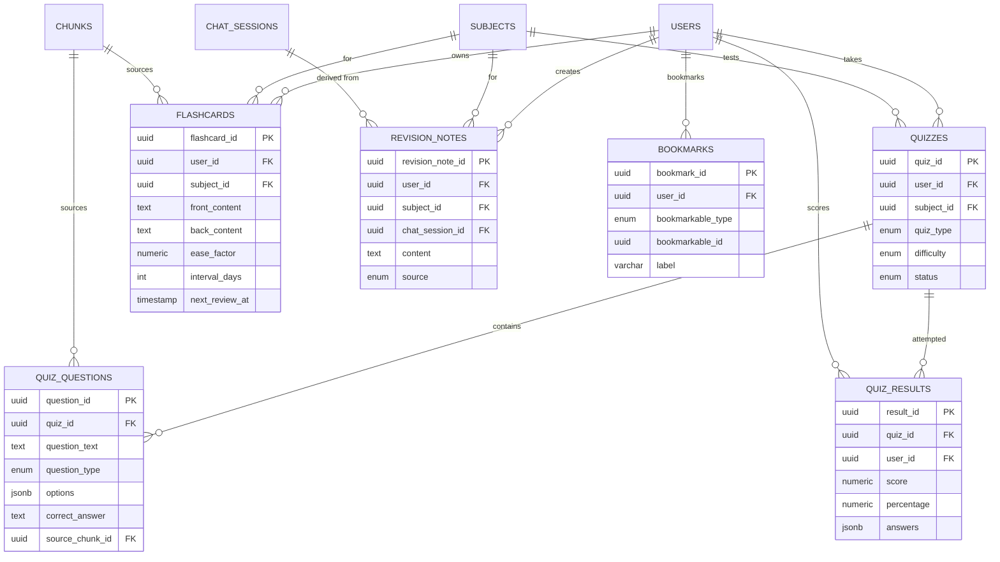

### 3.8 System ER Diagram

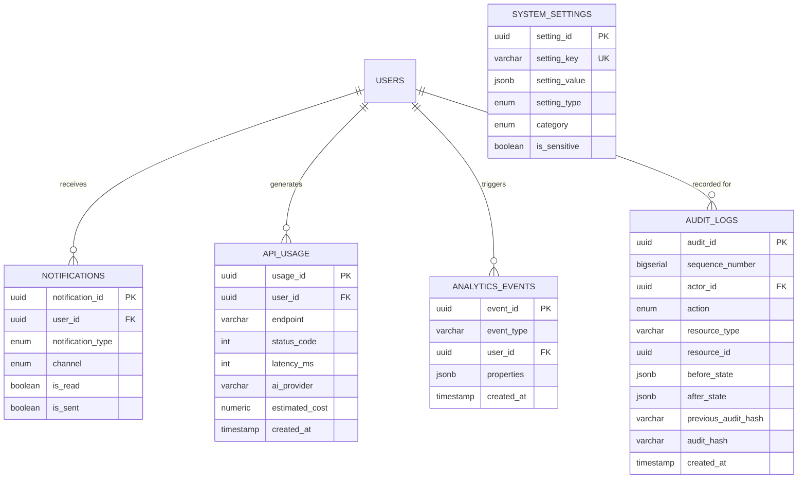

### 3.9 Relationship Type Summary

| Relationship | Type | Cascade on Delete | Why |
|-------------|------|-------------------|-----|
| Users → Students | One-to-One | CASCADE (soft) | Deleting a user logically deletes their student profile |
| Users → Faculty | One-to-One | CASCADE (soft) | Same |
| Users → Admins | One-to-One | CASCADE (soft) | Same |
| Users → UserPreferences | One-to-One | CASCADE | Preferences have no meaning without the user |
| Users → UserRoles | One-to-Many | CASCADE | Roles are cleared on user deletion |
| Users → UserSessions | One-to-Many | CASCADE | Sessions die with the user |
| Users → ChatSessions | One-to-Many | SET NULL (soft) | Chat history is retained for audit even if user is soft-deleted |
| Users → Documents | One-to-Many (uploaded_by) | RESTRICT | Cannot delete a user who uploaded documents; reassign first |
| Departments → Users | One-to-Many | SET NULL | Dissolving a department doesn't delete users |
| Departments → Courses | One-to-Many | RESTRICT | Cannot delete a department with active courses |
| Courses → Subjects | One-to-Many | RESTRICT | Cannot delete a course with active subjects |
| Courses → Students | One-to-Many | RESTRICT | Cannot delete a course with enrolled students |
| Documents → Chunks | One-to-Many | CASCADE | Deleting a document deletes all its chunks |
| Documents → Uploads | One-to-Many | CASCADE | Upload records go with the document |
| Chunks → Embeddings | One-to-One | CASCADE | Embedding is meaningless without its chunk |
| ChatSessions → Messages | One-to-Many | CASCADE (soft) | Soft-deleting a session soft-deletes its messages |
| Messages → AIResponses | One-to-One | CASCADE | AI metadata goes with the message |
| Messages → Attachments | One-to-Many | CASCADE | Attachments go with the message |
| Messages → Citations | One-to-Many | CASCADE | Citations go with the message |
| Quizzes → QuizQuestions | One-to-Many | CASCADE | Questions go with the quiz |
| Quizzes → QuizResults | One-to-Many | CASCADE | Results go with the quiz |
| Roles → RolePermissions | One-to-Many | CASCADE | Permissions are cleared when a role is deleted |
| KnowledgeCategories → KnowledgeCategories | Self-ref (parent) | RESTRICT | Cannot delete a category with children; reparent first |

### 3.10 Key Constraints

| Constraint | Table | Columns | Type | Why |
|-----------|-------|---------|------|-----|
| One current session | AcademicSessions | `is_current` WHERE `is_current = TRUE` | Partial unique | Exactly one academic session is current at any time |
| One active version per doc | Documents | `canonical_id` WHERE `is_active_version = TRUE` | Partial unique | Each logical document has exactly one active version |
| Unique fee per type | FeeStructure | `(course_id, session_id, year, fee_type)` | Unique | No duplicate fee entries |
| No duplicate bookmarks | Bookmarks | `(user_id, bookmarkable_type, bookmarkable_id)` | Unique | A user can't bookmark the same thing twice |
| No duplicate tags | DocumentTags | `(document_id, tag_id)` | PK composite | Each tag applied once per document |
| No duplicate role assignment | UserRoles | `(user_id, role_id, department_id)` | Unique | Same role not assigned twice for the same scope |
| Positive fee amounts | FeeStructure | `amount > 0` | Check | Fees cannot be zero or negative |
| Valid percentage | AttendanceRules | `minimum_percentage BETWEEN 0 AND 100` | Check | Percentage must be valid |
| Valid token counts | AIResponses | `tokens_input >= 0 AND tokens_output >= 0` | Check | Token counts cannot be negative |
| Audit immutability | AuditLogs | — | Rule/trigger | UPDATE and DELETE are rejected at the database level |

---

## Section 4 — RAG Data Model

### 4.1 RAG Data Flow — End to End

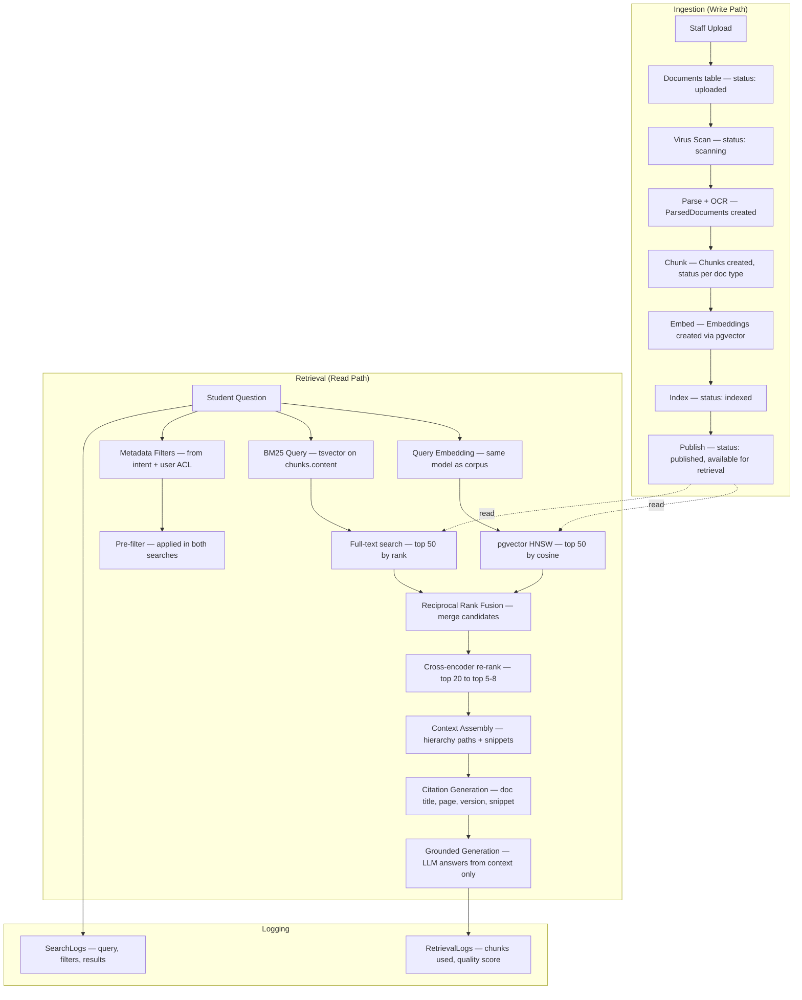

### 4.2 ParsedDocuments

**Purpose:** The intermediate representation between a raw file and its chunks. Stores the full extracted text, structured content (headings, tables, lists as JSON), per-page text, and parsing metadata. One ParsedDocuments row per document version. This entity exists so that re-chunking (e.g., with a new chunking strategy) doesn't require re-parsing the raw file.

**Key attributes:**
- `parsed_id` — UUID, primary key.
- `document_id` — FK to Documents.
- `raw_text` — Text. Full extracted text, unstructured.
- `structured_text` — JSONB. Preserves document structure: `{ headings: [...], paragraphs: [...], tables: [...], lists: [...] }`. This is what the chunker reads.
- `page_texts` — JSONB. Array of per-page text for page-number citation.
- `detected_language` — Enum: `en`, `hi`, `en_hi`.
- `table_count` — Integer. Number of detected tables.
- `image_count` — Integer. Number of detected images.
- `ocr_applied` — Boolean. Whether OCR was needed.
- `ocr_method` — Enum: `none`, `local`, `cloud`, `hybrid`, nullable.
- `ocr_confidence_avg` — Numeric, nullable. Average OCR confidence across pages.
- `low_confidence_pages` — Integer array, nullable. Page numbers that required cloud OCR.
- `parsing_duration_ms` — Integer.
- `parsing_error` — Text, nullable.
- `parsed_at` — Timestamptz.
- `created_at`.

### 4.3 Chunks

**Purpose:** The atomic unit of retrieval. Each chunk is a semantically coherent segment of a document — a heading with its body, a table, a slide, or a question from an exam paper. Chunks are what get embedded, searched, retrieved, and cited. Chunk quality is the single largest determinant of answer quality in the entire RAG system.

**Key attributes (detail from Section 2):**
- `chunk_id` — UUID, primary key.
- `document_id` — FK to Documents.
- `parsed_id` — FK to ParsedDocuments.
- `chunk_index` — Integer. Position within the document (0-based).
- `content` — Text. The chunk text.
- `content_hash` — Varchar(64). SHA-256 of content. For deduplication and change detection.
- `token_count` — Integer. Token count per the embedding model's tokenizer.
- `chunk_type` — Enum: `prose`, `table`, `heading_section`, `slide`, `question`, `summary`, `list`, `mixed`.
- `hierarchy_path` — Text. E.g., `"Hostel Rules > Section 3 > Curfew Timings"`. Prepended at retrieval time for LLM context.
- `page_number` — Integer, nullable. Source page for citation.
- `page_number_end` — Integer, nullable. If chunk spans pages.
- `start_char_offset` — Integer. Start position in the raw text.
- `end_char_offset` — Integer. End position in the raw text.
- `table_json` — JSONB, nullable. For table chunks: structured `{ headers: [...], rows: [[...], ...] }`.
- `metadata` — JSONB. Denormalized filterable attributes for vector search pre-filtering:

```json
{
  "category": "examination",
  "department": "CS",
  "audience": "students",
  "course_code": "BSC-CS",
  "subject_code": "CS302",
  "year": 2,
  "semester": 3,
  "effective_date": "2025-07-01",
  "expiry_date": null,
  "access_level": "public",
  "language": "en",
  "doc_type": "notice",
  "doc_version": 2
}
```

- `status` — Enum: `active`, `superseded`, `deleted`.
- `embedding_model` — Varchar. Which model generated the embedding for this chunk.
- `created_at`, `updated_at`.

**Why JSONB metadata on the chunk:** Retrieval pre-filtering must be fast. A JSONB column with GIN indexes on the filterable keys allows the vector search query to include `WHERE metadata->>'category' = 'examination' AND (metadata->>'expiry_date')::date > NOW()` alongside the `ORDER BY embedding <=> query_vector` without a cross-table join. This is the standard pattern for filtered vector search in pgvector.

### 4.4 Embeddings

**Purpose:** Vector representations of chunks for similarity search. Stored via pgvector's `vector` type. One embedding per chunk (one-to-one). Separated from Chunks for two reasons: (1) the vector column is large and bloats sequential scans of chunk metadata; (2) embedding model upgrades re-embed into a shadow table before atomic swap.

**Key attributes:**
- `embedding_id` — UUID, primary key.
- `chunk_id` — FK to Chunks, UNIQUE. One-to-one.
- `embedding_vector` — `vector(dimensions)`. The actual embedding. Dimensionality matches the embedding model (e.g., 768 or 1536).
- `embedding_model` — Varchar. E.g., `text-embedding-3-small`.
- `embedding_model_version` — Varchar. E.g., `v1.2`.
- `dimensions` — Integer. E.g., 1536.
- `created_at`.

**Embedding model upgrade procedure:** Generate new embeddings into a shadow Embeddings table (`embeddings_v2`). Validate retrieval quality against golden datasets. If quality meets or exceeds the incumbent, atomically rename tables (`embeddings` → `embeddings_v1_retired`, `embeddings_v2` → `embeddings`). This ensures zero downtime and never serves mixed-model vectors (mixing destroys cosine comparability).

### 4.5 Metadata & Filtering

Metadata filtering is fused with vector search — it happens *inside* the database query, not as a post-filter in application code. This is critical because post-filtering can empty the result set (retrieve 50 vectors, filter to 0 matches). Pre-filtering narrows the search space before the HNSW traversal.

**Filterable metadata fields and their sources:**

| Filter Field | Source | Used When |
|-------------|--------|-----------|
| `category` | KnowledgeCategories via Documents | Always — narrows to relevant content type |
| `department` | Departments via Documents | When user's department is known or question mentions one |
| `audience` | Documents.audience | Always — students never see faculty-only content |
| `course_code` | Documents → linked entity | When question mentions a specific course |
| `subject_code` | Documents → linked entity | When question mentions a specific subject |
| `effective_date` | Documents.effective_date | Always — exclude not-yet-effective content |
| `expiry_date` | Documents.expiry_date | Always — exclude expired content by default |
| `access_level` | Documents.access_level | Always — RBAC enforcement |
| `language` | Documents.language | When user has a language preference |
| `status` | Chunks.status | Always — only `active` chunks are retrieved |

### 4.6 Citations

**Purpose:** Source references attached to AI-generated knowledge answers. Every knowledge answer must cite its sources (P6/P7 from System Architecture). Each citation links a specific message to a specific chunk in a specific document version, with the snippet and relevance score. Citations are rendered both inline (footnotes) and as a sources panel in the UI.

**Key attributes (from Section 2.5 ER):**
- `citation_id` — UUID, primary key.
- `message_id` — FK to Messages. The AI message that contains this citation.
- `chunk_id` — FK to Chunks. The specific chunk cited.
- `document_id` — FK to Documents. The source document.
- `document_title` — Text. Denormalized for display without join.
- `document_version` — Integer. Which version was cited.
- `page_number` — Integer, nullable. Specific page.
- `chunk_index` — Integer. Position in the document.
- `relevance_score` — Numeric. The re-ranker's score for this chunk.
- `snippet` — Text. The relevant excerpt from the chunk.
- `citation_order` — Integer. Display order in the answer (1st citation, 2nd, etc.).
- `source_url` — Text, nullable. Direct link to the source document.
- `created_at`.

### 4.7 SearchLogs

**Purpose:** Every retrieval query is logged — the query text, intent classification, filters applied, how many results each stage produced, whether it was a cache hit, and total retrieval latency. This drives retrieval quality analytics: low-result queries reveal coverage gaps; high-latency queries reveal performance problems; cache-hit rates inform cache tuning.

**Key attributes:**
- `search_id` — UUID, primary key.
- `user_id` — FK to Users.
- `chat_session_id` — FK to ChatSessions, nullable.
- `message_id` — FK to Messages, nullable.
- `query_text` — Text. The original question.
- `query_expanded` — Text, nullable. The query after expansion/rewriting.
- `intent` — Enum: `academic`, `knowledge`, `mixed`, `conversational`, `out_of_scope`.
- `intent_confidence` — Numeric.
- `filters_applied` — JSONB. The metadata filters used.
- `vector_candidates` — Integer. Results from vector search before fusion.
- `bm25_candidates` — Integer. Results from BM25 before fusion.
- `fused_candidates` — Integer. After RRF fusion.
- `reranked_results` — Integer. After cross-encoder re-ranking.
- `final_chunks_used` — Integer. Chunks actually included in the LLM context.
- `top_chunk_ids` — UUID array. IDs of the final chunks.
- `top_relevance_scores` — Numeric array. Scores of the final chunks.
- `cache_hit` — Boolean. Whether the semantic cache served this query.
- `retrieval_duration_ms` — Integer.
- `created_at` — Timestamptz. **Partition key.**

### 4.8 RetrievalLogs

**Purpose:** Per-answer retrieval quality tracking. After the LLM generates an answer, this log records which chunks were retrieved, which were actually used in the answer, how many citations were generated, and whether evidence was found. Combined with user feedback, this is the primary dataset for evaluating and improving retrieval quality.

**Key attributes:**
- `retrieval_id` — UUID, primary key.
- `search_id` — FK to SearchLogs.
- `message_id` — FK to Messages.
- `chunks_retrieved` — JSONB. Array of `{ chunk_id, score, rank }`.
- `chunks_used_in_answer` — UUID array. Subset actually referenced by the LLM.
- `citation_count` — Integer.
- `evidence_found` — Boolean. FALSE = the system said "I don't have that in the knowledge base."
- `retrieval_quality_score` — Numeric, nullable. Auto-evaluated by the evaluation harness.
- `feedback_type` — Enum: `thumbs_up`, `thumbs_down`, `none`.
- `created_at`.

---

## Section 5 — Chat Data Model

### 5.1 Chat Data Flow

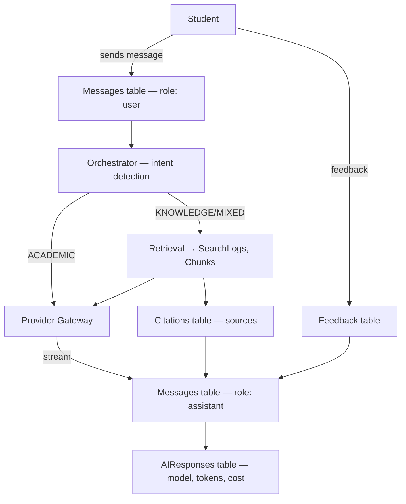

### 5.2 ChatSessions (Conversations)

**Purpose:** A conversation container. Each chat session represents one coherent interaction thread — like a ChatGPT conversation. Sessions carry mode settings (subject, study mode, language) that persist across messages within the session. Sessions can be pinned, archived, titled, and searched.

**Key attributes (from Section 2.7):**

- `session_id` — UUID, primary key.
- `user_id` — FK to Users.
- `title` — Text, nullable. Auto-generated from the first message or user-set.
- `session_type` — Enum: `academic`, `knowledge`, `general`, `mixed`. The dominant intent type of this conversation.
- `subject_id` — FK to Subjects, nullable. If the student selected a specific subject mode ("I'm studying CS302").
- `study_mode` — Enum: `learn`, `practice`, `revise`, `quiz`, nullable. Influences AI response style and tool selection.
- `language_preference` — Enum: `en`, `hi`, `en_hi`. Overrides the user's global preference for this session.
- `is_pinned` — Boolean, default FALSE.
- `is_archived` — Boolean, default FALSE.
- `last_message_at` — Timestamptz. Denormalized for sort-by-recent.
- `message_count` — Integer, default 0. Denormalized for display.
- `total_tokens_used` — Integer, default 0. Running total for cost tracking.
- `total_cost_estimate` — Numeric, default 0.
- `summary` — Text, nullable. Compressed summary of older messages (for context window management).
- `summary_up_to_sequence` — Integer, nullable. Messages up to this sequence number are summarized.
- `created_at`, `updated_at`, `deleted_at`.

### 5.3 Messages

**Purpose:** Individual turns in a conversation. Each message is either a user message (`role: user`), an AI response (`role: assistant`), or a system message (`role: system`). Messages are ordered by `sequence_number` within a session. User messages carry the raw input; assistant messages carry the AI output with citations.

**Key attributes:**
- `message_id` — UUID, primary key.
- `session_id` — FK to ChatSessions.
- `user_id` — FK to Users, nullable (NULL for assistant/system messages).
- `role` — Enum: `user`, `assistant`, `system`.
- `content` — Text. The message content (markdown for assistant messages).
- `content_format` — Enum: `text`, `markdown`, `latex`. Rendering hint.
- `intent` — Enum: `academic`, `knowledge`, `mixed`, `conversational`, `out_of_scope`, nullable. Classified intent for this turn.
- `intent_confidence` — Numeric, nullable.
- `parent_message_id` — FK to Messages (self-ref), nullable. For explicit threading (e.g., "regenerate this response").
- `is_edited` — Boolean, default FALSE.
- `original_content` — Text, nullable. If edited, the original text.
- `edited_at` — Timestamptz, nullable.
- `sequence_number` — Integer. Monotonically increasing within the session.
- `created_at`, `deleted_at`.

**Partitioning:** Messages are range-partitioned by `created_at` (monthly). This keeps the hot partition (current month) small and fast, while older partitions are accessed less frequently and can be archived.

### 5.4 AIResponses

**Purpose:** Metadata about how the AI generated a specific assistant message. One-to-one with assistant Messages. This is the observability and cost-tracking record: which model served the response, how many tokens were used, what it cost, how fast the first token arrived, whether the cache was hit. Essential for model comparison, cost attribution, and quality tracking.

**Key attributes:**
- `response_id` — UUID, primary key.
- `message_id` — FK to Messages, UNIQUE.
- `model_used` — Varchar. E.g., `claude-3.5-sonnet`.
- `provider_used` — Varchar. E.g., `anthropic`, `openai`, `groq`.
- `prompt_id` — Varchar. The prompt template ID (from the Prompt Manager).
- `prompt_version` — Varchar. E.g., `knowledge-grounded-v7`.
- `system_prompt_tokens` — Integer. Tokens in the system prompt.
- `context_tokens` — Integer. Tokens in the retrieved context (chunks).
- `history_tokens` — Integer. Tokens in the conversation history.
- `tokens_input` — Integer. Total input tokens.
- `tokens_output` — Integer. Output tokens.
- `total_tokens` — Integer. Sum.
- `cost_estimate` — Numeric(10,6). Estimated cost in USD.
- `first_token_latency_ms` — Integer. Time to first token.
- `total_latency_ms` — Integer. Total generation time.
- `finish_reason` — Enum: `stop`, `length`, `tool_call`, `content_filter`, `error`.
- `safety_filtered` — Boolean, default FALSE.
- `cache_hit` — Boolean, default FALSE.
- `retrieval_used` — Boolean. Whether the knowledge retrieval pipeline was invoked.
- `tools_used` — JSONB, nullable. Array of tool names invoked: `["knowledge_search", "calculator"]`.
- `temperature` — Numeric.
- `max_tokens` — Integer.
- `fallback_used` — Boolean, default FALSE. Whether a fallback model/provider was used.
- `fallback_reason` — Text, nullable.
- `created_at`.

### 5.5 Attachments

**Purpose:** Files attached to user messages — images of handwritten problems, screenshots, PDFs to ask about. Stored in object storage; metadata in this table. Attachments are not ingested into the RAG pipeline (they're ephemeral, per-message context).

**Key attributes (from Section 2.7):**
- `attachment_id` — UUID, primary key.
- `message_id` — FK to Messages.
- `file_name` — Text.
- `file_type` — Varchar. Extension.
- `mime_type` — Varchar.
- `file_size_bytes` — Bigint.
- `storage_path` — Text. Object storage key.
- `thumbnail_path` — Text, nullable. For image previews.
- `is_processed` — Boolean. Whether the attachment was processed (OCR'd for text extraction) for the AI.
- `extracted_text` — Text, nullable. OCR/extraction result.
- `created_at`.

### 5.6 Streaming Status

Streaming status is **not stored in the database**. It is ephemeral, real-time state managed via Redis pub/sub:

- When generation starts: a Redis key `stream:{message_id}` is set with status `generating`.
- Token events are published on a Redis channel `stream:{session_id}`.
- When generation completes: the key is updated to `complete`, the final message is persisted to Postgres, and the Redis key expires.
- If the client disconnects mid-stream: the Redis key TTL ensures cleanup; the partial message is discarded (generation is stateless and idempotent).

**Why not in the database:** streaming is sub-second, high-frequency state. Persisting every token event to Postgres would be wasteful and slow. Redis pub/sub is the right tool for ephemeral real-time state; Postgres is the right tool for durable state.

### 5.7 Conversation Context & Memory (Data Perspective)

Two tiers of memory, as specified in the System Architecture (Section 2.5):

**Short-term working context** — stored in Redis, keyed by `session:{session_id}`:
```json
{
  "last_intent": "KNOWLEDGE",
  "referenced_entities": ["CS302", "3rd year", "timetable"],
  "referenced_doc_ids": ["uuid1", "uuid2"],
  "recent_turns": [/* last 5-10 turns, compressed */],
  "filters_carried": { "department": "CS", "year": 3 }
}
```
TTL: session inactivity timeout (30 minutes). Rebuilt from Postgres on cache miss.

**Long-term semantic memory** — stored in the `UserPreferences` table (and optionally a dedicated `UserMemory` table if complexity warrants it):
- Durable facts about the user: "2nd-year BSc CS student", "interested in machine learning", "prefers Hindi explanations".
- Opt-in, user-viewable, user-editable.
- Injected as a small context block into every prompt for personalization.
- Never used to answer factual questions — only to filter and personalize.

---

## Section 6 — Indexing Strategy

### 6.1 Primary Keys

All primary keys are **UUIDv7** — time-sortable UUIDs that provide:
- **Global uniqueness** without coordination (no sequence collisions across replicas or services).
- **Time-sortability** — UUIDv7 embeds a timestamp, so a B-tree index on the PK is also approximately sorted by creation time. This improves insert performance (new rows append to the end of the index) and enables efficient time-range scans on the PK.
- **Non-guessable** — unlike auto-increment integers, UUIDs don't leak entity counts or allow enumeration attacks.

### 6.2 Unique Keys

| Table | Column(s) | Purpose |
|-------|-----------|---------|
| Users | `email` | Login identifier; must be unique |
| Students | `enrollment_number` | College-wide unique student ID |
| Students | `user_id` | One-to-one with Users |
| Faculty | `employee_id` | College-wide unique employee ID |
| Faculty | `user_id` | One-to-one |
| Admins | `user_id` | One-to-one |
| UserPreferences | `user_id` | One-to-one |
| Departments | `code` | Short codes must be unique |
| Courses | `code` | Course codes must be unique |
| Subjects | `code` | Subject codes must be unique |
| KnowledgeCategories | `slug` | URL-safe identifier |
| KnowledgeTags | `slug` | URL-safe identifier |
| Circulars | `reference_number` | Official circular numbers |
| LibraryResources | `isbn` (partial, WHERE NOT NULL) | ISBNs are globally unique |
| Embeddings | `chunk_id` | One-to-one with Chunks |
| AIResponses | `message_id` | One-to-one with Messages |
| SystemSettings | `setting_key` | Configuration keys |
| Documents | `(canonical_id)` WHERE `is_active_version = TRUE` | One active version per logical document |
| AcademicSessions | `(is_current)` WHERE `is_current = TRUE` | Exactly one current session |

### 6.3 Composite Indexes

| Table | Columns | Purpose |
|-------|---------|---------|
| Messages | `(session_id, sequence_number)` | Retrieve messages in order for a conversation |
| Messages | `(session_id, created_at)` | Time-based message retrieval |
| Messages | `(user_id, created_at)` | User's message history |
| ChatSessions | `(user_id, last_message_at DESC)` | User's recent conversations |
| ChatSessions | `(user_id, is_archived, last_message_at DESC)` | User's active conversations |
| Chunks | `(document_id, chunk_index)` | Ordered chunks within a document |
| Chunks | `(document_id, status)` | Active chunks for a document |
| Citations | `(message_id, citation_order)` | Ordered citations for a message |
| Timetables | `(session_id, course_id, year, semester, day_of_week)` | Timetable lookup for a specific class |
| FeeStructure | `(course_id, session_id, year, fee_type)` UNIQUE | Unique fee entry |
| UserRoles | `(user_id, role_id, department_id)` UNIQUE | Unique role assignment |
| DocumentTags | `(document_id, tag_id)` PK | Tag assignment |
| Bookmarks | `(user_id, bookmarkable_type, bookmarkable_id)` UNIQUE | No duplicate bookmarks |
| Notifications | `(user_id, is_read, created_at DESC)` | Unread notifications |
| SearchLogs | `(user_id, created_at)` | User's search history |
| AuditLogs | `(resource_type, resource_id, created_at)` | Audit trail for a specific resource |
| AuditLogs | `(actor_id, created_at)` | Audit trail for a specific user |

### 6.4 Full-Text Search Indexes

| Table | Column | Index Type | Language Config | Purpose |
|-------|--------|-----------|----------------|---------|
| Chunks | `content` | GIN on `to_tsvector('english', content)` | English (+ Hindi via custom config) | BM25 retrieval for the RAG pipeline |
| Documents | `title` | GIN on `to_tsvector('english', title)` | English | Document search in the admin portal |
| Notices | `title \|\| ' ' \|\| content` | GIN | English | Notice search |
| LibraryResources | `title \|\| ' ' \|\| author` | GIN | English | Library catalog search |
| Messages | `content` | GIN on `to_tsvector('english', content)` | English | Chat history search |

**Why PostgreSQL FTS over Elasticsearch:** at our scale, PostgreSQL's built-in tsvector/tsquery with ranking is sufficient for BM25 retrieval. It avoids a separate system, separate backup, separate ops. The upgrade path to Elasticsearch/OpenSearch is documented if FTS query volume or features (faceting, complex aggregations) outgrow Postgres.

**Hindi/multilingual support:** PostgreSQL's FTS supports custom dictionaries and configurations. A custom text search configuration combining the `simple` dictionary (for Hindi, which lacks stemming support in PostgreSQL) with the `english` dictionary covers the English+Hindi mixed corpus. For advanced Hindi NLP (stemming, synonyms), a preprocessing step normalizes Hindi text before insertion.

### 6.5 Vector Indexes (HNSW)

| Table | Column | Index Type | Parameters | Purpose |
|-------|--------|-----------|-----------|---------|
| Embeddings | `embedding_vector` | HNSW (pgvector) | `m=16, ef_construction=200` | Approximate nearest-neighbor search for semantic retrieval |

**HNSW parameter rationale:**
- `m=16` — Number of bi-directional links per node. 16 is the standard balance between recall and index size.
- `ef_construction=200` — Construction-time search depth. Higher = better recall, slower index build. 200 is generous (we build once, query millions of times).
- `ef_search=100–400` — Query-time search depth. Set at query time, not index time. Higher values increase recall at the cost of latency. Tuned per deployment based on recall vs. latency requirements. Start at 100; increase if retrieval quality metrics (Section 9) show missed relevant chunks.

**Distance metric:** Cosine distance (`vector_cosine_ops`) — the standard for text embeddings from transformer models.

**Filtered vector search:** pgvector supports WHERE clauses alongside HNSW search. Metadata filters from `chunks.metadata` (JSONB) are applied as part of the query, not as a post-filter. This is essential: post-filtering can empty the result set.

### 6.6 Partial Indexes

| Table | Condition | Columns | Purpose |
|-------|-----------|---------|---------|
| Documents | `WHERE is_active_version = TRUE` | `canonical_id` (UNIQUE) | Enforce one active version per logical document |
| Documents | `WHERE status = 'published'` | `category_id, department_id` | Fast lookups of published documents only |
| AcademicSessions | `WHERE is_current = TRUE` | `is_current` (UNIQUE) | Enforce exactly one current session |
| Chunks | `WHERE status = 'active'` | `document_id, chunk_index` | Retrieval only queries active chunks |
| Notifications | `WHERE is_read = FALSE` | `user_id, created_at` | Unread notification count/listing |
| UserSessions | `WHERE is_active = TRUE` | `user_id` | Active session lookups |
| OTPRecords | `WHERE is_used = FALSE AND expires_at > NOW()` | `user_id, purpose` | Valid OTP lookups |

**Why partial indexes:** they index only the rows that matter for a specific query pattern, reducing index size and improving write performance (fewer index entries to maintain). For example, the active-chunks partial index excludes all superseded and deleted chunks — potentially 80%+ of the table — from the index.

### 6.7 JSONB Indexes

| Table | Column | Path | Index Type | Purpose |
|-------|--------|------|-----------|---------|
| Chunks | `metadata` | `->>'category'` | B-tree on expression | Pre-filter by category |
| Chunks | `metadata` | `->>'department'` | B-tree on expression | Pre-filter by department |
| Chunks | `metadata` | `->>'access_level'` | B-tree on expression | ACL enforcement |
| Chunks | `metadata` | `->>'audience'` | GIN | Audience filtering (JSONB contains) |
| Chunks | `metadata` | Full JSONB | GIN | General metadata queries |
| AnalyticsEvents | `properties` | Full JSONB | GIN | Analytics queries |

### 6.8 Performance Optimization Summary

| Optimization | Mechanism | Tables Affected |
|-------------|-----------|-----------------|
| **Avoid sequential scans on hot tables** | Composite indexes on all query patterns | Messages, Chunks, Embeddings |
| **Reduce index bloat** | Partial indexes exclude dead/superseded rows | Chunks, Documents, Sessions |
| **Fast aggregations** | Denormalized counters (message_count, document_count, download_count) | ChatSessions, KnowledgeCategories, LibraryResources |
| **Minimize TOAST overhead** | Separate large text (raw_text, content) from metadata columns when possible | ParsedDocuments, Chunks |
| **Connection efficiency** | Connection pooler (PgBouncer) with transaction-mode pooling | All tables |
| **Read distribution** | Read replicas for retrieval metadata and analytics queries | Chunks, Documents, Analytics |

---

## Section 7 — Data Governance

### 7.1 Soft Delete

**Default policy:** Every user-facing entity supports soft delete via a `deleted_at` timestamp column. A soft-deleted record:

- Is excluded from all default queries (application-level `WHERE deleted_at IS NULL` filter, enforced via views or ORM default scopes).
- Remains in the database for the retention period.
- Can be restored during a grace period (90 days for most entities).
- Is physically purged by a scheduled retention job after the retention period.

**Entities with soft delete:** Users, Students, Faculty, Admins, ChatSessions, Messages, Notices, Circulars, Events, HostelInfo, Scholarships, Placements, Policies, RevisionNotes, Documents.

**Entities WITHOUT soft delete (append-only or ephemeral):**
- AuditLogs — never deleted (append-only, compliance).
- APIUsage, AnalyticsEvents, SearchLogs, RetrievalLogs — purged by retention job, not soft-deleted (high-volume, no "undo" use case).
- OTPRecords, UserSessions — purged by expiry, not soft-deleted.
- Embeddings — deleted when parent Chunk is deleted (cascade).

### 7.2 Hard Delete

Hard delete (physical row removal) occurs only in these scenarios:

1. **Retention job execution** — soft-deleted records past their retention window are physically purged by a nightly batch job.
2. **Data privacy erasure** — upon a verified erasure request (DPDP compliance), a user's personal data is physically deleted or anonymized within the compliance window.
3. **Ephemeral data expiry** — OTP records, expired sessions, and orphaned uploads are purged on schedule.
4. **Super Admin hard delete** — only Super Admins can trigger immediate hard delete of documents (e.g., accidentally uploaded confidential material). Hard deletes are logged to AuditLogs before execution.

**Hard delete procedure:**
1. Verify authorization (Super Admin or system retention job).
2. Write an audit log entry recording what will be deleted and why.
3. Delete associated object-storage files.
4. Delete database rows in dependency order (embeddings → chunks → parsed_documents → documents).
5. Verify deletion.

### 7.3 Archiving

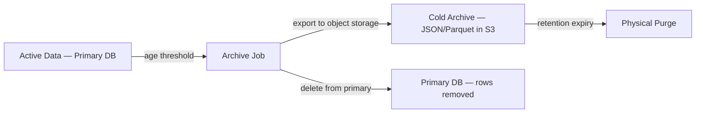

**Archiving strategy by data class:**

| Data Class | Archive Trigger | Archive Format | Restore Capability |
|-----------|----------------|----------------|-------------------|
| Chat messages | > 2 years old | JSONL in object storage | On-demand restore to staging for investigation |
| Analytics events | > 6 months old | Parquet in object storage (queryable via data warehouse) | Query via warehouse |
| API usage logs | > 6 months old | Parquet | Query via warehouse |
| Search/retrieval logs | > 6 months old | Parquet | Query via warehouse |
| Audit logs | > 1 year old | JSON in object-locked storage | Compliance export |
| Superseded documents + chunks | > 1 year after supersession | Document metadata JSON + embeddings binary | Re-index if needed |

### 7.4 Version Control

**Document versioning model:**
- Every document has a `canonical_id` (the logical document identity) and a `version` (monotonically increasing integer).
- Uploading a new version of a document creates a new `Documents` row with the same `canonical_id` and an incremented `version`.
- The `is_active_version` flag designates the current version; swapped atomically in a SERIALIZABLE transaction.
- Old versions are marked `superseded` but retained for historical queries and audit.
- The `KnowledgeVersions` table provides a changelog (who changed what, when, and why).

**What is versioned:**
- Documents (content + metadata)
- Policies (version number + effective dates)
- System settings (audit trail of changes)
- Prompt templates (via the Prompt Manager, not in the database — but prompt_id + version are recorded in AIResponses)

**What is NOT versioned (immutable or append-only):**
- Chat messages (immutable once created; edits store original in `original_content`)
- Audit logs (append-only, never modified)
- Embeddings (replaced atomically during model upgrades, not versioned per-embedding)

### 7.5 Audit History

**Coverage:** Every state change to a privileged resource writes to AuditLogs. "Privileged resource" includes:
- Documents (create, update, delete, approve, reject, publish, archive, supersede)
- Users (create, update, deactivate, delete)
- Roles and permissions (grant, revoke, modify)
- System settings (any change)
- Admin actions (bulk operations, re-indexing triggers)
- Authentication events (login, logout, failed login, session revocation)

**Hash chain integrity:**
- Each audit record computes its `audit_hash` from all its fields concatenated with `previous_audit_hash`.
- The chain starts with a genesis record (previous_audit_hash = a known seed value).
- Verification: walk the chain and recompute hashes. A mismatch at any point indicates tampering.
- Verification runs as a scheduled job (daily) and on-demand by Super Admins.

**Audit retention:** 7 years (compliance requirement for educational institutions). After 1 year in the primary database, audit records are archived to object-locked storage (cannot be deleted, even by the storage administrator, until the lock expires).

### 7.6 Retention Policies

| Data Class | Retention Period | Purge Method | Authority |
|-----------|-----------------|-------------|-----------|
| Active user accounts | Indefinite | — | — |
| Soft-deleted user accounts | 90 days | Hard delete + anonymize | System retention job |
| Chat messages (active users) | 5 years | Archive at 2y, purge at 5y | System retention job |
| Chat messages (deleted users) | 90 days post-deletion | Hard delete | System retention job |
| Document chunks (active) | Indefinite while document is active | — | — |
| Document chunks (superseded) | 3 years | Archive at 1y, purge at 3y | System retention job |
| Audit logs | 7 years minimum | Archive at 1y, retain in cold storage | Compliance policy |
| Analytics events | 2.5 years | Archive at 6m, purge at 2.5y | System retention job |
| API usage logs | 1.5 years | Archive at 6m, purge at 1.5y | System retention job |
| Search/retrieval logs | 1 year | Archive at 6m, purge at 1y | System retention job |
| OTP records | 24 hours | Hard delete | System cleanup job |
| Expired sessions | 24 hours post-expiry | Hard delete | System cleanup job |
| Orphaned uploads (no document) | 30 days | Hard delete + remove from object storage | System cleanup job |
| Notification records | 1 year | Hard delete | System cleanup job |

### 7.7 Data Validation

**Validation layers (defense in depth):**

1. **Database constraints (lowest layer, strongest guarantee):**
   - NOT NULL on all required columns
   - CHECK constraints for enums, ranges, and business rules
   - UNIQUE constraints for identifiers
   - FK constraints for referential integrity
   - Partial unique indexes for conditional uniqueness

2. **Application-level validation (before database write):**
   - Input sanitization (XSS, SQL injection prevention)
   - Business rule validation (e.g., a document cannot be approved by its uploader)
   - File type validation by magic bytes (not just extension)
   - Content size limits

3. **Trigger-based validation (for rules too complex for CHECK constraints):**
   - AuditLogs immutability — trigger rejects UPDATE and DELETE
   - Version swap atomicity — trigger ensures only one `is_active_version = TRUE` per `canonical_id`

---

## Section 8 — Security

### 8.1 Encryption

| Layer | Mechanism | Scope |
|-------|-----------|-------|
| **In transit** | TLS 1.2+ on all connections (client → DB, service → DB, replication) | All database connections |
| **At rest** | Managed Postgres encryption (AES-256) via the cloud provider | Entire database volume |
| **Field-level** | `pgcrypto` extension for envelope encryption of sensitive fields | PII fields: phone numbers, guardian contacts |
| **Backup** | Encrypted backups (AES-256, KMS-managed keys) | All backup storage |
| **Object storage** | Server-side encryption (SSE-KMS) | All stored files |

**What is NOT encrypted at field level (and why):**
- Emails — used as login identifiers and indexed for lookup; encrypting them would prevent indexing. Protected by access control instead.
- Embeddings — derived, non-reversible, and per-vector encryption would destroy vector search performance. The storage volume is encrypted at rest and network-isolated.
- Chat message content — high-volume reads; field-level encryption would add latency to every message fetch. Volume encryption covers this.

### 8.2 Access Control

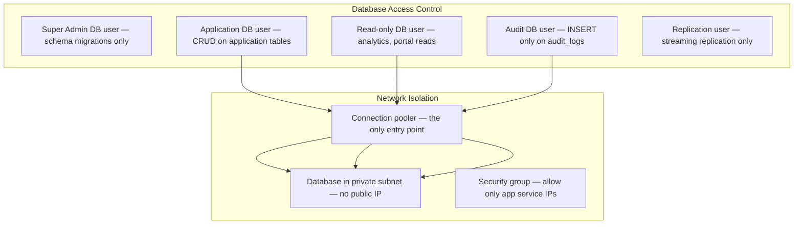

**Database user roles (not to be confused with application RBAC roles):**

| DB User | Permissions | Used By |
|---------|-------------|---------|
| `upcai_app` | SELECT, INSERT, UPDATE, DELETE on application tables; no DDL | Application services (Chat, Orchestrator, Retrieval, Portal, Auth) |
| `upcai_readonly` | SELECT only on all tables | Read replicas, analytics queries, admin portal reads |
| `upcai_audit` | INSERT only on `audit_logs`; no SELECT, UPDATE, DELETE | Audit Service (write-only; audit records are read via `upcai_readonly`) |
| `upcai_migrations` | Full DDL (CREATE, ALTER, DROP) + data manipulation | CI/CD migration pipeline only; never used by running services |
| `upcai_replication` | REPLICATION privilege | Streaming replication to read replicas |

**Principle of least privilege:** each service connects with the minimum database permissions it needs. The Chat Service never needs DDL; the Audit Service never needs to read or modify audit records; the migration user is only active during deploys.

### 8.3 Role-Based Permissions (Application Level)

Application-level RBAC is enforced at two points:

1. **API layer:** The BFF/API gateway checks the user's JWT claims (role, department, user_type) against the required permissions for each endpoint. Unauthorized requests are rejected with 403 before reaching the database.

2. **Data layer (retrieval choke point):** The Retrieval Service injects metadata filters based on the user's attributes (department, year, course, access_level entitlements) into every vector/BM25 query. A student cannot retrieve a restricted document even by crafting the perfect query, because the filter is applied server-side, inside the database query.

**Permission resolution flow:**
```
User JWT → UserRoles (user_id, role_id, department_id)
         → RolePermissions (role_id → permission_ids)
         → Permissions (permission_key: resource:action)
         → Allow/Deny
```

### 8.4 Sensitive Data Protection

| Data | Classification | Protection |
|------|---------------|------------|
| Passwords | Critical | bcrypt/argon2 hash; never stored or logged plaintext |
| Refresh tokens | Critical | SHA-256 hash stored; rotation on every use; reuse detection |
| OTPs | Critical | SHA-256 hash; 10-minute TTL; max 5 attempts |
| API keys (provider secrets) | Critical | Not in database — in managed secrets manager (KMS) |
| Phone numbers | PII | Field-level encryption (pgcrypto) |
| Guardian contact info | PII | Field-level encryption |
| Student enrollment/roll numbers | Institutional PII | Access-controlled; not encrypted (needed for lookups) |
| Chat message content | User data | Volume encryption at rest; access-controlled |
| Audit log before/after states | May contain PII | Volume encryption; access restricted to audit viewers |

### 8.5 Audit Logging (Database Perspective)

- AuditLogs table is **append-only** — enforced by a database-level rule/trigger that rejects UPDATE and DELETE.
- The `upcai_audit` database user can only INSERT into `audit_logs`.
- The `upcai_app` user can INSERT into `audit_logs` but cannot UPDATE or DELETE (trigger blocks it).
- AuditLogs are partitioned by month for performance and lifecycle management.
- Hash chain validation runs as a daily scheduled job; failures trigger a critical alert.

### 8.6 Data Privacy

**DPDP (Digital Personal Data Protection) compliance for an Indian educational institution:**

- **Data minimization:** only collect data necessary for the service. Long-term memory is opt-in.
- **Purpose limitation:** student data is used for personalization and access control only. Retrieval filters enforce audience boundaries.
- **Right to erasure:** upon verified request, personal data is anonymized or deleted within the compliance window. Chat history is anonymized (user_id set to a tombstone, identifying content redacted). Audit records are retained but the actor's PII is anonymized.
- **Data portability:** users can export their data (chat history, preferences, quiz results, bookmarks) in JSON format.
- **Consent:** long-term memory storage is opt-in with clear disclosure.
- **No vendor training:** provider API configurations disable vendor-side training on UPC prompts and documents. This is enforced at the Provider Gateway level and audited.

---

## Section 9 — Scalability

### 9.1 Scale Targets

| Metric | Target | Implication |
|--------|--------|------------|
| Concurrent students | 50,000+ | Connection pooling, stateless services, read replicas |
| Faculty | 5,000+ | Minimal additional load vs. students |
| Chat messages (total) | Millions (growing at ~500K/month) | Partitioning by month, archival at 2 years |
| Documents | Hundreds of thousands | Category-based organization, efficient indexing |
| Chunks | 1–10 million | Vector index tuning, potential migration to dedicated vector DB |
| Embeddings | 1–10 million vectors | HNSW performance monitoring, sharding path |
| API requests/day | 500K–2M | Connection pooling, caching, rate limiting |
| Concurrent chat streams | 5,000–10,000 | Stateless services, Redis pub/sub for streaming |

### 9.2 Table Partitioning

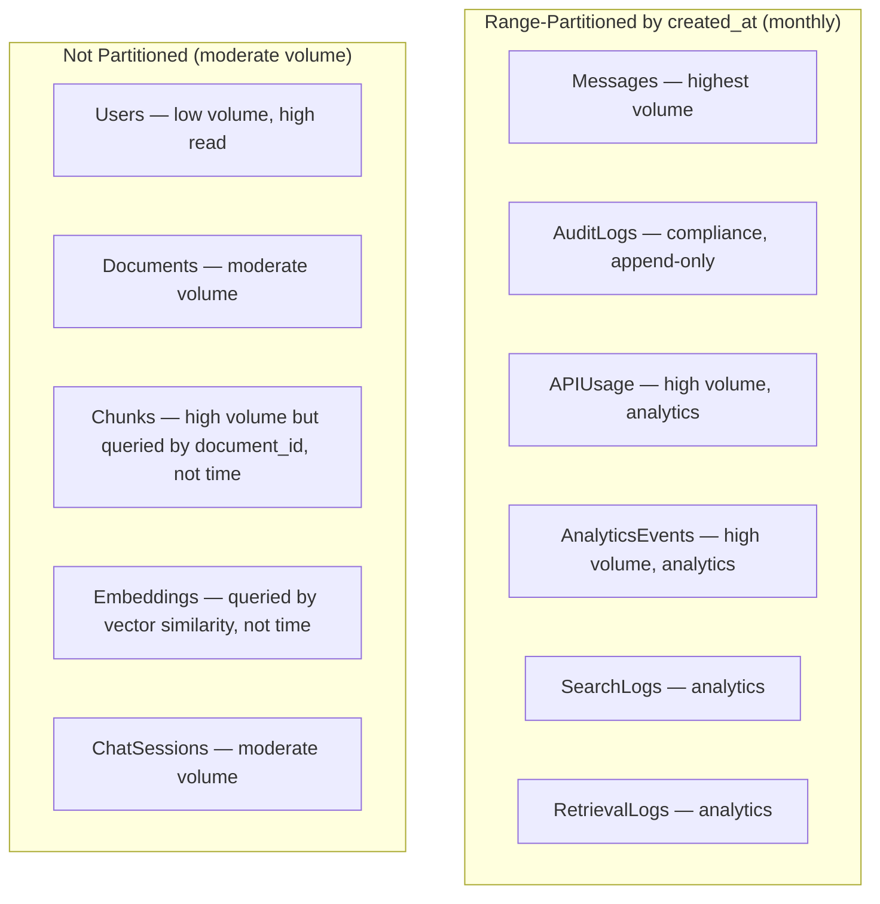

**Why partition Messages by month:** with ~500K messages/month, the Messages table reaches millions of rows within months. Monthly partitioning ensures:
- The hot partition (current month) fits in memory and is fast.
- Old partitions can be archived without affecting the hot path.
- Partition pruning eliminates scanning irrelevant months for time-range queries.
- VACUUM operates per-partition, reducing lock contention.

**Why NOT partition Chunks/Embeddings:** Chunks are queried by `document_id` and metadata filters, not by time. Partitioning by time would scatter chunks from the same document across partitions, worsening query performance. If chunk volume outgrows a single table, the migration path is a dedicated vector DB with sharding by category/department.

### 9.3 Read Replicas

| Replica | Serves | Latency Tolerance | Why |
|---------|--------|-------------------|-----|
| Replica 1 | Retrieval metadata reads, vector search, chunk lookups | < 1 second | Retrieval is the highest-volume read path; offloading it from the primary keeps write latency low |
| Replica 2 | Admin portal reads, analytics queries, audit browsing | < 5 seconds | Analytics queries are complex aggregations that would starve OLTP if run on the primary |

**Writes always go to the primary.** Read routing is handled by the connection pooler or application-level read/write split.

### 9.4 Connection Pooling

**PgBouncer (or equivalent) in transaction mode:**
- **Pool size:** 100–200 connections per pooler instance (vs. Postgres max_connections of ~300–500).
- **Mode:** Transaction pooling — connections are returned to the pool after each transaction, not after each session. This is critical for high-concurrency workloads where thousands of application instances share a few hundred database connections.
- **Multiple pooler instances** behind the load balancer for HA.
- **Prepared statements:** disabled in transaction mode (PgBouncer limitation); or use session mode for services that rely heavily on prepared statements.

**Why connection pooling is non-negotiable at this scale:** PostgreSQL's forked-process model means each connection costs ~5–10MB of memory. 5,000 concurrent users × direct connections = 50GB of connection overhead, which is unsustainable. Pooling reduces active connections to a bounded number (~200) regardless of application concurrency.

### 9.5 Caching Strategy (Data Layer Perspective)

| Cache | Stored In | Key Pattern | TTL | Invalidation |
|-------|-----------|-------------|-----|-------------|
| Semantic answer cache | Redis | Question embedding hash | 5 min (knowledge), 1 hour (academic) | Doc version change → evict via `doc_id→cache_keys` index |
| User session | Redis | `session:{session_id}` | 30 min inactivity | Explicit logout or revocation |
| Rate limit counters | Redis | `rate:{user_id}:{window}` | Window duration | Auto-expire |
| Working context | Redis | `ctx:{session_id}` | 30 min inactivity | Session end |
| Hot metadata | Redis | `meta:{document_id}` | 10 min | Doc update event |
| RBAC permission set | Redis | `perms:{user_id}` | 5 min | Role/permission change event |
| Current academic session | Redis | `session:current` | 1 hour | Session change event |

**Cache-aside pattern:** Application checks Redis first. On miss, queries Postgres, populates Redis, returns result. On cache invalidation (document update, role change), the invalidating service publishes an event that deletes the relevant cache keys.

### 9.6 Storage Growth Projections

| Component | Year 1 | Year 3 | Year 5 | Growth Driver |
|-----------|--------|--------|--------|--------------|
| **Postgres (primary)** | ~50 GB | ~200 GB | ~500 GB | Messages, chunks, audit logs |
| **Vector data (pgvector/dedicated)** | ~5 GB (500K vectors × 6KB) | ~30 GB (5M vectors) | ~60 GB (10M vectors) | Document ingestion + re-embedding |
| **Object storage** | ~500 GB | ~2 TB | ~5 TB | Raw uploads, derived assets, archives |
| **Redis** | ~2 GB | ~5 GB | ~10 GB | Caches, sessions (bounded by TTL) |

**Mitigation strategies:**
- Monthly partitioning + archival keeps the hot dataset bounded.
- Object storage lifecycle rules move old versions to cheaper tiers.
- Vector data migration to a dedicated engine at ~500K vectors prevents Postgres bloat.
- Denormalized counters avoid expensive COUNT(*) queries at scale.

---

## Section 10 — Architecture Decisions

### DBD-01 — PostgreSQL as the Sole Relational Database

- **Decision:** Use PostgreSQL for all relational data, full-text search, and vector search (via pgvector).
- **Alternatives:** (a) MySQL — weaker JSON, no vector support; (b) MongoDB — no ACID for multi-document transactions, no vector natively; (c) PostgreSQL + Elasticsearch + Pinecone — three systems from day one.
- **Why chosen:** PostgreSQL uniquely serves as OLTP + FTS + vector store at our initial scale, avoiding operational overhead of three separate systems. D1/D5.
- **Trade-offs:** pgvector has lower performance than dedicated vector engines at high scale; FTS is less feature-rich than Elasticsearch.
- **Risks:** Outgrowing pgvector or FTS. Mitigated by abstraction layers (Retrieval Service, Vector Search Engine) that make the swap invisible.
- **Future:** Dedicated vector DB at >500K vectors; Elasticsearch if FTS complexity demands it.

### DBD-02 — UUIDv7 Primary Keys

- **Decision:** All primary keys are UUIDv7 (time-sortable UUIDs).
- **Alternatives:** (a) Auto-increment integers — guessable, no global uniqueness; (b) UUIDv4 — random, poor B-tree locality; (c) ULID — similar to UUIDv7 but non-standard.
- **Why chosen:** UUIDv7 provides global uniqueness (no coordination across replicas), time-sortability (good B-tree insert performance), and non-guessability (security). Standard UUID format works with every tool and ORM.
- **Trade-offs:** 16 bytes vs. 4/8 bytes for integers; slightly larger indexes.
- **Risks:** Negligible at our scale. Index size is a concern at billions of rows, not millions.
- **Future:** No change expected; UUIDv7 scales to any practical row count.

### DBD-03 — Soft Delete with Scheduled Purge

- **Decision:** All user-facing entities use `deleted_at` soft delete; physical purge by retention job.
- **Alternatives:** (a) Hard delete immediately; (b) Separate archive tables; (c) Event sourcing.
- **Why chosen:** Soft delete protects against accidental loss, supports "undo," enables audit trail, and simplifies the application (filter rather than move). Scheduled purge ensures storage doesn't grow unbounded. D2.
- **Trade-offs:** Queries must include `WHERE deleted_at IS NULL`; index bloat from soft-deleted rows (mitigated by partial indexes).
- **Risks:** Developers forgetting the filter. Mitigated by ORM default scopes and database views.
- **Future:** If soft-delete volume becomes a concern, partition tables by active/deleted status.

### DBD-04 — Hash-Chained Append-Only Audit Logs

- **Decision:** AuditLogs are append-only with hash-chain tamper detection. UPDATE and DELETE are rejected at the database level.
- **Alternatives:** (a) Standard mutable log table; (b) External audit SaaS; (c) Blockchain.
- **Why chosen:** For an official college system, tamper-evidence is required. Hash chaining is simple, efficient, and verifiable without external infrastructure. Append-only enforcement at the database level prevents even a compromised application from modifying audit history. D3.
- **Trade-offs:** Cannot correct audit records (by design); storage grows linearly; chain verification has O(n) cost.
- **Risks:** Chain verification latency at millions of records. Mitigated by daily incremental verification (only verify new records since last checkpoint) and periodic full-chain audits.
- **Future:** Anchor chain heads to an external notary or timestamping service for third-party verifiability.

### DBD-05 — Monthly Range Partitioning for Time-Series Tables

- **Decision:** Messages, AuditLogs, APIUsage, AnalyticsEvents, SearchLogs, and RetrievalLogs are range-partitioned by `created_at` (monthly).
- **Alternatives:** (a) No partitioning; (b) Hash partitioning; (c) List partitioning by category.
- **Why chosen:** Time-series data is always queried with a time range (recent messages, this month's analytics). Monthly partitions enable partition pruning (only scan relevant months), efficient archival (detach old partitions), and parallel VACUUM. D4.
- **Trade-offs:** Partition management overhead (auto-creating future partitions); cross-partition queries are slower for non-time-filtered lookups.
- **Risks:** Queries without a time filter scan all partitions. Mitigated by ensuring all query patterns include a time range or use indexes on non-time columns.
- **Future:** Automatic partition management via pg_partman or equivalent.

### DBD-06 — JSONB Metadata on Chunks for Filtered Vector Search

- **Decision:** Chunk metadata (category, department, audience, access_level, dates) is stored as a JSONB column on the Chunks table with GIN and expression indexes.
- **Alternatives:** (a) Fully normalized — separate metadata table joined at query time; (b) Separate wide columns — one column per metadata field; (c) Metadata only in the vector DB.
- **Why chosen:** JSONB with expression indexes enables pre-filtering in the same query as the vector search (`WHERE metadata->>'category' = 'examination' ORDER BY embedding <=> query_vector`). This is faster than a join and avoids the empty-result-set problem of post-filtering. Flexible schema accommodates new metadata fields without schema migrations. D5.
- **Trade-offs:** JSONB lacks column-level constraints (no NOT NULL on a JSONB key); validation must be application-enforced. Slightly larger storage than normalized columns.
- **Risks:** Schema drift — different documents having different metadata keys. Mitigated by a metadata schema definition (application-enforced) and validation on ingestion.
- **Future:** If a metadata field becomes universally required and heavily filtered, promote it to a dedicated column with a proper constraint.

### DBD-07 — Separate Embeddings Table (Not Inline on Chunks)

- **Decision:** Embeddings are stored in a separate table with a one-to-one FK to Chunks, rather than as a column on the Chunks table.
- **Alternatives:** (a) Vector column directly on Chunks; (b) Embeddings only in a dedicated vector DB.
- **Why chosen:** Separation keeps the Chunks table lean for metadata-only scans (sequential scans skip the large vector column). It enables atomic embedding model upgrades: generate new embeddings into a shadow table, validate, swap — without touching the Chunks table. D5.
- **Trade-offs:** One extra join for combined chunk+vector queries (mitigated by the join being on a UNIQUE FK, which is efficient).
- **Risks:** Join overhead. Negligible at our scale; the vector search itself dominates latency.
- **Future:** If the dedicated vector DB migration (DBD-01) happens, the Embeddings table is simply dropped and replaced by the external engine.

### DBD-08 — Connection Pooling via PgBouncer in Transaction Mode

- **Decision:** All application services connect to PostgreSQL through PgBouncer in transaction-mode pooling.
- **Alternatives:** (a) Direct connections; (b) Session-mode pooling; (c) Application-level pooling only.
- **Why chosen:** Transaction-mode pooling maximizes connection reuse (connections are returned after each transaction, not each session), supporting thousands of concurrent application instances with ~200 database connections. This is essential at 50K+ users.
- **Trade-offs:** Prepared statements don't work in transaction mode; session-level features (temp tables, SET statements) require workarounds or session-mode pools for specific services.
- **Risks:** Application code accidentally using session-level features. Mitigated by coding standards and testing against the pooler.
- **Future:** Supavisor or pgcat for more advanced features (multi-tenant pooling, named prepared statement support).

### DBD-09 — Denormalized Counters for High-Frequency Aggregations

- **Decision:** Frequently-read counts (message_count on ChatSessions, document_count on KnowledgeCategories, download_count on PreviousYearPapers, etc.) are stored as denormalized columns, updated on write via application logic (or triggers).
- **Alternatives:** (a) Always COUNT(*) at read time; (b) Materialized views refreshed periodically.
- **Why chosen:** COUNT(*) on large partitioned tables is expensive (sequential scan). Denormalized counters make reads O(1). D1 (denormalization is documented and kept consistent).
- **Trade-offs:** Write amplification (every message insert also updates the session's counter); potential for drift if updates fail.
- **Risks:** Counter drift. Mitigated by a periodic reconciliation job that recomputes counts from the source-of-truth and corrects any drift.
- **Future:** If counter update contention becomes a problem, move to async counter aggregation via a queue.

### DBD-10 — Polymorphic Bookmarks via Type+ID Pattern

- **Decision:** The Bookmarks table uses a `bookmarkable_type` enum + `bookmarkable_id` UUID pattern to reference any bookmarkable entity.
- **Alternatives:** (a) Separate bookmark tables per entity (BookmarkMessages, BookmarkDocuments, etc.); (b) Single FK per possible target (one nullable FK column per entity type).
- **Why chosen:** One table, one query, one UI component. Adding a new bookmarkable type is adding an enum value, not a new table or column. At our scale and query patterns (always filtered by user_id + type), this is simpler than N tables.
- **Trade-offs:** No FK constraint on `bookmarkable_id` (database can't enforce referential integrity across multiple target tables); orphaned bookmarks are possible if a target is deleted without cleaning up bookmarks.
- **Risks:** Orphaned bookmarks. Mitigated by cascade logic in the application layer and a periodic cleanup job.
- **Future:** If bookmark volume grows significantly or if referential integrity becomes critical, migrate to per-type junction tables.

---

## Closing Note

This database architecture is designed to be the **durable, consistent, and auditable foundation** of UPC AI. Three structural choices run through every section:

1. **PostgreSQL as the converged data platform** — relational, full-text, and vector in one system at initial scale, with documented migration paths to dedicated engines as each axis outgrows Postgres.
2. **Defense in depth for data integrity** — database constraints enforce business rules at the lowest layer; soft delete prevents accidental loss; hash-chained audit logs provide tamper-evidence; RBAC filters are applied inside the database query, not after it.
3. **Time-partitioned, cache-layered, replica-distributed** — the schema is designed for 50K+ users from day one, with partitioning for time-series growth, read replicas for query distribution, and a four-layer caching strategy that keeps the primary fast.

A senior database engineering team can implement UPC AI's entire data layer — from schema creation to indexing to partitioning to backup configuration — directly from this document, entity by entity, section by section.
