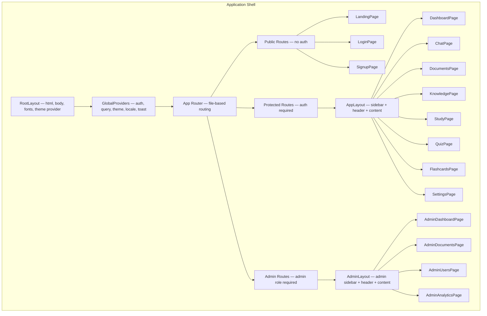
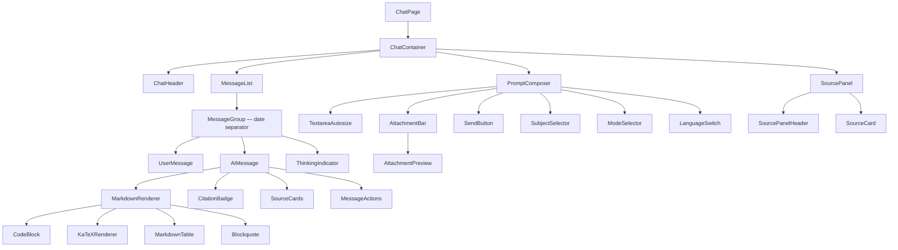
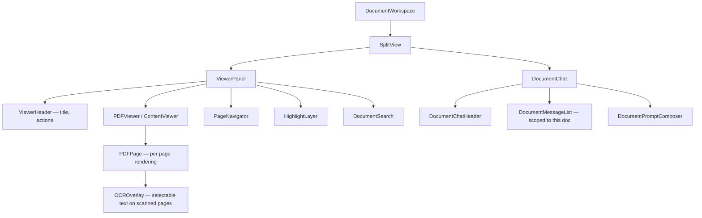
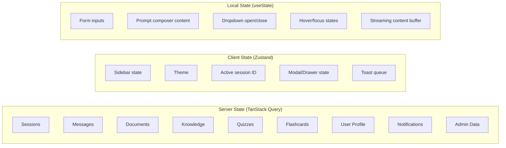
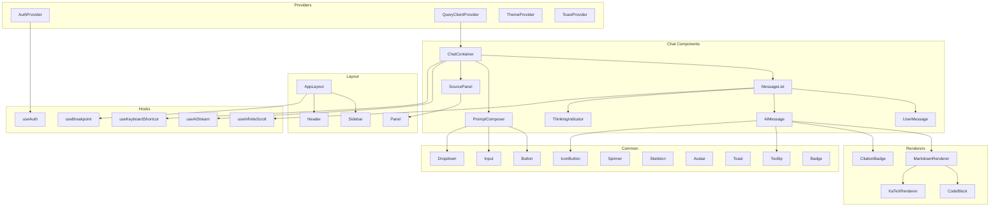
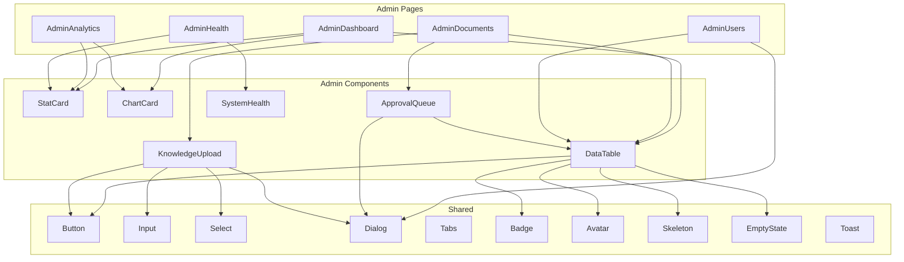

# UPC AI — Frontend Component Architecture

**Product:** UPC AI — Official AI-Powered Academic & Campus Assistant for Udai Pratap College (UPC), Varanasi
**Version:** 1.1 — warm-editorial design pivot (Design System v2.0); font stacks, theme system, chat components, and token references updated
**Status:** Frontend architecture blueprint — approved, pre-implementation
**Authored as:** Principal Frontend Architect · Staff React Engineer · Design System Architect · Senior TypeScript Engineer · UI Platform Lead

> **No implementation code appears in this document.** No React components, no JSX, no CSS, no Tailwind. This is a pure frontend component architecture specification — component trees, prop contracts, state models, hook designs, and performance strategies — detailed enough for a senior frontend engineering team to implement UPC AI's entire UI layer directly.

---

## Table of Contents

- [Section 1 — Application Structure](#section-1--application-structure)
- [Section 2 — Layout Components](#section-2--layout-components)
- [Section 3 — AI Chat Components](#section-3--ai-chat-components)
- [Section 4 — Document Components](#section-4--document-components)
- [Section 5 — Quiz Components](#section-5--quiz-components)
- [Section 6 — Flashcard Components](#section-6--flashcard-components)
- [Section 7 — Admin Components](#section-7--admin-components)
- [Section 8 — Common Components](#section-8--common-components)
- [Section 9 — Custom Hooks](#section-9--custom-hooks)
- [Section 10 — State Management](#section-10--state-management)
- [Section 11 — Performance](#section-11--performance)
- [Section 12 — Accessibility](#section-12--accessibility)
- [Section 13 — Component Dependencies](#section-13--component-dependencies)

---

## Conventions

**Component specification format:** Every component is described with:
- **Purpose** — what it does and when it's used.
- **Props** — the external API. Types are TypeScript-style. `?` marks optional props.
- **Internal State** — what the component manages internally.
- **Children/Composition** — sub-components it renders.
- **Accessibility** — ARIA roles, keyboard behaviour, screen reader considerations.
- **Performance** — memoization, virtualization, lazy-loading notes.

**Naming:** Components use PascalCase. Hooks use `use` prefix. Props interfaces use the component name + `Props` suffix. All names are prefixed with their domain when ambiguous (e.g., `ChatMessage` vs `DocumentMessage`).

---

## Section 1 — Application Structure

### 1.1 Technology Stack

| Layer | Technology | Rationale |
|-------|-----------|-----------|
| Framework | **Next.js 14+ (App Router)** | File-based routing, SSR/SSG for landing page, server components for data fetching, streaming support, built-in image optimization. |
| Language | **TypeScript (strict mode)** | Type safety across the entire frontend. |
| Styling | **CSS Modules + CSS Custom Properties** | Design tokens (warm-editorial system, Design System v2.0) as CSS custom properties. Component-scoped styles via CSS Modules. No utility-class framework — the design system tokens provide the vocabulary. |
| State — server | **TanStack Query (React Query)** | Server state caching, deduplication, background refetch, optimistic updates, infinite scroll support. |
| State — client | **Zustand** | Minimal client-side global state (sidebar, theme, UI flags). No Redux — Zustand is lighter for UPC AI's needs. |
| Forms | **React Hook Form + Zod** | Performant form handling (no re-renders on every keystroke) + schema validation. |
| Icons | **Lucide React** | Tree-shakeable, consistent with the design system. |
| Math | **KaTeX** | LaTeX rendering in AI responses. |
| Markdown | **React Markdown + rehype/remark plugins** | AI response rendering with syntax highlighting, tables, math, citations. |
| Code Highlighting | **Shiki** | Accurate syntax highlighting (same engine as VS Code). Loaded per-language on demand. |
| Animation | **CSS transitions + Framer Motion (selective)** | CSS for simple transitions (hover, focus). Framer Motion only for complex orchestrated animations (flashcard flip, confetti, modal sequences). |
| Charts | **Recharts** | Admin dashboard charts. Lightweight, composable, React-native. |
| PDF | **react-pdf (pdfjs)** | PDF rendering in the Document Workspace. |
| Testing | **Vitest + Testing Library + Playwright** | Unit/integration (Vitest + RTL), E2E (Playwright). |

### 1.2 Application Shell Architecture



### 1.3 Route Map

| Route | Page | Layout | Auth | Role |
|-------|------|--------|------|------|
| `/` | Landing | PublicLayout | No | — |
| `/login` | Login | AuthLayout | No | — |
| `/signup` | Signup | AuthLayout | No | — |
| `/verify` | OTP Verification | AuthLayout | No | — |
| `/forgot-password` | Password Reset | AuthLayout | No | — |
| `/onboarding` | Onboarding Wizard | OnboardingLayout | Yes | — |
| `/dashboard` | Dashboard | AppLayout | Yes | — |
| `/chat` | Chat (new session) | AppLayout | Yes | — |
| `/chat/[sessionId]` | Chat Session | AppLayout | Yes | — |
| `/documents` | Document List | AppLayout | Yes | — |
| `/documents/[docId]` | Document Workspace | DocumentLayout | Yes | — |
| `/knowledge` | Knowledge Search | AppLayout | Yes | — |
| `/knowledge/[type]` | Knowledge Category | AppLayout | Yes | — |
| `/knowledge/[type]/[id]` | Knowledge Detail | AppLayout | Yes | — |
| `/quiz` | Quiz Home | AppLayout | Yes | — |
| `/quiz/generate` | Quiz Generator | AppLayout | Yes | — |
| `/quiz/[quizId]` | Quiz Taking | QuizLayout (distraction-free) | Yes | — |
| `/quiz/[quizId]/results` | Quiz Results | AppLayout | Yes | — |
| `/flashcards` | Flashcard Decks | AppLayout | Yes | — |
| `/flashcards/[deckId]` | Flashcard Review | FlashcardLayout (distraction-free) | Yes | — |
| `/study` | Study Dashboard | AppLayout | Yes | — |
| `/revision-notes` | Revision Notes | AppLayout | Yes | — |
| `/bookmarks` | Bookmarks | AppLayout | Yes | — |
| `/settings` | Settings | AppLayout | Yes | — |
| `/settings/[tab]` | Settings Tab | AppLayout | Yes | — |
| `/admin` | Admin Dashboard | AdminLayout | Yes | admin |
| `/admin/documents` | Document Management | AdminLayout | Yes | admin |
| `/admin/approvals` | Approval Queue | AdminLayout | Yes | admin |
| `/admin/users` | User Management | AdminLayout | Yes | admin |
| `/admin/roles` | Role Management | AdminLayout | Yes | admin |
| `/admin/analytics` | Analytics | AdminLayout | Yes | admin |
| `/admin/costs` | Cost Dashboard | AdminLayout | Yes | admin |
| `/admin/indexing` | Indexing Monitor | AdminLayout | Yes | admin |
| `/admin/health` | System Health | AdminLayout | Yes | admin |
| `/admin/audit` | Audit Logs | AdminLayout | Yes | admin |
| `/admin/settings` | System Settings | AdminLayout | Yes | admin |

### 1.4 Global Providers

The provider tree wraps the entire application. Order matters — inner providers can consume outer ones.

```
<ThemeProvider>              ← CSS custom properties for theme tokens
  <LocaleProvider>           ← i18n (en/hi), date formatting
    <QueryClientProvider>    ← TanStack Query client
      <AuthProvider>         ← Auth state, token refresh, user context
        <ToastProvider>      ← Toast notification queue
          <KeyboardProvider> ← Global keyboard shortcut registry
            {children}       ← Routes and pages
          </KeyboardProvider>
        </ToastProvider>
      </AuthProvider>
    </QueryClientProvider>
  </LocaleProvider>
</ThemeProvider>
```

**ThemeProvider:**
- **Single source of truth:** the persisted Zustand `UserPreferencesStore.theme` (v2.0 — resolves the v1.x dual-state conflict). ThemeProvider reads the store and applies it; it holds no theme state of its own.
- Applies `data-theme="light" | "dark"` on `<html>` (dark is the default — the warm charcoal identity; light fully supported). The `oled` theme was removed in v2.0.
- Also applies `data-contrast="high"` when the high-contrast accessibility setting is on.
- Reads system preference (`prefers-color-scheme`) only when theme = `system`.
- Exposes `theme`, `setTheme` via context for convenience consumers.

**AuthProvider:**
- Manages JWT access token (in memory — never localStorage).
- Manages refresh token (httpOnly cookie — handled by browser).
- Provides `user`, `isAuthenticated`, `login`, `logout`, `refreshToken`.
- Auto-refreshes access token before expiry (15-min TTL, refresh at 12 min).
- On 401 response from any API call: attempts silent refresh. On refresh failure: redirects to `/login`.

**LocaleProvider:**
- Current language: `en` or `hi`.
- Provides `t(key)` translation function.
- Provides `formatDate`, `formatNumber`, `formatCurrency` localized formatters.

### 1.5 Responsive Strategy

Responsive behaviour is handled at two levels:

1. **Layout level:** `AppLayout` reads the viewport width (via `useMediaQuery` hook) and adjusts the sidebar mode (persistent / drawer / hidden) and navigation mode (sidebar / bottom tab bar).

2. **Component level:** Individual components accept a `compact` or `size` prop where layout needs to change. Components do NOT read viewport width directly — they receive context from their parent layout.

**Breakpoint detection:** A single `useBreakpoint()` hook (wrapping `matchMedia`) returns the current breakpoint (`sm | md | lg | xl | 2xl`). Only layout components consume this hook.

---

## Section 2 — Layout Components

### 2.1 RootLayout

| Field | Detail |
|-------|--------|
| **Purpose** | The outermost layout. Sets up `<html>`, `<body>`, font loading (Cormorant Garamond display, Inter body, JetBrains Mono, Noto Sans/Serif Devanagari — all via `next/font` self-hosted), viewport meta, theme class, and the global provider tree. |
| **Renders** | `<html>` → `<body>` → `GlobalProviders` → `{children}` |
| **State** | None (static shell). |
| **Server/Client** | Server Component (Next.js). Only the providers are Client Components. |

### 2.2 AppLayout

| Field | Detail |
|-------|--------|
| **Purpose** | The authenticated app shell: sidebar + header + main content area. Used by all non-admin authenticated pages. |
| **Props** | `children: ReactNode` |
| **Internal State** | `sidebarMode: 'expanded' | 'collapsed' | 'drawer' | 'hidden'` (derived from breakpoint + user preference). `isSidebarOpen: boolean` (for drawer mode). |
| **Composition** | `<Sidebar>` + `<Header>` + `<main>{children}</main>` + `<BottomTabBar>` (mobile only). |
| **Responsive** | ≥1024px: persistent sidebar. 768–1023px: drawer sidebar. <768px: no sidebar, bottom tab bar. |
| **Keyboard** | `⌘/Ctrl+Shift+S` toggles sidebar expand/collapse. |
| **Accessibility** | `<main>` has `role="main"`. Sidebar has `role="complementary"`. Skip-to-content link targets `<main>`. |

### 2.3 Sidebar

| Field | Detail |
|-------|--------|
| **Purpose** | Primary navigation + chat history + tools. The persistent left rail. |
| **Props** | `mode: 'expanded' | 'collapsed' | 'drawer'`, `isOpen?: boolean`, `onClose?: () => void` |
| **Internal State** | `chatSessions: Session[]` (from TanStack Query), `expandedGroups: Set<string>` (which time groups are expanded), `searchQuery: string`. |
| **Children** | `SidebarHeader` (logo + collapse toggle), `SidebarSearch`, `NewChatButton`, `ChatSessionList` (grouped by date), `SidebarToolsNav`, `SidebarFooter` (settings + profile). |
| **Performance** | Chat session list is virtualized (only renders visible items) if > 50 sessions. |
| **Accessibility** | `<nav aria-label="Main navigation">`. Items are keyboard-navigable with arrow keys. Active item indicated by `aria-current="page"`. |
| **Animation** | Width transition: 200ms ease-in-out. Drawer mode: slide from left + overlay fade. |

### 2.4 Header

| Field | Detail |
|-------|--------|
| **Purpose** | Top bar: page title, breadcrumbs, notification bell, user menu. |
| **Props** | `title?: string`, `breadcrumbs?: Breadcrumb[]`, `actions?: ReactNode` (page-specific action buttons) |
| **Internal State** | `unreadCount: number` (from notifications query), `isUserMenuOpen: boolean`. |
| **Children** | `Breadcrumbs`, `NotificationBell` (with badge), `UserMenu` (dropdown: profile, settings, theme toggle, logout). |
| **Responsive** | On mobile: hamburger menu button (opens sidebar drawer) replaces breadcrumbs. Title truncated. |
| **Height** | 56px fixed. |

### 2.5 BottomTabBar

| Field | Detail |
|-------|--------|
| **Purpose** | Mobile-only navigation bar replacing the sidebar. |
| **Props** | `activeTab: string` |
| **Children** | 5 tab items: Chat, Knowledge, Tools, Notifications, Profile. Each: icon + label. Active tab in `accent`; inactive in `muted`. |
| **Accessibility** | `role="tablist"`. Each tab: `role="tab"`, `aria-selected`. |
| **Responsive** | Only rendered at `< 768px`. |
| **Position** | Fixed bottom, above safe area inset. Height: 56px + safe area. |

### 2.6 ContentArea

| Field | Detail |
|-------|--------|
| **Purpose** | The scrollable main content container. Centers content, constrains max-width, applies padding. |
| **Props** | `maxWidth?: 'sm' | 'md' | 'lg' | 'xl' | 'full'` (default: `md` = 680px — the conversation reading width), `padding?: 'default' | 'compact' | 'none'`, `children: ReactNode` |
| **State** | None. Pure layout. |
| **Performance** | This is the scroll container for infinite scroll detection (`useInfiniteScroll` hook attaches here). |

### 2.7 SplitView

| Field | Detail |
|-------|--------|
| **Purpose** | A two-panel layout with a draggable divider. Used by: Document Workspace (viewer + chat), admin detail views. |
| **Props** | `left: ReactNode`, `right: ReactNode`, `defaultSplit?: number` (percentage, default 60), `minLeft?: number` (px), `minRight?: number` (px), `collapsible?: 'left' | 'right' | 'both'` |
| **Internal State** | `splitPosition: number` (percentage), `isCollapsed: 'left' | 'right' | null`. |
| **Interaction** | Drag divider to resize. Double-click divider to reset to default. Collapse button on divider. |
| **Responsive** | On mobile (`< 768px`): stacks vertically. The `right` panel becomes a toggle-able bottom sheet. |
| **Keyboard** | `⌘]` / `⌘[` to adjust split. |
| **Performance** | Drag uses `requestAnimationFrame` for smooth resizing. Content within panels is NOT re-rendered during drag (CSS-only resize via `flex-basis`). |

### 2.8 Panel

| Field | Detail |
|-------|--------|
| **Purpose** | A collapsible side panel (e.g., Source Panel in chat). Slides in/out from the right edge. |
| **Props** | `isOpen: boolean`, `onClose: () => void`, `width?: number` (default 320px), `title?: string`, `children: ReactNode` |
| **Animation** | Slide from right: translateX(100%) → translateX(0), 200ms ease-out. |
| **Responsive** | On mobile: becomes a bottom sheet. |
| **Accessibility** | `role="complementary"`. Focus trapped when open (if overlay mode). Close on `Escape`. |

### 2.9 AdminLayout

| Field | Detail |
|-------|--------|
| **Purpose** | The admin-specific shell. Same structure as AppLayout but with a different sidebar navigation (admin-specific items) and no chat history. |
| **Props** | `children: ReactNode` |
| **Composition** | `AdminSidebar` + `Header` (with admin badge) + `<main>{children}</main>`. |
| **Auth** | Checks `user.roles.includes('admin')`. Redirects non-admins to `/dashboard`. |

### 2.10 Distraction-Free Layouts

**QuizLayout:** Full-screen content, no sidebar, no header navigation. Only: quiz header (question count, timer, exit button) + content + navigation buttons. Used during quiz taking.

**FlashcardLayout:** Full-screen, no sidebar. Card + rating buttons + progress. Exit button in top-left.

**OnboardingLayout:** Centred card layout, step indicator, no sidebar. Brand background.

---

## Section 3 — AI Chat Components

### 3.1 Component Tree



### 3.2 ChatContainer

| Field | Detail |
|-------|--------|
| **Purpose** | The top-level chat workspace component. Manages the session lifecycle and coordinates children. |
| **Props** | `sessionId?: string` (undefined = new session) |
| **Internal State** | `session: ChatSession | null`, `isStreaming: boolean`, `streamingMessageId: string | null`. |
| **Data** | Fetches session via `useSession(sessionId)`. Messages via `useMessages(sessionId)`. |
| **Responsibilities** | 1. Fetch/create session. 2. Render MessageList + PromptComposer + SourcePanel. 3. Handle message sending (calls `useSendMessage` mutation). 4. Manage SSE connection for streaming (via `useAIStream` hook). 5. Propagate streaming tokens to the AIMessage being rendered. |
| **Empty State** | No sessionId and no messages: renders `EmptyChatState` (logo + starter questions). |
| **Error State** | Session fetch failed: "Couldn't load this conversation. [Try again]". |
| **Loading State** | Session loading: skeleton shimmer. |

### 3.3 MessageList

| Field | Detail |
|-------|--------|
| **Purpose** | Renders the chronological list of messages in a chat session. |
| **Props** | `messages: Message[]`, `isStreaming: boolean`, `streamingContent?: string`, `streamingCitations?: Citation[]`, `onLoadMore: () => void`, `hasMore: boolean` |
| **Internal State** | `isAtBottom: boolean` (scroll tracking). |
| **Responsibilities** | 1. Render messages grouped by date. 2. Auto-scroll to bottom on new messages (if user is at bottom). 3. Show "↓ New messages" pill when user has scrolled up and new content arrives. 4. Infinite scroll upward (load older messages). 5. Render ThinkingIndicator when streaming is in progress and no tokens yet. |
| **Performance** | Messages are NOT virtualized by default (most conversations are < 100 messages). For sessions with > 200 messages, enable virtualization via `react-window`. Each Message component is memoized (`React.memo`) — re-renders only when its own props change. |
| **Accessibility** | `role="log"`, `aria-live="polite"` on the streaming message container (announces new content to screen readers without interrupting). |

### 3.4 UserMessage

| Field | Detail |
|-------|--------|
| **Purpose** | Renders a message sent by the user. |
| **Props** | `message: { id: string, content: string, attachments: Attachment[], createdAt: string }` |
| **Composition** | Text content (plain text, no Markdown rendering for user messages) + `AttachmentPreview` chips (if any) + timestamp (on hover). |
| **Styling** | Right-aligned, `surface.card` background, 12px border-radius. Max-width 85%. |
| **Actions** | On hover: "Copy" and "Delete" icon buttons appear (subtle, top-right corner). |
| **Accessibility** | `role="listitem"`. Content is plain text (no ARIA complexity needed). |

### 3.5 AIMessage

| Field | Detail |
|-------|--------|
| **Purpose** | Renders an AI-generated response with Markdown, citations, and actions. The most complex component in the app. |
| **Props** | `message: { id: string, content: string, citations: Citation[], model: string, tokensUsed: number, isStreaming: boolean }`, `streamingContent?: string` |
| **Internal State** | `isSourcePanelOpen: boolean`, `activeCitationId: string | null`. |
| **Composition** | MarkdownRenderer (for content) + CitationBadges (inline) + SourceCards (bottom) + MessageActions (below). **No avatar, no bubble** — assistant text sits directly on the app canvas (warm-editorial reading surface). |
| **Streaming** | When `isStreaming=true`: renders `streamingContent` through MarkdownRenderer with a blinking cursor appended. Content updates token by token. When streaming completes, transitions to the final `message.content`. |
| **Styling** | Left-aligned, no background. Full width of the 680px conversation column. Response headings render in the display serif (Cormorant Garamond); body in Inter `body-lg`. Code blocks use the warm-dark `code-block` surface in both themes. |
| **Performance** | MarkdownRenderer is the bottleneck — see 3.7 for optimization. Citations are memoized independently from the message content. |
| **Accessibility** | `role="listitem"`. Citations: `role="button"`, `aria-label="Source 1: [document title]"`. |

### 3.6 MessageActions

| Field | Detail |
|-------|--------|
| **Purpose** | Action buttons below an AI response: 👍 👎 📋 🔁 📌 |
| **Props** | `messageId: string`, `responseId: string`, `onRegenerate: () => void` |
| **Internal State** | `feedbackGiven: 'up' | 'down' | null`. |
| **Actions** | Thumbs up/down → opens feedback modal (category + optional comment). Copy → copies Markdown to clipboard + toast "Copied!". Regenerate → calls `onRegenerate`. Bookmark → toggles bookmark. |
| **Animation** | Buttons fade in with 50ms stagger when the AI message finishes streaming. Not shown during streaming. |

### 3.7 MarkdownRenderer

| Field | Detail |
|-------|--------|
| **Purpose** | Renders AI-generated Markdown as rich HTML. The rendering engine for all AI responses. |
| **Props** | `content: string`, `isStreaming?: boolean` |
| **Responsibilities** | Parse Markdown → render: headings, paragraphs, lists, bold/italic, links, images, tables, code blocks (with syntax highlighting), blockquotes, horizontal rules, LaTeX math (inline + display), citation markers `[1]`. |
| **Children** | Uses remark/rehype plugin pipeline: `remark-gfm` (tables, strikethrough) → `remark-math` (LaTeX) → `rehype-katex` (math rendering) → `rehype-shiki` (code highlighting) → custom `rehype-citation` plugin (transforms `[n]` into clickable CitationBadge components). |
| **Performance** | **Critical path.** During streaming, the renderer is called on every token (30+ times/second). Optimizations: 1. The remark/rehype pipeline runs in a `useMemo` that debounces during streaming (re-parses every 100ms, not every token). 2. Between re-parses, new tokens are appended to the last text node directly (DOM append, not full re-render). 3. Code blocks: syntax highlighting is deferred until streaming completes (during streaming, code blocks render as plain monospace text). 4. KaTeX: renders only after the closing `$$` or `\]` delimiter is received. |
| **Accessibility** | Headings maintain proper hierarchy. Code blocks have `aria-label="Code block, language: python"`. Tables use proper `<th>` with `scope`. |

### 3.8 CodeBlock

| Field | Detail |
|-------|--------|
| **Purpose** | Renders a fenced code block with syntax highlighting, language label, and copy button. |
| **Props** | `code: string`, `language?: string`, `isStreaming?: boolean` |
| **Internal State** | `isCopied: boolean` (for copy feedback). |
| **Composition** | Header (language label + copy button) + highlighted code content + line numbers (optional). |
| **Copy** | Copies raw code (not highlighted HTML) to clipboard. Shows "Copied!" for 2 seconds. |
| **Performance** | Shiki highlighting is async and language-specific grammars are loaded on demand. During streaming, falls back to plain monospace (no highlighting until stream completes). |
| **Accessibility** | `role="region"`, `aria-label="Code block, [language]"`. Copy button: `aria-label="Copy code"`. |

### 3.9 KaTeXRenderer

| Field | Detail |
|-------|--------|
| **Purpose** | Renders LaTeX math expressions (inline and display) using KaTeX. |
| **Props** | `expression: string`, `displayMode: boolean` |
| **Error Handling** | Invalid LaTeX: renders the raw expression in a red monospace font with a tooltip "Invalid math expression". Never crashes the page. |
| **Accessibility** | KaTeX generates MathML alongside visual output. Screen readers read the MathML. |
| **Performance** | KaTeX CSS is loaded once globally. The KaTeX library itself is code-split and loaded on first use. |

### 3.10 CitationBadge

| Field | Detail |
|-------|--------|
| **Purpose** | Inline clickable citation marker (`[1]`, `[2]`) within AI responses. |
| **Props** | `index: number`, `citation: Citation`, `onClick: (citation) => void` |
| **Styling** | Superscript, `accent` colour (black/cream per theme), weight 500. |
| **Interaction** | Click → opens Source Panel and scrolls to this citation. Hover → tooltip with document title + page number. |
| **Accessibility** | `role="button"`, `aria-label="Source [n]: [document title], page [p]"`. |

### 3.11 ThinkingIndicator

| Field | Detail |
|-------|--------|
| **Purpose** | Animated "AI is thinking" state shown between user message and AI response. |
| **Props** | `status: 'thinking' | 'searching' | 'generating'` |
| **Rendering** | `thinking`: sparkle glyph + "Thinking…" in italic serif (Cormorant Garamond, `muted`) with a slow shimmer sweep (opacity 0.5→1→0.5, 1.8s). `searching`: "Searching college documents..." — same italic-serif treatment. `generating`: transitions to the streaming AIMessage. |
| **Animation** | Shimmer sweep loops until tokens begin. Respects `prefers-reduced-motion` (static text, no shimmer). |
| **Accessibility** | `role="status"`, `aria-live="polite"`. Text announces the current status to screen readers. |

### 3.12 PromptComposer

| Field | Detail |
|-------|--------|
| **Purpose** | The message input area: textarea + attachments + controls + send button. |
| **Props** | `sessionId?: string`, `onSend: (message: { content: string, attachments: File[] }) => void`, `isDisabled?: boolean`, `isStreaming?: boolean` |
| **Internal State** | `content: string`, `attachments: File[]`, `selectedSubject: Subject | null`, `studyMode: StudyMode`, `language: 'en' | 'hi'`, `isExpanded: boolean` (textarea height). |
| **Composition** | `TextareaAutosize` + `AttachmentBar` (below textarea) + toolbar: `AttachButton`, `SubjectSelector`, `ModeSelector`, `LanguageSwitch`, `SendButton`. |
| **Textarea** | Auto-grows from 48px to max 200px. Internally scrolls after max height. Placeholder: "Ask UPC AI anything..." (new chat) or "Ask a follow-up..." (existing chat). |
| **Send Logic** | `Enter` sends (if content or attachments exist). `Shift+Enter` inserts newline. Send button disabled when empty. During streaming: send button becomes a "Stop" button (square icon). |
| **File Attachments** | Drag-and-drop on the composer area. Click 📎 opens file picker. Paste images from clipboard. Preview chips with ✕ remove. Max 5 files, max 10MB each. |
| **Performance** | Content state is local (not in global store). No re-renders of the MessageList on every keystroke. |
| **Accessibility** | `aria-label="Message input"`. Send button: `aria-label="Send message"` / `aria-label="Stop generation"`. Subject/mode selectors have labels. |

### 3.13 SourcePanel

| Field | Detail |
|-------|--------|
| **Purpose** | Right-side panel showing source document details for citations. |
| **Props** | `citations: Citation[]`, `activeCitationId?: string`, `isOpen: boolean`, `onClose: () => void` |
| **Composition** | Panel header (title + close button) + list of SourceCards. Active citation is highlighted and auto-scrolled to. |
| **Children** | Each `SourceCard` shows: document title, page number, relevant excerpt (highlighted), relevance bar, "Open full document" link. |
| **Responsive** | Desktop: right panel (360px). Mobile: bottom sheet. |
| **Accessibility** | `aria-label="Source documents"`. Each source card is a `role="article"`. |

### 3.14 CommandPalette

| Field | Detail |
|-------|--------|
| **Purpose** | Universal search-and-action surface (⌘K). Searches chats, messages, knowledge, actions. |
| **Props** | `isOpen: boolean`, `onClose: () => void` |
| **Internal State** | `query: string`, `results: { actions, chats, knowledge, subjects }`, `activeIndex: number`. |
| **Composition** | Search input (sparkle prefix) + grouped result list. 640px centered dialog on `app-card`, radius 16. Mobile: full-screen bottom sheet. |
| **Data** | Actions are static; chats via `useQuery(['sessions'])`; knowledge via debounced `useSearch`. Opens with recents + actions when `query` is empty. |
| **Keyboard** | `↑/↓` move, `Enter` open, `Esc` close. Selection highlight: `bubble-user`. |
| **Accessibility** | `role="dialog"` + `aria-modal`. Result list: `role="listbox"`, options `role="option"` with `aria-selected`. Focus trap; focus returns to trigger. |

### 3.15 NotificationPanel

| Field | Detail |
|-------|--------|
| **Purpose** | Right slide-in panel listing in-app notifications; opened from the header NotificationBell. |
| **Props** | `isOpen: boolean`, `onClose: () => void` |
| **Data** | `useInfiniteQuery(['notifications'])`; unread count from `useQuery(['notifications','unread'])` (30s poll). |
| **Internal State** | `activeFilter: 'all' | 'unread'`. |
| **Composition** | Header ("Notifications" + "Mark all read") + notification items (type icon, title, preview, relative time; unread = 3px `accent` left bar). Click → deep-link via `action_url`, marks read (optimistic). |
| **Responsive** | Desktop: right panel 360px. Mobile: bottom sheet. |
| **Accessibility** | `role="region"`, `aria-label="Notifications"`. New items announced politely. |

---

## Section 4 — Document Components

### 4.1 Component Tree



### 4.2 PDFViewer

| Field | Detail |
|-------|--------|
| **Purpose** | Renders PDF documents page by page. |
| **Props** | `documentUrl: string`, `initialPage?: number`, `highlights?: Highlight[]`, `onTextSelect?: (selection: TextSelection) => void` |
| **Internal State** | `currentPage: number`, `totalPages: number`, `zoom: number` (0.5–3.0), `isLoading: boolean`. |
| **Children** | `PDFPage` components (one per visible page). `PageNavigator` (bottom bar). `ZoomControls` (floating, bottom-right). |
| **Performance** | Only renders visible pages + 1 page buffer above/below (lazy rendering). PDF.js worker runs in a Web Worker. Pages rendered to `<canvas>` for performance. Text layer overlaid for selection. |
| **Interactions** | Scroll through pages. Pinch-to-zoom (touch). `⌘+` / `⌘-` for zoom. Text selection → context menu (Highlight, Ask AI, Copy). |
| **Accessibility** | Text layer provides accessible content. Page navigation announced via `aria-live`. |

### 4.3 HighlightLayer

| Field | Detail |
|-------|--------|
| **Purpose** | Overlays user highlights on document pages. |
| **Props** | `highlights: Highlight[]`, `pageNumber: number`, `onHighlightCreate: (highlight) => void`, `onHighlightClick: (id) => void` |
| **Interaction** | Select text → toolbar appears: "Highlight" (yellow marker), "Ask AI" (sends selected text as a question to DocumentChat), "Copy". Click existing highlight → tooltip with options (Remove, Ask AI about this). |
| **Storage** | Highlights are persisted per-user per-document via API. |

### 4.4 DocumentChat

| Field | Detail |
|-------|--------|
| **Purpose** | Scoped AI chat for a specific document. Same as the main chat, but retrieval is restricted to this document's chunks. |
| **Props** | `documentId: string` |
| **Composition** | Reuses `MessageList`, `PromptComposer`, and `AIMessage` components. The PromptComposer has a simplified toolbar (no subject selector, no study mode — it's document-scoped). |
| **Difference from main chat** | Citations reference page numbers within the document. Clicking a citation scrolls the PDFViewer to that page (cross-panel communication via shared state or callback). |

### 4.5 OCROverlay

| Field | Detail |
|-------|--------|
| **Purpose** | Invisible text layer over scanned PDF pages, enabling text selection and search on OCR-processed documents. |
| **Props** | `ocrText: OCRTextBlock[]`, `pageWidth: number`, `pageHeight: number` |
| **Rendering** | Positions invisible `<span>` elements over the page image, matching the bounding boxes of OCR-detected text. The spans are transparent but selectable. |

---

## Section 5 — Quiz Components

### 5.1 QuizGenerator

| Field | Detail |
|-------|--------|
| **Purpose** | Form to configure and generate a new quiz. |
| **Props** | None (page-level component). |
| **Internal State** | `subjectId`, `topic`, `difficulty`, `questionCount`, `timeLimit`, `isGenerating`. |
| **Composition** | `Select` (subject), `Input` (topic with autocomplete), `SegmentedControl` (difficulty), `SegmentedControl` (question count), `SegmentedControl` (time limit), `Button` (generate). |
| **Loading** | On generate: button shows spinner + "Generating questions...". |
| **On Success** | Navigates to `/quiz/[quizId]` (quiz taking screen). |

### 5.2 QuizPlayer

| Field | Detail |
|-------|--------|
| **Purpose** | The quiz-taking experience. One question at a time, with timer and progress. |
| **Props** | `quizId: string` |
| **Internal State** | `currentIndex: number`, `answers: Map<string, string>`, `timeRemaining: number`. |
| **Composition** | `QuizHeader` (question counter + timer + exit button), `QuizProgress` (progress bar), `QuestionCard` (question text + options), `QuizNavigation` (prev/next/submit buttons). |
| **Timer** | Counts down. Visual warning at 2 min (amber) and 30 sec (red). Auto-submits when time runs out. |
| **Keyboard** | `A/B/C/D` selects option. `→` / `Enter` next. `←` previous. |
| **Accessibility** | `role="form"`. Options are `role="radiogroup"`. Timer has `aria-live="assertive"` when < 30s. |

### 5.3 QuestionCard

| Field | Detail |
|-------|--------|
| **Purpose** | Renders a single quiz question with its options. |
| **Props** | `question: Question`, `selectedAnswer?: string`, `onSelect: (answer: string) => void`, `showResult?: boolean` (for review mode) |
| **Composition** | Question text (`text.body.lg`) + `OptionList` (radio buttons). |
| **Review Mode** | When `showResult=true`: correct answer highlighted green, wrong answer highlighted red, explanation shown below. |

### 5.4 QuizResults

| Field | Detail |
|-------|--------|
| **Purpose** | Displays quiz results with score, breakdown, and explanations. |
| **Props** | `result: QuizResult` |
| **Composition** | `ScoreRing` (animated circular progress), stat cards (time, difficulty, subject), `ResultsList` (question-by-question breakdown with ✅/❌ and explanations). |
| **Animation** | Score ring animates from 0 to final score (1s ease-out). Confetti on ≥ 90%. |

---

## Section 6 — Flashcard Components

### 6.1 FlashcardPlayer

| Field | Detail |
|-------|--------|
| **Purpose** | The flashcard review experience. Shows one card at a time with flip and rating. |
| **Props** | `deckId: string` |
| **Internal State** | `currentIndex: number`, `isFlipped: boolean`, `reviewedCount: number`. |
| **Composition** | `FlashcardHeader` (deck name + progress), `FlashcardCard` (front/back), `RatingBar` (5 quality buttons), `FlashcardProgress` (cards remaining). |

### 6.2 FlashcardCard

| Field | Detail |
|-------|--------|
| **Purpose** | The flip card: front (question) → back (answer). |
| **Props** | `front: string`, `back: string`, `isFlipped: boolean`, `onFlip: () => void` |
| **Animation** | 3D Y-axis rotation: 0deg → 180deg over 400ms ease-in-out. Front content hidden at 90deg, back content revealed at 90deg. CSS `backface-visibility: hidden` on both faces. |
| **Interaction** | Click/tap or `Space` to flip. |
| **Reduced Motion** | Instant swap (fade out front 100ms, fade in back 100ms — no rotation). |
| **Accessibility** | `role="button"`, `aria-label="Flashcard, tap to reveal answer"`. After flip: content changes are announced. |

### 6.3 RatingBar

| Field | Detail |
|-------|--------|
| **Purpose** | 5 quality rating buttons for spaced repetition (SM-2 scale). |
| **Props** | `onRate: (quality: 0|1|2|3|4|5) => void`, `disabled?: boolean` |
| **Children** | 5 buttons: Again (0–1), Hard (2), OK (3), Good (4), Easy (5). Each with emoji + label. |
| **Visibility** | Hidden until the card is flipped. Fades in after flip. |
| **Keyboard** | `1/2/3/4/5` selects the corresponding rating. |

### 6.4 FlashcardStats

| Field | Detail |
|-------|--------|
| **Purpose** | Shows deck-level stats: total cards, due today, mastered, retention rate. |
| **Props** | `stats: DeckStats` |
| **Composition** | Stat cards (due, new, learning, mastered) + retention chart (line chart, last 30 days). |

---

## Section 7 — Admin Components

### 7.1 StatCard

| Field | Detail |
|-------|--------|
| **Purpose** | A single metric card showing a number, label, and optional trend. |
| **Props** | `label: string`, `value: string | number`, `trend?: { direction: 'up' | 'down', percentage: number }`, `icon?: ReactNode`, `onClick?: () => void` |
| **Styling** | `surface.card` background. Large number (24px bold), label below (13px secondary). Trend arrow + percentage in green/red. |
| **Reusability** | Used on admin dashboard, study dashboard, and analytics pages. |

### 7.2 DataTable

| Field | Detail |
|-------|--------|
| **Purpose** | Reusable data table for admin views (users, documents, audit logs). |
| **Props** | `columns: Column[]`, `data: Row[]`, `isLoading?: boolean`, `onSort?: (column, direction) => void`, `onRowClick?: (row) => void`, `selectable?: boolean`, `onSelectionChange?: (selectedIds) => void`, `pagination?: PaginationProps`, `emptyMessage?: string` |
| **Internal State** | `selectedRowIds: Set<string>`, `sortColumn: string`, `sortDirection: 'asc' | 'desc'`. |
| **Features** | Sortable columns (click header), selectable rows (checkbox column), bulk actions bar (appears when rows are selected), pagination. |
| **Loading** | Skeleton rows (same column layout, shimmer animation). |
| **Empty** | Custom empty message or default "No data found". |
| **Responsive** | ≥768px: standard table. <768px: stacked card layout (each row becomes a card with label: value pairs). |
| **Performance** | Virtualized rows for > 100 rows (via `react-window`). |
| **Accessibility** | Proper `<table>`, `<thead>`, `<th scope="col">`. Sortable headers: `aria-sort`. Selectable rows: `aria-selected`. |

### 7.3 ChartCard

| Field | Detail |
|-------|--------|
| **Purpose** | A card wrapper for Recharts charts, with a title, date range selector, and optional legend. |
| **Props** | `title: string`, `children: ReactNode` (the chart), `dateRange?: DateRange`, `onDateRangeChange?: (range) => void` |
| **Children** | Recharts `<LineChart>`, `<BarChart>`, `<PieChart>`, etc. |
| **Responsive** | Chart resizes to fill the card width (Recharts `<ResponsiveContainer>`). |

### 7.4 ApprovalQueue

| Field | Detail |
|-------|--------|
| **Purpose** | Admin document approval workflow. |
| **Props** | None (page-level). |
| **Composition** | `DataTable` with document-specific columns (title, uploader, department, date, status) + row actions (Review button). Filter tabs: Pending | In Review | Approved | Rejected. |
| **Review action** | Opens a modal with: document preview (embedded PDFViewer), metadata, approve/reject buttons, notes textarea. |

### 7.5 KnowledgeUpload

| Field | Detail |
|-------|--------|
| **Purpose** | Admin interface for uploading knowledge documents (notices, circulars, etc.). |
| **Props** | None (page-level). |
| **Composition** | File drop zone + metadata form (title, category, department, access level, audience, dates, description) + upload progress. |
| **Interaction** | Drag-and-drop or click to select files. After file selection: metadata form appears. On submit: presigned upload + processing status. |

### 7.6 SystemHealth

| Field | Detail |
|-------|--------|
| **Purpose** | Real-time system health monitoring. |
| **Props** | None (page-level). |
| **Composition** | Grid of `ServiceStatusCard` components (Database, Redis, Vector DB, Object Storage, AI Providers) + connection pool gauge + replication lag indicator + queue depth. |
| **Auto-refresh** | Polls every 30 seconds via TanStack Query `refetchInterval`. |
| **Status indicators** | Green (up), amber (degraded), red (down). Circuit breaker state for AI providers. |

---

## Section 8 — Common Components

### 8.1 Button

| Field | Detail |
|-------|--------|
| **Purpose** | The foundational interactive element. |
| **Props** | `variant: 'primary' | 'secondary' | 'ghost' | 'danger'`, `size: 'sm' | 'md' | 'lg'`, `isLoading?: boolean`, `isDisabled?: boolean`, `leftIcon?: ReactNode`, `rightIcon?: ReactNode`, `fullWidth?: boolean`, `type?: 'button' | 'submit'`, `onClick?: () => void`, `children: ReactNode` |
| **Loading** | When `isLoading`: text replaced with 16px `Spinner`, button width locked, disabled. |
| **Accessibility** | Uses `<button>` element (never `<div>`). `aria-disabled` when disabled. `aria-busy` when loading. |

### 8.2 IconButton

| Field | Detail |
|-------|--------|
| **Purpose** | Icon-only button (close, menu, copy, etc.). |
| **Props** | `icon: ReactNode`, `label: string` (required — used for `aria-label`), `variant`, `size`, `isActive?`, `tooltip?: string` |
| **Accessibility** | `aria-label` is mandatory (icon-only buttons MUST have a text label for screen readers). |

### 8.3 Input

| Field | Detail |
|-------|--------|
| **Purpose** | Text input field. |
| **Props** | `label: string`, `type?: 'text' | 'email' | 'password' | 'search' | 'number' | 'tel'`, `placeholder?`, `value`, `onChange`, `error?: string`, `helperText?`, `leftIcon?`, `rightIcon?`, `size?: 'sm' | 'md' | 'lg'`, `isDisabled?`, `isRequired?`, `autoComplete?` |
| **Internal State** | `isPasswordVisible: boolean` (for type=password). |
| **Composition** | Label (above) + input field + helper/error text (below). |
| **Accessibility** | `<label>` linked to `<input>` via `htmlFor`. Error text linked via `aria-describedby`. `aria-invalid` when error. `aria-required` when required. |

### 8.4 Textarea

Same as Input but multi-line. Additional props: `minRows`, `maxRows`, `autoResize: boolean`.

### 8.5 Select

| Field | Detail |
|-------|--------|
| **Purpose** | Single-select dropdown. |
| **Props** | `label`, `options: { value, label, icon? }[]`, `value`, `onChange`, `placeholder?`, `error?`, `isDisabled?`, `isSearchable?` |
| **Internal State** | `isOpen`, `searchQuery` (if searchable), `focusedIndex`. |
| **Keyboard** | `Enter`/`Space` opens. Arrow keys navigate. `Enter` selects. `Escape` closes. Type-ahead search. |
| **Accessibility** | `role="combobox"` (if searchable) or `role="listbox"`. Options: `role="option"`, `aria-selected`. |

### 8.6 Dropdown / Popover

| Field | Detail |
|-------|--------|
| **Purpose** | Floating panel anchored to a trigger element. |
| **Props** | `trigger: ReactNode`, `content: ReactNode`, `placement?: 'top' | 'bottom' | 'left' | 'right'`, `align?: 'start' | 'center' | 'end'`, `offset?: number` |
| **Positioning** | Uses `@floating-ui/react` for collision-aware positioning. Auto-flips when hitting viewport edges. |
| **Close** | Click outside, `Escape`, or explicit close call. |
| **Animation** | Scale(0.95→1.0) + fadeIn from trigger origin, 150ms ease-out. |

### 8.7 Dialog (Modal)

| Field | Detail |
|-------|--------|
| **Purpose** | Overlay dialog for confirmations, forms, details. |
| **Props** | `isOpen: boolean`, `onClose: () => void`, `title: string`, `size?: 'sm' | 'md' | 'lg'`, `children: ReactNode`, `footer?: ReactNode`, `closeOnOverlay?: boolean` (default true), `closeOnEscape?: boolean` (default true) |
| **Accessibility** | `role="dialog"`, `aria-modal="true"`, `aria-labelledby` (title). Focus trapped inside. Focus returns to trigger on close. |
| **Animation** | Overlay: fadeIn 200ms. Panel: scale(0.98→1.0) + translateY(8→0) + fadeIn, 250ms ease-out. |
| **Responsive** | ≥768px: centred overlay. <768px: full-screen bottom sheet. |

### 8.8 Drawer

| Field | Detail |
|-------|--------|
| **Purpose** | Slide-in panel from the edge of the screen (sidebar on mobile, detail panels). |
| **Props** | `isOpen`, `onClose`, `side: 'left' | 'right' | 'bottom'`, `width?: number` (for left/right), `title?`, `children` |
| **Animation** | Slides in from the specified side, 250ms ease-out. Overlay fades in. |
| **Accessibility** | Same as Dialog (focus trap, Escape to close). |

### 8.9 Toast

| Field | Detail |
|-------|--------|
| **Purpose** | Transient notification messages. |
| **API** | `toast.success('Message')`, `toast.error('Message')`, `toast.warning('Message')`, `toast.info('Message')`. Called imperatively (not via props). |
| **Internal State (ToastProvider)** | `toasts: Toast[]` — queue of active toasts. Max 3 visible. |
| **Auto-dismiss** | 4s for success/info, 8s for error/warning. Hover pauses timer. |
| **Animation** | Enter: slideUp + fadeIn (250ms). Exit: slideDown + fadeOut (150ms). |
| **Accessibility** | `role="status"`, `aria-live="polite"`. Errors use `aria-live="assertive"`. |
| **Position** | Desktop: bottom-right. Mobile: bottom-center. |

### 8.10 Tooltip

| Field | Detail |
|-------|--------|
| **Props** | `content: string`, `placement?`, `delay?: number` (default 400ms), `children: ReactNode` (trigger element) |
| **Animation** | FadeIn + scale(0.95→1.0), 100ms. |
| **Accessibility** | Uses `aria-describedby`. Not shown on touch devices (replaced by long-press context menu where applicable). |

### 8.11 Tabs

| Field | Detail |
|-------|--------|
| **Props** | `tabs: { id, label, icon?, content: ReactNode }[]`, `activeTab: string`, `onChange: (tabId) => void`, `variant?: 'underline' | 'pills'` |
| **Accessibility** | `role="tablist"`, tabs: `role="tab"`, `aria-selected`, content: `role="tabpanel"`, `aria-labelledby`. Arrow keys navigate between tabs. |
| **Animation** | Underline indicator slides between tabs (200ms ease-in-out). Content: fade transition (150ms). |

### 8.12 Accordion

| Field | Detail |
|-------|--------|
| **Props** | `items: { id, title, content: ReactNode }[]`, `allowMultiple?: boolean` (default false), `defaultOpen?: string[]` |
| **Animation** | Content: slideDown (height 0→auto, 200ms ease-out). Chevron: rotate(0→180deg, 200ms). |
| **Accessibility** | `role="region"`. Headers: `<button>` with `aria-expanded`, `aria-controls`. |

### 8.13 Badge

| Field | Detail |
|-------|--------|
| **Props** | `variant: 'default' | 'primary' | 'success' | 'warning' | 'error'`, `size: 'sm' | 'md'`, `dot?: boolean` (notification dot — no text, just a circle), `children?: ReactNode` |

### 8.14 Avatar

| Field | Detail |
|-------|--------|
| **Props** | `src?: string`, `name: string`, `size: 'xs' | 'sm' | 'md' | 'lg'` |
| **Fallback** | If `src` is undefined or fails to load: shows initials (first letter of first + last name) on a deterministic background colour (hashed from name). |
| **Accessibility** | `role="img"`, `aria-label=name`. |

### 8.15 Spinner

| Field | Detail |
|-------|--------|
| **Props** | `size: 'sm' | 'md' | 'lg'` (16px, 24px, 32px), `color?: string` (default: `accent` — black/cream per theme) |
| **Animation** | Rotating circle (1s linear infinite). `prefers-reduced-motion`: static spinner icon (no rotation). |
| **Accessibility** | `role="status"`, `aria-label="Loading"`. |

### 8.16 Skeleton

| Field | Detail |
|-------|--------|
| **Props** | `variant: 'text' | 'circular' | 'rectangular'`, `width?: string | number`, `height?: string | number`, `lines?: number` (for text variant — renders multiple lines with varying widths) |
| **Animation** | Pulse: opacity 0.4→0.7→0.4, 1.5s ease-in-out infinite. |
| **Usage** | Composed into `*Skeleton` components (e.g., `ChatMessageSkeleton`, `CardSkeleton`) that mirror the real component's shape. |

### 8.17 EmptyState

| Field | Detail |
|-------|--------|
| **Props** | `icon?: ReactNode`, `title: string`, `description?: string`, `action?: { label: string, onClick: () => void }` |
| **Styling** | Centred vertically and horizontally. Icon (48px, `text.tertiary`), title (`text.h3`), description (`text.secondary`), action button (primary). |

### 8.18 ErrorState

| Field | Detail |
|-------|--------|
| **Props** | `code?: '404' | '403' | '500' | 'network'`, `title?: string`, `description?: string`, `onRetry?: () => void` |
| **Variants** | Auto-generates title/description from `code` if not provided. Shows "Try Again" button if `onRetry` is provided. |

---

## Section 9 — Custom Hooks

### 9.1 useAuth

| Field | Detail |
|-------|--------|
| **Purpose** | Access authentication state and actions. |
| **Returns** | `{ user: User | null, isAuthenticated: boolean, isLoading: boolean, login: (credentials) => Promise, loginWithGoogle: (idToken) => Promise, logout: () => Promise, refreshToken: () => Promise }` |
| **Implementation** | Wraps the AuthProvider context. The token refresh cycle runs on a timer (refresh at T-3 minutes before expiry). On 401 from any API call: intercepts, attempts silent refresh, retries the original request. On refresh failure: clears state, redirects to `/login`. |

### 9.2 useTheme

| Field | Detail |
|-------|--------|
| **Purpose** | Read and set the current theme. |
| **Returns** | `{ theme: 'light' | 'dark' | 'system', resolvedTheme: 'light' | 'dark', setTheme: (theme) => void }` |
| **Implementation** | Wraps the persisted Zustand `UserPreferencesStore` (single source of truth). Reads system preference via `matchMedia('(prefers-color-scheme: dark)')` only for `system`. Side effect: sets `data-theme` on `<html>`; tokens switch via CSS custom properties. |

### 9.3 useLocale

| Field | Detail |
|-------|--------|
| **Purpose** | i18n support. Read current language and translate strings. |
| **Returns** | `{ locale: 'en' | 'hi', setLocale: (locale) => void, t: (key: string, params?) => string, formatDate, formatNumber, formatCurrency }` |
| **Implementation** | Translation strings are loaded per-locale (code-split). Date/number formatting uses `Intl.*` APIs. |

### 9.4 useAIStream

| Field | Detail |
|-------|--------|
| **Purpose** | Manages the SSE connection for AI response streaming. The core hook for real-time AI interaction. |
| **Parameters** | `sessionId: string` |
| **Returns** | `{ sendMessage: (content, attachments?) => void, streamingContent: string, streamingCitations: Citation[], status: 'idle' | 'thinking' | 'searching' | 'streaming' | 'done' | 'error', error: Error | null, cancel: () => void }` |
| **Implementation** | 1. On `sendMessage`: POSTs to `/v1/chat/sessions/{id}/messages` with `Accept: text/event-stream`. 2. Opens SSE connection via `fetch` + `ReadableStream` (not `EventSource` — `EventSource` doesn't support POST). 3. Parses SSE events (`status`, `intent`, `retrieval`, `token`, `citation`, `done`, `error`), tracking the last token `sequence`. 4. Accumulates tokens into `streamingContent`. 5. On `done`: finalizes the message, invalidates the messages query cache. 6. On `cancel`: aborts the fetch, cleans up. 7. On connection drop: replays via `GET /v1/chat/sessions/{id}/messages/{messageId}/stream?after={lastSequence}` (server-side Redis stream buffer); if the buffer is gone, falls back to fetching the message via REST. |
| **Cleanup** | Aborts the stream on unmount. |

### 9.5 useUpload

| Field | Detail |
|-------|--------|
| **Purpose** | Manages file upload flow (presigned URL → upload → notify complete). |
| **Parameters** | None. |
| **Returns** | `{ upload: (file: File, metadata: DocMetadata) => Promise<string>, progress: number, status: 'idle' | 'requesting' | 'uploading' | 'processing' | 'done' | 'error', error: Error | null, cancel: () => void }` |
| **Implementation** | 1. POSTs metadata to `/v1/documents/upload` → gets presigned URL. 2. PUTs file bytes directly to the presigned URL (with `XMLHttpRequest` for progress tracking). 3. POSTs to `/v1/documents/{id}/upload-complete`. 4. Optionally connects SSE for processing status. |

### 9.6 useSearch

| Field | Detail |
|-------|--------|
| **Purpose** | Debounced search with typeahead. |
| **Parameters** | `endpoint: string`, `debounceMs?: number` (default 300) |
| **Returns** | `{ query: string, setQuery: (q) => void, results: SearchResult[], suggestions: string[], isLoading: boolean }` |
| **Implementation** | Debounces `setQuery`. Fires search API call after debounce. Returns results and suggestions. Caches recent queries. |

### 9.7 useNotifications

| Field | Detail |
|-------|--------|
| **Purpose** | Real-time notification state. |
| **Returns** | `{ notifications: Notification[], unreadCount: number, markAsRead: (id) => void, markAllRead: () => void }` |
| **Implementation** | Polls `/v1/notifications/unread-count` every 30 seconds. Full notification list fetched on demand (when notification panel opens). |

### 9.8 useKeyboardShortcut

| Field | Detail |
|-------|--------|
| **Purpose** | Register a keyboard shortcut. |
| **Parameters** | `shortcut: string` (e.g., `'mod+k'`, `'mod+n'`, `'escape'`), `callback: () => void`, `options?: { enabled?: boolean, preventDefault?: boolean }` |
| **Implementation** | Registers a keydown listener via the KeyboardProvider. `mod` resolves to `⌘` on Mac, `Ctrl` on Windows/Linux. De-registers on unmount. Does not fire when focus is in an input/textarea (unless explicitly enabled). |

### 9.9 useMediaQuery

| Field | Detail |
|-------|--------|
| **Purpose** | Reactive CSS media query matching. |
| **Parameters** | `query: string` (e.g., `'(min-width: 768px)'`) |
| **Returns** | `boolean` |
| **Implementation** | Wraps `window.matchMedia` with a state + effect listener. |

### 9.10 useBreakpoint

| Field | Detail |
|-------|--------|
| **Purpose** | Returns the current responsive breakpoint. |
| **Returns** | `'sm' | 'md' | 'lg' | 'xl' | '2xl'` |
| **Implementation** | Reads multiple `useMediaQuery` calls and returns the highest matching breakpoint. |

### 9.11 useInfiniteScroll

| Field | Detail |
|-------|--------|
| **Purpose** | Triggers a callback when the user scrolls near the edge of a container. |
| **Parameters** | `containerRef: RefObject`, `onLoadMore: () => void`, `options?: { threshold?: number, direction?: 'top' | 'bottom' }` |
| **Implementation** | Uses `IntersectionObserver` on a sentinel element. Fires `onLoadMore` when the sentinel enters the viewport. |

### 9.12 useDebounce

| Field | Detail |
|-------|--------|
| **Purpose** | Debounces a value or callback. |
| **Parameters** | `value: T`, `delay: number` |
| **Returns** | `T` (the debounced value) |

---

## Section 10 — State Management

### 10.1 Architecture



### 10.2 Principle: Where Does State Live?

| Rule | Where |
|------|-------|
| Data from the API (sessions, messages, documents, users) | **TanStack Query** (server state). Never duplicated in Zustand. |
| UI state that persists across navigation (sidebar collapsed, theme, language) | **Zustand** (global client state). |
| UI state scoped to a single component (form values, dropdown open, hover state) | **useState** (local component state). |
| Streaming AI content during an active stream | **useAIStream hook** (local, ephemeral). On stream complete, the final message enters TanStack Query cache. |

### 10.3 TanStack Query — Cache Strategy

| Query Key | Stale Time | GC Time | Refetch On |
|-----------|-----------|---------|------------|
| `['sessions']` | 30s | 5 min | Window focus |
| `['sessions', sessionId]` | 30s | 5 min | Window focus |
| `['messages', sessionId]` | Infinity | 10 min | Manual invalidation (on new message) |
| `['user', 'me']` | 5 min | 30 min | Window focus |
| `['notifications', 'unread']` | 10s | 1 min | Polling (30s) |
| `['documents']` | 1 min | 5 min | Window focus |
| `['knowledge', type, filters]` | 5 min | 10 min | — |
| `['admin', 'analytics', ...]` | 1 min | 5 min | — |
| `['admin', 'health']` | 10s | 30s | Polling (30s) |
| `['flashcards', 'due']` | 30s | 2 min | Manual invalidation (on review) |

### 10.4 Optimistic Updates

| Action | Optimistic Behaviour |
|--------|---------------------|
| **Send message** | User message immediately appears in the MessageList (before API confirms). On API error: message is marked "Failed to send" with a retry button. |
| **Toggle bookmark** | Bookmark icon toggles immediately. On API error: reverts. |
| **Mark notification read** | Notification visually marked as read immediately. Unread count decremented. On API error: reverts. |
| **Delete chat session** | Session disappears from sidebar immediately. On API error: reappears with error toast. |
| **Rate flashcard** | Card advances to next immediately. On API error: reverts to the rated card with error. |
| **Approve/reject document** | Status updates immediately in the table. On API error: reverts with error toast. |

### 10.5 Zustand Store Shape

```
UIStore {
  sidebar: {
    mode: 'expanded' | 'collapsed'
    isDrawerOpen: boolean
    width: number
  }
  activeSessionId: string | null
  commandPaletteOpen: boolean
}

UserPreferencesStore {
  theme: 'light' | 'dark' | 'oled' | 'system'
  locale: 'en' | 'hi'
  aiResponseLength: 'concise' | 'detailed' | 'exhaustive'
  aiDifficulty: 'beginner' | 'intermediate' | 'advanced'
  defaultStudyMode: StudyMode
  showCitations: boolean
  compactMode: boolean
}
```

### 10.6 Offline Handling

- TanStack Query's `networkMode: 'online'` pauses mutations when offline and retries when connection returns.
- A `useOnlineStatus()` hook exposes `isOnline: boolean`.
- When offline: a top banner appears ("You're offline"). The prompt composer is disabled. Cached data (recent sessions, messages) remains visible and browsable.
- When connection restores: banner dismisses. Paused mutations execute. Stale queries refetch.

---

## Section 11 — Performance

### 11.1 Lazy Loading & Code Splitting

| Module | Split Strategy |
|--------|---------------|
| **Landing page** | Separate chunk (not bundled with the app). |
| **Auth pages** | Separate chunk. |
| **Admin module** | Lazy-loaded route group — never loaded for non-admin users. |
| **Quiz module** | Lazy-loaded on first navigation to `/quiz`. |
| **Flashcard module** | Lazy-loaded on first navigation to `/flashcards`. |
| **Document Workspace** | Lazy-loaded. PDF.js loaded on demand. |
| **KaTeX** | Loaded on first LaTeX expression encountered (CSS + JS). |
| **Shiki** | Language grammars loaded per-language on first code block. |
| **Framer Motion** | Only imported in components that use complex animations (FlashcardCard, QuizResults confetti). NOT in the main bundle. |
| **Recharts** | Only loaded on admin analytics pages. |

**Strategy:** Next.js App Router's `loading.tsx` files provide automatic loading states for lazy routes. Heavy components within a page use `React.lazy` + `Suspense` with skeleton fallbacks.

### 11.2 Memoization

| What | How | Why |
|------|-----|-----|
| Individual chat messages | `React.memo` with `message.id` + `message.content` as comparison keys | Messages don't change after creation (except streaming message). Prevents re-rendering all messages when a new one is added. |
| MarkdownRenderer output | `useMemo` on the remark/rehype pipeline output, keyed on `content` | Parsing is expensive. Re-parse only when content changes. |
| Sidebar session list items | `React.memo` | Session metadata changes rarely. |
| DataTable rows | `React.memo` with row ID comparison | Tables can have 100+ rows. |
| CodeBlock highlighted output | `useMemo` on highlighted HTML, keyed on `code` + `language` | Shiki highlighting is expensive. |

### 11.3 Virtualization

| Component | When | Library |
|-----------|------|---------|
| MessageList | > 200 messages in a session | `react-window` (VariableSizeList) |
| Sidebar session list | > 50 sessions | `react-window` (FixedSizeList) |
| DataTable | > 100 rows | `@tanstack/react-virtual` |
| Knowledge search results | Infinite scroll | Intersection Observer (not virtualization — results are paginated) |

### 11.4 Image Optimization

- Next.js `<Image>` component for all images: automatic WebP/AVIF conversion, lazy loading, responsive `srcSet`, blur placeholder.
- Avatar images: resized server-side to 64×64 (max display size).
- Document thumbnails: generated server-side, served at the required dimensions.

### 11.5 Streaming Rendering Performance

The AI streaming path is the most performance-critical rendering path:

1. **Token accumulation:** Tokens arrive via SSE at ~30 tokens/second. Each token is appended to a mutable `ref` (not state) to avoid re-renders per token.
2. **Batched rendering:** A `requestAnimationFrame` loop reads the ref and updates state in batches (every frame, ~16ms). This means the React tree re-renders at 60fps, not 30+ times per second.
3. **Incremental Markdown parsing:** The MarkdownRenderer uses `useMemo` with a 100ms debounce during streaming. Between debounce cycles, raw text is appended directly to the last DOM text node (no React re-render).
4. **Deferred highlighting:** Code blocks render as plain monospace text during streaming. Syntax highlighting runs once after the stream completes (or after the code block's closing fence is detected).
5. **Deferred KaTeX:** Math expressions render only after both delimiters (`$$...$$`) are received.
6. **Citation handling:** CitationBadges are rendered inline as the `[n]` markers appear. They are lightweight components (no tooltip preloading during stream — tooltip content loads on hover).

### 11.6 Bundle Optimization

- **Tree shaking:** Lucide icons imported individually (`import { Send } from 'lucide-react'`), not as a barrel import. Same for all libraries.
- **No barrel exports in the component library:** Each component is imported directly from its file. Prevents pulling the entire component library into every page.
- **CSS:** CSS Modules are per-component (automatic code-split by Next.js). Design system tokens are in a single global CSS file (small, cacheable forever).
- **Font loading:** Inter and JetBrains Mono loaded via `next/font` (self-hosted, no FOUT, optimal loading).

---

## Section 12 — Accessibility

### 12.1 Component Accessibility Matrix

| Component | ARIA Role | Keyboard | Focus | Screen Reader |
|-----------|-----------|----------|-------|---------------|
| **Button** | `button` | `Enter`/`Space` activates | Focus ring on `:focus-visible` | Label announced |
| **IconButton** | `button` | Same | Same | `aria-label` announced |
| **Input** | — (native) | Tab to focus | Focus ring + border change | Label + error via `aria-describedby` |
| **Select** | `combobox`/`listbox` | Arrows, Enter, Escape, type-ahead | Focus ring | Selected value + options count |
| **Dialog** | `dialog` | Escape closes, Tab trapped | Auto-focus first focusable | Title announced |
| **Drawer** | `dialog` | Same as Dialog | Same | Same |
| **Toast** | `status` | — (not interactive) | — | `aria-live="polite"` (or `assertive` for errors) |
| **Tabs** | `tablist`/`tab`/`tabpanel` | Arrow keys between tabs | Focus ring | Active tab announced |
| **Accordion** | Button + region | Enter/Space toggles | Focus ring on header | `aria-expanded` state |
| **Sidebar** | `navigation` | Arrow keys between items | Focus ring | `aria-current="page"` for active |
| **MessageList** | `log` | — (scrollable) | — | `aria-live="polite"` for new messages |
| **PromptComposer** | — (textarea) | Enter sends, Shift+Enter newline | Focus ring + glow | Label: "Message input" |
| **DataTable** | `table` | Arrow keys for cell navigation | Focus ring on active cell | Column headers announced per cell |
| **FlashcardCard** | `button` | Space flips | Focus ring | "Flashcard. Tap to reveal answer." |
| **QuizOptions** | `radiogroup` | Arrow keys, A/B/C/D | Focus ring | Option label + selected state |

### 12.2 Focus Management Patterns

- **Page navigation:** focus moves to the page heading (`h1`) on route change.
- **Modal open:** focus moves to the first focusable element inside the modal.
- **Modal close:** focus returns to the element that triggered the modal.
- **Sidebar item click:** focus moves to the main content area.
- **Message sent:** focus stays on the prompt composer (the user will type the next message).
- **Error state:** focus moves to the error message or retry button.
- **Skip to content:** first Tab press on any page shows a "Skip to main content" link.

### 12.3 High Contrast Mode

When the user enables high contrast mode (via Settings > Accessibility or system preference):

- All borders increase to 2px.
- `text.tertiary` is replaced with `text.secondary` (higher contrast).
- Focus rings become 3px solid (more visible).
- Card backgrounds gain more contrast against the page background.
- Semantic colours (success, warning, error) become more saturated.

### 12.4 Reduced Motion

When `prefers-reduced-motion: reduce` is active:

- All CSS transitions set to 0ms.
- Framer Motion animations disabled (`<AnimatePresence>` uses `initial={false}`).
- Skeleton: static opacity (no pulse).
- AI streaming: batched text appearance (no per-token fade).
- Flashcard flip: instant swap (no 3D rotation).
- Confetti: disabled.
- Page transitions: instant swap.

---

## Section 13 — Component Dependencies

### 13.1 Dependency Graph — Chat



### 13.2 Dependency Graph — Admin



### 13.3 Component Reuse Matrix

| Component | Used In |
|-----------|---------|
| `Button` | Every page and component |
| `Input` | Auth, Settings, Search, Prompt, Admin forms, Quiz generator |
| `Select` | Subject selector, filters, admin forms |
| `Dialog` | Feedback, confirmations, document review, role management |
| `Toast` | Every mutation (success/error feedback) |
| `Skeleton` | Every page (loading state) |
| `Avatar` | Header, messages, user lists, faculty cards |
| `Badge` | Notifications, document status, priority, roles |
| `EmptyState` | Every list/collection page |
| `DataTable` | Admin (documents, users, audit logs, analytics) |
| `StatCard` | Dashboard, Study Dashboard, Admin Dashboard |
| `MarkdownRenderer` | AIMessage, Revision Notes viewer, Knowledge detail |
| `Tabs` | Settings, Admin Analytics, Knowledge categories |
| `MessageList` | Main Chat, Document Chat |
| `PromptComposer` | Main Chat, Document Chat (simplified variant) |

---

## Closing Note

This frontend component architecture is built on three structural commitments:

1. **Server state lives in TanStack Query, client state lives in Zustand, component state lives in useState.** There is exactly one source of truth for every piece of data. Server data is never duplicated into a global store. UI state never leaks into server state. Streaming content lives in a mutable ref until it stabilizes into the query cache.

2. **The streaming path is performance-engineered at every layer.** Tokens accumulate in a ref (not state). Rendering batches via `requestAnimationFrame`. Markdown parsing debounces at 100ms. Code highlighting defers until stream completion. The result: smooth 60fps rendering during AI generation, even on mid-range devices.

3. **Every component has a defined accessibility contract.** ARIA roles, keyboard navigation, focus management, and screen reader behaviour are specified upfront — not retrofitted. The component tree guarantees that a keyboard-only user or a screen reader user can access every feature in UPC AI.

A senior frontend engineering team can implement UPC AI's entire UI — from the root layout to the last tooltip — directly from this specification, component by component, hook by hook, state slice by state slice.

---

## Changelog

**v1.1 — Warm-editorial design pivot**
- Fonts: Cormorant Garamond (display serif) + Inter (body) + JetBrains Mono + Noto Sans/Serif Devanagari, loaded via `next/font`. RootLayout and AI-response typography updated (serif headings in responses).
- Theme: single source of truth in persisted Zustand store; light-first with one warm dark theme; OLED removed; `data-contrast="high"` support added.
- Chat: AIMessage has no avatar/bubble (editorial on-canvas text); ThinkingIndicator is an italic-serif shimmer with sparkle; CitationBadge uses `accent`; composer spec aligns to `composer-bg`/`composer-border` tokens; content column 680px.
- Added components: CommandPalette (3.14) and NotificationPanel (3.15) — previously referenced but unspecified.
- useAIStream: replaced hand-waved `Last-Event-ID` reconnection with the explicit sequence-based resume protocol (`GET .../stream?after={lastSequence}` + REST fallback), matching Backend Architecture v1.1.
- BottomTabBar fixed to 5 tabs (Notifications added); Spinner default color `accent`; ContentArea default width 680px.

**v1.2 — Monochrome accent & dark default**
- Accent colour references updated to the monochrome accent (`#000000` light / `#faf9f5` dark — the logo's two colorways; was orange `#c96442`): CitationBadge (3.10) and Spinner (8.15) specs.
- ThemeProvider default flipped from light to dark (`data-theme="dark"` on `<html>` at SSR). Marketing landing stays cream regardless of theme (theme-independent tokens) and pins its accent to ink.
