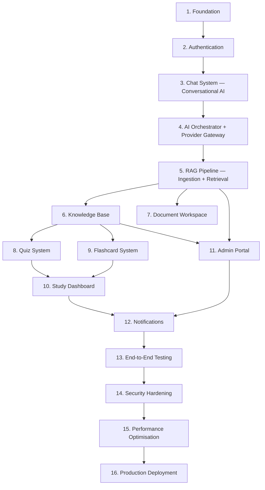
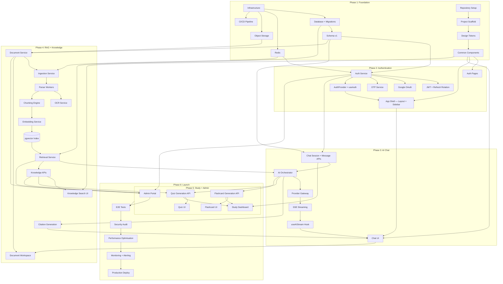

# UPC AI — Implementation Roadmap

**Product:** UPC AI — Official AI-Powered Academic & Campus Assistant for Udai Pratap College (UPC), Varanasi
**Version:** 1.0
**Status:** Engineering execution plan — approved, pre-implementation
**Authored as:** Chief Technology Officer · Principal Software Engineer · Staff Engineering Manager · Principal AI Architect · Technical Program Manager

> **No implementation code appears in this document.** This is a pure engineering execution plan — phases, sprints, dependencies, quality gates, risk mitigations, team assignments, and a launch checklist — detailed enough for the engineering organisation to follow step-by-step from the first commit to production launch.

---

## Table of Contents

- [Section 1 — Implementation Phases](#section-1--implementation-phases)
- [Section 2 — Development Order](#section-2--development-order)
- [Section 3 — Sprint Planning](#section-3--sprint-planning)
- [Section 4 — Module Dependencies](#section-4--module-dependencies)
- [Section 5 — Quality Gates](#section-5--quality-gates)
- [Section 6 — Risk Management](#section-6--risk-management)
- [Section 7 — Team Responsibilities](#section-7--team-responsibilities)
- [Section 8 — Final Development Checklist](#section-8--final-development-checklist)

---

## Section 1 — Implementation Phases

The project is broken into **6 phases**, ordered by dependency (nothing is built before what it depends on exists) and by value (the earliest phases deliver a usable product).

### Phase 1 — Foundation (Weeks 1–3)

| Field | Detail |
|-------|--------|
| **Objective** | Stand up the infrastructure, project scaffolding, CI/CD pipeline, database schema, and design system tokens so that all subsequent development has a stable base. Nothing user-facing ships — this is the platform that everything else builds on. |
| **Dependencies** | Approved architecture documents (all 6 — done). Cloud infrastructure access. Domain/DNS. |
| **Deliverables** | 1. Repository setup (monorepo with apps/packages structure). 2. CI/CD pipeline (lint → test → build → deploy to staging). 3. PostgreSQL database provisioned + pgvector extension + initial schema migration. 4. Redis provisioned. 5. Object storage bucket configured. 6. Next.js project scaffolded with TypeScript, ESLint, Prettier. 7. Design system token CSS custom properties file. 8. Common UI components library (Button, Input, Spinner, Skeleton — the 8 most-used components). 9. API client utility (fetch wrapper with auth headers, error handling, type safety). 10. Environment configuration (dev/staging/prod). |
| **Risks** | Infrastructure provisioning delays. Database schema errors caught late. |
| **Mitigation** | Provision infrastructure in parallel with scaffolding. Schema reviewed by 2 engineers before migration. |
| **Completion Criteria** | ✅ `main` branch builds and deploys to staging with zero errors. ✅ Database migrations run successfully. ✅ Design token CSS renders in a test page. ✅ CI pipeline runs lint + type-check + unit tests. ✅ At least one common component (Button) has a passing unit test. |

---

### Phase 2 — Authentication & Core Shell (Weeks 4–6)

| Field | Detail |
|-------|--------|
| **Objective** | Build the auth system (registration, login, JWT, sessions) and the app shell (layout, sidebar, header, routing) so that an authenticated user can navigate an empty but functional application. |
| **Dependencies** | Phase 1 complete (database, project structure, common components). |
| **Deliverables** | 1. Auth Service (register, login, Google OAuth, OTP, refresh, logout, sessions). 2. JWT issuance + validation + refresh rotation. 3. Auth middleware (API Gateway level). 4. Rate limiting (Redis-backed). 5. Frontend auth pages (Login, Signup, OTP, Forgot Password). 6. AuthProvider + useAuth hook. 7. AppLayout (sidebar + header + content area). 8. Sidebar component (navigation, collapsible). 9. Protected route handling (redirect unauthenticated users). 10. User profile API + settings page (basic). 11. Theme provider (dark/light/system). |
| **Risks** | OAuth configuration issues with college Google Workspace. Token refresh race conditions. |
| **Mitigation** | Test Google OAuth against the college domain early. Implement refresh token rotation with reuse detection from day one. |
| **Completion Criteria** | ✅ User can register, login (email + Google), receive OTP, reset password. ✅ Authenticated user sees the app shell with sidebar and header. ✅ JWT refresh works silently. ✅ Unauthenticated access redirects to login. ✅ Rate limiting returns 429 on excess attempts. ✅ Theme toggle works (dark/light). ✅ All auth endpoints have integration tests. |

---

### Phase 3 — AI Core & Chat System (Weeks 7–12)

| Field | Detail |
|-------|--------|
| **Objective** | Build the AI chat experience end-to-end: the chat UI (prompt composer, message list, streaming), the AI Orchestrator (intent detection, model selection), the Provider Gateway (multi-provider, streaming, fallback), and basic conversation memory. This phase delivers the product's core value — a student can ask a question and get a streaming AI response. No RAG yet — this is pure conversational AI. |
| **Dependencies** | Phase 2 complete (auth, app shell, sidebar). At least one AI provider API key (Gemini or Groq for development). |
| **Deliverables** | 1. Chat Session CRUD API. 2. Message API (create, list, delete). 3. AI Orchestrator — intent detection (academic/conversational/out-of-scope). 4. Provider Gateway — adapters for 2+ providers (e.g., Gemini + Groq), streaming normalisation, retry, circuit breaking. 5. SSE streaming endpoint. 6. Frontend: ChatContainer, MessageList, UserMessage, AIMessage, PromptComposer, SendButton. 7. MarkdownRenderer (headings, lists, bold, italic, links, code blocks — no math/citations yet). 8. CodeBlock with syntax highlighting (Shiki). 9. ThinkingIndicator. 10. useAIStream hook (SSE client). 11. Chat history in sidebar (grouped by date). 12. New Chat button. 13. Streaming cancellation. 14. Conversation memory (session context — last N messages sent with the prompt). 15. Basic prompt templates (system prompts per intent). |
| **Risks** | SSE streaming bugs (connection drops, partial renders). Provider rate limits during development. MarkdownRenderer performance during streaming. |
| **Mitigation** | Build streaming with reconnection from day one. Use cheap providers (Groq/DeepSeek) for development. Implement the rAF batching pattern for streaming rendering from the start. |
| **Completion Criteria** | ✅ Student can create a chat, type a question, see a streaming AI response. ✅ AI responses render as Markdown (headings, lists, code blocks). ✅ Streaming is smooth (no jank at 60fps). ✅ Chat history persists and is browsable in the sidebar. ✅ Stream cancellation works. ✅ Provider fallback works (if primary is down, secondary takes over). ✅ Thinking indicator shows during processing. ✅ Messages persist across sessions (reload shows history). ✅ Load test: 50 concurrent streams with < 2s TTFT. |

---

### Phase 4 — RAG, Knowledge & Documents (Weeks 13–20)

| Field | Detail |
|-------|--------|
| **Objective** | Build the knowledge layer: document ingestion (upload, parse, OCR, chunk, embed), the Retrieval Service (hybrid search, re-ranking, citations), the Knowledge Base (notices, timetables, fees, etc.), and integrate RAG into the AI Orchestrator. After this phase, UPC AI can answer questions grounded in official college documents with citations. This is the phase that transforms UPC AI from a generic chatbot into an institutional knowledge assistant. |
| **Dependencies** | Phase 3 complete (AI Orchestrator, chat system). pgvector extension active. Object storage operational. |
| **Deliverables** | **Backend:** 1. Document Service (upload initiation, presigned URLs, metadata CRUD, versioning). 2. Ingestion Service (job queue, processing orchestration). 3. Parser Workers — PDF text extraction, DOCX/PPTX/XLSX parsing, text/CSV/HTML parsing. 4. OCR Service (Tesseract for text pages, Cloud OCR fallback). 5. Chunking engine (type-aware: paragraph, table, list, heading-anchored). 6. Embedding Service (batch embedding, model versioning). 7. Retrieval Service — query embedding, pgvector HNSW search, BM25 (tsvector) search, Reciprocal Rank Fusion, cross-encoder re-ranking, citation generation. 8. Knowledge Base APIs (notices, events, fees, timetables, scholarships, placements, etc.). 9. RAG integration in Orchestrator — intent routes to Retrieval Service, context assembly, grounded prompts. 10. Citation threading — citations in AI responses link to source documents. **Frontend:** 11. Knowledge Search page (search bar, category pills, filters, result cards). 12. Knowledge detail pages (notice detail, fee structure viewer, etc.). 13. Document Workspace (PDFViewer, split-view with DocumentChat, highlights). 14. Citation rendering in AIMessage (CitationBadge, SourceCards, SourcePanel). 15. Document upload UI (admin — covered more in Phase 5). 16. KaTeX renderer (math in AI responses). 17. Admin: document status tracking (processing pipeline visibility). |
| **Risks** | OCR quality on scanned Hindi documents. Chunking quality (wrong boundaries → bad retrieval). Embedding model cost. Retrieval relevance (garbage in → garbage out). |
| **Mitigation** | Test OCR with a representative sample of 50 real college PDFs early. Build a retrieval evaluation harness (query → expected doc mapping) before shipping. Use a cost-effective embedding model (e.g., text-embedding-3-small). Manually review chunk quality for the first 100 documents. |
| **Completion Criteria** | ✅ Admin can upload a PDF → it is parsed, chunked, embedded, and searchable within 2 minutes. ✅ Student asks "What is the BSc CS fee structure?" → gets a correct, cited answer from the uploaded document. ✅ Citations in AI responses are clickable and link to the source document + page. ✅ Knowledge Search returns relevant results for notices, timetables, etc. ✅ Document Workspace renders PDFs with text selection. ✅ OCR works on scanned documents (> 85% accuracy on test set). ✅ Retrieval evaluation: > 80% precision@5 on a 100-query test set. ✅ Hindi content is retrievable and answerable. |

---

### Phase 5 — Study Tools & Admin Portal (Weeks 21–26)

| Field | Detail |
|-------|--------|
| **Objective** | Build the learning tools (quizzes, flashcards, revision notes, bookmarks, study dashboard) and the admin portal (document approval, user management, analytics, audit logs, system settings). |
| **Dependencies** | Phase 4 complete (RAG, knowledge base, documents). |
| **Deliverables** | **Study Tools:** 1. Quiz generation API (AI-powered). 2. Quiz CRUD + submission + grading. 3. Quiz UI (generator form, player, results with animations). 4. Flashcard generation API (AI-powered). 5. Flashcard CRUD + spaced-repetition scheduling (SM-2). 6. Flashcard UI (deck list, card flip, rating bar). 7. Revision notes generation + CRUD. 8. Revision notes UI. 9. Bookmarks CRUD + UI. 10. Study Dashboard (streak, progress, weak areas, heatmap). 11. Notification Service + in-app notifications UI. **Admin Portal:** 12. Admin Dashboard (overview stats, pending approvals, activity). 13. Document Approval workflow (submit → review → approve/reject → publish). 14. User Management (list, search, activate/deactivate, role assignment). 15. Role Management (CRUD, permission assignment). 16. Analytics Dashboard (usage, costs, retrieval quality, top topics, coverage gaps). 17. AI Indexing Monitor (queue depth, job status, retry). 18. Audit Log viewer (filterable, hash chain verification). 19. System Settings (model selection, cost thresholds). 20. Cost Dashboard (provider breakdown, token usage, cache savings). |
| **Risks** | Quiz/flashcard AI generation quality (bad questions). Admin portal scope creep. Spaced-repetition algorithm bugs. |
| **Mitigation** | Test quiz generation against 10 subjects with faculty review. Limit admin features to the spec — no ad-hoc additions. Use the well-documented SM-2 algorithm with no custom modifications. |
| **Completion Criteria** | ✅ Student generates a quiz → takes it → sees scored results with explanations. ✅ Student reviews flashcards with spaced-repetition scheduling → cards reappear on schedule. ✅ Study Dashboard shows accurate streak, progress, and weak areas. ✅ Admin approves a document → it becomes searchable within 1 minute. ✅ Admin views analytics (daily active users, AI costs, retrieval quality). ✅ Audit logs are complete and hash chain verifies. ✅ Notifications appear in-app when a notice is published. |

---

### Phase 6 — Polish, Security Hardening & Launch (Weeks 27–30)

| Field | Detail |
|-------|--------|
| **Objective** | Performance optimisation, security audit, accessibility audit, end-to-end testing, load testing, documentation, monitoring setup, and production deployment. No new features — only hardening. |
| **Dependencies** | All features complete (Phases 1–5). |
| **Deliverables** | 1. Performance audit (Lighthouse, bundle analysis, TTFB, streaming latency). 2. Bundle optimisation (code splitting, tree shaking, font loading). 3. Security audit (OWASP Top 10, penetration testing, dependency vulnerability scan). 4. Accessibility audit (WCAG 2.2 AA compliance, screen reader testing, keyboard navigation). 5. End-to-end test suite (Playwright — 30+ critical user journeys). 6. Load testing (50, 100, 500 concurrent users — measure TTFT, API latency, DB connections). 7. Monitoring setup (Prometheus metrics, Grafana dashboards, alerting rules). 8. Structured logging (JSON logs, request tracing, sensitive data scrubbed). 9. Health check endpoints. 10. Production infrastructure (database backups, read replicas, connection pooling). 11. Error tracking (Sentry or equivalent). 12. Rate limiting validation. 13. SEO (landing page meta tags, Open Graph, sitemap). 14. User documentation (help center articles, FAQ). 15. Admin documentation (knowledge upload guide, document management). 16. Engineering documentation (runbooks, deployment guide, architecture overview). 17. Final staging review with stakeholders. 18. Production deployment. 19. Post-launch monitoring (72-hour watch). |
| **Risks** | Critical bugs found during security audit. Load testing reveals database bottlenecks. |
| **Mitigation** | Security audit starts in Week 27 — leaves 3 weeks for fixes. Load testing starts in Week 28 — leaves 2 weeks for scaling fixes. |
| **Completion Criteria** | ✅ Lighthouse performance score ≥ 90 on all pages. ✅ No critical or high-severity security findings open. ✅ WCAG 2.2 AA: zero critical violations. ✅ All 30+ E2E tests pass on staging. ✅ Load test: 100 concurrent users, p95 TTFT < 2s, p95 API latency < 500ms, zero 5xx errors. ✅ Monitoring dashboards live with alerting configured. ✅ Backup/restore tested successfully. ✅ Production deployed and stable for 72 hours. |

---

## Section 2 — Development Order

### 2.1 Build Order & Rationale



### 2.2 Module-by-Module Rationale

| Order | Module | Why this order |
|-------|--------|---------------|
| **1** | **Foundation** | Everything depends on the database, CI/CD, and project structure. Cannot write a single feature without this. |
| **2** | **Authentication** | Every feature requires knowing who the user is. Auth is a prerequisite for all protected routes, all API calls, all data ownership. |
| **3** | **Chat System (UI)** | The chat interface (prompt composer, message list, streaming rendering) is the core product surface. Building it early means the team can use it as a test harness for all subsequent AI work. |
| **4** | **AI Orchestrator + Provider Gateway** | The chat system needs an AI backend. The Orchestrator and Provider Gateway are built next because they are the "engine" that powers everything — chat, quiz generation, flashcard generation, summarisation. Build once, use everywhere. |
| **5** | **RAG Pipeline (Ingestion + Retrieval)** | This is where UPC AI becomes differentiated from a generic chatbot. Ingestion (upload → parse → chunk → embed) and Retrieval (search → rank → cite) are the knowledge backbone. Must exist before knowledge-grounded answers, document workspace, or admin approval workflows. |
| **6** | **Knowledge Base** | Structured college knowledge (notices, fees, timetables) depends on the RAG pipeline for search and the document system for storage. Built after RAG because it's a consumer of the retrieval infrastructure. |
| **7** | **Document Workspace** | The PDF viewer, OCR overlay, document chat, and highlight system depend on documents being ingested (Phase 5) and the chat system (Phase 3). It's a composition of existing pieces. |
| **8** | **Quiz System** | Quizzes depend on the AI Orchestrator (for question generation) and the Knowledge Base (for topic-aware generation). Both must exist. |
| **9** | **Flashcard System** | Same dependencies as quizzes. Built in parallel or immediately after. |
| **10** | **Study Dashboard** | The study dashboard aggregates data from quizzes, flashcards, and chat activity. It's a read-only analytics view — all data sources must exist first. |
| **11** | **Admin Portal** | The admin portal depends on documents (approval workflow), the knowledge base (management), user data (user management), and RAG (indexing monitor, retrieval quality). It's a management layer over existing features. |
| **12** | **Notifications** | Notifications are triggered by events across the system (notice published, document approved, quiz reminder). The events must exist before the notification system can fire. |
| **13** | **End-to-End Testing** | All features must be built before comprehensive E2E testing. Unit and integration tests are written throughout development; E2E tests come last. |
| **14** | **Security Hardening** | Security review after feature completion ensures the audit covers the full attack surface. Earlier security work (input validation, auth) is built into each module, but the formal audit is here. |
| **15** | **Performance Optimisation** | Optimise after building. Premature optimisation wastes time on code that might change. Profile real usage patterns, then optimise the hot paths. |
| **16** | **Production Deployment** | Ship last. Only after all quality gates pass. |

---

## Section 3 — Sprint Planning

Sprints are **2 weeks** each. The 30-week project = **15 sprints**.

### Sprint 1 (Weeks 1–2) — Project Foundation

| Field | Detail |
|-------|--------|
| **Goals** | Repository setup, CI/CD, infrastructure provisioning, database schema v1, design tokens. |
| **Features** | Monorepo structure. ESLint + Prettier + TypeScript config. CI pipeline (GitHub Actions or equivalent): lint → type-check → test → build. PostgreSQL + pgvector provisioned. Redis provisioned. Object storage bucket. Database migration tooling + initial schema (users, sessions, messages, documents — core tables). Design system CSS custom property file generated from token definitions. |
| **Complexity** | Medium — infrastructure work, no business logic. |
| **Testing** | CI pipeline itself is the test. Schema migrations run without error. |
| **Review Checklist** | ☐ Repository builds on CI. ☐ Database migrations pass on a clean database. ☐ All team members can clone, install, and run locally. ☐ Design tokens render correctly in a test page. |

---

### Sprint 2 (Weeks 3–4) — Common Components + Auth Backend

| Field | Detail |
|-------|--------|
| **Goals** | Build the common component library (Button, Input, Select, Dialog, Toast, Spinner, Skeleton, Avatar). Start Auth Service backend. |
| **Features** | 8 common components with tests. Storybook (or equivalent) for visual testing. Auth Service: register, login (email), JWT issuance, token refresh, password hashing. Rate limiting middleware. |
| **Complexity** | Medium. Components are well-specified (Design System doc). Auth is standard but must be secure. |
| **Testing** | Component unit tests (Testing Library). Auth integration tests (register → login → refresh → logout). |
| **Review Checklist** | ☐ All 8 components render correctly in all themes (dark, light). ☐ Components pass accessibility checks (axe). ☐ Auth: register → login → get user → refresh → logout flow works end-to-end. ☐ Rate limiting returns 429 on excessive requests. |

---

### Sprint 3 (Weeks 5–6) — Auth Frontend + App Shell

| Field | Detail |
|-------|--------|
| **Goals** | Auth frontend (login, signup, OTP, forgot password pages). App shell (AppLayout, Sidebar, Header). Google OAuth integration. |
| **Features** | Login page. Signup page. OTP verification page. Forgot password flow. Google OAuth (college domain validation). AuthProvider + useAuth hook. AppLayout with Sidebar (collapsible) + Header (notification bell placeholder, user menu). Protected routes (redirect to login if unauthenticated). Theme toggle (dark/light/system). Profile page (basic — name, email, department). Onboarding wizard (4 steps). |
| **Complexity** | Medium-high. OAuth requires college Google Workspace integration. Sidebar animation and responsive behaviour. |
| **Testing** | Auth E2E (Playwright): full register → OTP → login → logout flow. Sidebar: visual regression test. |
| **Review Checklist** | ☐ Full auth flow works (email + Google). ☐ App shell renders with sidebar and header. ☐ Sidebar collapses/expands. ☐ Theme switch works. ☐ Onboarding wizard completes. ☐ Unauthenticated access redirects. |

---

### Sprint 4 (Weeks 7–8) — Chat Backend + Streaming

| Field | Detail |
|-------|--------|
| **Goals** | Chat Session + Message APIs. AI Orchestrator (basic intent detection). Provider Gateway (1 provider, streaming). SSE streaming endpoint. |
| **Features** | Chat session CRUD (create, list, get, update, delete). Message creation + retrieval (paginated). AI Orchestrator — basic intent detection (academic / conversational / out-of-scope). Provider Gateway — adapter for one provider (Gemini or Groq), streaming normalisation. SSE endpoint for streaming AI responses. Prompt template management (system prompts). Conversation context assembly (last N messages). |
| **Complexity** | High. SSE streaming is the most technically challenging backend feature. |
| **Testing** | Integration: send message → receive streaming response → verify persistence. Load: 10 concurrent streams. |
| **Review Checklist** | ☐ SSE stream delivers tokens correctly. ☐ Stream cancellation works (client abort → server cleanup). ☐ Messages persist to database. ☐ Intent detection works for 10 test queries. ☐ Provider fallback: mock primary failure → secondary responds. |

---

### Sprint 5 (Weeks 9–10) — Chat Frontend

| Field | Detail |
|-------|--------|
| **Goals** | Complete chat UI: PromptComposer, MessageList, UserMessage, AIMessage, MarkdownRenderer, streaming experience. |
| **Features** | ChatContainer. MessageList (auto-scroll, load-more). UserMessage. AIMessage with MarkdownRenderer (headings, lists, bold/italic, links). CodeBlock with Shiki highlighting. ThinkingIndicator (pulsing dots). useAIStream hook (SSE client with reconnection). PromptComposer (auto-resize textarea, send button, keyboard shortcuts). Streaming rendering (token-by-token with rAF batching). Chat history in sidebar (grouped by date, session CRUD). New Chat button. Empty chat state (starter questions). |
| **Complexity** | High. MarkdownRenderer + streaming performance is the frontend's hardest problem. |
| **Testing** | Visual: streaming renders smoothly (manual testing + Playwright recording). Unit: MarkdownRenderer parses all Markdown features correctly. |
| **Review Checklist** | ☐ Complete chat flow: type → send → see streaming response → see final Markdown. ☐ Streaming is smooth (no jank). ☐ Code blocks highlight correctly. ☐ Chat history loads and sessions are clickable. ☐ Keyboard shortcuts work (Enter to send, Shift+Enter for newline, / to focus). |

---

### Sprint 6 (Weeks 11–12) — AI Hardening + Multi-Provider

| Field | Detail |
|-------|--------|
| **Goals** | Add 2+ more AI providers. Model selection logic. Fallback chains. Circuit breaker. Cost tracking. Provider health monitoring. |
| **Features** | Provider adapters for OpenAI, Anthropic, DeepSeek (or 2 of these). Model selection algorithm (intent → difficulty → cost tier → model). Fallback chain: primary → secondary → tertiary. Circuit breaker per provider (open → half-open → closed). Token counting + cost estimation per request. Cost logging to database. Semantic caching (Redis — cache responses for semantically similar queries). Message feedback API (thumbs up/down). Feedback UI (MessageActions component). |
| **Complexity** | Medium-high. Multi-provider normalisation + circuit breaker logic. |
| **Testing** | Integration: failover test (mock primary down → verify fallback). Unit: model selection algorithm. |
| **Review Checklist** | ☐ 3+ providers work. ☐ Failover: kill primary → response comes from secondary. ☐ Circuit breaker: 5 consecutive failures → circuit opens → health check → half-open → closed. ☐ Cost logged accurately. ☐ Semantic cache reduces duplicate queries. ☐ Feedback UI works (thumbs up/down → persisted). |

---

### Sprint 7 (Weeks 13–14) — Document Ingestion Pipeline

| Field | Detail |
|-------|--------|
| **Goals** | Upload flow (presigned URLs), parsing (PDF, DOCX, PPTX, XLSX), OCR, chunking, embedding. |
| **Features** | Document Service — upload initiation, presigned URL generation, metadata CRUD, versioning. Ingestion Service — job queue (Redis), processing orchestration, retry logic, dead-letter queue. PDF parser (text extraction + structure detection). DOCX/PPTX/XLSX parsers. OCR Service (Tesseract + cloud fallback). Chunking engine — heading-anchored, paragraph, table, list chunking with metadata preservation. Embedding Service — batch embedding with model versioning. Document processing status API (polling + SSE). Admin: document processing status tracker. |
| **Complexity** | High. Parsing diverse document formats reliably is the hardest engineering problem. |
| **Testing** | 50 real college PDFs (mix of text-native and scanned) processed successfully. Chunk quality reviewed manually for 20 documents. |
| **Review Checklist** | ☐ Upload → parse → OCR → chunk → embed pipeline completes for PDF, DOCX, PPTX. ☐ OCR works on scanned Hindi documents (> 85% accuracy). ☐ Chunking preserves table structure and heading hierarchy. ☐ Embeddings stored in pgvector. ☐ Failed jobs retry and land in dead-letter queue. ☐ Processing status visible via API. |

---

### Sprint 8 (Weeks 15–16) — Retrieval Service + RAG Integration

| Field | Detail |
|-------|--------|
| **Goals** | Hybrid search (vector + BM25), re-ranking, citation generation, RAG integration in Orchestrator. |
| **Features** | Query embedding generation. pgvector HNSW index search (approximate nearest neighbours). BM25 search (tsvector). Metadata pre-filtering (category, department, audience, access level, date range). Reciprocal Rank Fusion (combining vector + BM25 results). Cross-encoder re-ranking (top 20 → top 5). Citation generation (document title, page, snippet, relevance score). RAG integration in Orchestrator: intent=knowledge → retrieve → assemble grounded prompt → generate with citations. CitationBadge + SourceCards + SourcePanel in frontend AIMessage. KaTeX renderer for math in AI responses. |
| **Complexity** | High. Retrieval quality determines product quality. |
| **Testing** | Retrieval evaluation: 100-query test set with expected documents. Precision@5 > 80%. Manual review of 20 RAG-grounded responses by a faculty member. |
| **Review Checklist** | ☐ Student asks a knowledge question → gets a cited answer from real documents. ☐ Citations are accurate (point to the right document + page). ☐ Precision@5 > 80% on test set. ☐ Hindi queries retrieve Hindi documents correctly. ☐ Metadata filters work (department-scoped queries). ☐ KaTeX renders math expressions in AI responses. ☐ SourcePanel opens with clickable citations. |

---

### Sprint 9 (Weeks 17–18) — Knowledge Base + Knowledge Search

| Field | Detail |
|-------|--------|
| **Goals** | Structured knowledge APIs (notices, timetables, fees, etc.), Knowledge Search UI, knowledge detail pages. |
| **Features** | Knowledge APIs — CRUD for: notices, events, fee structure, timetables, academic calendar, scholarships, placements, hostel info, library, policies, attendance rules, previous papers, lab manuals, lecture notes. Knowledge Search page — search bar, category pills, filters (department, date, sort), result cards. Knowledge detail pages — rendered content, source document link, "Ask AI about this" button. Unified search API (across all knowledge types). Search suggestions / typeahead. |
| **Complexity** | Medium. Many endpoints but they follow the same pattern. |
| **Testing** | Integration: CRUD for each knowledge type. Search: query → results match expected. |
| **Review Checklist** | ☐ Admin can create/edit notices, fees, timetables, etc. ☐ Student can search for "exam schedule" and find relevant notices. ☐ Category filters work. ☐ Search results are sorted by relevance. ☐ Knowledge detail page renders correctly. |

---

### Sprint 10 (Weeks 19–20) — Document Workspace

| Field | Detail |
|-------|--------|
| **Goals** | PDF Viewer, Document Chat, highlights, OCR overlay, split-view layout. |
| **Features** | PDFViewer (react-pdf, lazy page rendering, zoom, text selection). OCROverlay (invisible text layer for scanned pages). HighlightLayer (text selection → highlight, Ask AI, copy). DocumentChat (scoped to document, citations link to pages). SplitView layout (viewer + chat, draggable divider). PageNavigator (page number display, jump to page). Document download + preview endpoints. Document version history UI. |
| **Complexity** | Medium-high. PDF rendering + cross-panel communication (citation → page scroll). |
| **Testing** | Visual: 10 different PDFs render correctly. Highlight → Ask AI → response cites the right page. |
| **Review Checklist** | ☐ PDFs render with text selection. ☐ Scanned PDFs have OCR overlay (text selectable). ☐ Highlights persist. ☐ Document Chat answers questions about the document with page citations. ☐ Citation click scrolls the viewer to the cited page. ☐ Split-view resize works. |

---

### Sprint 11 (Weeks 21–22) — Quiz & Flashcards

| Field | Detail |
|-------|--------|
| **Goals** | AI-powered quiz generation, quiz-taking experience, flashcard generation + spaced repetition. |
| **Features** | Quiz generation API (AI-powered, subject + topic + difficulty). Quiz CRUD + submission + grading. Quiz UI: generator form, QuizPlayer (one question at a time, timer, keyboard), QuizResults (animated score, explanations). Flashcard generation API. Flashcard CRUD + SM-2 scheduling. Flashcard UI: deck list, FlashcardCard (3D flip), RatingBar, due card count. Revision notes generation API + CRUD + UI. Bookmark CRUD + UI. |
| **Complexity** | Medium. AI generation is the complexity; CRUD is straightforward. |
| **Testing** | Quiz: generate 10 quizzes across 5 subjects → faculty reviews question quality. Flashcard: create → review → verify SM-2 scheduling calculates next_review_at correctly. |
| **Review Checklist** | ☐ Student generates a quiz → takes it → sees results with explanations. ☐ Flashcard flip animation works. ☐ Spaced repetition scheduling works correctly (easy cards appear later). ☐ Revision notes generated from AI are readable and accurate. ☐ Bookmarks save and display correctly. |

---

### Sprint 12 (Weeks 23–24) — Study Dashboard + Admin Portal (Part 1)

| Field | Detail |
|-------|--------|
| **Goals** | Study analytics dashboard. Admin dashboard + document approval + user management. |
| **Features** | Study Dashboard: streak counter, activity heatmap, subject progress bars, weak areas, revision reminders. Notification Service + in-app notifications (bell icon, unread count, mark read). Admin Dashboard: stat cards (total docs, pending approvals, active users, AI cost). Admin Document Approval: approval queue, review modal (PDF preview + approve/reject + notes), publish flow. Admin User Management: user list table, search, filters, activate/deactivate, role assignment. Admin Role Management: role CRUD, permission checkboxes. |
| **Complexity** | Medium. Data aggregation for analytics. Admin tables are repetitive but must be polished. |
| **Testing** | Study Dashboard: verify calculations (streak, scores, progress). Admin: full approval workflow E2E. |
| **Review Checklist** | ☐ Study Dashboard shows accurate data. ☐ Streak increments on daily activity. ☐ Admin approves a document → it becomes searchable. ☐ Admin rejects a document → uploader sees rejection reason. ☐ User management: deactivate → user can't login. ☐ Notifications appear when a notice is published. |

---

### Sprint 13 (Weeks 25–26) — Admin Portal (Part 2) + Settings

| Field | Detail |
|-------|--------|
| **Goals** | Admin analytics, cost dashboard, indexing monitor, audit logs, system settings. User settings (full). |
| **Features** | Admin Analytics: usage charts, cost breakdown, retrieval quality metrics, top topics, coverage gaps. Admin Cost Dashboard: provider costs, token usage, cache savings. Admin Indexing Monitor: queue depth, job status, retry, reindex. Admin Audit Logs: filterable table, before/after state, hash chain verification. Admin System Settings: model selection, rate limits, feature flags. User Settings: profile editing, appearance (theme, OLED, compact mode), AI preferences, notification preferences, accessibility settings, keyboard shortcuts reference, account management (change password, delete account). |
| **Complexity** | Medium. Charts require Recharts integration. Audit verification is unique. |
| **Testing** | Analytics: verify aggregation queries against test data. Audit: insert 1000 log entries → verify chain integrity. |
| **Review Checklist** | ☐ Admin analytics dashboard loads with real data. ☐ Cost dashboard shows accurate provider breakdown. ☐ Indexing monitor reflects actual queue state. ☐ Audit log hash chain verifies successfully. ☐ System settings changes take effect (e.g., changing default model). ☐ User settings persist across sessions. |

---

### Sprint 14 (Weeks 27–28) — Testing, Security & Accessibility

| Field | Detail |
|-------|--------|
| **Goals** | Comprehensive E2E test suite. Security audit. Accessibility audit. |
| **Features** | Playwright E2E tests: 30+ critical user journeys (registration, login, chat, quiz, flashcard, knowledge search, document view, admin approval, settings). Security audit: OWASP Top 10 review, dependency vulnerability scan, penetration testing (auth bypass, injection, XSS, CSRF, file upload abuse). Accessibility audit: WCAG 2.2 AA automated scan (axe) + manual testing (keyboard navigation, screen reader). Load testing: 50, 100, 500 concurrent users. Fix all critical and high-severity findings. |
| **Complexity** | Medium. Testing is labor-intensive, not technically novel. Security fixes may be complex. |
| **Testing** | This IS the testing sprint. Meta-test: all tests pass on staging. |
| **Review Checklist** | ☐ All 30+ E2E tests pass on staging. ☐ Zero critical/high security findings open. ☐ WCAG 2.2 AA: zero critical violations. ☐ Load test passes at 100 concurrent users (all SLOs met). ☐ All dependency vulnerabilities patched or acknowledged. |

---

### Sprint 15 (Weeks 29–30) — Performance, Monitoring & Launch

| Field | Detail |
|-------|--------|
| **Goals** | Performance optimisation. Monitoring + alerting. Production deployment. Launch. |
| **Features** | Performance: Lighthouse audits, bundle analysis, lazy loading verification, image optimisation, font loading. Monitoring: Prometheus metrics, Grafana dashboards (API latency, error rate, AI costs, queue depth), alerting rules (PagerDuty/Slack). Structured logging: JSON format, request tracing, PII scrubbed. Health check endpoints (/health, /health/ready, /health/dependencies). Error tracking (Sentry integration). Production infrastructure: database backups (automated), read replicas, PgBouncer connection pooling. SEO: landing page meta tags, Open Graph, sitemap.xml. Documentation: user guide, admin guide, engineering runbook, deployment guide. Staging final review with stakeholders. **Production deployment.** Post-launch monitoring: 72-hour engineering watch. |
| **Complexity** | Medium. Infrastructure and configuration, not new features. |
| **Testing** | Production smoke tests: register → login → chat → quiz → knowledge search. |
| **Review Checklist** | ☐ Lighthouse ≥ 90 on all pages. ☐ Monitoring dashboards live with data flowing. ☐ Alerting fires on test alert. ☐ Database backup + restore tested. ☐ Production deployed and serving traffic. ☐ 72-hour watch: zero critical incidents. |

---

## Section 4 — Module Dependencies

### 4.1 Full Dependency Graph



### 4.2 Critical Path

The **critical path** — the longest sequence of dependent tasks that determines the minimum project duration:

```
Foundation → Auth → Chat Backend + SSE → Chat Frontend → AI Multi-Provider →
Document Ingestion → Retrieval Service + RAG → Knowledge Base → Admin Portal →
E2E Testing → Security Audit → Production Deploy
```

**Duration: 30 weeks.** No parallelisation shortens this path because each step depends on the previous.

### 4.3 Parallelisable Tracks

While the critical path is sequential, several modules can be built in **parallel** by separate team members:

| Sprint | Critical Path | Parallel Track |
|--------|--------------|----------------|
| Sprint 2 | Auth Backend | Common Components (frontend) |
| Sprint 7 | Document Ingestion | Knowledge API scaffolding (backend) |
| Sprint 9 | Knowledge Search UI | Document Workspace UI (frontend) |
| Sprint 11 | Quiz + Flashcards | Revision Notes + Bookmarks (backend) |
| Sprint 12 | Admin Portal (Part 1) | Study Dashboard (frontend) |
| Sprint 13 | Admin Portal (Part 2) | User Settings (frontend) |

---

## Section 5 — Quality Gates

Before moving from one phase to the next, ALL of the following gates must pass.

### Gate 1: Code Quality

| Requirement | Standard |
|-------------|----------|
| **Code review** | Every PR reviewed by ≥ 1 engineer (2 for auth, security, AI orchestrator). |
| **Lint** | Zero ESLint errors, zero TypeScript errors (`strict` mode). |
| **Formatting** | Prettier-formatted. No style debates in reviews. |
| **Naming** | Components: PascalCase. Hooks: use prefix. Files match export name. |
| **Documentation** | Every exported function has a JSDoc comment. Every API endpoint has OpenAPI spec. |
| **No dead code** | No commented-out code, no unused imports, no unused variables (enforced by lint). |

### Gate 2: Testing

| Requirement | Standard |
|-------------|----------|
| **Unit tests** | Every utility function, every custom hook, every business logic module. Coverage > 80% on business logic (not UI). |
| **Integration tests** | Every API endpoint has at least one happy-path and one error-path test. |
| **Component tests** | Every common component has a rendering test + accessibility test (axe). |
| **E2E tests** | Critical user journeys (added incrementally per sprint). |
| **AI tests** | Retrieval evaluation test set (100 queries → expected documents). |
| **No skipped tests** | `test.skip()` is forbidden in `main`. |

### Gate 3: Performance

| Requirement | Standard |
|-------------|----------|
| **Bundle size** | Initial JS bundle < 200KB (gzipped). Per-route chunks < 100KB. |
| **First Contentful Paint** | < 1.5s on 4G connection. |
| **Time to First Token (AI)** | p95 < 2s. |
| **API response time** | p95 < 500ms for non-AI endpoints. |
| **Lighthouse** | Score ≥ 85 on all pages (target ≥ 90 at launch). |
| **No memory leaks** | SSE connections cleaned up on unmount. No growing event listener counts. |

### Gate 4: Security

| Requirement | Standard |
|-------------|----------|
| **Auth** | JWT validation on every protected endpoint. Refresh token rotation with reuse detection. |
| **Input validation** | Every API endpoint validates input (Zod schema on both client and server). |
| **SQL injection** | Zero raw SQL queries. All queries parameterised (via ORM or query builder). |
| **XSS** | All user content HTML-escaped before rendering. |
| **File upload** | Magic byte validation. Virus scan. Presigned URLs only (files never transit app server). |
| **Secrets** | Zero secrets in code or logs. Environment variables only. |
| **Dependencies** | Zero known critical vulnerabilities (`npm audit`). |

### Gate 5: Accessibility

| Requirement | Standard |
|-------------|----------|
| **WCAG 2.2 AA** | Zero critical violations (axe automated scan). |
| **Keyboard** | Every interactive element reachable via keyboard. Focus visible on all elements. |
| **Screen reader** | All components have appropriate ARIA roles/labels. Tested with VoiceOver/NVDA. |
| **Contrast** | All text meets 4.5:1 (normal) / 3:1 (large) contrast ratio. |
| **Reduced motion** | All animations respect `prefers-reduced-motion`. |

### Gate 6: Documentation

| Requirement | Standard |
|-------------|----------|
| **API docs** | OpenAPI spec for every endpoint. |
| **Component docs** | Props documentation for every common component. |
| **Architecture docs** | Updated architecture documents if implementation deviates from spec. |
| **Runbooks** | For every critical system: how to debug, how to restart, how to rollback. |

---

## Section 6 — Risk Management

### 6.1 Risk Register

| ID | Risk | Probability | Impact | Category |
|----|------|------------|--------|----------|
| R1 | OCR quality on scanned Hindi PDFs is poor | High | High | Technical |
| R2 | AI provider rate limits / outages during development and production | Medium | High | AI |
| R3 | Retrieval quality is insufficient (wrong documents returned) | Medium | Critical | AI |
| R4 | SSE streaming connection instability (proxies, load balancers dropping connections) | Medium | Medium | Technical |
| R5 | Token costs exceed budget at scale | Medium | High | AI |
| R6 | Database performance degrades at scale (50k+ users) | Low | High | Scalability |
| R7 | Security vulnerability in auth (token theft, session hijacking) | Low | Critical | Security |
| R8 | Document parsing fails on unexpected formats (encrypted PDFs, complex PPTX) | Medium | Medium | Technical |
| R9 | Bundle size grows beyond acceptable limits | Medium | Medium | Performance |
| R10 | Scope creep (stakeholders request features not in spec) | High | Medium | Management |

### 6.2 Mitigation Strategies

| ID | Mitigation |
|----|-----------|
| **R1** | Test OCR on 50 real Hindi documents in Sprint 7. If Tesseract fails below 80%, switch to Google Cloud Vision or Azure Document Intelligence for Hindi pages. Budget for cloud OCR costs. |
| **R2** | Multi-provider architecture from Sprint 6. Circuit breakers + automatic failover. Use cheap providers (Groq, DeepSeek) for development to preserve primary provider quotas for production. |
| **R3** | Build a retrieval evaluation harness in Sprint 8 (100-query test set). Run evaluation after every retrieval change. If precision@5 < 80%, iterate on chunking strategy, embedding model, or re-ranking before shipping. Faculty review 20 answers before Phase 4 signoff. |
| **R4** | Implement SSE with heartbeat (15-second keep-alive), reconnection with `Last-Event-ID`, and sequence numbers on tokens from Sprint 4. Test through production load balancer early. |
| **R5** | Semantic caching (Sprint 6) to eliminate duplicate queries (~30% of volume). Model tiering: cheap models for simple questions, expensive models for reasoning. Daily cost alerting in admin dashboard. Budget cap per model per day. |
| **R6** | Partitioning plan from database architecture (messages by month). Read replicas for analytics queries. PgBouncer for connection pooling. Load test at 100 and 500 concurrent users in Sprint 14. |
| **R7** | Rotating refresh tokens with reuse detection from Sprint 2. JWT signed with RS256 (asymmetric). Penetration testing in Sprint 14. Account lockout after failed attempts. |
| **R8** | Whitelist supported formats. Reject unsupported files at upload. Log and skip corrupted pages instead of failing entire documents. Dead-letter queue for manual review. |
| **R9** | Bundle analysis in CI (fail build if initial bundle > 200KB gzipped). Lazy loading for heavy modules (admin, PDF viewer, KaTeX, Recharts). No barrel imports. |
| **R10** | All feature requests go through the PM. No feature is implemented without updating the spec first. The spec is the contract. "Is this in the spec?" is a valid and complete response to a scope request. |

---

## Section 7 — Team Responsibilities

### 7.1 Assumed Team Structure

| Role | Count | Focus |
|------|-------|-------|
| **Frontend Engineers** | 2–3 | React, Next.js, components, streaming UI, accessibility |
| **Backend Engineers** | 2–3 | API services, database, job queues, document processing |
| **AI Engineers** | 1–2 | Orchestrator, provider gateway, RAG pipeline, prompt engineering, retrieval quality |
| **Database Engineer** | 1 | Schema design, migrations, pgvector tuning, query optimisation, partitioning |
| **DevOps Engineer** | 1 | Infrastructure, CI/CD, monitoring, deployment, security hardening |
| **UI/UX Designer** | 1 | Figma screens from the spec, visual QA, interaction refinement |
| **QA Engineer** | 1 | E2E tests, accessibility testing, load testing, security testing |
| **Technical Lead / PM** | 1 | Architecture decisions, sprint planning, code review, stakeholder communication |

### 7.2 Module Ownership

| Module | Primary Owner | Reviewer |
|--------|--------------|----------|
| **Infrastructure & CI/CD** | DevOps | Tech Lead |
| **Database schema & migrations** | Database Engineer | Backend Engineer |
| **Auth Service** | Backend Engineer 1 | Backend Engineer 2 + Tech Lead |
| **Chat Session/Message APIs** | Backend Engineer 1 | Backend Engineer 2 |
| **AI Orchestrator** | AI Engineer 1 | Tech Lead |
| **Provider Gateway** | AI Engineer 1 | AI Engineer 2 |
| **Retrieval Service** | AI Engineer 2 | AI Engineer 1 |
| **Embedding Service** | AI Engineer 2 | AI Engineer 1 |
| **Document Service** | Backend Engineer 2 | Backend Engineer 1 |
| **Ingestion + Parsers + OCR** | Backend Engineer 2 + AI Engineer 2 | Tech Lead |
| **Knowledge APIs** | Backend Engineer 1 | Backend Engineer 2 |
| **Quiz/Flashcard APIs** | Backend Engineer 1 | Backend Engineer 2 |
| **Notification Service** | Backend Engineer 2 | Backend Engineer 1 |
| **Admin APIs** | Backend Engineer 2 | Backend Engineer 1 |
| **Design System (tokens + components)** | Frontend Engineer 1 | UI/UX Designer |
| **App Shell (layout, sidebar, header)** | Frontend Engineer 1 | Frontend Engineer 2 |
| **Auth pages** | Frontend Engineer 2 | Frontend Engineer 1 |
| **Chat UI** | Frontend Engineer 1 | Frontend Engineer 2 + Tech Lead |
| **MarkdownRenderer + streaming** | Frontend Engineer 1 | Tech Lead |
| **Document Workspace** | Frontend Engineer 2 | Frontend Engineer 1 |
| **Knowledge Search UI** | Frontend Engineer 2 | Frontend Engineer 1 |
| **Quiz + Flashcard UI** | Frontend Engineer 2 (or 3) | Frontend Engineer 1 |
| **Study Dashboard** | Frontend Engineer 2 | Frontend Engineer 1 |
| **Admin Portal UI** | Frontend Engineer 1 | Frontend Engineer 2 |
| **Settings UI** | Frontend Engineer 2 | Frontend Engineer 1 |
| **E2E Tests** | QA Engineer | Tech Lead |
| **Accessibility Testing** | QA Engineer + Frontend Engineers | UI/UX Designer |
| **Load Testing** | QA Engineer + DevOps | Tech Lead |
| **Security Audit** | DevOps + Tech Lead | External (if available) |
| **Monitoring + Alerting** | DevOps | Tech Lead |
| **Documentation** | All (each module owner documents their module) | Tech Lead |

### 7.3 Cross-Cutting Responsibilities

| Responsibility | Owner |
|----------------|-------|
| **Code review enforcement** | Tech Lead (all PRs require review) |
| **Sprint planning + standup** | Tech Lead |
| **Architecture decisions** | Tech Lead + module owner |
| **Dependency updates** | DevOps (weekly `npm audit` + `dependabot`) |
| **Production on-call** | Rotating: all engineers |
| **Stakeholder demos** | Tech Lead (end of each sprint) |

---

## Section 8 — Final Development Checklist

### 8.1 Pre-Launch Checklist

This checklist must be 100% complete before the production launch.

#### Functionality

- [ ] User can register (email + Google OAuth)
- [ ] User can login, logout, refresh session
- [ ] OTP verification works
- [ ] Password reset works
- [ ] Onboarding wizard completes (new users)
- [ ] Dashboard loads with accurate data (recent chats, announcements, study progress)
- [ ] New chat session can be created
- [ ] User can send a message and receive a streaming AI response
- [ ] AI responses render Markdown correctly (headings, lists, code, tables, math)
- [ ] Code blocks have syntax highlighting + copy button
- [ ] Citations appear inline and link to source documents
- [ ] Source panel opens with document details
- [ ] Chat history persists and is browsable
- [ ] Chat sessions can be renamed, pinned, archived, deleted
- [ ] Study mode selector works (Learn, Practice, etc.)
- [ ] Language switch works (English ↔ Hindi AI responses)
- [ ] File attachments can be sent with messages
- [ ] AI response feedback (thumbs up/down) works
- [ ] Message regeneration works
- [ ] Document upload completes successfully (PDF, DOCX, PPTX, XLSX)
- [ ] Document processing pipeline completes (parse → OCR → chunk → embed)
- [ ] Knowledge Search returns relevant results
- [ ] Knowledge category filters work
- [ ] Knowledge detail pages render correctly
- [ ] Document Workspace renders PDFs with text selection
- [ ] Document Chat answers questions about the document
- [ ] Highlights can be created and persisted
- [ ] Quiz generation produces valid questions
- [ ] Quiz taking works (timer, options, navigation, submit)
- [ ] Quiz results display with scores and explanations
- [ ] Flashcard generation produces valid cards
- [ ] Flashcard review works (flip, rate, spaced repetition)
- [ ] Revision notes can be generated and edited
- [ ] Bookmarks can be created, listed, and deleted
- [ ] Study Dashboard shows accurate metrics
- [ ] Notifications appear for relevant events
- [ ] User settings persist (theme, language, AI preferences)
- [ ] Admin can approve/reject documents
- [ ] Admin can manage users (activate, deactivate, assign roles)
- [ ] Admin analytics dashboard shows accurate data
- [ ] Admin cost dashboard shows provider breakdown
- [ ] Admin audit logs are complete and verifiable
- [ ] Admin system settings work

#### Security

- [ ] JWT tokens expire after 15 minutes
- [ ] Refresh token rotation works with reuse detection
- [ ] Failed login attempts lock the account after 5 tries
- [ ] Rate limiting returns 429 on all rate-limited endpoints
- [ ] SQL injection: zero parameterised query bypasses
- [ ] XSS: all user content sanitised
- [ ] CSRF: mitigated by Bearer token requirement + SameSite cookies
- [ ] File uploads: magic byte validation, virus scan, size limits
- [ ] No secrets in code, logs, or client-side bundle
- [ ] Presigned URLs expire after 1 hour
- [ ] Admin actions require admin role (non-admins get 403)
- [ ] Audit log records every privileged action
- [ ] Password hashed with bcrypt (cost factor ≥ 12)
- [ ] Dependency vulnerability scan: zero critical
- [ ] HTTPS enforced on all endpoints (HTTP redirects to HTTPS)

#### Performance

- [ ] Lighthouse score ≥ 90 (performance) on all pages
- [ ] Initial JS bundle < 200KB gzipped
- [ ] Time to First Token (AI): p95 < 2 seconds
- [ ] API response time: p95 < 500ms (non-AI endpoints)
- [ ] Database queries: no query > 1 second in normal operation
- [ ] Load test: 100 concurrent users — all SLOs met, zero 5xx errors
- [ ] Streaming: smooth rendering at 60fps during token delivery
- [ ] Images optimised (WebP, lazy loading, proper dimensions)
- [ ] Fonts self-hosted and loaded without FOUT

#### Accessibility

- [ ] WCAG 2.2 AA: zero critical violations (automated scan)
- [ ] All pages keyboard-navigable
- [ ] All interactive elements have visible focus indicators
- [ ] All icon-only buttons have aria-labels
- [ ] All form inputs have associated labels
- [ ] All images/icons have alt text
- [ ] Screen reader testing passed (VoiceOver on macOS, NVDA on Windows)
- [ ] Reduced motion preference respected
- [ ] Colour contrast meets 4.5:1 / 3:1 minimum
- [ ] Skip-to-content link works

#### AI Quality

- [ ] Retrieval precision@5 > 80% on 100-query test set
- [ ] AI responses are grounded in documents (no hallucination on knowledge queries)
- [ ] Citations are accurate (correct document, correct page)
- [ ] Hindi queries return Hindi-relevant results
- [ ] Out-of-scope queries are handled gracefully ("I can only help with...")
- [ ] Provider failover works (primary down → secondary responds)
- [ ] Semantic cache hit rate > 25% on repeated queries
- [ ] Quiz questions reviewed by faculty (10 quizzes across 5 subjects)
- [ ] Token cost per message within budget ($0.005 average)

#### Deployment & Infrastructure

- [ ] Production database provisioned with backups (automated daily, tested restore)
- [ ] Read replica provisioned and serving analytics queries
- [ ] PgBouncer configured (connection pooling)
- [ ] Redis provisioned (caching + rate limiting + job queue)
- [ ] Object storage configured with lifecycle policies
- [ ] CDN configured for static assets
- [ ] Domain + SSL certificate configured
- [ ] Environment variables set for production (no hardcoded values)
- [ ] CI/CD pipeline deploys to production via manual trigger (not auto-deploy)

#### Monitoring & Observability

- [ ] Health check endpoints respond (/health, /health/ready)
- [ ] Prometheus metrics exported (API latency, error rate, AI costs, queue depth)
- [ ] Grafana dashboards configured (API, AI, Retrieval, Ingestion, Auth)
- [ ] Alerting rules configured (error rate > 5%, provider down, queue backlog, cost spike)
- [ ] Structured JSON logging active
- [ ] Request tracing (X-Request-Id propagated through all services)
- [ ] Error tracking (Sentry) capturing unhandled exceptions
- [ ] No PII in logs (email, name, phone, message content not logged)

#### Documentation

- [ ] User guide (help center articles for students)
- [ ] Admin guide (knowledge upload, document approval, analytics)
- [ ] Engineering runbook (how to debug, restart, rollback each service)
- [ ] Deployment guide (step-by-step production deployment process)
- [ ] API documentation (OpenAPI spec for all endpoints)
- [ ] Architecture overview (updated if implementation deviates from spec)

---

## Closing Note

This roadmap turns 556 KB of architecture specification into an actionable 30-week engineering plan.

Three principles guide the execution:

1. **Dependencies dictate order.** Every module is built after the modules it depends on. The critical path — foundation → auth → chat → AI → RAG → knowledge → admin → launch — is non-negotiable. Parallelisable tracks accelerate delivery, but never at the cost of building on an unfinished dependency.

2. **Quality gates are binary.** A gate passes or it doesn't. There is no "mostly passing." Code review, testing, security, accessibility, and performance standards are defined explicitly so there is no ambiguity about whether a phase is done.

3. **Risk is managed, not avoided.** Every identified risk has a specific mitigation strategy with a specific sprint where the mitigation is executed. OCR quality is tested in Sprint 7, not discovered in Sprint 14. Retrieval quality is evaluated in Sprint 8, not hoped for at launch.

From the first commit to production: **15 sprints, 30 weeks, one step at a time.**
