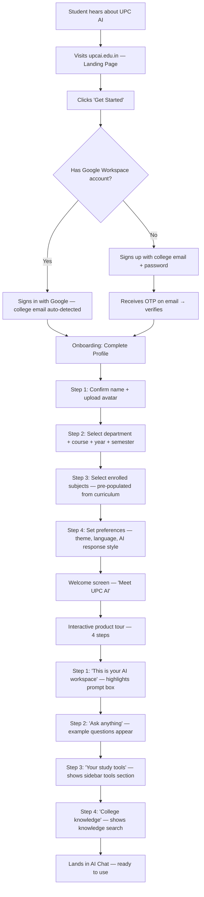
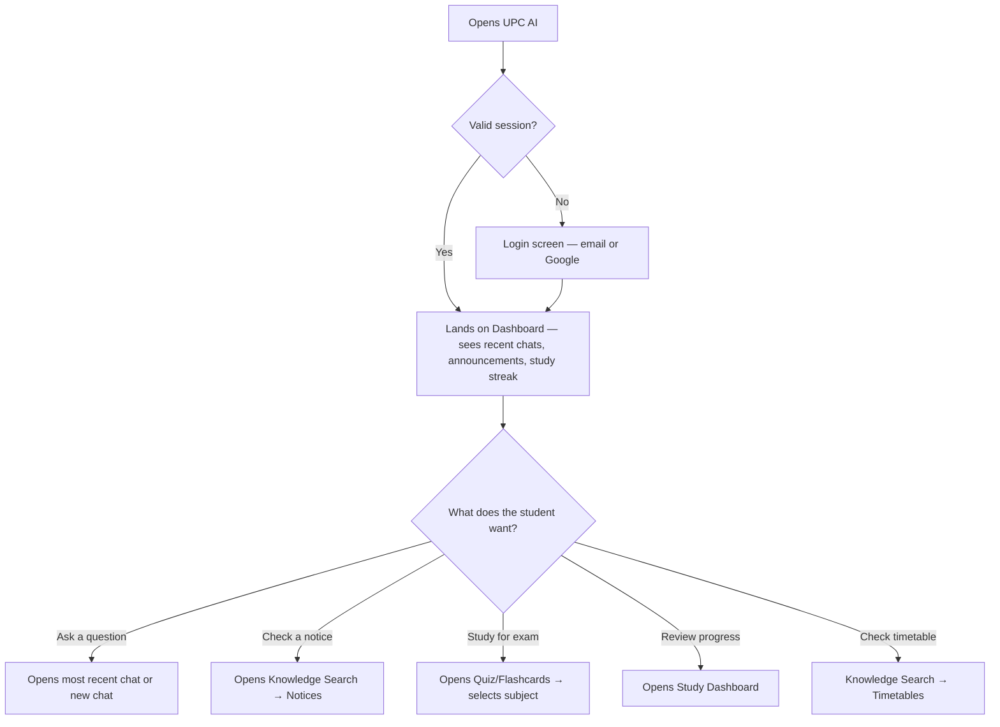
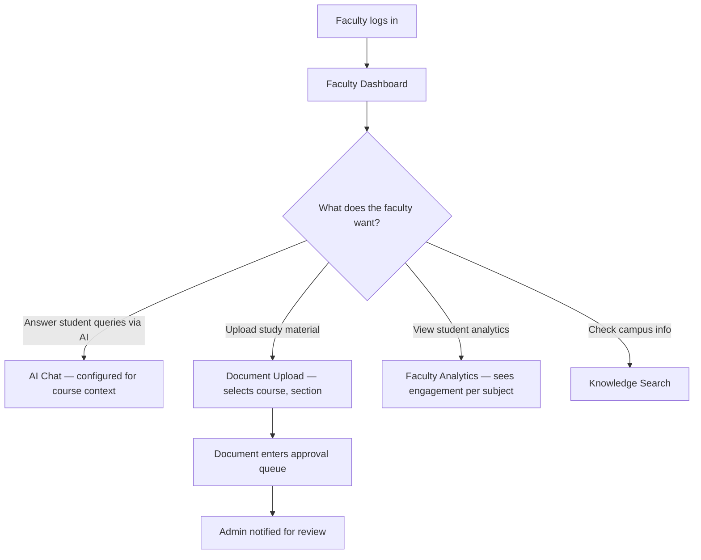
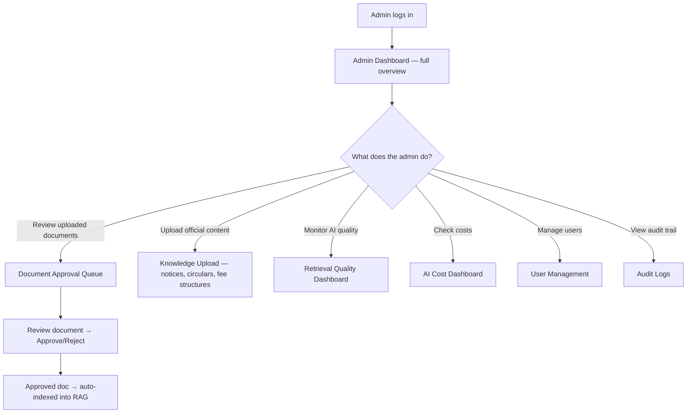

# UPC AI — UI/UX Specification

**Product:** UPC AI — Official AI-Powered Academic & Campus Assistant for Udai Pratap College (UPC), Varanasi
**Version:** 2.0 — design language pivoted to the warm-editorial system (see UPC AI Design System v2.0)
**Status:** UI/UX blueprint — approved, pre-implementation
**Authored as:** VP of Product Design · Lead UX Designer · Senior Product Designer · Staff UX Architect · Design Director for AI Products

> **No implementation code appears in this document.** No React, no HTML, no CSS, no Tailwind. This is a pure UI/UX specification — screens, flows, layouts, interactions, states, and rationale — detailed enough for a senior product design team to create the entire Figma design system and all screens directly.

---

## Table of Contents

- [Section 1 — User Flows](#section-1--user-flows)
- [Section 2 — Landing Page](#section-2--landing-page)
- [Section 3 — Authentication](#section-3--authentication)
- [Section 4 — Main Dashboard](#section-4--main-dashboard)
- [Section 5 — AI Chat Workspace](#section-5--ai-chat-workspace)
- [Section 6 — Document Workspace](#section-6--document-workspace)
- [Section 7 — Quiz & Flashcards](#section-7--quiz--flashcards)
- [Section 8 — Study Dashboard](#section-8--study-dashboard)
- [Section 9 — Knowledge Search](#section-9--knowledge-search)
- [Section 10 — Admin Dashboard](#section-10--admin-dashboard)
- [Section 11 — Profile & Settings](#section-11--profile--settings)
- [Section 12 — Empty, Loading & Error States](#section-12--empty-loading--error-states)
- [Section 13 — Responsive Experience](#section-13--responsive-experience)
- [Section 14 — Micro-Interactions](#section-14--micro-interactions)

---

## Notation

Throughout this document, screen layouts are described using ASCII wireframes with the following conventions:

```
┌───┐ = container boundary
│   │ = content area
├───┤ = section divider
└───┘ = container end
[ Button ] = interactive element
···  = expandable/collapsible content
→ = navigation/flow arrow
```

Component names reference the UPC AI Design System (v2.0). Colour references use token names (e.g., `surface-card`, `app-canvas`, `ink`, `accent`). Spacing references use token names (e.g., `space-md` = 16px).

**Design language (v2.0):** warm-editorial — cream canvas (`#faf9f5` marketing / `#F0ECE0` product), serif display headlines (Cormorant Garamond), humanist sans body (Inter), warm coral CTAs (`#cc785c`), product accents in orange (`#c96442`), and dark navy product surfaces (`#181715` family). No cool grays, no pure white floors, no blue accents anywhere.

---

## Section 1 — User Flows

### 1.1 New Student Onboarding



**Design notes:**

- **Onboarding is 4 steps maximum.** Each step fits on a single screen. No scrolling required. Progress indicator (4 dots) at the top.
- **Step 2 (academic details)** pre-populates available options based on previous selections (selecting "Computer Science" department shows only CS courses). This reduces cognitive load.
- **Step 3 (subjects)** shows a grid of subject cards with checkboxes. Pre-checked based on the standard curriculum for their year/semester. The student confirms or adjusts.
- **Step 4 (preferences)** shows four choices: theme (light/dark/system), response language (English/Hindi/auto-detect), response length (concise/detailed/exhaustive), and difficulty level (beginner/intermediate/advanced). Defaults to light, English, detailed, intermediate. Each option is a visual toggle, not a dropdown.
- **Welcome screen** is a single screen with the UPC AI sparkle mark, a serif display headline ("Welcome to UPC AI, Rahul"), a brief 2-line explanation in body sans, and a "Start Exploring" coral button. This screen exists for one purpose: to make the student feel welcomed before entering the product.
- **Product tour** uses a spotlight overlay (dims everything except the highlighted element). Each step has a tooltip with a short sentence and a "Next" button. The user can skip the tour at any time.

**Time from signup to first chat: under 3 minutes.**

### 1.2 Returning Student



**Design notes:**

- **Auto-login:** if the refresh token is valid, the student bypasses login entirely. The dashboard loads within 1.5 seconds.
- **Dashboard as launchpad:** the dashboard is NOT a destination — it is a launchpad. The most prominent element is the prompt box ("Ask UPC AI anything...") at the centre. Below it: recent chat sessions (2–3 cards), announcements (if any), and quick-action buttons.
- **Keyboard shortcut:** pressing `/` on the dashboard immediately focuses the prompt box. `⌘/Ctrl+N` opens a new chat.

### 1.3 Faculty Flow



**Design notes:**

- Faculty see the same core interface as students, with additional navigation items: "My Uploads" and "Analytics" in the sidebar.
- The upload flow is prominent — a dedicated "Upload Material" button in the sidebar and on the dashboard.
- Faculty analytics show aggregate data: which subjects are most queried, which topics students struggle with.

### 1.4 Administrator Flow



**Design notes:**

- Admins have a completely separate dashboard layout (see Section 10). They can switch to the "student view" via a toggle to experience UPC AI as a student would.
- The admin dashboard is information-dense — tables, charts, counters. It prioritises scanability over aesthetics (though both are achieved).

---

## Section 2 — Landing Page

### 2.1 Purpose

The landing page converts a visitor into a user. It must accomplish three things in under 10 seconds:

1. **Explain** what UPC AI is (official AI assistant for UPC).
2. **Demonstrate** what it does (academic AI + college knowledge).
3. **Motivate** the visitor to sign up ("Get Started Free").

### 2.2 Layout

The landing page follows the warm-editorial marketing structure: a cream top-nav, a serif hero with a dark product mockup, and alternating cream/dark/coral bands on a strict 96px rhythm. Content max-width 1200px.

```
┌────────────────────────────────────────────────────────────────┐
│  TOP NAV — 64px, canvas bg, hairline bottom border             │
│  [✳ UPC AI]   Features  Knowledge  Study Tools  For Faculty    │
│  FAQ                                  [Sign in] [Try UPC AI]  │
│                                        (text-link) (coral ●)  │
├────────────────────────────────────────────────────────────────┤
│  HERO BAND — canvas, 96px vertical padding, 6/6 grid           │
│                                                                │
│  [ OFFICIAL · UDAI PRATAP COLLEGE ]         ← badge-coral      │
│                                                                │
│  Meet your thinking                        ← display-xl serif  │
│  partner for campus.                                           │
│                                                                │
│  The official AI assistant that knows your courses,           │
│  your campus, and your curriculum — inside and out.            │
│                                                                │
│  [ Get Started Free ]      [ See it in action → ]              │
│  (coral primary)           (text-link)                         │
│                                                                │
│                ┌───────────────────────────────────┐           │
│                │  DARK CHAT MOCKUP (surface-dark)  │           │
│                │  radius 16 · real product chrome  │           │
│                │                                   │           │
│                │  ✳ What is the BSc CS fee         │           │
│                │    structure for 2nd year?        │           │
│                │  ───────────────────────────      │           │
│                │  Tuition: ₹15,000/semester  [1]   │           │
│                │  Library: ₹2,000  Lab: ₹3,000 [2] │           │
│                │                                   │           │
│                │  ▸ Sources: Fee Structure 2025-26 │           │
│                │    (Official) · Page 1            │           │
│                └───────────────────────────────────┘           │
├────────────────────────────────────────────────────────────────┤
│  STRIP — "Used by 5,000+ students across 12 departments"      │
│          (muted text, hairline top + bottom)                   │
├────────────────────────────────────────────────────────────────┤
│  FEATURES — canvas band, cream feature cards, 3-up             │
│  ┌──────────────┐  ┌──────────────┐  ┌──────────────┐         │
│  │ (icon)       │  │ (icon)       │  │ (icon)       │         │
│  │ Academic AI  │  │ College      │  │ Study Tools  │         │
│  │ Ask doubts,  │  │ Knowledge    │  │ Quizzes,     │         │
│  │ get answers  │  │ Fees, exams, │  │ flashcards,  │         │
│  │ with steps   │  │ notices —    │  │ revision     │         │
│  │ & citations  │  │ cited &      │  │ notes — AI   │         │
│  │              │  │ accurate     │  │ generated    │         │
│  └──────────────┘  └──────────────┘  └──────────────┘         │
├────────────────────────────────────────────────────────────────┤
│  PRODUCT BAND — dark navy (surface-dark)                       │
│  Left: "Grounded in official documents."  ← display-md serif  │
│        + body-md on-dark text + "See how retrieval works →"   │
│  Right: code-window-card — a solved math/code answer with     │
│         line numbers, syntax colors, terminal output panel    │
├────────────────────────────────────────────────────────────────┤
│  COMPARISON — canvas band, two comparison cards                │
│  [ Ask anything — open academic AI ]  [ Official answers —    │
│  hairline cards, title-md + body + text-link     RAG + cites ] │
├────────────────────────────────────────────────────────────────┤
│  COLLEGE KNOWLEDGE — cream band, knowledge tiles 4-up          │
│  [Notices] [Fee Structure] [Timetables] [Syllabus]             │
│  [Scholarships] [Prev Papers] [Lab Manuals] [Hostel]           │
│  [Library] [Placements] — tile: monogram circle + title +      │
│  "120+ documents" caption                                      │
├────────────────────────────────────────────────────────────────┤
│  TESTIMONIALS — canvas band, serif pull-quotes (display-sm),   │
│  circle avatar photos 40px, name + course + year in caption    │
├────────────────────────────────────────────────────────────────┤
│  FAQ — canvas band, hairline accordion (6–8 items)             │
├────────────────────────────────────────────────────────────────┤
│  CALLOUT BAND — coral (#cc785c) fill, radius 12, inset 24px    │
│  "Ready to study smarter?"  ← display-sm serif, on-primary     │
│  [ Get Started Free ]  ← cream button (canvas bg, ink text)    │
├────────────────────────────────────────────────────────────────┤
│  FOOTER — dark navy, sparkle + "UPC AI" wordmark, 4 columns    │
│  Product / College / Resources / Legal · © 2025 UPC AI         │
└────────────────────────────────────────────────────────────────┘
```

**Band rhythm (non-negotiable):** the page alternates surfaces and never repeats the same surface twice in a row — `canvas → canvas(cards) → dark → canvas → cream(cards) → canvas → canvas → coral callout → dark footer`. The cream-to-dark pacing is the brand's rhythm.

### 2.3 Interactions & UX Rationale

**Hero section:**
- The hero right half is a **dark chat mockup card** (`surface-dark`, radius 16) showing real product chrome — not a static screenshot. An **animated chat demo** loops inside it: a student types "What is the BSc CS fee structure for 2nd year?" and UPC AI streams a formatted answer with citation chips and a source line. The loop runs every 8 seconds with a 3-second pause between cycles. Streaming text fades in per batch (80ms), matching the in-product motion language exactly.
- The h1 ("Meet your thinking partner for campus.") is set in `display-xl` serif — the single most brand-defining element on the page. An `OFFICIAL · UDAI PRATAP COLLEGE` badge-coral sits above it.
- Two CTAs: coral primary ("Get Started Free") and a text-link secondary ("See it in action →") that smooth-scrolls to the product band.
- **Why a live demo on dark:** the dark surface carries the product chrome (the cream-to-dark contrast is the brand's pacing), and streaming conveys the living AI experience a screenshot cannot.

**Navigation bar:**
- Solid `canvas` background with a 1px `hairline` bottom border — always solid, never transparent or blurred. Sticky on scroll.
- Left: sparkle mark + "UPC AI" wordmark. Links in `nav-link`. Right: "Sign in" text-link + "Try UPC AI" coral button — the CTA is never more than one click away.
- `<768px`: hamburger opens a full-screen cream sheet with the links stacked.

**Features section:**
- Three cream cards (`surface-card`, radius 12, 32px padding) with Lucide icons, `title-md` heads, and 2–3 sentence `body-md` descriptions.
- No hover effects — this system defines default and pressed states only.
- **Why 3 cards:** three is the optimal number for cognitive grouping. More would overwhelm; fewer would undersell.

**Product band (dark):**
- A `code-window-card` (line numbers, syntax colors, terminal output) shows a real solved math or code answer — the system shows the product, never an illustration of it.
- **Scroll-linked reveal:** as the user scrolls through three capability callouts ("Understands your syllabus", "Cites official documents", "Speaks English and Hindi"), the mockup content transitions between them (300ms crossfade). On mobile, stacks vertically with one inline mockup per capability.

**Comparison cards:**
- Two hairline-bordered canvas cards set side by side: "Ask anything" (open academic AI) vs "Official answers" (retrieval-grounded with citations). Each carries a `link`-style footer action.

**Testimonials:**
- Quotes set in `display-sm` serif (pull-quote style), circle avatar photos at 40px, name + course + year in `caption`.
- Carousel with fade transitions (300ms), auto-advances every 5s, manual nav dots. On mobile: single testimonial with swipe.

**FAQ:**
- Accordion pattern with `hairline` dividers. Only one item open at a time. Chevron rotates 180° on toggle (200ms).

**Performance:**
- The landing page loads in < 2 seconds on 3G.
- Hero animation is lightweight (CSS animation, not video). Fonts self-hosted via `next/font`.
- Images are lazy-loaded below the fold.

**Keyboard / Accessibility:**
- All interactive elements are keyboard-navigable.
- Hero demo has `aria-hidden="true"` (decorative; the text provides the information).
- Skip-to-content link targets the Features section.

---

## Section 3 — Authentication

### 3.1 Login Screen

```
┌────────────────────────────────────────────────────────────────┐
│                                                                │
│  LEFT HALF (60%)              │  RIGHT HALF (40%)              │
│                               │                                │
│  ┌─────────────────────────┐  │   ┌──────────────────────┐    │
│  │                         │  │   │   UPC AI Logo         │    │
│  │   Ambient background    │  │   │                      │    │
│  │   with subtle gradient  │  │   │   Welcome back       │    │
│  │   and floating UPC AI   │  │   │                      │    │
│  │   brand elements        │  │   │   [ 🔵 Continue     │    │
│  │                         │  │   │     with Google ]    │    │
│  │   Quote:                │  │   │                      │    │
│  │   "AI that knows your   │  │   │   ─── or ───        │    │
│  │    college as well as   │  │   │                      │    │
│  │    you do."             │  │   │   Email              │    │
│  │                         │  │   │   ┌────────────────┐ │    │
│  │                         │  │   │   │                │ │    │
│  │                         │  │   │   └────────────────┘ │    │
│  │                         │  │   │   Password           │    │
│  │                         │  │   │   ┌────────────────┐ │    │
│  │                         │  │   │   │           👁   │ │    │
│  │                         │  │   │   └────────────────┘ │    │
│  │                         │  │   │   Forgot password?   │    │
│  │                         │  │   │                      │    │
│  │                         │  │   │   [ Sign In ]        │    │
│  │                         │  │   │                      │    │
│  │                         │  │   │   Don't have an      │    │
│  │                         │  │   │   account? Sign up   │    │
│  │                         │  │   └──────────────────────┘    │
│  └─────────────────────────┘  │                                │
│                                                                │
└────────────────────────────────────────────────────────────────┘
```

**Purpose:** Authenticate the user with minimum friction.

**Layout:**
- **Desktop:** Split-screen. Left 60%: warm brand panel — `surface-soft` cream with the UPC AI sparkle mark, a pull-quote set in `display-md` serif ("AI that knows your college as well as you do."), and a faint line-art illustration in coral/ink strokes. No gradients, no glow, no blue.
- **Mobile:** Full screen — brand panel hidden. Logo at top, form below.

**Components:**
- UPC AI sparkle mark + wordmark (top of form panel).
- Headline: "Welcome back" (returning) or "Create your account" (signup) — `title-lg`, `ink`.
- Google SSO button (secondary — canvas bg, 1px `hairline` border, full width) — most students have college Google accounts; this is the fastest path.
- Divider: "— or —" in `muted-soft` between hairlines.
- Email input (with label) — `text-input` styling.
- Password input (with label, show/hide toggle 👁).
- "Forgot password?" link (right-aligned below password field, `link` token).
- "Sign In" button (coral primary, full width).
- "Don't have an account? Sign up" link (bottom, `link` token).

**Interactions:**
- **Google SSO:** single click opens Google OAuth popup. On success, user is redirected to the dashboard (returning) or onboarding (new). The button shows a loading spinner during OAuth.
- **Email login:** validates email format on blur. Password field shows/hides password on eye icon click. "Sign In" button is disabled until both fields are filled.
- **On submit:** button shows spinner. On success: redirect (300ms delay for success state). On error: error message appears below the form (red text, shake animation on the form, 300ms).

**States:**

| State | Visual |
|-------|--------|
| Default | Form with empty inputs |
| Validating | Input border turns red on invalid email (on blur) |
| Loading | "Sign In" button shows spinner, inputs disabled |
| Success | Brief checkmark animation (200ms), then redirect |
| Error — wrong credentials | Error text below form: "Invalid email or password". Shake animation. Password field cleared. |
| Error — account locked | Error text: "Account locked. Too many failed attempts. Try again in 15 minutes." |
| Error — network | Error text: "Connection error. Please check your internet and try again." |

**Keyboard:**
- `Tab` moves between email → password → Sign In.
- `Enter` in password field submits the form.
- `Escape` clears any error state.

**Accessibility:**
- Labels on all inputs (not just placeholder text).
- Error messages linked to inputs via `aria-describedby`.
- Google button has `aria-label="Sign in with Google"`.
- Autofill supported for email and password.

---

### 3.2 Signup Screen

Same layout as login, with these differences:

- Headline: "Create your account".
- Additional fields: Display Name (before email).
- User type selector: "I am a..." → `Student` | `Faculty` (two large cards, radio-like).
- Password strength indicator: bar below password input (weak → fair → strong → very strong), colour-coded (red → amber → green → green).
- Terms checkbox: "I agree to the Terms of Service and Privacy Policy" (links open in new tab).
- CTA: "Create Account".
- Bottom link: "Already have an account? Sign in".

---

### 3.3 OTP Verification

```
┌──────────────────────────────────────┐
│                                      │
│        Verify your email             │
│                                      │
│   We sent a 6-digit code to         │
│   stu***@upc.ac.in                  │
│                                      │
│   ┌──┐ ┌──┐ ┌──┐ ┌──┐ ┌──┐ ┌──┐   │
│   │  │ │  │ │  │ │  │ │  │ │  │   │
│   └──┘ └──┘ └──┘ └──┘ └──┘ └──┘   │
│                                      │
│   Didn't receive it?                 │
│   Resend code (available in 45s)     │
│                                      │
│         [ Verify ]                   │
│                                      │
└──────────────────────────────────────┘
```

**Interactions:**
- 6 individual digit inputs. Auto-focus moves to the next box on input. Backspace moves to the previous box.
- Paste support: pasting a 6-digit code auto-fills all boxes.
- "Resend code" link: disabled for 60 seconds after sending. Shows countdown timer.
- Auto-submit when all 6 digits are entered (no need to click "Verify").
- On success: checkmark animation, then redirect to onboarding.
- On wrong OTP: boxes shake, turn red border, clear. "Incorrect code. Please try again."
- After 5 failed attempts: "Too many attempts. Please request a new code."

---

### 3.4 Forgot Password

Two screens:

**Screen 1 — Request reset:**
- Email input.
- "Send Reset Code" button.
- On submit: always shows "If an account exists, a reset code has been sent" (prevent enumeration).
- Redirect to OTP screen (purpose: password_reset).

**Screen 2 — Set new password:**
- After OTP verified: new password input + confirm password input.
- Password strength indicator.
- "Reset Password" button.
- On success: "Password updated. Redirecting to login..." then auto-redirect.

---

## Section 4 — Main Dashboard

### 4.1 Purpose

The dashboard is the **home base** — the screen a returning user sees first. It orients the student: "Where was I? What's happening? What should I do next?" It is NOT a feature showcase — it is a launchpad.

### 4.2 Layout

```
┌─────────────┬──────────────────────────────────────────────────┐
│             │                   HEADER                         │
│             │  Dashboard              🔔 3    👤 Rahul ▾      │
│   SIDEBAR   ├──────────────────────────────────────────────────┤
│             │                                                  │
│  UPC AI     │   Good morning, Rahul 👋                        │
│  ─────────  │                                                  │
│  🆕 New Chat│   ┌──────────────────────────────────────────┐  │
│  ─────────  │   │  Ask UPC AI anything...               ➤  │  │
│  Today      │   └──────────────────────────────────────────┘  │
│   Chat 1    │                                                  │
│   Chat 2    │   QUICK ACTIONS                                  │
│  Yesterday  │   ┌────────┐ ┌────────┐ ┌────────┐ ┌────────┐  │
│   Chat 3    │   │📚 Quiz │ │🃏 Flash│ │📋 Notes│ │🔍Search│  │
│   Chat 4    │   │Generate│ │ cards  │ │Revision│ │College │  │
│  ─────────  │   └────────┘ └────────┘ └────────┘ └────────┘  │
│  📚 Tools   │                                                  │
│  🔍 Search  │   ┌─────────────────────┬────────────────────┐  │
│  ─────────  │   │  RECENT CHATS       │  ANNOUNCEMENTS     │  │
│  ⚙ Settings │   │                     │                    │  │
│  👤 Profile  │   │  ▸ Physics doubt    │  📢 Exam schedule  │  │
│             │   │    2 hours ago      │     revised for    │  │
│             │   │  ▸ Fee structure    │     BSc 3rd year   │  │
│             │   │    yesterday        │                    │  │
│             │   │  ▸ Data structures  │  📢 Scholarship    │  │
│             │   │    2 days ago       │     deadline       │  │
│             │   │                     │     extended       │  │
│             │   │  See all →          │                    │  │
│             │   └─────────────────────┴────────────────────┘  │
│             │                                                  │
│             │   ┌─────────────────────┬────────────────────┐  │
│             │   │  STUDY PROGRESS     │  UPCOMING          │  │
│             │   │                     │                    │  │
│             │   │  🔥 5-day streak    │  📅 Physics Exam   │  │
│             │   │                     │     Aug 15, 2025   │  │
│             │   │  Topics this week:  │                    │  │
│             │   │  ████████░░ 8/10    │  📅 Assignment     │  │
│             │   │                     │     Due: Aug 10    │  │
│             │   │  Quizzes taken: 12  │                    │  │
│             │   │  Avg score: 78%     │                    │  │
│             │   └─────────────────────┴────────────────────┘  │
│             │                                                  │
└─────────────┴──────────────────────────────────────────────────┘
```

### 4.3 Components

**Header:**
- Left: Page title ("Dashboard") — `title-lg` sans (serif is reserved for greeting/headline moments).
- Right: Notification bell (with unread count badge, `error` dot), user avatar + name + dropdown chevron.
- Background: `app-canvas` with a `hairline` bottom border.
- Height: 56px.

**Greeting:**
- Time-aware: "Good morning", "Good afternoon", "Good evening".
- Student's first name.
- `display-md` serif — the dashboard's one serif moment. Margin-bottom `space-lg`.

**Prompt box (central):**
- Same component as the chat prompt box, but positioned centrally on the dashboard.
- This is the most prominent element — it says "the primary action here is to ask a question."
- On click or keyboard `/`: navigates to a new chat session with the prompt focused.

**Quick Actions:**
- 4 cards in a row (grid).
- Each card: icon + label + subtitle.
- On click: navigates to the respective feature (Quiz Generator, Flashcards, Revision Notes, Knowledge Search).
- Cards sit on `app-card` with a `hairline` border; press darkens to `bubble-user-hover`. No hover motion.

**Recent Chats:**
- List of 3–5 most recent chat sessions.
- Each item: title + relative time ("2 hours ago").
- On click: opens that chat session.
- "See all →" link at the bottom: navigates to the full chat history.

**Announcements:**
- College notices/announcements relevant to the student (filtered by department, course).
- Each item: icon (📢) + title + brief text.
- On click: opens the full notice in Knowledge Search.
- Shows max 3 items. "See all →" link.

**Study Progress:**
- Study streak (fire emoji + day count).
- Topics covered this week: progress bar (filled/total).
- Quiz stats: count + average score.
- On click: navigates to Study Dashboard.

**Upcoming:**
- Calendar items: exams, assignment deadlines.
- Shows next 2–3 items.
- On click: opens the calendar event detail.

### 4.4 States

| State | Behaviour |
|-------|-----------|
| **Loading** | Skeleton shimmer for all widgets. Greeting shows immediately (from cached user data). |
| **Empty (new user)** | No recent chats → "Start your first conversation" card with a CTA. No study progress → motivational message: "Your study journey begins here." No announcements → "No announcements right now." |
| **Error** | If a widget fails to load, it shows a retry button with "Couldn't load [widget]. Tap to retry." Other widgets load independently. |

### 4.5 Mobile Layout

- Sidebar hidden. Bottom tab bar visible.
- Prompt box: full width, at the top (below greeting).
- Quick actions: 2×2 grid.
- Recent chats + announcements: stacked vertically (full width cards).
- Study progress + upcoming: stacked below.
- All widgets are scrollable in a single vertical scroll.

---

## Section 5 — AI Chat Workspace

### 5.1 Purpose

This is the core of UPC AI — the screen where learning happens. It must be:
- **Distraction-free** — the conversation is the only focus.
- **Information-rich** — citations, context, and tools are available without clutter.
- **Responsive** — streaming tokens, real-time feedback, instant interactions.

### 5.2 Layout

```
┌────────────┬───────────────────────────────────────┬───────────┐
│            │           CHAT HEADER                  │           │
│            │  Physics Doubts  📌 ▸ Study: Learn  ⋯ │           │
│  SIDEBAR   ├───────────────────────────────────────┤  SOURCE   │
│            │                                       │  PANEL    │
│  Search    │      CHAT MESSAGE AREA                │ (optional)│
│  ─────────│                                       │           │
│  🆕 New    │  ┌─ USER ───────────────────────────┐ │  ┌─────┐ │
│  ─────────│  │ Explain Newton's third law with  │ │  │ 📄  │ │
│  Today     │  │ real-world examples.             │ │  │Doc 1│ │
│   ▸ Active │  └─────────────────────────────────┘ │  │     │ │
│   ▸ Chat 2 │                                       │  ├─────┤ │
│  Yesterday │  ┌─ AI ────────────────────────────┐ │  │ 📄  │ │
│   ▸ Chat 3 │  │ Newton's third law states that  │ │  │Doc 2│ │
│  ─────────│  │ for every action, there is an   │ │  │     │ │
│  Pinned    │  │ equal and opposite reaction.    │ │  └─────┘ │
│   ▸ Fav 1  │  │                                 │ │           │
│  ─────────│  │ ## Real-World Examples          │ │           │
│  📚 Quiz   │  │                                 │ │           │
│  🃏 Flash  │  │ 1. **Walking** — your foot...  │ │           │
│  📋 Notes  │  │ 2. **Rocket launch** — ...     │ │           │
│  ─────────│  │                                 │ │           │
│  ⚙ Settings│  │ Sources: [1] [2]               │ │           │
│            │  └─────────────────────────────────┘ │           │
│            │                                       │           │
│            │  ┌──────────────────────────────────┐ │           │
│            │  │ Ask a follow-up...            ➤  │ │           │
│            │  │ 📎  🎓 Physics  📖 Learn   🌐 EN│ │           │
│            │  └──────────────────────────────────┘ │           │
│            │                                       │           │
└────────────┴───────────────────────────────────────┴───────────┘
```

### 5.3 Sidebar

**Width:** 260px (default), 72px (collapsed), 0px (mobile).

**Sections (top to bottom):**

1. **Search bar** (top): `⌘K` shortcut. Searches across chat titles, message content, and knowledge base.

2. **New Chat button**: Full width, secondary style — `composer-bg` background, 1px `hairline` border, `ink` text (bordered button, not coral-filled). `⌘N` shortcut.

3. **Chat history**: Grouped by time period (Today, Yesterday, Previous 7 Days, Previous 30 Days, Older). Each item shows:
   - Chat title (auto-generated from first message, or user-renamed).
   - Truncated preview of last message (1 line).
   - On hover: 3-dot menu appears (Rename, Pin, Archive, Delete).
   - Active chat: `bubble-user` background + 3px `accent` left bar.

4. **Pinned chats**: Above the history groups, separated by a divider.

5. **Tools section**: Quiz, Flashcards, Revision Notes, Bookmarks — navigates to the respective feature.

6. **Footer**: Settings, Profile.

**Interactions:**
- **Collapse:** Toggle button (chevron) at the bottom of the sidebar. Animates width 260px → 72px over 200ms. In collapsed state, only icons are shown. On hover in collapsed state: a tooltip shows the item label.
- **Drag-to-resize:** Subtle drag handle on the right edge of the sidebar. Min 200px, max 360px.
- **Right-click context menu** on chat items: Rename, Pin/Unpin, Archive, Delete.
- **Swipe (mobile):** Swipe left on a chat item reveals delete button. Swipe right reveals pin button.

### 5.4 Chat Header

- **Title**: Editable inline (click to edit, or double-click). `title-lg` style.
- **Pin icon**: Toggles pin state.
- **Study mode selector**: Dropdown — "Learn" | "Practice" | "Explain Simply" | "Challenge Me". Changes the AI's pedagogical approach.
- **Three-dot menu**: Rename, Export (Markdown/PDF), Share, Archive, Delete.

### 5.5 Chat Message Area

**User messages:**
- Right-aligned within the 680px conversation column, right-flush.
- Background: `bubble-user` (#E5E0D6 light / #393937 dark).
- Border-radius: 16px (4px on the bottom-right corner — conversational tail).
- Max width: 80% of the content area.
- Text: `body-md` (16px). Hover reveals edit/copy affordances at 40% opacity.

**AI messages:**
- Left-aligned, full width of the 680px conversation column.
- **No bubble and no avatar** — editorial text sits directly on `app-canvas` (the signature reading surface).
- Text: `body-lg` (16px/1.6), rendered as Markdown with full support for headings (rendered in the display serif), lists, code blocks (warm-dark `code-block` surface in both themes), tables, math (KaTeX), and images.
- **Citations**: inline superscript numbers `[1]` in `accent` (#c96442), weight 500. Clickable — opens the source panel on the right.
- **Sources section** (at the bottom of the AI message): horizontal row of source cards on `app-card` (radius 12, 16px padding). Each card: document icon + title + page number. Click opens the Source Panel.

**Message spacing:** 24px between messages.

**Scroll behaviour:**
- Auto-scrolls to the bottom when a new message arrives (if the user is already at the bottom).
- If the user has scrolled up: a "↓ New messages" pill appears at the bottom, click scrolls to the latest. Auto-scroll does NOT happen (respect the user's position).
- Smooth scrolling with deceleration.

### 5.6 Prompt Composer

The most critical component in the product.

**Anatomy:**
- Auto-expanding textarea (min 48px, max ~200px before internal scroll).
- Background: `composer-bg` (white in light mode / #1f1e1b in dark). Border: 1px `composer-border`, radius 16px. Flat — no shadow.
- Placeholder: "Ask a follow-up..." (or "Ask UPC AI anything..." for a new chat) in `muted`.
- On focus: border → `accent`, plus a 3px `accent`@15% outer ring around the whole composer.
- Below the composer, always visible: "UPC AI can make mistakes. Please double-check important details." — `body-sm`, `muted-soft`, centered.

**Bottom toolbar:**
- **📎 Attach**: Opens file picker. Supports images, PDFs, DOCX. Shows thumbnail previews of attached files above the textarea.
- **🎓 Subject selector**: Dropdown showing the user's enrolled subjects. Selecting a subject scopes the AI's knowledge retrieval.
- **📖 Study mode**: Same dropdown as the header (Learn / Practice / Explain Simply / Challenge Me).
- **🌐 Language**: Toggle — EN | HI. When Hindi is active, the AI responds in Hindi (Devanagari script). The UI language does NOT change — only the AI's response language.
- **➤ Send button**: 36px circular, filled `accent` (#c96442), white arrow icon. Disabled when textarea is empty (`muted-soft` fill). While streaming, it morphs into a stop button (square icon, same accent fill). No hover scale.

**Keyboard:**
- `Enter` — send message.
- `Shift+Enter` — newline.
- `⌘/Ctrl+V` — paste (supports images directly).
- `Escape` — blur the prompt box.
- `/` — focus the prompt box (from anywhere in the chat view).

**Attachments:**
- After attaching a file, a small preview chip appears above the textarea:
  ```
  ┌─────────────┐
  │ 📄 notes.pdf  ✕ │
  └─────────────┘
  ```
- Max 5 attachments per message.
- On send, attachments are uploaded (progress bar on each chip), then the message is sent.

### 5.7 AI Streaming Experience

This is the signature UX of UPC AI:

1. **User sends message** → message appears immediately in the chat. Send button disables.

2. **Thinking indicator** (0–2 seconds): Below the user message, the sparkle glyph appears with "Thinking…" set in *italic serif* (display face, 16px, `muted`) and a slow shimmer sweep (opacity 0.5→1→0.5, 1.8s ease-in-out):
   ```
   ✳ Thinking…
   ```
   This appears while the orchestrator runs intent detection and retrieval. Reduced motion: static text.

3. **Intent & retrieval** (shown as a status line):
   ```
   🔍 Searching college documents...
   ```
   This replaces the thinking indicator. It tells the user what the AI is doing — building trust that it's actually searching real documents, not hallucinating.

4. **Token streaming** begins: The AI response starts rendering token by token. Each token fades in from 0% to 100% opacity over 80ms. A blinking cursor (|) follows the last token.

5. **Citations appear** inline as `[1]`, `[2]` during streaming. They are clickable even while streaming.

6. **Stream completes**: The cursor disappears. The full response is rendered as Markdown. The sources section fades in below the response (250ms slide-down).

7. **Post-response actions** appear below the sources:
   ```
   [ 👍 ] [ 👎 ] [ 📋 Copy ] [ 🔁 Regenerate ] [ 📌 Bookmark ]
   ```
   These buttons appear with a 200ms fade-in, 100ms stagger between them.

### 5.8 Source Panel (Right Side)

- Width: 360px. Collapsible. Hidden by default. Source cards on `app-card` (radius 12, 16px padding).
- Opens when the user clicks a citation `[1]` or a source card.
- Shows:
  - Document title.
  - Page number / section.
  - Relevant excerpt (highlighted text).
  - "Open full document" link → navigates to Document Workspace.
  - Relevance score (visual bar, not number — students don't need to see "0.94").
- Multiple sources: tabbed or stacked vertically.
- On mobile: Source panel is a bottom sheet (slides up from bottom).

### 5.9 Related Topics & Practice Questions

After certain AI responses, context-aware suggestions appear:

```
┌────────────────────────────────────────────┐
│  Related                                    │
│  ┌──────────────┐ ┌──────────────┐         │
│  │ Newton's 1st │ │ Newton's 2nd │         │
│  │ Law          │ │ Law          │         │
│  └──────────────┘ └──────────────┘         │
│                                             │
│  Practice                                   │
│  ▸ "What happens when a ball hits a wall?"  │
│  ▸ "Explain action-reaction in swimming"    │
└────────────────────────────────────────────┘
```

- **Related topics**: Chip/pill buttons. On click: starts a new message with that topic.
- **Practice questions**: On click: sends that question as a new user message.
- These are AI-generated based on the conversation context and appear only when relevant.

### 5.10 States

| State | Behaviour |
|-------|-----------|
| **New chat (empty)** | Centre of the screen: orange sparkle glyph + "How can I help you today?" in `display-md` serif + the four study-mode chips (Learn / Practice / Explain Simply / Challenge Me) + 4 suggested starter questions as `category-tab` pills (context-aware based on user's subjects). Composer pinned at the bottom with the disclaimer beneath it. |
| **Loading chat history** | Skeleton shimmer for messages. |
| **Streaming** | Thinking indicator → retrieval status → token streaming → sources. |
| **Stream error** | "Something went wrong. [Try again]" below the last message. |
| **Rate limited** | "You've sent too many messages. Please wait [countdown]." in the prompt area. |
| **Offline** | Banner at top: "You're offline. Messages will be sent when you reconnect." Prompt box disabled. |

### 5.11 Mobile Layout

- Sidebar: completely hidden. Access via hamburger menu or swipe from left edge.
- Chat header: simplified — title + back arrow (to dashboard) + three-dot menu.
- Messages: full width. User messages have a subtle different background to differentiate.
- Prompt box: full width, pinned at bottom above the keyboard.
- Source panel: bottom sheet.
- No right-side panel.

### 5.12 Command Palette (⌘K)

The universal search-and-action surface, opened from anywhere in the app.

- **Trigger:** `⌘/Ctrl+K`, or clicking the sidebar search field.
- **Presentation:** centered dialog (640px max) on `app-card`, radius 16, overlay rgba(20,20,19,0.5). A single search field at top, `text-input` styling with an orange sparkle prefix.
- **Results, grouped:** Actions (New chat, Generate quiz, New flashcard deck, Toggle theme, Open settings) · Chats (title + last-message preview) · Knowledge (notices/documents with type badges) · Subjects (jump to subject-scoped chat).
- **Keyboard:** ↑/↓ move, Enter open, Esc close. Selection highlight: `bubble-user`.
- Debounced 150ms; on open with no query, recent chats and common actions list immediately.
- Mobile: full-screen bottom sheet.

### 5.13 Notification Panel

Opened from the header bell (unread count badge in `error`).

- Right slide-in panel, 360px, on `app-card` (mobile: bottom sheet). 250ms slide.
- Header: "Notifications" (`title-lg`) + "Mark all read" text-button.
- Items: type icon (notice / event / quiz / security), `title-sm` title, `body-sm` preview, relative time in `muted`. Unread items carry a 3px `accent` left bar. Click deep-links via `action_url` and marks read.
- Empty state: bell icon 40px in `muted-soft` + "You're all caught up."
- Data: polls `/v1/notifications/unread-count` every 30s in v1 (push notifications deferred).

---

## Section 6 — Document Workspace

### 6.1 Purpose

When a student clicks a source document (from a citation, from Knowledge Search, or from a link), they enter the Document Workspace — a focused reading/study environment for that document.

### 6.2 Layout

```
┌────────────────────────────────────────────────────────────────┐
│  ← Back   Fee Structure 2025-26 (v2)        🔍  ⬇  📋  ⋯    │
├───────────────────────────────┬────────────────────────────────┤
│                               │                                │
│     DOCUMENT VIEWER           │       DOCUMENT CHAT            │
│     (PDF / rendered content)  │                                │
│                               │  Ask about this document...    │
│     ┌───────────────────┐     │                                │
│     │                   │     │  Q: What is the tuition fee?   │
│     │   Page 1 of 3     │     │                                │
│     │                   │     │  A: The tuition fee for BSc    │
│     │   Fee Structure   │     │  CS 2nd year is ₹15,000 per   │
│     │   for BSc CS      │     │  semester. [Page 1]            │
│     │   2nd Year        │     │                                │
│     │                   │     │                                │
│     │   Tuition: ₹15k   │     │                                │
│     │   Library: ₹2k    │     │                                │
│     │   Lab:     ₹3k    │     │                                │
│     │                   │     │  ┌──────────────────────────┐  │
│     │                   │     │  │ Ask about this doc...  ➤ │  │
│     └───────────────────┘     │  └──────────────────────────┘  │
│     [ ◀ ] Page 1 of 3 [ ▶ ] │                                │
│                               │                                │
└───────────────────────────────┴────────────────────────────────┘
```

### 6.3 Components

**Header:**
- Back button (← returns to previous screen).
- Document title + version badge (e.g., "v2").
- Actions: Search within document (🔍), Download (⬇), Copy link (📋), More menu (⋯ → Print, Report issue, View history).

**Document Viewer (left panel, ~60%):**
- Renders PDF pages as images/text, or renders parsed content (for DOCX, PPTX, etc.) as formatted HTML-like content.
- Page navigation: bottom bar with "Page X of Y" + prev/next arrows. Also supports scroll-through-pages.
- Zoom: pinch-to-zoom (touch) or ⌘+/⌘- (keyboard). Zoom level indicator.
- **Text selection**: select text in the document to highlight, copy, or ask the AI about it.
- **Highlighting**: select text → tooltip appears: "Highlight | Ask AI | Copy". Highlighted text is saved (persisted per user per document). Highlights rendered as an `accent-amber` @35% background.
- **OCR overlay**: for scanned documents, the OCR text is overlaid on the page image (invisible but selectable), allowing copy-paste even on scanned PDFs.

**Document Chat (right panel, ~40%):**
- A scoped chat that only answers questions about THIS document.
- Same streaming experience as the main chat, but retrieval is limited to this document's chunks.
- Citations reference page numbers within this document (clickable — scrolls the viewer to that page).
- On mobile: the document chat is a bottom sheet that can be pulled up.

**Split-screen controls:**
- Draggable divider between viewer and chat.
- Keyboard: `⌘]` to expand chat, `⌘[` to expand viewer.
- Toggle button to collapse chat entirely (full-screen viewer).

### 6.4 States

| State | Behaviour |
|-------|-----------|
| **Loading** | Skeleton for viewer (page-shaped rectangle). "Loading document..." text. |
| **OCR in progress** | "This document is being processed. Text search will be available shortly." Banner at top. Pages render as images (no text selection until OCR completes). |
| **Error — not found** | "This document has been removed or you don't have access." with a back button. |
| **Mobile** | Single panel — document viewer full screen. Chat accessible via a floating "💬" button (bottom-right) that opens a bottom sheet. |

---

## Section 7 — Quiz & Flashcards

### 7.1 Quiz Generation Screen

```
┌────────────────────────────────────────────────────────────────┐
│  ← Back    Generate Quiz                                       │
├────────────────────────────────────────────────────────────────┤
│                                                                │
│   Select Subject                                               │
│   ┌────────────────────────────────────────────────────────┐  │
│   │ Data Structures                                    ▾   │  │
│   └────────────────────────────────────────────────────────┘  │
│                                                                │
│   Topic (optional)                                             │
│   ┌────────────────────────────────────────────────────────┐  │
│   │ Binary Search Trees                                    │  │
│   └────────────────────────────────────────────────────────┘  │
│                                                                │
│   Difficulty                                                   │
│   [ Easy ]  [ Medium ● ]  [ Hard ]                            │
│                                                                │
│   Questions            Time Limit                              │
│   [ 5 ] [ 10● ] [ 20 ]   [ 10 ] [ 15● ] [ 30 ] min          │
│                                                                │
│              [ Generate Quiz ✨ ]                              │
│                                                                │
└────────────────────────────────────────────────────────────────┘
```

**Interactions:**
- Subject dropdown: lists user's enrolled subjects.
- Topic: free-text input with autocomplete suggestions from the knowledge base.
- Difficulty & question count: segmented controls (pill buttons). Single select.
- "Generate Quiz" button: shows loading spinner + "Generating questions..." text (2–5 seconds).
- On success: navigates to Quiz Taking screen.

### 7.2 Quiz Taking Screen

```
┌────────────────────────────────────────────────────────────────┐
│  Question 3 of 10                          ⏱ 12:45 remaining  │
│  ─────────────────────────────────── ████████░░░░ ─────────── │
├────────────────────────────────────────────────────────────────┤
│                                                                │
│   What is the time complexity of inserting an element          │
│   into a balanced BST?                                         │
│                                                                │
│   ○ A) O(1)                                                   │
│   ● B) O(log n)      ← selected                              │
│   ○ C) O(n)                                                   │
│   ○ D) O(n log n)                                             │
│                                                                │
│                                                                │
│          [ ◀ Previous ]          [ Next ▶ ]                   │
│                                                                │
└────────────────────────────────────────────────────────────────┘
```

**Components:**
- Progress bar: filled proportionally to questions answered.
- Timer: countdown. Turns `warning` at 2 minutes remaining. Turns `error` at 30 seconds.
- Question text: `body-lg`.
- Options: large touch targets (full-width, 48px height each), radio buttons. Selected option has `surface-cream-strong` background + 3px `accent` left border.
- Navigation: Previous / Next buttons. "Submit Quiz" replaces "Next" on the last question.

**Keyboard:**
- `A/B/C/D` selects the corresponding option.
- `→` or `Enter` goes to next question.
- `←` goes to previous.

### 7.3 Quiz Results Screen

```
┌────────────────────────────────────────────────────────────────┐
│                                                                │
│                    🎉 Quiz Complete!                           │
│                                                                │
│                 ┌─────────────────┐                            │
│                 │                 │                            │
│                 │      78%       │    Circular progress ring   │
│                 │    7 / 10      │                            │
│                 │                 │                            │
│                 └─────────────────┘                            │
│                                                                │
│   Time: 8m 23s    Difficulty: Medium    Subject: DSA          │
│                                                                │
│   ── Results ──                                                │
│                                                                │
│   ✅ Q1: What is a BST?                                       │
│   ✅ Q2: Inorder traversal gives...                           │
│   ✅ Q3: Insert complexity...                                  │
│   ❌ Q4: Delete in AVL tree...                      [See why] │
│   ✅ Q5: Height of BST...                                     │
│   ...                                                          │
│                                                                │
│   [ Review Answers ]  [ Generate New Quiz ]  [ Back ]         │
│                                                                │
└────────────────────────────────────────────────────────────────┘
```

**Interactions:**
- **Circular progress ring**: animates from 0% to the score (1 second, ease-out). Colour: green (≥ 70%), amber (50–69%), red (< 50%).
- **"See why"** on wrong answers: expands to show the correct answer + AI-generated explanation.
- **"Review Answers"**: shows all questions with the user's answer and the correct answer side by side.
- **Confetti animation**: fires on scores ≥ 90% (subtle, 1.5 seconds, respects `prefers-reduced-motion`).

### 7.4 Flashcard View

```
┌────────────────────────────────────────────────────────────────┐
│  ← Back    Flashcards: OS Process Scheduling    3/15 due      │
├────────────────────────────────────────────────────────────────┤
│                                                                │
│              ┌─────────────────────────────────┐              │
│              │                                 │              │
│              │   What scheduling algorithm     │              │
│              │   gives the minimum average     │              │
│              │   waiting time?                 │              │
│              │                                 │              │
│              │                                 │              │
│              │         [ Tap to flip ]         │              │
│              │                                 │              │
│              └─────────────────────────────────┘              │
│                                                                │
│   ┌──────┐  ┌──────┐  ┌──────┐  ┌──────┐  ┌──────┐         │
│   │ 😵  │  │ 😕  │  │ 🤔  │  │ 😊  │  │ 🎯  │         │
│   │Again │  │Hard  │  │ OK   │  │Good  │  │Easy  │         │
│   └──────┘  └──────┘  └──────┘  └──────┘  └──────┘         │
│                                                                │
│    Card 8 of 15              Progress: ████████░░░             │
│                                                                │
└────────────────────────────────────────────────────────────────┘
```

**Interactions:**
- **Card flip**: tap/click the card or press `Space`. The card performs a 3D rotation (Y-axis, 400ms, ease-in-out) to reveal the answer on the back.
- **Rating buttons**: appear after flipping. Maps to SM-2 quality scale (0–5). The chosen rating determines when the card appears next.
- **Swipe (mobile)**: swipe right = Good (4), swipe left = Again (1). Optional — buttons also work.
- **Keyboard**: `Space` = flip, `1/2/3/4/5` = rate, `→` = next card.
- **Progress**: shows cards reviewed / total due.
- After all due cards reviewed: "All done! 🎉 Come back tomorrow for more." with a return button.

---

## Section 8 — Study Dashboard

### 8.1 Layout

```
┌─────────────┬──────────────────────────────────────────────────┐
│             │  Study Dashboard                                  │
│   SIDEBAR   ├──────────────────────────────────────────────────┤
│             │                                                  │
│             │  ┌─────────┐ ┌─────────┐ ┌─────────┐ ┌────────┐│
│             │  │🔥 12-day│ │📊 78%   │ │🧠 45    │ │📝 23  ││
│             │  │ streak  │ │ avg quiz│ │ topics  │ │quizzes ││
│             │  │         │ │ score   │ │mastered │ │taken   ││
│             │  └─────────┘ └─────────┘ └─────────┘ └────────┘│
│             │                                                  │
│             │  LEARNING ACTIVITY (last 30 days)                │
│             │  ┌──────────────────────────────────────────┐    │
│             │  │  ░▓░▓▓▓░▓░▓▓░░▓▓▓▓▓░░▓▓▓▓░▓▓▓▓▓▓      │    │
│             │  │  Mon Tue Wed Thu Fri Sat Sun (heat map)  │    │
│             │  └──────────────────────────────────────────┘    │
│             │                                                  │
│             │  SUBJECTS                                        │
│             │  ┌─────────────────────┬───────────────────────┐│
│             │  │ Data Structures     │ ████████████░░ 85%    ││
│             │  │ Physics             │ ██████████░░░░ 70%    ││
│             │  │ Mathematics         │ █████░░░░░░░░░ 35%    ││
│             │  │ Operating Systems   │ ████████░░░░░░ 55%    ││
│             │  └─────────────────────┴───────────────────────┘│
│             │                                                  │
│             │  ┌──────────────────────┬─────────────────────┐ │
│             │  │ WEAK AREAS           │ REVISION REMINDERS  │ │
│             │  │                      │                     │ │
│             │  │ ⚠ AVL Trees (DSA)   │ 📅 OS Chapter 5     │ │
│             │  │   Score: 40%         │    Review today      │ │
│             │  │   [Practice →]       │                     │ │
│             │  │                      │ 📅 Physics Lab 3    │ │
│             │  │ ⚠ Thermodynamics    │    Review tomorrow   │ │
│             │  │   Score: 45%         │                     │ │
│             │  │   [Practice →]       │                     │ │
│             │  └──────────────────────┴─────────────────────┘ │
│             │                                                  │
└─────────────┴──────────────────────────────────────────────────┘
```

### 8.2 Components

**Stat cards (top row):**
- 4 cards showing key metrics: study streak, average quiz score, topics mastered, quizzes taken.
- Each card has an icon, a large number, and a label.
- Streak card: fire emoji, day count. If streak is active today, pulsing glow effect.

**Activity heatmap:**
- GitHub-style contribution grid (last 30 days or last 12 weeks).
- Each cell = one day. Colour intensity = activity level (messages + quizzes + flashcard reviews).
- Warm intensity ramp (no blues): `app-card-soft` (none) → `accent-amber`@35% (light) → `accent` (moderate) → `primary-active` (heavy).
- Tooltip on hover: "Jul 15: 12 messages, 2 quizzes, 15 flashcards".

**Subject progress:**
- Bar chart showing mastery percentage per enrolled subject.
- Mastery = weighted average of quiz scores, flashcard retention, and topic coverage.
- On click: drills down to the subject detail (topics breakdown).
- Colour coding: green (> 70%), amber (40–70%), red (< 40%).

**Weak areas:**
- Topics where the student scored below 50% on quizzes or has low flashcard retention.
- "Practice →" button for each: opens a targeted quiz or flashcard deck for that topic.

**Revision reminders:**
- Spaced-repetition-driven reminders: "Review OS Chapter 5 today" based on flashcard due dates.
- Tapping navigates to the flashcard deck.

### 8.3 States

| State | Behaviour |
|-------|-----------|
| **New user (no data)** | All metrics show 0. Activity heatmap is empty. Motivational message: "Start your first quiz or chat to begin tracking your progress!" |
| **Loading** | Skeleton shimmer for all widgets. |
| **Mobile** | Stat cards: 2×2 grid. Activity heatmap: scrollable horizontally. Subject bars: full width. Weak areas + reminders: stacked vertically. |

---

## Section 9 — Knowledge Search

### 9.1 Purpose

Knowledge Search is where students go to find specific college information WITHOUT asking the AI. It is a structured, filterable, browsable interface — like a digital notice board.

### 9.2 Layout

```
┌─────────────┬──────────────────────────────────────────────────┐
│             │  College Knowledge                                │
│   SIDEBAR   ├──────────────────────────────────────────────────┤
│             │                                                  │
│             │  ┌──────────────────────────────────────────┐    │
│             │  │ 🔍 Search notices, timetables, fees...  │    │
│             │  └──────────────────────────────────────────┘    │
│             │                                                  │
│             │  CATEGORIES                                      │
│             │  ┌────┐ ┌────┐ ┌────┐ ┌────┐ ┌────┐ ┌────┐    │
│             │  │📢 │ │📅 │ │💰 │ │📚 │ │🎓 │ │📋 │    │
│             │  │Not.│ │Time│ │Fees│ │Syll│ │Schol│ │Poli│    │
│             │  └────┘ └────┘ └────┘ └────┘ └────┘ └────┘    │
│             │  ┌────┐ ┌────┐ ┌────┐ ┌────┐                   │
│             │  │📝 │ │🏠 │ │📖 │ │💼 │                   │
│             │  │Prev│ │Host│ │Libr│ │Plac│                   │
│             │  └────┘ └────┘ └────┘ └────┘                   │
│             │                                                  │
│             │  ── FILTERS ──                                   │
│             │  Department: [All ▾]                             │
│             │  Date: [This month ▾]                            │
│             │  Sort: [Most recent ▾]                           │
│             │                                                  │
│             │  ── RESULTS ──                                   │
│             │  ┌──────────────────────────────────────────┐   │
│             │  │ 📢 Revised Examination Schedule          │   │
│             │  │    UPC/2025/EXAM/047 · Examinations      │   │
│             │  │    Published: Jul 15, 2025 · Priority: 🔴│   │
│             │  │    "The examination schedule for BSc..."  │   │
│             │  └──────────────────────────────────────────┘   │
│             │  ┌──────────────────────────────────────────┐   │
│             │  │ 📢 Scholarship Deadline Extended         │   │
│             │  │    UPC/2025/SCHOL/012 · Scholarships     │   │
│             │  │    Published: Jul 12, 2025               │   │
│             │  └──────────────────────────────────────────┘   │
│             │                                                  │
│             │  [ Load more ]                                   │
│             │                                                  │
└─────────────┴──────────────────────────────────────────────────┘
```

### 9.3 Interactions

**Search bar:**
- Live search with debounce (300ms).
- Shows typeahead suggestions below the search bar.
- Results update in real-time as the user types.
- Clear button (✕) appears when text is present.

**Category pills:**
- Horizontal scrollable row of category icons.
- Click a category: filters results to that category. The pill gets an active state (`surface-cream-strong` background + `ink` text).
- Can select multiple categories (acts as OR filter).

**Filters:**
- Department dropdown: "All Departments" or a specific one.
- Date: "All Time", "This week", "This month", "This semester", custom range.
- Sort: "Most recent", "Most relevant", "Priority".
- Filters apply immediately (no "Apply" button needed).

**Result cards:**
- Each card shows: category icon, title, reference number, department, date, priority (if urgent), 1-line snippet.
- On click: opens a detail view with full content (rendered notice/document) and a "Ask AI about this" button.
- Priority notices have a 3px `error` left border and a `badge-coral` "URGENT" pill.

**Mobile:**
- Categories: horizontal scrollable row.
- Filters: collapsible filter panel (toggle button: "Filters ▾").
- Results: full-width cards.

---

## Section 10 — Admin Dashboard

### 10.1 Purpose

The admin dashboard provides institutional oversight: document management, AI quality monitoring, cost tracking, user management, and system health. It is information-dense and optimized for efficiency, not exploration.

### 10.2 Layout

```
┌─────────────┬──────────────────────────────────────────────────┐
│             │  Admin Dashboard                      👤 Admin ▾ │
│  ADMIN NAV  ├──────────────────────────────────────────────────┤
│             │                                                  │
│  UPC AI     │  ┌────────┐ ┌────────┐ ┌────────┐ ┌────────┐  │
│  Admin      │  │ 12,450 │ │  150   │ │  8,500 │ │ $450   │  │
│  ─────────  │  │ Docs   │ │Pending │ │ Users  │ │AI Cost │  │
│  📊 Overview│  │ indexed│ │review  │ │ active │ │ /month │  │
│  📄 Documents│  └────────┘ └────────┘ └────────┘ └────────┘  │
│  ✅ Approvals│                                                │
│  🔍 Indexing│  ┌─────────────────────────────────────────┐    │
│  📈 Analytics│  │ USAGE TRENDS (7-day)                    │    │
│  👥 Users   │  │ ┌─────────────────────────────────┐    │    │
│  🔐 Roles   │  │ │        📈 Line Chart            │    │    │
│  💰 Costs   │  │ │  Messages per day / Active users │    │    │
│  🏥 Health  │  │ └─────────────────────────────────┘    │    │
│  📋 Audit   │  └─────────────────────────────────────────┘    │
│  ⚙ Settings │                                                 │
│             │  ┌──────────────────┬──────────────────────┐    │
│             │  │ PENDING APPROVALS│ RECENT ACTIVITY       │    │
│             │  │                  │                       │    │
│             │  │ 📄 Fee Structure │ Dr. Verma approved   │    │
│             │  │    BSc CS v2     │ "Exam Schedule" 2h   │    │
│             │  │    [Review]      │                       │    │
│             │  │                  │ Admin uploaded        │    │
│             │  │ 📄 Lab Manual    │ "Hostel Rules" 5h    │    │
│             │  │    Physics       │                       │    │
│             │  │    [Review]      │                       │    │
│             │  └──────────────────┴──────────────────────┘    │
│             │                                                  │
└─────────────┴──────────────────────────────────────────────────┘
```

### 10.3 Admin Sub-Screens

**Document Approval Queue:**
- Table: document title, uploader, department, category, uploaded date, status.
- Actions per row: "Review" button → opens document viewer with approve/reject buttons.
- Bulk actions: select multiple → "Approve Selected".
- Status filter: Pending, In Review, Approved, Rejected.

**AI Indexing Monitor:**
- Queue depth gauge (real-time).
- Active workers count.
- Table of recent jobs: document, status (queued/processing/completed/failed), duration, error (if failed).
- Failed jobs: "Retry" button per job, "Retry All" bulk action.
- Embedding model info: current model, version, documents on old model.

**Analytics Dashboard:**
- Tab navigation: Usage | Costs | Retrieval Quality | Top Topics | Coverage Gaps.
- **Usage**: line chart (messages/day, DAU), bar chart (messages by intent), table (top subjects).
- **Costs**: cost breakdown by provider (pie chart), daily cost trend (line chart), cache hit rate.
- **Retrieval Quality**: relevance score distribution (histogram), no-evidence rate trend, low-confidence queries table.
- **Coverage Gaps**: topics with high query volume but low retrieval confidence. Each gap has a "Recommended: upload X" action.

**User Management:**
- Table: name, email, type, department, status, last active, roles.
- Search + filters.
- Actions per user: View profile, Assign role, Deactivate/Reactivate.
- Bulk: Deactivate selected.

**Role Management:**
- Table: role name, permissions count, users assigned.
- Create custom role: modal with permission checkboxes grouped by module.

**Cost Dashboard:**
- Monthly cost: large number at top.
- Breakdown by provider, by intent, by model.
- Token usage (input vs output).
- Cache savings estimate.
- Daily cost trend with alert threshold line.

**System Health:**
- Service status cards: Database, Redis, Vector DB, Object Storage, AI Providers (each with up/down/degraded status, latency).
- Replication lag.
- Connection pool usage.
- Queue depths.
- Auto-refresh every 30 seconds.

**Audit Logs:**
- Table: timestamp, actor, action, resource, change summary.
- Filters: actor, action type, resource type, date range.
- Click a row: expands to show before/after state.
- "Verify Chain Integrity" button: runs hash chain verification.

---

## Section 11 — Profile & Settings

### 11.1 Layout

```
┌─────────────┬──────────────────────────────────────────────────┐
│             │  Settings                                         │
│   SIDEBAR   ├──────────────────────────────────────────────────┤
│             │                                                  │
│             │  SETTING TABS                                    │
│             │  [ Profile ] [ Appearance ] [ AI ] [ Notif. ]    │
│             │  [ Accessibility ] [ Shortcuts ] [ Account ]     │
│             │                                                  │
│             │  ── PROFILE ──                                   │
│             │                                                  │
│             │  ┌──┐                                            │
│             │  │👤│ Rahul Sharma                               │
│             │  └──┘ student@upc.ac.in                         │
│             │       BSc Computer Science, 2nd Year             │
│             │       [ Edit Profile ]                           │
│             │                                                  │
│             │  Department: Computer Science                    │
│             │  Enrollment: UPC2023CS001                        │
│             │  Section: A                                      │
│             │  Semester: 3                                     │
│             │                                                  │
└─────────────┴──────────────────────────────────────────────────┘
```

### 11.2 Settings Sections

**Profile:**
- Avatar (upload or change). Crop modal.
- Display name (editable).
- Phone number (editable).
- Read-only fields: email, enrollment number, department, course (admin-managed).

**Appearance:**
- Theme: Light | Dark | System (three cards with previews). Default: Light — the warm cream identity is the brand default.
- Compact mode: Toggle (reduces spacing for power users).
- (OLED mode removed in v2.0 — the single warm dark theme already reads softly at night; one dark theme, done perfectly.)

**AI Preferences:**
- Response language: English | Hindi | Auto-detect.
- Response length: Concise | Detailed | Exhaustive.
- Difficulty level: Beginner | Intermediate | Advanced (affects explanations).
- Default study mode: Learn | Practice | Explain Simply | Challenge Me.
- Show citations: Toggle (on by default).
- Show related topics: Toggle (on by default).

**Notifications:**
- Email notifications: Toggle per category (notices, announcements, assignment reminders).
- In-app notifications: Toggle per category.
- Push notifications: Toggle.
- Quiet hours: Start/end time pickers.

**Accessibility:**
- Reduce motion: Toggle (mirrors system preference but can be overridden).
- High contrast mode: Toggle.
- Font size: Slider (80% → 120% of base).
- Screen reader optimizations: Toggle (simplifies layout for screen reader clarity).

**Keyboard Shortcuts:**
- Two-column list: shortcut → action.
- All shortcuts from Section 5.6 and others.
- "Reset to defaults" button.

**Account:**
- Change password.
- Connected accounts (Google — connect/disconnect).
- Download my data (DPDP-compliant export).
- Delete account (danger zone, requires password confirmation).

---

## Section 12 — Empty, Loading & Error States

### 12.1 Empty States

Every screen has a designed empty state. Empty states are NOT blank screens — they are opportunities to guide the user.

**Chat (no sessions):**
```
┌──────────────────────────────────┐
│                                  │
│      [UPC AI Logo — large]       │
│                                  │
│   How can I help you today?      │
│                                  │
│   ┌──────────────────────┐      │
│   │ What is the BSc CS   │      │
│   │ fee structure?       │      │
│   └──────────────────────┘      │
│   ┌──────────────────────┐      │
│   │ Explain Newton's     │      │
│   │ third law            │      │
│   └──────────────────────┘      │
│   ┌──────────────────────┐      │
│   │ When is the next     │      │
│   │ semester exam?       │      │
│   └──────────────────────┘      │
│                                  │
│   Try asking one of these,      │
│   or type your own question     │
│   below.                        │
│                                  │
└──────────────────────────────────┘
```
- Context-aware starter questions based on the student's subjects and current academic calendar.
- Clicking a starter question sends it as the first message.

**Search (no results):**
```
┌──────────────────────────────────┐
│                                  │
│    🔍 No results for "xyz"       │
│                                  │
│    Try different keywords or     │
│    check your filters.           │
│                                  │
│    Or ask UPC AI:                │
│    [ Ask about "xyz" → ]         │
│                                  │
└──────────────────────────────────┘
```

**Flashcards (no due cards):**
```
┌──────────────────────────────────┐
│                                  │
│         ✅ All caught up!        │
│                                  │
│   No flashcards due today.       │
│   Come back tomorrow for more.   │
│                                  │
│   Or: [ Create new cards ]       │
│                                  │
└──────────────────────────────────┘
```

**Bookmarks (empty):**
```
┌──────────────────────────────────┐
│                                  │
│         📌 No bookmarks yet      │
│                                  │
│   When you find a helpful AI     │
│   response, click the bookmark   │
│   icon to save it here.          │
│                                  │
└──────────────────────────────────┘
```

**Admin — Pending approvals (empty):**
```
┌──────────────────────────────────┐
│                                  │
│     ✅ All documents reviewed    │
│                                  │
│   No pending approvals. Great    │
│   job keeping up!                │
│                                  │
└──────────────────────────────────┘
```

### 12.2 Loading States

| Context | Loading Pattern |
|---------|----------------|
| **Full page** | Skeleton shimmer matching the page layout. Appears after 300ms delay (prevents flash on fast loads). |
| **Chat messages** | Skeleton bubbles: 3 alternating left/right rectangles with shimmer. |
| **AI thinking** | Sparkle + italic-serif "Thinking…" with shimmer sweep |
| **AI retrieval** | Italic-serif status: "Searching college documents..." |
| **AI streaming** | Token-by-token fade-in with blinking cursor. |
| **Document upload** | Progress bar on the file chip (percentage). |
| **Document processing** | Multi-stage progress: virus scan → parsing → OCR → chunking → embedding. Each stage shows a checkmark when complete. |
| **Quiz generating** | "Generating questions... ✨" with a shimmer animation. 2–5 seconds. |
| **Search** | Skeleton result cards (3 rectangles with shimmer). |
| **Image/PDF loading** | Blurred placeholder → sharp image (progressive load). |
| **Button loading** | Button text replaced with 16px spinner. Button width preserved. Disabled. |

### 12.3 Error States

**Network error (global):**
```
┌──────────────────────────────────────────────┐
│ ⚠ You're offline. Reconnecting...            │  ← Top banner, full width
└──────────────────────────────────────────────┘
```
- Yellow banner at the top of the page.
- Auto-dismisses when connection is restored.
- While offline: prompt box disabled, "Offline" badge in header.

**Server error (500):**
```
┌──────────────────────────────────┐
│                                  │
│         ⚠ Something went wrong   │
│                                  │
│   We're having trouble right     │
│   now. Please try again in a     │
│   few moments.                   │
│                                  │
│       [ Try Again ]              │
│                                  │
│   Error ID: abc-123-def          │
│   (Share this with support       │
│    if the problem persists)      │
│                                  │
└──────────────────────────────────┘
```

**Permission denied (403):**
```
┌──────────────────────────────────┐
│                                  │
│         🔒 Access Denied          │
│                                  │
│   You don't have permission to   │
│   view this page. Contact your   │
│   administrator if you believe   │
│   this is a mistake.             │
│                                  │
│       [ Go to Dashboard ]        │
│                                  │
└──────────────────────────────────┘
```

**404 Not Found:**
```
┌──────────────────────────────────┐
│                                  │
│         🔍 Page not found         │
│                                  │
│   The page you're looking for    │
│   doesn't exist or has been      │
│   moved.                         │
│                                  │
│   [ Go to Dashboard ]            │
│   [ Search for something ]       │
│                                  │
└──────────────────────────────────┘
```

**AI error (during streaming):**
```
In-line within the chat:

┌──────────────────────────────────┐
│ ⚠ Couldn't generate a response. │
│                                  │
│ [ Try again ] [ Report issue ]   │
└──────────────────────────────────┘
```

**Upload error:**
- Red border on the file chip.
- Error text below: "Upload failed. File may be too large or unsupported."
- "Retry" button on the chip.

**Rate limited:**
- Prompt box shows: "Slow down — you can send another message in [countdown] seconds."
- Send button disabled with a subtle timer indicator.

---

## Section 13 — Responsive Experience

### 13.1 Breakpoint Behaviour Summary

| Element | Desktop (≥1280) | Laptop (1024–1279) | Tablet (768–1023) | Mobile (<768) |
|---------|----------------|-------------------|-------------------|---------------|
| Sidebar | Persistent, 260px | Persistent, collapsible | Drawer (overlay) | Hidden; bottom tab bar |
| Header | Full | Full | Full | Simplified |
| Content width | 680px max (chat) | 680px max | Full width - 48px | Full width - 32px |
| Source panel | Right panel, 360px | Toggle panel | Bottom sheet | Bottom sheet |
| Navigation | Sidebar | Sidebar | Hamburger + drawer | Bottom tab bar (5 tabs) |
| Modals | Centre overlay | Centre overlay | Centre overlay | Full-screen bottom sheet |
| Dropdowns | Popover | Popover | Popover | Bottom sheet |
| Tables (admin) | Standard table | Scrollable table | Scrollable, key cols pinned | Cards (stacked rows) |
| Cards layout | Grid (2–3 col) | Grid (2 col) | Grid (2 col) | Stack (1 col) |
| Prompt box | Bottom of content, max width | Bottom of content | Full width, fixed bottom | Full width, above keyboard |
| Chat messages | Max 80% width (user bubble) | Max 80% width | Full width | Full width |
| Typography scale | Full scale | Full scale | Reduced headings | Reduced headings |
| Touch targets | Standard | Standard | 44px min | 48px min |

### 13.2 Mobile-Specific Patterns

**Bottom Tab Bar:**
```
┌──────────────────────────────────────────────────────┐
│  💬 Chat │ 🏛 Know │ 📚 Tools │ 🔔 Alerts │ 👤 Me │
└──────────────────────────────────────────────────────┘
```
- 5 tabs: Chat, Knowledge, Tools, Notifications, Profile.
- Active tab: `accent` icon + label. Inactive: `muted`.
- Sits above the safe area (accounts for home indicator on iPhone).

**Bottom sheets:**
- Replace modals and dropdowns on mobile.
- Slide up from the bottom with a drag handle at the top.
- Swipe down to dismiss.
- Rounded top corners (16px radius).
- Maximum height: 85% of screen.
- Backdrop: dimmed overlay.

**Gesture navigation:**
- Swipe from left edge: opens sidebar drawer.
- Swipe down on chat list: pull-to-refresh.
- Long-press on messages: context menu (Copy, Bookmark, Regenerate, Report).
- Swipe on list items: reveal actions (archive, delete).

### 13.3 Tablet-Specific Patterns

- Sidebar is accessible via hamburger menu (top-left).
- When sidebar is open: content area dims (overlay). Sidebar slides over content.
- Landscape orientation: sidebar persistent (split-screen feel).
- Portrait orientation: sidebar as drawer.
- Keyboard shortcuts work with external keyboards.

---

## Section 14 — Micro-Interactions

### 14.1 Hover Effects

**Hover in this system is an opacity reveal, never motion.** Cards, buttons, and nav items do not lift, scale, brighten, or change color on hover — the system defines default and pressed states only. The complete hover inventory:

| Element | Hover Effect | Timing |
|---------|-------------|--------|
| Chat message actions (copy, thumbs, regenerate) | Fade in from 0% to 40% opacity | 100ms |
| Sidebar item affordances (3-dot menu) | Fade in | 100ms |
| Composer toolbar icons | Rise from 70% to 100% opacity | 100ms |
| Tooltip trigger | Tooltip appears | 400ms delay |
| Table row (admin) | Background fills to `app-card-soft` | 100ms |
| Avatar | Tooltip with full name (no scale change) | 150ms |

Everything else moves directly from default to pressed: primary buttons darken to `primary-active`, other buttons and cards darken to `bubble-user-hover`.

### 14.2 Button Feedback

- **Press:** scale(0.98) + background darkens. Duration: 80ms ease-in.
- **Release:** spring back to scale(1.0). Duration: 150ms spring easing.
- **Loading:** text fades out (100ms), spinner fades in (100ms). Width is locked.
- **Success:** spinner → checkmark icon (morphs, 200ms). Green flash on background (100ms). Then button returns to default.
- **Error:** button shakes horizontally (3 cycles, 300ms total). Red flash on background.

### 14.3 Sidebar Animations

- **Expand:** Width: 72px → 260px, 200ms ease-in-out. Labels: fade in with 50ms delay (staggered, 30ms per item).
- **Collapse:** Labels: instant hide. Width: 260px → 72px, 200ms ease-in-out.
- **New chat appears:** New item slides down from the top of the list (translateY -36px → 0, 200ms ease-out). Other items shift down smoothly.
- **Delete chat:** Item slides left and fades out (200ms). Gap closes smoothly (200ms, 100ms delay).

### 14.4 AI Thinking Indicator

```
✳ Thinking…
```
- The sparkle glyph in `accent` + "Thinking…" in italic serif (display face, 16px, `muted`).
- A slow shimmer sweep crosses the text: opacity 0.5 → 1 → 0.5, 1.8s ease-in-out, looping until streaming begins.
- When retrieval is running, the text reads "Searching college documents…".
- Reduced motion: static text, no shimmer.

### 14.5 Smooth Scrolling

- All scroll-to actions (scroll to bottom, scroll to top, anchor links) use smooth scrolling with deceleration (ease-out).
- Scroll shadows: at the top and bottom of scrollable containers. Fade in/out based on scroll position (100ms, 0 to 8px shadow height). On scroll to the very top: top shadow disappears. On scroll to the bottom: bottom shadow disappears.
- Infinite scroll: no pagination buttons. New items load when the user scrolls within 200px of the bottom. A small spinner appears at the bottom while loading.

### 14.6 Page Transitions

- **Content area crossfade:** Old content fades out (100ms, ease-in), new content fades in (150ms, ease-out). Total: 200ms perceived transition.
- **Sidebar navigation:** Active indicator slides vertically to the new position (200ms, ease-in-out). Background highlight follows.
- **Reduced motion:** Instant swap (no fade).

### 14.7 Loading Shimmer

- Skeleton shapes pulse opacity: 0.4 → 0.7 → 0.4, 1.5s ease-in-out, infinite.
- Shapes match the content they replace: rectangles for text lines, circles for avatars, rounded rectangles for cards.
- Skeleton appears after 300ms delay (prevents flash on fast loads).
- On content arrival: skeleton fades out, real content fades in (200ms crossfade).

### 14.8 Toasts

- **Enter:** Slide up from below (translateY 16px → 0) + fade in. 250ms ease-out.
- **Exit:** Slide down + fade out. 150ms ease-in.
- **Progress bar:** A thin progress bar at the bottom of the toast that shrinks from 100% to 0% over the toast's lifetime (4s for success, 8s for errors). Gives the user a visual cue of how long the toast will remain.
- **Stack:** Maximum 3 toasts visible. New toasts push older ones up. Oldest auto-dismiss first.
- **Hover:** Pauses the dismiss timer (the progress bar freezes).

### 14.9 Success Animations

| Context | Animation |
|---------|-----------|
| **Quiz score ≥ 90%** | Confetti particles burst from the score circle. 40 particles, random warm colours (`primary`, `accent-amber`, `accent-teal`), falling with gravity simulation. 1.5 seconds. |
| **Study streak milestone (7, 30, 100 days)** | Fire emoji scales up (1.0 → 1.5 → 1.0) with a golden ring pulse. 800ms. |
| **Document approved** | Checkmark draws itself (stroke-dasharray animation). Green circle scales in behind it. 600ms. |
| **All flashcards reviewed** | Cards "fly away" to the bottom of the screen (translateY, staggered, 300ms per card, ease-in). Then the "All done!" message fades in. |
| **Account created** | Checkmark + "Welcome!" animation. Smooth transition to onboarding. |

All success animations respect `prefers-reduced-motion` — replaced with simple fade-in of the final state.

---

## Closing Note

This UI/UX specification defines every screen, every interaction, every state, and every animation in UPC AI — from the first impression on the landing page to the last pulse of a streaming cursor.

Three UX decisions define the product:

1. **The prompt box is always the loudest element on the screen.** On the dashboard, it sits at centre. In the chat, it anchors the bottom. In Knowledge Search, the search bar leads. The primary user action — asking a question — is never more than one keystroke away.

2. **AI responses are designed for reading, not scanning.** 16px text, 1.6 line height, 680px max width, proper Markdown rendering, inline citations, source cards. Every response reads like a well-formatted textbook answer because that's exactly what students need.

3. **Every state is designed.** Loading is not a blank screen — it's a skeleton. Empty is not a blank screen — it's a guided prompt. Error is not a blank screen — it's a recovery path. Offline is not silence — it's a banner. The product never leaves the user without next steps.

A senior product design team can create UPC AI's complete Figma design system — every frame, every component, every prototype interaction — directly from this document.

---

## Changelog

**v2.0 — Warm-editorial design pivot (supersedes v1.0)**
- Complete design language switched from indigo/dark-first to the warm-editorial system: cream canvas, serif display type, coral CTAs, orange product accents, dark navy product surfaces. All token references updated (see UPC AI Design System v2.0).
- Landing page restructured to the editorial marketing pattern: cream top-nav, serif hero with dark chat mockup, alternating cream/dark bands, comparison cards, knowledge tiles, coral callout band, dark footer.
- Chat workspace restyled to the claude.ai product pattern: no AI avatar, assistant messages bubble-free on cream canvas, user bubbles `bubble-user` rounded-16, italic-serif shimmer thinking indicator, white rounded-16 composer with orange send button, disclaimer line, 680px reading column.
- Added missing component specs: Command Palette (5.12) and Notification Panel (5.13).
- Enums aligned with Database Architecture v1.1: study modes (Learn/Practice/Explain Simply/Challenge Me), response length (concise/detailed/exhaustive), language (+auto-detect), theme default Light (OLED removed).
- Mobile bottom tab bar fixed to 5 tabs (Notifications added); source panel standardized at 360px; user bubble max-width 80%.
- Micro-interactions rewritten: hover is opacity-reveal only (no lifts/scales/color shifts); confetti palette warmed; GDPR-style export renamed DPDP-compliant.
- Study heatmap intensity ramp defined in warm tones; quiz selected-option styling defined; onboarding preference defaults updated.
